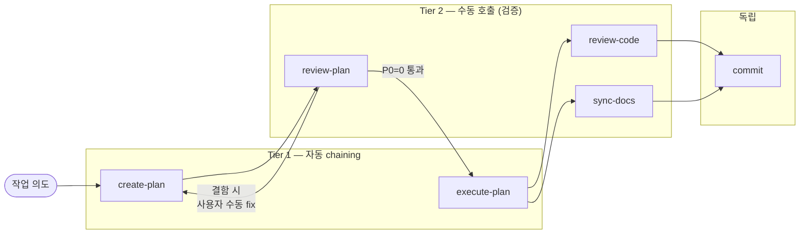

# SKILLS — Dialectic-CLI

> 본 도구 개발용(A 층) 스킬 인덱스. dev-time에 Claude Code/Codex가 호출. **Tier 구조**로 운용.

---

## Tier 1 — 핵심 워크플로우 (자동 chaining)

큰 작업의 standard path. 두 스킬이 자연스럽게 연결.

| 스킬 | 책임 | 입력 | 산출물 |
|---|---|---|---|
| [create-plan](create-plan/SKILL.md) | 작업 → AS-IS/TO-BE 형식 plan 생성 | 작업 의도 (자연어) | `plan/<work-id>/<plan-name>.md` |
| [execute-plan](execute-plan/SKILL.md) | plan → 실 구현 (Phase 병렬 subagent 패턴) | plan 파일 경로 | 코드 변경 + execution-log |

`create-plan` → 사용자 검토 → (`review-plan` 거쳐) → `execute-plan` 흐름.

---

## Tier 2 — 후처리·검증 (수동 호출)

작업 결과 검증. 자동 chaining 안 함 — 사용자가 명시적으로 호출.

| 스킬 | 책임 | 검사 대상 | 결과 |
|---|---|---|---|
| [review-plan](review-plan/SKILL.md) | plan의 빠진 엣지케이스·모순·실현 가능성 검토 | `plan/<work-id>/` 산출물 | P0/P1/P2 결함 목록 + (재계획 필요 시) 사용자에게 수동 fix 요청 |
| [review-code](review-code/SKILL.md) | 코드의 안전성/인터페이스/컨벤션 3 도메인 검사 | `src/` 코드 + 관련 .md | 도메인별 결함 목록. `validation.md` 환원 자료 |
| [sync-docs](sync-docs/SKILL.md) | 코드 변경 → 갱신 누락된 .md 점검 | `Documentation-Checklist.md` 표 + 최근 변경 | 누락 매핑 보고 |

---

## 독립 — 단발 작업

체이닝과 무관한 단독 스킬.

| 스킬 | 책임 | 호출 시점 |
|---|---|---|
| [commit](commit/SKILL.md) | 변경 분류표 → 사용자 확인 → 의미 단위 순차 커밋 | 작업 완료 후 |

---

## Tier 운용 원칙

- **Tier 1은 자동 chaining 가능**: 한 명령으로 plan→review→execute 흐름이 이어질 수 있음. 단 review-plan은 결함 발견 시 자동 fix 안 하고 사용자에게 보고.
- **Tier 2는 수동**: dogfooding 시연용. 본 도구의 핵심 thesis "사용자=synthesis 생성자"가 dev-time에도 적용 — 도구가 자기 검증 결과를 보고만 하고 결정은 사용자.
- **독립은 수시**: commit 같은 발신 작업은 chain 밖.

---

## 새 스킬 추가 시

1. `.claude/skills/<skill-name>/SKILL.md` 작성 (`동사-명사` 명명 규칙)
2. 본 인덱스에 적절한 Tier로 등재 (책임·입력·산출물 한 줄로)
3. `docs/dev-docs/Documentation-Checklist.md` §1.4에 변경 매핑 추가
4. 필요 시 `CLAUDE.md`/`AGENTS.md`에 호출 안내 (Pre/Post Checklist 단계 매핑)
