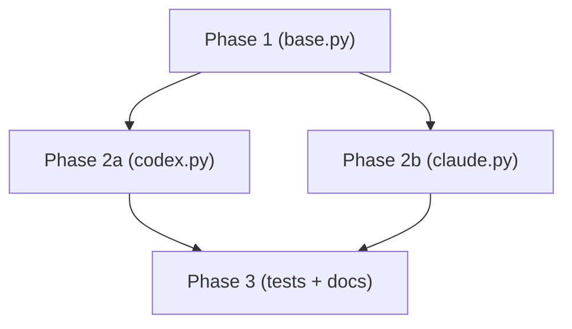

# execute-plan

## 책임

`plan/<work-id>/<plan-name>.md`를 입력으로 실 코드·문서 변경 수행. **Phase 의존성 그래프**를 따라 병렬 가능한 부분은 subagent로 동시 실행.

## 호출 시점

- `review-plan`이 P0 결함 0 보고 후
- 사용자가 plan 승인 후 명시 호출
- 자동 chaining: create-plan → review-plan (P0=0 통과) → execute-plan

## 절차

### 1. plan 읽기 + Phase 그래프 구축

plan의 §3 "Phase" 섹션 파싱:
- 각 Phase의 입력·출력·의존성 식별
- 의존성 0인 Phase 그룹 → 병렬 가능
- 의존성 1+인 Phase → 직렬 (선행 Phase 완료 후)

DAG로 시각화 (선택):



### 2. Phase 단위 실행

각 Phase를 **Task tool 또는 subagent**로 분기:
- 병렬 가능한 Phase는 한 메시지에 여러 subagent 호출 (병렬 실행)
- 직렬은 선행 완료 후 호출
- 각 subagent에 Phase의 입력·목표·검증 방식 전달

### 3. Phase별 검증

Phase 완료 후 즉시 검증:
- 단위 테스트가 있으면 `pytest tests/test_<phase>.py` 실행
- 코드 변경이면 syntax 검증 (import 가능 여부)
- 문서 변경이면 cross-reference 깨짐 검사 (간단한 grep)

검증 실패 시 — 다음 Phase 진행 X. 사용자에게 보고.

### 4. execution-log 작성

`plan/<work-id>/execution-log.md` 누적 기록:

```markdown
# Execution Log · 001-codex-adapter

## Phase 1 (base.py)
- 시작: 2026-05-08T10:00:00
- 산출물: src/agents/base.py 신규 (35 lines)
- 검증: pytest tests/test_base.py — 3/3 pass
- 종료: 2026-05-08T10:08:00

## Phase 2a (codex.py) — 병렬 with 2b
- ...

## Phase 3 (tests + docs)
- ...
```

### 5. 완료 기준 체크

plan §6 "완료 기준" 체크박스 모두 만족 검증:
- [ ] 코드 + 테스트 pass
- [ ] sync-docs 누락 0
- [ ] review-code P0 = 0
- [ ] (해당 시) ADR 추가

미달 항목이 있으면 사용자에게 보고. 자동으로 다른 스킬 호출은 안 함 (단 sync-docs는 Phase 끝마다 자동 호출 가능).

### 6. 사용자 보고

```markdown
## execute-plan 완료

대상: plan/001-codex-adapter/plan.md
실행 시간: 2026-05-08T10:00 ~ 10:42

### 변경
- src/agents/base.py (+35)
- src/agents/codex.py (+82)
- tests/test_base.py (+18), tests/test_codex.py (+45)
- docs/runtime-docs/protocol.md §10 갱신

### 검증
- pytest 6/6 pass
- sync-docs 누락 0
- 완료 기준 체크박스 5/5 만족

### 권고

`commit` 호출하여 의미 단위 커밋. review-code도 1회 권장.
```

## 본 도구 specific 패턴

### Phase 병렬 subagent

본 스킬의 Phase 병렬 패턴은 Dialectic-CLI의 `compare` 모드 (병렬 비교)와 같은 사고 모델:
- compare: 같은 task에 다른 매핑을 병렬 실행
- execute-plan: 같은 plan에 다른 Phase를 병렬 실행
- 둘 다 subagent를 ThreadPoolExecutor 또는 asyncio.gather로 동시 실행

dev-time 도구가 runtime 도구의 사고 패턴을 그대로 시연 — 본 도구의 self-consistency.

### 검증 자동화

각 Phase 완료 후 가능한 검증:
- syntax: `python -c "import <module>"` 또는 `ast.parse()`
- 단위 테스트: pytest 해당 파일
- cwd 격리: 어댑터 변경 시 자동으로 `tests/test_cwd_isolation.py` 호출
- JSONL append-only: bus 변경 시 자동으로 `tests/test_bus_append.py` 호출

## 안전장치

- **Phase 검증 실패 시 즉시 중단** — 다음 Phase 안 감
- **subagent 출력 다시 메인이 검증** — subagent가 거짓 보고할 수 있음
- **자동 commit 안 함** — execute-plan 완료 후 commit은 사용자가 별도 호출
- **plan 수정 안 함** — 실행 중 plan과 다른 방향이 더 나아 보이면 사용자에게 보고만 (plan 수정은 사용자가 직접)

## 한계

- subagent의 도메인 지식이 부족하면 본 도구 specific 패턴(cwd 격리, JSONL append-only) 위반 가능 → review-code가 사후 검증
- 외부 시스템(API 호출, 네트워크)이 필요한 Phase는 본 스킬 범위 X — 사용자가 별도 처리
- Phase 그래프가 너무 세분화면 오버헤드 — 보통 2-5개 Phase가 적절

## 본 스킬 자체의 변경

- 검증 자동화 항목 추가 시 `docs/dev-docs/code-conventions.md` §9 (테스트) 동기화
- Phase 병렬 패턴 변경 시 `docs/dev-docs/architecture.md` §4 (4 모드 데이터 흐름, compare narrative 포함) 영향 검토
