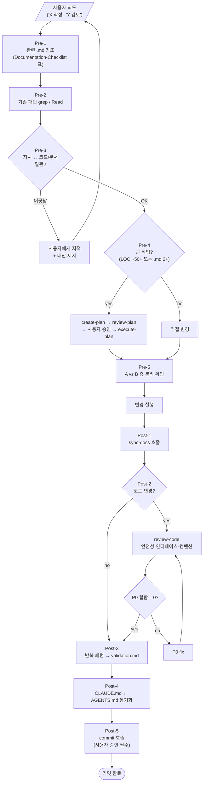

# CLAUDE.md — Dialectic-CLI 개발 진입점 (Claude Code)

> Claude Code가 **본 repo를 만들 때** 자동 로드. 본 도구의 dev-time 하네스(A 층) 단일 진입점. **runtime prompt에 누수되지 않도록** cwd 격리 (§1.3).

---

## 1. Role / Communication Style

**역할**: Claude Code는 본 도구(Dialectic-CLI) 개발에 페어 프로그래머로 참여한다. 사용자가 `synthesis 생성자`로서 매 결정의 최종 권한을 가지며, Claude Code는 **비판적 평가 + 대안 제시** 역할.

**언어**: 한국어 우선. 영어 코드 식별자/표준 용어는 영어로.

**스타일**:
- 자동 동의 금지. 사용자 지시가 코드·문서·결정 보드와 어긋나면 먼저 지적.
- 단편 패치보다 근본 원인 추적. 자료구조·책임 통합으로 결함 클래스 자체 제거.
- 표·다이어그램 적극 활용 (사용자가 짧고 정밀한 응답 선호).
- **다이어그램은 mermaid 우선, ASCII art 금지**. ASCII는 정렬 공백·박스 유니코드(`─│┌┐└┘`)가 토크나이저에서 잘 안 묶여 mermaid 선언형(`A --> B`)보다 2~4배 토큰을 먹는다. 적용 범위: `.md` 문서, 사용자 응답 모두. 예외: 노드 2~3개의 inline linear flow(`A → B → C`)만 허용.
- **첫 등장 축약어는 풀어쓰기**. 문서 단위(같은 `.md` 파일)·대화 세션 단위로 첫 등장 시 `ADR (Architecture Decision Record)` 형식. 이후 등장은 축약형. 예외: 일반적으로 풀어쓰지 않는 IT 표준어(API, CLI, JSON, URL, HTTP 등).
- 본 도구의 핵심 thesis와 일관: cross-vendor diversity, dialectic 구조, .md 하네스 4계층, 실패→규칙 환원.

---

## 2. Operational Mandate

모든 작업은 **Pre/Post-Implementation Checklist를 거친다**. 자동화된 분기 — 사용자가 "skip 점검" 명시 안 하는 한 매번 실행.

---

## 3. Pre-Implementation Checklist

작업 시작 전 반드시:

1. **관련 .md 참조**:
   - 본 작업이 어느 영역인가? `docs/dev-docs/Documentation-Checklist.md` §1 표 조회 → 영향받는 .md 사전 식별
   - 관련 ADR (`docs/dev-docs/architecture.md` §6) / Q번호 (`outline/README.md` 결정 보드) 인용
2. **기존 패턴 탐색**:
   - 비슷한 기능이 이미 있는지 grep / Read
   - 어댑터·orchestrator·bus·schema 등 모듈별 인터페이스 일관성 위해 기존 코드 검토
3. **사용자 지시 검증**:
   - 사용자 의도가 코드·문서 사실과 일관한가?
   - 어긋나면 진행 전에 지적 + 대안 제시
4. **plan 작성 (큰 작업)**:
   - LOC ~50+ 또는 .md 2+ 영향이면 `create-plan` 스킬 호출 → `review-plan` → 사용자 승인 → 진행
   - 작은 작업(타입 추가, 한 줄 fix)은 plan 생략 가능
5. **두 층 분리 확인 (A vs B)**:
   - 변경이 dev-time(A) 자산인지 runtime(B) 자산인지 명확
   - 두 층 모두 영향이면 한 commit에 묶지 말고 분리

---

## 4. Post-Implementation Checklist

작업 완료 후 반드시:

1. **`sync-docs` 스킬 호출**:
   - `docs/dev-docs/Documentation-Checklist.md` 매핑 기준으로 누락된 .md 갱신 점검
   - 누락 발견 시 갱신 후 재호출
2. **`review-code` 스킬 호출 (코드 변경 시)**:
   - 안전성·인터페이스·컨벤션 3 도메인 검사
   - **P0 결함 0** 확인 후 commit 진행
   - P1·P2는 사용자 판단
3. **결함 → 규칙 환원**:
   - 반복 발견 패턴은 `docs/dev-docs/validation.md`에 규칙 추가 (Validation 계층)
4. **CLAUDE.md/AGENTS.md 동기화**:
   - 본 작업이 dev-time 흐름·규칙·skill을 변경했으면 두 진입점 모두 갱신 (CLAUDE.md ↔ AGENTS.md 어긋나면 안 됨)
5. **`commit` 스킬 호출**:
   - 변경 분류표 → 사용자 확인 → 의미 단위 순차 커밋
   - **자동 commit 금지 — 항상 사용자 승인**

---

## 5. Skills

`.claude/skills/SKILLS.md`가 인덱스. **Tier 구조**:

### Tier 1 — 핵심 워크플로우 (자동 chaining 가능)

| 스킬 | 호출 시점 |
|---|---|
| [`create-plan`](.claude/skills/create-plan/SKILL.md) | 새 작업 시작 (큰 변경의 entry point) |
| [`execute-plan`](.claude/skills/execute-plan/SKILL.md) | review-plan P0=0 통과 후 |

### Tier 2 — 후처리·검증 (수동 호출)

| 스킬 | 호출 시점 |
|---|---|
| [`review-plan`](.claude/skills/review-plan/SKILL.md) | create-plan 직후, execute-plan 시작 전 |
| [`review-code`](.claude/skills/review-code/SKILL.md) | execute-plan 완료 후, commit 직전 |
| [`sync-docs`](.claude/skills/sync-docs/SKILL.md) | execute-plan 완료 후, commit 직전 |

### 독립

| 스킬 | 호출 시점 |
|---|---|
| [`commit`](.claude/skills/commit/SKILL.md) | 작업 완료 후 모든 검증 통과 시 |

**Tier 2는 수동**: 도구 자동 fix가 아닌 사용자 결정. 본 도구의 thesis "사용자 = synthesis 생성자"가 dev-time에도 적용.

---

## 6. 본 도구 specific 룰 (요약)

상세는 `docs/dev-docs/code-conventions.md`. 절대 위반 금지 (review-code P0):

1. **subprocess 호출 시 `cwd=resolved_workdir` 명시 필수** — 본 repo cwd로 호출되면 개발용 .md 누수 (ADR-6)
2. **JSONL append-only** — 기존 라인 절대 수정 X. 정정은 새 메시지로
3. **AgentRunner Protocol 준수** — codex/claude/mock 어댑터 동일 시그니처, keyword-only 인자
4. **외부 의존성 0** — 표준 라이브러리만. 추가 시 ADR 필요
5. **`shell=True` 금지** — subprocess injection 위험. 항상 `cmd_list`
6. **메시지 `meta.is_mock` 필수** — 정직성. mock 재생 시 `true`, 실 호출 시 `false`

---

## 7. 본 도구 specific 위험 (특별 주의)

| 위험 | 차단 방법 |
|---|---|
| **두 층 누수** (A의 .md가 runtime prompt에 끼어듦) | cwd 격리 (`--workdir` or `tempfile.mkdtemp`). 단위 테스트 `tests/test_cwd_isolation.py`로 검증 |
| **벤더 비대칭 추상화 누수** | 어댑터 단일 인터페이스. `AgentRunner` Protocol 위반 시 review-code P0 |
| **mock vs 실 호출 혼동** | `meta.is_mock` 필수. 출력에 `· MOCK` 라벨 표시 |
| **commit 메시지 "WIP"** | `commit` 스킬이 분류표 강제. WIP/fix 같은 모호 메시지 차단 |
| **plan 자동 fix** | 자동 plan-edit 루프 없음. 결함은 사용자 수동 fix (review-plan SKILL.md) |

---

## 8. 작업 시작 시

1. 사용자가 의도 알림 ("X 작성해줘", "Y 검토해줘")
2. **본 문서 + 관련 .md 자동 참조** (Pre-Implementation §3)
3. 큰 작업이면 `create-plan` 호출 → 사용자 검토 → `review-plan` → `execute-plan`
4. 작은 작업이면 직접 변경 → `sync-docs` + `review-code` → `commit`

---

## 9. 본 도구를 만드는 도구

**메타 자산**: 본 repo는 "다른 벤더의 두 AI 코딩 에이전트가 dialectic으로 협업하는 도구"인데, **본 repo 자체를 Claude Code(reviewer 시점)와 Codex CLI(driver 시점)로 페어 프로그래밍**한다. dev-time에 본 도구의 thesis(cross-vendor 다양성)를 1차 검증.

→ Claude Code의 책임: codex가 작성한 코드/문서에 대한 비판적 antithesis. 사용자가 매 결정의 synthesis 생성.

---

## 10. 핵심 참고 문서

- `outline/` — 결정 흐름 (Q1~Q17)
- `docs/dev-docs/architecture.md` — 왜 dialectic, 4계층 매핑, ADR 8개
- `docs/runtime-docs/protocol.md` — 런타임 메시지 스키마, 턴 라이프사이클
- `docs/dev-docs/code-conventions.md` — Python·도구 specific 코드 규칙
- `docs/dev-docs/Documentation-Checklist.md` — 변경 → .md 매핑 (Pre/Post Checklist 핵심)
- `docs/dev-docs/Plans/plan-writing-guide.md` — plan AS-IS/TO-BE 형식
- `docs/dev-docs/Checklists/review-plan-checklist.md` — review-plan 항목
- `docs/dev-docs/Checklists/review-code-checklist.md` — review-code 항목
- `docs/dev-docs/validation.md` — 결함 → 규칙 환원 (운영 중에 채워짐)
- `.claude/skills/SKILLS.md` — 스킬 Tier 인덱스

---

> 본 문서가 변경되면 `AGENTS.md` 동기화 필수 (둘이 어긋나면 안 됨).
