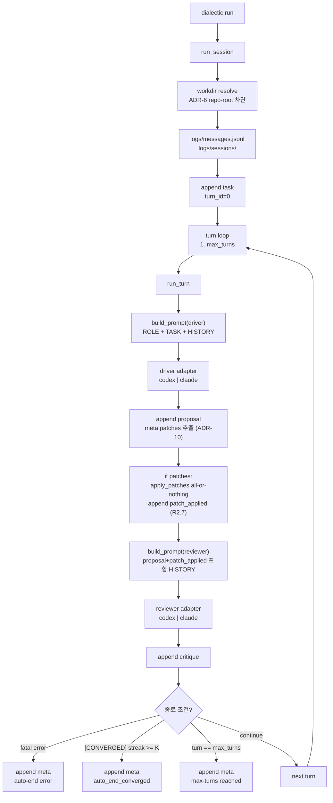

# Current Implementation Flow

> 현재 구현을 한눈에 보기 위한 루트 지도 문서. 세부 동작의 정본은 아래 링크된 systems/protocol 문서다.

## 현재 범위

2026-05-08 기준 구현 표면:

| 영역 | 현재 상태 | 정본 |
|---|---|---|
| CLI 진입점 | `dialectic` (default 메뉴 진입), `dialectic run`, `dialectic doctor` | [orchestrator + cli](dev-docs/systems/orchestrator.md#cli) |
| 실행 모드 | `run`만 CLI에 노출 | [run mode](runtime-docs/systems/run-mode.md) |
| 포지션 | `driver` → `reviewer` | [protocol](runtime-docs/protocol.md#10-포지션-vs-역할-vs-벤더-3축-분리) |
| 로그 | `logs/messages.jsonl` + `logs/sessions/*.jsonl` | [jsonl-bus](dev-docs/systems/jsonl-bus.md) |
| 종료 | fatal error / `[CONVERGED]` streak / `max-turns` | [run mode 종료 조건](runtime-docs/systems/run-mode.md#4-종료-조건-dod-01-plan-6--outline04-451) |

## 한눈 흐름



## 메시지 순서

```text
task
  -> proposal           (meta.patches 추출, ADR-10)
  -> [patch_applied]    (proposal에 patches 있으면; ADR-10 R2.7)
  -> critique
  -> meta
```

일반적인 한 턴 성공 로그는 다음 순서다.

| 순서 | kind | from | slot | seq_in_turn | 의미 |
|---|---|---|---|---|---|
| 1 | `task` | `system` | null | 1 (turn_id=0) | 사용자 task 기록 |
| 2 | `proposal` | `implementer` | `driver` | 1 | driver 제안 + meta.patches |
| 2.5 | `patch_applied` | `system` | null | 98 | (있을 때만) ADR-10 R2.7 search-replace 적용 결과 |
| 3 | `critique` | `spec-reviewer` | `reviewer` | 2 | reviewer 검토 |
| 4 | `meta` | `system` | null | 99 | 자동 종료 사유 |

`(turn_id, seq_in_turn)` 정렬 직렬화 순서는 `proposal(1) → critique(2) → patch_applied(98) → meta(99)`. patch_applied는 시간 순(turn 내 발생)으로는 critique 앞이지만 직렬화 순으로는 critique 뒤 (ADR-10 의도된 비대칭, driver 다음 턴 prompt 강조 효과).

## 읽는 순서

1. 현재 실행 흐름: [runtime-docs/systems/run-mode.md](runtime-docs/systems/run-mode.md)
2. 구현 함수 단위: [dev-docs/systems/orchestrator.md](dev-docs/systems/orchestrator.md)
3. 메시지/프로토콜 전체: [runtime-docs/protocol.md](runtime-docs/protocol.md)
4. 모듈 의존 관계: [dev-docs/systems/INDEX.md](dev-docs/systems/INDEX.md)

## 주의

- 이 문서는 요약 지도다. 코드 변경 시 상세 정본을 먼저 갱신하고, 이 문서는 흐름이 바뀐 경우에만 맞춘다.
- `runtime-docs/protocol.md`에는 예정 사양이 포함될 수 있다. 현재 CLI에 노출된 동작은 `runtime-docs/systems/run-mode.md`를 우선한다.
- patch apply 흐름은 `protocol.md` 사양 + `src/orchestrator.py`의 `run_turn`에 통합 완료 (ADR-10, plan/completed/005-patch-apply-impl). `src/patch_apply.py` 정통.
