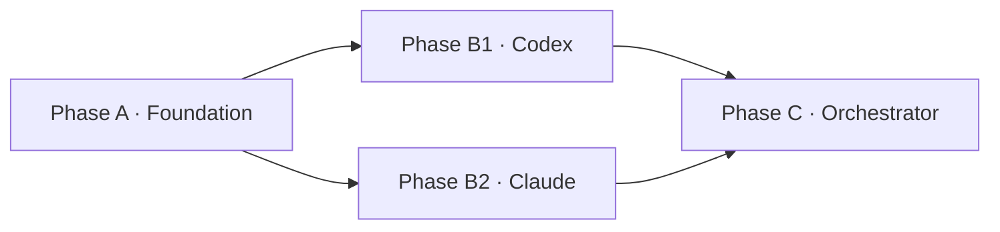

# Plan Writing Guide (계획 작성 가이드) — Dialectic-CLI

> 작업 plan을 작성할 때 따라야 할 형식. `create-plan` 스킬이 본 가이드를 참조하여 plan을 생성하고, `review-plan`이 본 가이드 기준으로 검토하며, `execute-plan`이 본 형식의 plan을 실행 가능한 형태로 해석.

---

## 1. plan의 위치·구조

### 1.1 디렉토리 구조

한 plan = 한 폴더. `plan/<work-id>/` 하위에 **`00-summary.md`(요약 digest)** + **`01-plan.md`(인덱스 본문)** + **Phase별 .md(본문)** 같은 레벨로 둔다.

```
plan/<work-id>/
├── 00-summary.md                    # 30~80줄 digest (의도·배경·Phase 흐름·핵심 결정/위험·DoD 요약)
├── 01-plan.md                       # 메타 + AS-IS/TO-BE + Phase 인덱스 + DoD (전체)
├── phase-a-<slug>.md                # Phase A 본문 (목표·입력·출력·작업 단위·검증)
├── phase-b-<slug>.md                # Phase B 본문
├── phase-c-<slug>.md                # ...
└── execution-log.md                 # execute-plan이 누적 기록 (실행 후 생성)
```

### 1.2 명명 규칙

- `<work-id>`: 작업 단위 ID. 의미 단위 (예: `001-run-mode-core`, `002-mock-adapter`, `compare-mode`). 충돌 검사 시 `plan/` 루트뿐 아니라 `plan/completed/` 하위까지 모두 조회 — 완수된 plan ID도 재사용 금지.
- **요약 파일**: `00-summary.md` (고정명). `01-plan.md`의 digest. 폴더 첫 진입 시 가장 먼저 보이도록 `00-` 접두사.
- **인덱스 본문**: `01-plan.md` (고정명). 전체 메타·AS-IS/TO-BE·Phase 인덱스·DoD.
- 파일명: `phase-<id>-<slug>.md`
  - `<id>`: 알파벳(`a`, `b`, `c`, ...). 01-plan.md의 mermaid Phase 라벨과 일치 (대소문자 같이 고정).
  - `<slug>`: kebab-case 짧은 이름 (예: `foundation`, `adapters`, `orchestrator`, `tests`).
- 병렬 Phase는 같은 알파벳 + 숫자 (예: `phase-b1-codex.md`, `phase-b2-claude.md`).

### 1.3 분리의 이유

- **`00-summary.md` = digest**: 30~80줄. 폴더에 처음 들어온 사람이 plan 본문을 안 읽어도 의도·흐름·핵심 위험을 파악. 01-plan.md의 요약본 — 이해를 돕는 보조 파일.
- **`01-plan.md` = 인덱스 본문**: 전체 흐름·메타·AS-IS/TO-BE·DoD. 본문은 phase 파일에 위임.
- **execute-plan 컨텍스트 격리**: Phase별로 subagent에 해당 phase 파일만 전달 — 전체 plan 컨텍스트 부담 X.
- **review-plan 단위 검토**: Phase별로 입력·출력·검증을 독립 검사.
- **변경 모듈성**: 한 Phase 수정이 다른 Phase 파일에 영향 없음.

---

## 2. 00-summary.md 형식 (digest)

`01-plan.md`의 요약본. 30~80줄 권장. 폴더에 처음 진입한 독자가 본문(01-plan.md, phase-*.md)을 읽기 전에 plan 전체 그림을 5분 안에 파악하도록 돕는 **보조 파일**. 정본은 `01-plan.md` — 정보 충돌 시 본문이 우선이며, 본문 변경 시 summary도 동기화.

```markdown
# Summary · <작업명>

## 의도
<2~3줄 — 무엇을 만들/바꾸는가>

## 배경 / 동기
<왜 지금 이 작업이 필요한가. 트리거된 ADR/Q번호·이슈·실패 사례 등 동기 1~3줄>

## Phase 흐름
A → B1·B2(병렬) → C  ← 텍스트 1줄 또는 mermaid 간략 다이어그램

## 핵심 의사결정
- <결정 1줄> (근거: ADR-N / Q번호 / phase-X)
- <결정 1줄>

## 핵심 위험
- <위험 1줄 + 차단/완화 한 마디>

## DoD 요약
- [ ] (Phase A) ...
- [ ] (Phase C) `dialectic run ...` exit 0
- [ ] sync-docs 누락 0 / review-code P0 = 0

→ 상세: [01-plan.md](01-plan.md), Phase별 [phase-*.md](.)
```

작성 가이드:
- **요약 우선**, 인용·줄 번호는 본문(01-plan.md)에 맡김.
- 항목별 1~5줄. mermaid는 Phase 흐름이 단순(노드 ≤ 5)하면 텍스트 1줄로 충분.
- DoD는 본문 §6에서 **3~6개 핵심**만 발췌. 전체 체크박스 복제 금지.
- 본문이 갱신되면 summary도 1줄 단위로 손봄. 본문과 summary가 동기화되지 않으면 review-plan P1.

---

## 3. 01-plan.md 형식 (인덱스 + 메타)

```markdown
# Plan · <작업명>

## 0. 메타

- 작업 ID: <work-id>
- 의도: <한 줄 요약>
- 관련 ADR / Q번호: <docs/dev-docs/architecture.md ADR-N or outline/README.md Q번호>
- 예상 영향 범위: <변경될 파일 목록 또는 범위>
- LOC 추정: <약 ~LOC>

## 1. AS-IS (현재 상태)

전체 코드/문서의 현재 상태. 사실 기준, 인용 근거 (파일·줄 번호) 명시. Phase별 상세는 phase 파일.

## 2. TO-BE (목표 상태)

전체 목표 상태 — 어떤 모듈·파일이 어떤 책임을 갖게 되는지. 검증 가능 항목으로. Phase별 작업 단위는 phase 파일에.

## 3. Phase 인덱스

### 3.1 의존성 그래프



### 3.2 Phase 파일 경로

| Phase | 경로 | 의존 | 병렬 그룹 |
|---|---|---|---|
| A · Foundation | [phase-a-foundation.md](phase-a-foundation.md) | (없음) | — |
| B1 · Codex | [phase-b1-codex.md](phase-b1-codex.md) | A | B (B1·B2 병렬) |
| B2 · Claude | [phase-b2-claude.md](phase-b2-claude.md) | A | B (B1·B2 병렬) |
| C · Orchestrator | [phase-c-orchestrator.md](phase-c-orchestrator.md) | B1, B2 | — |

## 4. 비기능 요구

- 성능·리소스 제약
- 외부 의존성 추가 여부 (있으면 ADR 필요)
- 보안 고려사항

## 5. 위험 (Phase 횡단)

전체 plan 차원의 위험. Phase 한정 위험은 해당 phase 파일에.

## 6. 완료 기준 (Definition of Done)

체크박스 형식. 각 항목 옆에 책임 Phase 명시.

- [ ] (Phase A) src/foo.py + 단위 테스트 pass
- [ ] (Phase B1·B2) 어댑터 짧은 prompt 1회 실 호출 성공
- [ ] (Phase C) `dialectic run --task "..." --max-turns 1` exit 0
- [ ] sync-docs 누락 0
- [ ] review-code P0 = 0

## 7. 참조 .md

본 plan 검증·실행 시 참조할 기존 문서 (protocol.md §, ADR, role.md 등).
```

---

## 4. phase-<id>-<slug>.md 형식 (Phase 본문)

각 Phase 파일은 **자기 단독으로 실행 가능한 단위**. 다른 phase 파일을 안 읽어도 본 phase의 작업·검증을 알 수 있어야 함.

```markdown
# Phase <id> · <Phase 명> — <work-id>

## 0. 메타

- Phase ID: <id> (예: A / B1 / C)
- 소속 plan: [01-plan.md](01-plan.md)
- 의존 Phase: <선행 Phase 또는 "(없음)">
- 병렬 그룹: <같은 그룹의 다른 Phase 또는 "—">
- 예상 LOC: <Phase 한정 추정>

## 1. 목표

본 Phase가 끝나면 무엇이 되는지. 한 문장.

## 2. 입력

- 의존 Phase 산출물 (파일 경로)
- 참조 .md (protocol.md §, code-conventions.md § 등 — 줄 번호까지 권고)
- 사전 검증된 사실 (CLI 옵션 존재 여부 등)

## 3. 출력

생성·변경되는 파일 + 핵심 시그니처/구조. execute-plan이 이를 보고 어떤 코드를 작성할지 판단.

예시:
- `src/agents/base.py` (신규, ~30 LOC)
  - `@dataclass(frozen=True) class AgentResponse: text, raw_path, meta`
  - `class AgentRunner(Protocol): name, vendor, run(prompt, *, raw_log_path, timeout_s, workdir) -> AgentResponse`

## 4. 작업 단위

체크박스 형식. execute-plan이 그대로 실행 가능한 명세.

- [ ] `src/agents/base.py` 생성, AgentResponse · AgentRunner Protocol 정의
- [ ] `src/agents/base.py`에 `AgentAuthError` 예외 추가
- [ ] keyword-only 인자(`*`) 사용 검증

## 5. 검증

본 Phase 완료를 어떻게 확인하는지. 가능하면 명령어 형태.

- `python -c "from src.agents.base import AgentResponse, AgentRunner"` 성공
- (단위 테스트 있으면) `pytest tests/test_base.py -q` pass
- 시그니처 1:1 검증: `protocol.md` §8 ↔ `base.py` cross-check

## 6. 엣지케이스 / 위험 (Phase 한정)

본 Phase 실행 중 부딪힐 가능한 함정. 전체 plan 횡단 위험은 01-plan.md §5에.

- 예: subprocess timeout 동작이 OS별 차이 — Linux 기준 검증, macOS 별도 확인.
```

### 4.1 코드 블록 라벨 (spec / paste)

phase 파일 §3 출력의 코드 블록은 **execute-plan subagent의 자유 해석 폭**을 결정한다. 라벨로 의도 명시:

| 라벨 | 의도 | execute-plan 동작 |
|---|---|---|
| `spec` (default) | 시그니처·docstring·예시 명세 | 의도 보존하며 자유 해석. 함수 본문·타입·docstring은 subagent가 결정. |
| `paste` | 그대로 코드에 들어가는 정의 (상수, frozen dataclass, lambda, 정확한 dict 리터럴 등) | **변형 금지**. 들여쓰기·식별자·값 그대로 복사. |

표기: 코드 펜스 직후 첫 줄에 `# <label>` 인라인 주석:

```python
# paste
MODE_ROLES = { "run": {...}, "plan": {...} }
```

```python
# spec
def _msg(turn_id: int, ...) -> Message:
    """parent_id 추적·workdir 기록·meta sentinel 채움."""
```

라벨 부재 = `spec`. dataclass·상수·MODE_ROLES 같은 정의는 `paste` 명시 권장. 라벨은 **코드 펜스 직후 첫 줄에만** 인식 — 코드 본문 안의 `# spec`/`# paste` 주석은 무관.

---

## 5. AS-IS / TO-BE 형식의 가치

- **검증 가능**: TO-BE는 측정 가능한 상태 — "잘 동작" 같은 모호 표현 X
- **diff 명확**: AS-IS와 TO-BE의 차이가 곧 작업 분량
- **review-plan이 검사하기 쉬움**: TO-BE 항목 하나하나가 검사 단위
- **execute-plan이 분할하기 쉬움**: phase 파일이 하나하나 subagent 단위

---

## 6. 안티패턴 (피할 것)

| 안티패턴 | 문제 | 대안 |
|---|---|---|
| AS-IS 없이 바로 TO-BE만 | 변경 분량 가늠 불가, 사용자가 현재 상태 모름 | 01-plan.md §1·§2 양쪽 다 적기 |
| Phase 파일 없이 01-plan.md에만 | execute-plan이 Phase 단위 실행 못 함, 컨텍스트 비대 | Phase별 .md 분리 (§1.1) |
| 01-plan.md에서 phase 경로 누락 | 인덱스 단절, 사용자·도구 모두 phase 파일 못 찾음 | §3.2 표 필수 |
| Phase 1개 (분할 X) | 병렬화 못 함, 진행 추적 어려움 | 최소 2 Phase로 분할 |
| Phase 의존성 미명시 | execute-plan이 직렬·병렬 판단 불가 | phase 파일 §0 + 01-plan.md §3.1 mermaid 양쪽에 |
| 완료 기준 모호 ("잘 되면 끝") | review-plan이 무엇을 검사할지 모름 | 측정 가능 체크박스 + 책임 Phase 명시 |
| 엣지케이스 0 | 발견 안 된 위험이 곧 미래 결함 | 01-plan.md §5 횡단 + phase 파일 §6 한정 양쪽에 |
| Phase 파일이 01-plan.md 인용 없이 자급자족 X | review-plan이 phase 단위 검토 불가 | phase 파일 §0 메타에 01-plan.md 경로 + §2 입력에 참조 .md 명시 |
| paste 의도인데 라벨 없음 | execute-plan이 spec(자유 해석)으로 해석 → MODE_ROLES 같은 정의가 변형 위험 | 정의는 `# paste` 명시 |
| **절대 날짜·요일 라벨** (`2026-05-08`, `5/9 토`, `5/8 목요일`) | 외부 calendar(요일·휴일)와 어긋나면 plan 신뢰성 균열. 일정 변동성도 큼 | Day index (`Day 1/2/3/4`) + 가용 시간 (`~4.5h`) + 마일스톤 (`마감일`) 추상 표현. mermaid gantt가 dateFormat 의존이면 gantt 폐기 또는 추상 day 기반 |
| **시간 추정 (`~30분`, `~1.5h`)** | 사용자 가용·체력 변동성으로 ETA 무의미 | LOC·단계 수·도메인 swap 정도로 정성 표현 |
| **00-summary.md 부재** | 폴더 첫 진입 시 plan 그림 파악 비용 큼. review-plan·execute-plan 이전 단계의 사용자 이해 비대 | §2 형식으로 30~80줄 digest 작성. 본문(01-plan.md)의 요약본 |
| **00-summary.md ↔ 01-plan.md 비동기** | summary가 본문과 어긋나면 오히려 오해 유발 (digest의 목적 역행) | 본문 변경 시 summary 핵심 항목 1줄 단위로 손봄. review-plan 점검 항목 |
| **단일 plan 비대 (분할 누락)** | Phase 5+, 독립 기능 2+, ADR 2+, 영향 모듈 3+ 중 2개 이상 신호 발생인데도 한 plan에 묶음 → review-plan 결함 누적, 진행 추적 어려움, 분할 비용 사후 폭증 | create-plan Step 1.5 평가 → 신호 ≥ 2면 작성 일시정지 + 분할 후보(의존성·산출물 기반) 보고 + 사용자 결정. 분리 시 work-id 두 개 부여, 후행 plan §0에 선행 plan 산출 의존 명시 |

---

## 7. plan 갱신

- plan 실행 중 발견된 변경(예: TO-BE 항목 하나가 실제로는 다른 방식이 더 합리적)은 해당 phase 파일 또는 01-plan.md 직접 수정.
- 수정 시 commit message: "Update plan/<work-id>/<file>: <reason>"
- review-plan이 P0를 짚으면 사용자가 직접 phase 파일/01-plan.md 수정 후 다시 review-plan.
- 자동 plan-edit 루프 X — 사용자 수동 fix가 원칙.
- **summary 동기화**: 01-plan.md 또는 phase 파일이 의미 있는 변경(의도/Phase 흐름/핵심 결정/위험/DoD 핵심)을 받으면 `00-summary.md` 해당 섹션 1줄도 손봄. summary는 본문의 종속 — 본문이 정본.

---

## 8. 본 가이드 자체의 변경

본 가이드는 `create-plan` / `review-plan` / `execute-plan` 세 스킬과 `docs/dev-docs/Checklists/review-plan-checklist.md`가 모두 참조한다. 형식 변경 시 4 파일 모두 동기화 필수 — `docs/dev-docs/Documentation-Checklist.md` §1.4.
