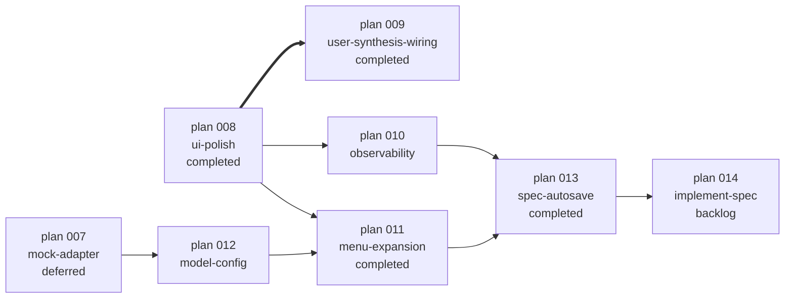

# Upcoming Plans Overview

> 진입 예정 plan scope 개요. 각 plan이 실제 작성될 때 본 문서를 SSOT로 인용. 진입 후에는 plan 폴더 본문이 정본 — 본 문서는 backlog 메모.
>
> 완료 plan: plan 008-ui-polish, plan 009-user-synthesis-wiring (`plan/completed/`)

작성 정책:
- 결정 결과만 기록 (working out narrative 금지)
- 절대 날짜·요일 라벨 금지 (Day index/마감일/추상 표현)
- 시간 추정 금지 (LOC·단계 수로 정성 표현)
- file:line 인용 의무 — 결정 근거가 코드/문서에 있으면 위치 명시
- mermaid OK (.md GitHub render)

## 의존 그래프



- plan 008·007은 본 문서 범위 외 (각각 active / mock 어댑터)
- plan 008 → plan 009는 hard dependency (`==>`) — 결과 출력·호출 진행 spinner 없이는 사용자가 결정 근거 부재
- plan 009·010·011·012 우선순위는 시나리오에 따라 사용자가 추후 확정 (§우선순위 결정 시나리오 참조)

---

## plan 009-user-synthesis-wiring (✓ completed → `plan/completed/009-user-synthesis-wiring/`)

### 의도

본 도구 thesis "사용자 = synthesis 생성자"를 mid-session 단위에서 실제 wiring. 현재 `src/ui.py:prompt_decision` 정의만 있고 `src/orchestrator.py` turn loop에서 호출자 0건 → 사용자가 화면 보고 개입할 수단이 없음.

핵심 use case (사용자 narrative 일반화):
- 어떤 턴에서든 driver 응답 또는 reviewer 비판이 잘못됐다 판단 → 그 턴 끝에 개입
- [CONVERGED] 도달 후에도 추가 구현 필요 → 종료 차단 + directive 주입

### AS-IS

- `src/ui.py:30-79 prompt_decision` — 6지선다(a/r/m/i/e/s) + directive 정의. 호출자 0건 (docstring `:73` 명시)
- `src/ui.py:82-124 Spinner` — 트리거 listener 신규 클래스 신설 시 동일 패턴 (isatty 가드, threading.Event, __enter__/__exit__)
- `src/cli.py:75` — `--interactive choices=["end-only"]` 단일값. critical/full 미지원
- `src/orchestrator.py:run_session` — turn loop에 사용자 개입 wiring 0. `[CONVERGED]` streak ≥ K 도달 시 즉시 `auto_end_converged` (사용자 의도 무관)

### Phase 분할

```
A · CLI + 메뉴 default                   ~10 LOC
B · src/ui.py:TriggerListener            ~50 LOC  Ctrl+F (chr(0x06)) 트리거
C · src/ui.py:prompt_end_or_iterate       ~25 LOC  critical 모드 종료 직전 prompt
D · orchestrator critical/full wiring    ~40 LOC
E · JSONL user_synthesis kind             ~20 LOC
─────────────────────────────────────────────────
A → C → D 직렬 (mode·prompt·wiring)
B는 D 진입 전 Phase A·B 실 호출 검증 (R1~R4)
E는 D와 동등 (schema·protocol·bus 갱신)
총 ~145 LOC + 테스트 ~50 LOC
```

### Phase A · CLI + 메뉴 default

- 대상: `src/cli.py:75` argparse choices 확장
- 변경: `--interactive choices=["end-only","critical","full"]`
- default 정책:
  - CLI `dialectic run` 직접 호출 → `end-only` (자동 dialectic, CI 친화)
  - 메뉴 진입 (default) → `critical` (기획자 페르소나 개입 의도 ↑)
- 단위 테스트: 3 mode CLI parsing + 메뉴 default critical 단언

### Phase B · src/ui.py:TriggerListener (~50 LOC)

- 트리거 키: **Ctrl+F (chr(0x06))** — 명시성·실수 부담 균형
  - 'i' 단일 키 vs Ctrl+F 비교 결과 (실수 부담·명시성 모두 우월)
  - readline forward-char 충돌은 raw mode 진입 시 무력화 (안전)
- 메커니즘: termios + tty.setcbreak + select.select(timeout=0.1) + threading.Thread daemon + threading.Event
- 격리: raw mode = listener thread fd 한정. main thread stdout/stderr 영향 X
- isatty 가드 — CI·파이프 silent (`src/ui.py:Spinner` 동일 패턴)
- `__enter__`/`__exit__` + try/finally `termios.tcsetattr` 복원 (필수, R3)
- 안내: stderr 1줄 "[i] Ctrl+F = 다음 턴 끝에 개입 단계 진입"
- Windows: `NotImplementedError` 또는 no-op fallback (본 도구 WSL 가정 정합)
- 단위 테스트: trigger.is_set / trigger.clear / isatty False silent / tcsetattr 복원 / EOF 안전

### Phase C · src/ui.py:prompt_end_or_iterate (~25 LOC)

- 신규 함수 — `prompt_decision`과 분리 (default 의미 정반대)
  - `prompt_decision` Enter default = `("i", None)` (full 모드용)
  - `prompt_end_or_iterate` Enter default = `("e", None)` (critical 모드 종료 직전용)
- 시그니처: `def prompt_end_or_iterate(reason: str) -> tuple[str, str | None]`
- reason 예: `"[CONVERGED] streak 2 도달"` / `"max-turns 5 도달"`
- 분기:
  - Enter / Y / y → `("e", None)` — 사용자 만족 신호
  - n / N → `("i", None)` — directive 없이 1턴 추가 (driver 재시도, reviewer 비판 흡수)
  - 그 외 텍스트 → `("i", text)` — directive 주입
  - EOF / Ctrl+C → `("e", None)` — CI·파이프 안전망
- 단위 테스트: 4 분기 (Y/n/text/EOF) + reason 라벨 출력

### Phase D · orchestrator critical/full wiring (~40 LOC)

- 대상: `src/orchestrator.py:run_session` turn loop
- 모드별 분기:
  ```
  end-only:  현재 동작 그대로 (CONVERGED·max-turns 도달 시 즉시 auto_end)
             → listener 0, prompt 0

  critical:  with TriggerListener(): turn loop
             매 턴 끝:
               should_prompt = trigger.is_set() OR converged OR last_turn
               if should_prompt:
                 key, dir = prompt_end_or_iterate(reason=...)
                 trigger.clear()
                 if key == "e": auto_end_user; break
                 if key == "i":
                   max_turns += 1
                   streak = 0
                   if dir: bus.append(user_synthesis kind, dir)

  full:      매 턴 끝 prompt_decision (6지선다 a/r/m/i/e/s)
             listener 가동 X — 매 턴 prompt 자동이라 trigger 의미 X
             a/r/m/i/e/s 각 분기 동작은 phase D §4 작업 단위에 명세
  ```
- 절대 상한: `MAX_TURNS_HARD_CAP = 20` (모듈 상수) — critical 모드 i 무한 방지
- 단위 테스트: 3 모드 × (CONVERGED·max-turns·trigger·hard_cap) 매트릭스 ≥ 12 케이스

### Phase E · JSONL user_synthesis kind (~20 LOC)

- 대상: `src/schema.py` kind 표 + `src/bus.py` append 책임 + `docs/runtime-docs/protocol.md` §6 narrative
- 메시지 형식:
  ```
  turn_id           해당 턴 ID
  seq_in_turn       97 (proposal·critique 뒤, patch_applied=98·meta=99 앞)
  kind              "user_synthesis"
  from              "user"
  slot              null
  content           directive 본문 (사용자 입력 텍스트)
  meta.is_mock      false (실 사용자 입력)
  ```
- history 직렬화: 현재 system 분기와 동일 처리 — 다음 턴 driver prompt에 자연 포함
- 단위 테스트: append + serialize + 다음 턴 prompt에 directive 포함 단언

### 비판 포인트 (Phase 진입 전 사전 차단)

```
1. full 모드 listener 가치 X
   매 턴 prompt 자동이라 Ctrl+F 무관 → critical 모드 전용

2. n 분기 효용 의문
   driver 같은 history 받고 같은 응답 낼 가능성 ↑ (LLM 결정성)
   reviewer critique는 history에 들어 있어 driver 흡수 가능
   실효성 약하면 사용자 학습으로 자연 폐기 → DoD 단위 테스트 + 실 호출 1회 검증

3. plan 008 hard dependency
   호출 진행 spinner·결과 stdout 출력 없으면 사용자가
   무엇 보고 Ctrl+F 누르는지·결정 근거 부재 → 008 완료 전 진입 X
```

### 기술 리스크 (Phase B 실 호출 검증 필수)

```
R1. subprocess.run(input=prompt) 진행 중 listener raw mode가 terminal stdin 점유
    자식 stdin은 PIPE라 terminal 영향 X (이론상)
    → Phase B에서 dialectic 1턴 + Ctrl+F 입력 시연 검증

R2. listener raw mode 진입 동안 main thread stdout/stderr
    raw mode = stdin 한정, stdout 영향 X
    → spinner·결과 출력 정상 동작 확인 (plan 008 산출과 동시 가동)

R3. listener 종료 시 tcsetattr 복원 실패 시 사용자 terminal 망가짐
    → __exit__ try/finally 필수 + SIGINT 핸들러 등록(abort 시 복원) 검토

R4. WSL · Linux POSIX termios 동작
    본 도구 가정 환경 (CLAUDE.md WSL 명시)
    Windows native cmd는 NotImplementedError fallback
```

### DoD 가이드

- `pytest -q` 회귀 0 + 신규 케이스 ≥20 (mode·trigger·prompt·kind·hard_cap 매트릭스)
- critical 모드 실 호출 검증: `dialectic` 메뉴 진입 → 1턴 진행 도중 Ctrl+F → 턴 끝 prompt 표시
- critical 모드 [CONVERGED] 시연: `n` 입력 시 추가 1턴 진행 + streak 0 리셋
- critical 모드 종료 시연: Enter/Y 입력 시 auto_end_user
- full 모드 시연: 매 턴 끝 6지선다 풀 prompt
- review-code P0=0 (R-001 encoding + Protocol 일관성 + termios 안전)
- sync-docs cascade — `docs/dev-docs/systems/orchestrator.md` + `docs/runtime-docs/protocol.md` (kind 표) + `docs/dev-docs/systems/jsonl-bus.md` + `docs/dev-docs/code-conventions.md` (TriggerListener 패턴) + README

### 참조

- `src/ui.py:30-79` — prompt_decision SSOT (full 모드 6지선다)
- `src/ui.py:82-124` — Spinner 패턴 (TriggerListener 동일 isatty 가드·thread·Event)
- `src/cli.py:75` — `--interactive` argparse AS-IS
- `src/orchestrator.py:run_session` — turn loop AS-IS
- `outline/03-ux.md` §3.3 — 6지선다 SSOT (a/r/m/i/e/s 매핑)
- `outline/03-ux.md` §3.2 line 216 — `[User Synthesis · Turn {turn_id}]` 라벨 SSOT
- `docs/dev-docs/architecture.md` — 사용자 = synthesis 생성자 thesis
- POSIX termios + tty.setcbreak + select.select — 표준 라이브러리 (외부 의존성 0)

---

## plan 010-observability

### 의도

dialectic 1턴 시연(workdir `/tmp/dialectic-XXXX`)에서 발견된 **관찰 가능성** 결함 3건 통합 처리.

### Phase 분할 (병렬 가능)

```
A · dialectic logs 서브커맨드           ~50 LOC
B · env_check 병렬 + Spinner            ~30 LOC
C · workdir default 변경                ~40 LOC
─────────────────────────────────────────────────
A·B·C 의존성 0 · execute-plan 병렬 분기 후보
총 ~120 LOC + 테스트
```

### Phase A · `dialectic logs` 서브커맨드 (~50 LOC)

- 대상: `src/cli.py` argparse — `logs` subparser 신설
- 인자: `--session <id>` / `--tail N` / `--follow` / `--workdir <path>` (default = 마지막 세션 자동 탐색)
- 출력 형식: `[turn=N seq=M] kind=... from=... slot=...` 1줄 요약 + `--full` flag 시 content 본문 펼침
- 정본: `outline/03-ux.md §3.5` (line 336-376) — color·kind label SSOT
- 단위 테스트: tail/follow off 케이스 + malformed JSONL skip 케이스

### Phase B · env_check 병렬 + Spinner (~30 LOC)

- 대상: `src/env_check.py:check_env`
- 결함: 메뉴 진입 시 30초 멈춘 듯 + 활성 4/5 변동 (`claude doctor` 단독 timeout)
- 변경:
  - 5개 vendor 검증 sequential → `concurrent.futures.ThreadPoolExecutor` 병렬 (표준 라이브러리, 외부 의존성 0)
  - vendor별 timeout 명시 (default 10초, claude doctor만 30초 또는 분리)
  - 메뉴 진입 시 `with Spinner("환경 점검 중...")` 래핑 — `src/ui.py:Spinner` (plan 006 산출) 재사용
- 4/5 변동 안정화: claude doctor flaky → 결과 캐시(TTL 5분) 또는 timeout 시 "측정 불가" 라벨 분리
- 단위 테스트: 병렬 timeout 단언 + claude doctor 실패 시 안정 반환

### Phase C · workdir default 변경 (~40 LOC)

- 대상: `src/cli.py:_interactive_menu` + `src/orchestrator.py:run_session` workdir 해소 로직
- AS-IS: `tempfile.mkdtemp(prefix="dialectic-")` → `/tmp/dialectic-XXXX` (WSL `/tmp` 접근성 ↓)
- TO-BE default: `~/.local/share/dialectic/runs/<timestamp>-<short-id>/`
- 우선순위: `--workdir` CLI 인자 > `DIALECTIC_RUNS_DIR` 환경변수 > `XDG_DATA_HOME/dialectic/runs/` > 위 default
- 환원: `docs/dev-docs/validation.md` 신규 P-id `C-010`
- 회귀: `tests/test_cwd_isolation.py` (ADR-6 repo-root 차단) 통과 유지
- 단위 테스트: default 경로 생성 + `DIALECTIC_RUNS_DIR` override + `--workdir` override + repo-root 차단

### 경계 (plan 010 외)

| 결함 | 후속 plan |
|---|---|
| 메뉴 단계 2(모드 선택) / 4(매핑·workdir 선택) | plan 011 |
| `--interactive critical/full` (User Synthesis wiring) | plan 009 |
| mock 어댑터 + recordings | plan 007 |
| model 선택 wiring | plan 012 |

### DoD 가이드

- `pytest -q` 회귀 0 + 신규 케이스 ≥8
- `dialectic logs --tail 10` 실행 시 마지막 세션 요약 화면 표시
- `dialectic` 단독 실행 시 환경 점검 spinner 표시
- 새 세션 workdir = `~/.local/share/dialectic/runs/<...>` (사용자가 cd 가능)
- review-code P0=0 (R-001 encoding 포함)
- sync-docs cascade — `docs/dev-docs/systems/orchestrator.md` + `docs/runtime-docs/systems/run-mode.md` + `docs/dev-docs/systems/env-check.md` + `validation.md` C-010 + README

### 참조

- `outline/03-ux.md` §3.5 — logs 서브커맨드 narrative SSOT
- `outline/03-ux.md` §3.2 — 메뉴 단계 narrative
- `docs/dev-docs/architecture.md` ADR-6 — cwd 격리
- `src/ui.py:82-124` — Spinner 정의 (plan 006 산출)
- `tests/test_cwd_isolation.py` — repo-root 차단 회귀

---

## plan 011-menu-expansion (✓ completed → `plan/completed/011-menu-expansion/`)

### 의도

기획자 페르소나(`outline/03-ux.md §3.1` line 19, Q14)가 `dialectic` 단독 실행 시 진입하는 default 메뉴를 outline narrative 전체로 확장.

### AS-IS

`src/cli.py:_interactive_menu` (plan 006 Day 2 minimum cut):
- 단계 1 (task 입력) + 단계 5 (execute) 만 wiring
- 모드 = run 고정, driver=codex, reviewer=claude 고정, max-turns=1 고정, end-only 고정

### TO-BE — outline §3.2 line 124-179 단계 2·3·4 추가

```
단계 1 (기존)  task 입력
단계 2 (NEW)   mode 선택       run / plan / implement / compare
단계 3 (NEW)   driver/reviewer 매핑 선택   codex|claude × codex|claude
단계 4 (NEW)   workdir·max-turns·model 선택  (model은 plan 012 의존)
단계 5 (기존)  진행 확인 + execute
```

### Phase 분할

```
A · 단계 2 mode 선택              ~25 LOC
B · 단계 3 매핑 선택              ~25 LOC
C · 단계 4 workdir·max-turns 선택 ~30 LOC
D · 단계 4 model 선택 (plan 012 의존)  ~20 LOC
─────────────────────────────────────────────
A → B → C 직렬 (UX 흐름) 또는 병렬 (UI 컴포넌트 독립)
D는 plan 012 완료 후 진입
총 ~100 LOC + 테스트
```

### 경계

- plan 012 의존 — Phase D는 plan 012의 `--driver-model`/`--reviewer-model` 인자 wiring 후 진입
- plan 010 의존 권장 — Phase C `workdir 선택` UX는 plan 010 Phase C의 default 경로 결정 후 자연스러움
- `--interactive critical/full` (User Synthesis wiring)는 plan 009 책임 (메뉴 default도 plan 009 Phase A에서 결정)

### DoD 가이드

- `dialectic` 단독 실행 시 5단계 메뉴 모두 화면 표시
- 각 단계 EOF/Ctrl-C 안전 종료 (return 0)
- 단계별 default Enter 안전망 (현재 = run / codex→claude / 1턴 / end-only)
- 단위 테스트: 단계별 입력·default·취소 케이스 ≥10

### 참조

- `outline/03-ux.md` §3.2 line 104-252 — 메뉴 단계 narrative SSOT
- `src/cli.py:_interactive_menu` — AS-IS 시작점
- `src/ui.py:prompt_decision` — User Synthesis wiring은 plan 009 책임

---

## plan 013-spec-autosave (✓ completed → `plan/completed/013-spec-autosave/`)

### 의도

`mode=plan` 호출 시 planner ROLE 응답을 매 턴 `<workdir>/specs/<slug>.md` (top-level — session 격리 X) 파일로 자동 저장. JSONL 텍스트 보존만 있던 상태 → 파일 시스템 spec.md 산출 (outline `:46`/`:50`/`:131-132`/`:199-200` + planner.md `:11`/`:139` SSOT narrative와 wiring 정합).

### Phase 분할

```
A · helpers (slug + path resolve)        ~45 LOC + 테스트 ~50 LOC
B · orchestrator wiring + 통합 테스트   ~25 LOC + 테스트 ~30 LOC
```

A → B 직렬 (B가 A의 helper 2개 import).

### 산출 핵심

- `_task_to_slug(task, *, max_len=50)` / `_resolve_spec_path(workdir, task, *, session_ts)` 2 helper
- `run_turn` / `_run_session_*` 3종 시그니처에 `*, spec_path: Path | None = None` 추가 (회귀 0)
- 매 턴 driver 응답 직후 `spec_path.write_text(...)` overwrite (마지막 정본 정책)
- 충돌 fallback: `<slug>-<session_ts>.md` (run_session 산출 session_ts 재사용 → session_dir 1:1 매핑)
- 17 신규 테스트 (slug 6 + path 4 + run_turn 3 + run_session 4)

### 의존

- plan 011 완료 (메뉴 wiring) — driver/reviewer 모드 분기 SSOT 활용
- plan 010 완료 (workdir default + session_ts 격리) — line 위치·default 흐름 narrative 정합
- plan 014 (`dialectic implement --spec`) — 본 plan 산출 spec.md 소비자 (사용자 결정 분리, backlog)

---

## plan 012-model-config

### 의도

driver/reviewer 어댑터 호출 시 model + reasoning effort를 명령어 인자로 선택 가능하게. 본 도구 evaluation surface 확장 (vendor × role × mode × **model**).

### AS-IS

- `src/agents/codex.py:44-52` cmd 하드코딩 — `--model` 미전달, `~/.codex/config.toml`의 user config 의존 (model = "gpt-5.2", model_reasoning_effort = "low" 발견 — 본 도구 외부 영향)
- `src/agents/claude.py:50-58` cmd 하드코딩 — `--model` 미전달, claude CLI default 사용
- `src/cli.py:62-63` — `--driver`/`--reviewer` 벤더 choices만, model 인자 0
- `src/schema.py:23` Meta.model — codex는 None 고정 (stream 부재), claude는 응답 model 보존. 입력 model 보존 X

### TO-BE — Phase 분할

```
A · AgentRunner Protocol + 어댑터 wiring   ~30 LOC
    AgentRunner.run(prompt, *, model=None, reasoning_effort=None, ...)
    codex 어댑터: cmd에 -c model="..." -c model_reasoning_effort="..." 동적 주입
    claude 어댑터: cmd에 --model "..." 동적 주입
    mock 어댑터(plan 007 산출)도 동일 시그니처

B · CLI 인자 + 환경변수 fallback          ~25 LOC
    --driver-model / --reviewer-model
    --driver-reasoning / --reviewer-reasoning
    DIALECTIC_DRIVER_MODEL / DIALECTIC_REVIEWER_MODEL / ... 환경변수 fallback
    우선순위: CLI 인자 > 환경변수 > vendor CLI default(config.toml/settings)

C · meta.model_requested 정직성 강화         ~15 LOC
    Meta에 model_requested 필드 추가 (입력 model 보존)
    schema.py + protocol.md + agents.md cascade
    codex meta.model=None 유지 (stream 부재 정직), model_requested로 입력 보존

총 ~70 LOC + 메뉴 단계 4 합류는 plan 011 Phase D에 위임 (~20 LOC)
```

### 경계

- plan 007 의존 — mock 어댑터도 동일 Protocol 시그니처라야 일관 (Phase A에서 어댑터 3종 동시 갱신)
- 메뉴 단계 4 model 선택 UI는 plan 011 Phase D 책임 (본 plan은 CLI 인자 + 환경변수까지)
- `--max-budget-usd` 같은 비용 안전장치는 본 plan 외 (별도 plan 필요 시)

### 비판 포인트

- **codex의 정직성 약점**: codex CLI는 turn.completed에 model 보고 X. 입력 model을 cmd로 명시했어도 `meta.model=None` 유지가 정직 (stream 부재 사실). 이를 보강하려면 `meta.model_requested` 새 필드 — Phase C 책임
- **user config 의존성 갈림**: codex는 `~/.codex/config.toml`을 fallback으로 둘지, 본 도구가 무조건 `-c` override할지 결정. 후자는 사용자 환경 영향 차단(좋음), 전자는 사용자 선택권 ↑(좋음). 우선순위 표 (§B) 정신상 후자 — 본 도구 인자/환경변수가 user config보다 우선

### DoD 가이드

- `dialectic run --task "..." --driver-model gpt-5.2 --driver-reasoning low --reviewer-model haiku` 동작
- 환경변수 `DIALECTIC_REVIEWER_MODEL=haiku` export 후 `dialectic run` 시 reviewer = haiku
- `meta.model_requested`가 JSONL에 보존 (codex/claude 양쪽)
- `pytest -q` 회귀 0 + 신규 케이스 ≥10
- review-code P0=0 (Protocol 시그니처 일관성 포함)
- sync-docs cascade — `docs/dev-docs/systems/agents.md` + `docs/runtime-docs/protocol.md` (Meta 필드 추가) + `docs/dev-docs/systems/jsonl-bus.md` + README

### 참조

- `src/agents/codex.py:44-52` — codex cmd 하드코딩 AS-IS
- `src/agents/claude.py:50-58` — claude cmd 하드코딩 AS-IS
- `src/agents/codex.py:99` — Meta.model=None 정직성 SSOT
- `src/agents/claude.py:109` — Meta.model = payload.get("model") SSOT
- `src/schema.py:23` — Meta 필드 정의
- `~/.codex/config.toml` — user config (model = "gpt-5.2", model_reasoning_effort = "low")
- codex CLI: `-m, --model <MODEL>` / `-c model="..."` / `-c model_reasoning_effort="low"`
- claude CLI: `--model <model>` (haiku/sonnet/opus alias 또는 full ID)

---

## 우선순위 결정 시나리오

본 문서는 plan 진입 순서를 강제하지 않는다. 사용자가 평가 시연 의도에 따라 결정.

| 시나리오 | 진입 순서 | 정당성 |
|---|---|---|
| **시연 = thesis 직접 검증 (사용자 개입 데모)** | 008 → 009 → 010 → 011·012 | mid-turn 개입(Ctrl+F + critical 모드)이 본 도구 차별화 핵심 |
| **시연 = haiku 고정 token 절감** | 008 → 010 → (평가) → 012 → 011 | 평가 직전엔 1줄 hack으로 haiku 강제 + 평가 후 012 정상화 |
| **시연 = model 다양성 실시간 데모** | 008·012 동등 → 010 → 011 | `--reviewer-model haiku` 명령어 자체가 데모 자산 |
| **시연 = 관찰 가능성 (logs/workdir) 강조** | 008·010 동등 → 011·012 | 데모 영상에서 logs 서브커맨드·접근성 좋은 workdir이 핵심 자산 |

각 plan 진입 시 본 문서 해당 섹션을 create-plan 입력으로 그대로 사용 가능.

---

## 본 문서 자체 갱신

- plan 진입 → plan 폴더 신설 + 본 문서 해당 섹션 상단에 `→ 진입: plan/<work-id>/` 링크 1줄
- plan 완료 + completed 이동 → 본 문서 해당 섹션 제거 또는 `→ completed: plan/completed/<work-id>/` 갱신
- 본 문서 자체가 commit 분류 단위 1개 (`Add upcoming plans overview` 등)
- sync-docs 매핑 — 본 문서 신설은 `docs/dev-docs/Documentation-Checklist.md` §1.5(개발용 .md) 후보. 매핑 추가 시점은 사용자 commit 의향 시 별도 결정.
