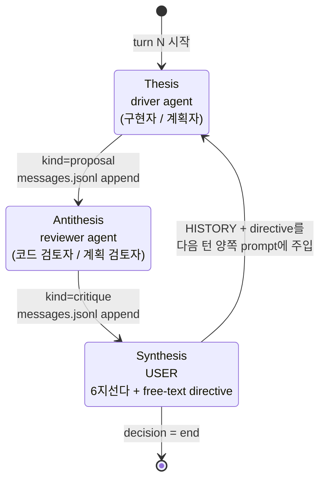
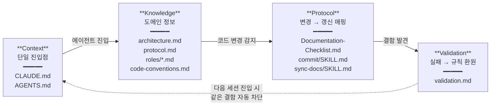
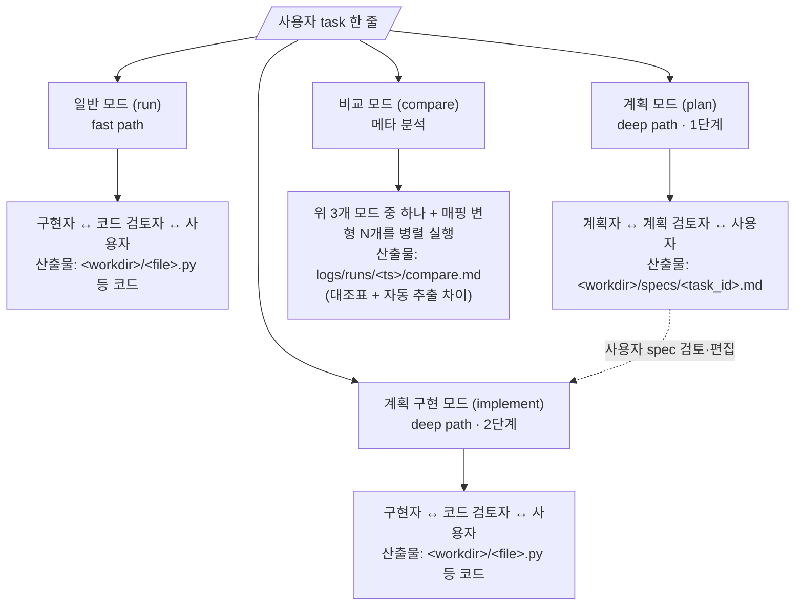

# Architecture — Dialectic-CLI

> 권장 동선 3단계. README → assignment-requirements → 이 문서 → harness → code.

---

## 1. Why dialectic — Hegelian thesis ↔ antithesis ↔ synthesis

흔한 multi-agent loop은 "여러 에이전트가 자유롭게 메시지 주고받음" 정도. 본 도구는 **변증법 구조**를 의도적으로 부과한다:

| 단계 | 역할 | 본 도구의 매핑 |
|---|---|---|
| **Thesis** | 첫 제안 | driver 포지션의 에이전트 (구현자 또는 계획자) |
| **Antithesis** | 비판적 응답 | reviewer 포지션의 에이전트 (코드 검토자 또는 계획 검토자) |
| **Synthesis** | 두 입장의 통합 | **사용자** — 매 턴 6지선다 + free-text directive로 새 방향 생성 |

핵심 차별점: **사용자는 단순 approver가 아니라 synthesis 생성자**. Synthesis는 다음 턴 양쪽 prompt에 `HISTORY` + `directive`로 주입되어, 다음 thesis와 antithesis의 출발점이 된다. 사용자가 빠지면 dialectic 자체가 성립하지 않는다.

→ 단순 multi-agent와 차별: 본 도구는 *구조가 강제하는 사고 사이클*. `messages.jsonl`을 보면 매 턴 turn_id × {driver, reviewer, user_decision} 3 발화의 패턴이 자명.

---

## 2. Why cross-vendor — self-preference bias 회피

같은 모델 self-play(예: Claude vs Claude)는 **self-preference bias**가 있다 — LLM은 자기 출력의 스타일·구조를 선호하는 경향. driver와 reviewer가 같은 모델이면 reviewer가 driver의 결함을 충실히 짚지 못한다.

| 매핑 | 시각 다양성 | 결함 발견 능력 |
|---|---|---|
| Codex ↔ Codex | 같은 모델군 | 약함 (자기 스타일 선호) |
| Claude ↔ Claude | 같은 모델군 | 약함 |
| **Codex ↔ Claude** | 다른 벤더, 다른 학습 데이터, 다른 RLHF | **강함 (진정한 외부 시각)** |

본 도구는 이 thesis를 검증할 수 있는 **compare 모드**도 제공한다 — 같은 task에 대해 (Codex driver, Claude reviewer)와 (Claude driver, Codex reviewer)를 병렬로 돌리고 결과를 대조하는 `compare.md` 자동 생성.

---

## 3. AI 하네스 4계층 매핑

본 도구가 운영하는 4계층:

| 계층 | 본 repo의 파일 | 책임 |
|---|---|---|
| **Context** (단일 진입점) | `CLAUDE.md`, `AGENTS.md` | 개발 시 에이전트가 자동 로드. Pre/Post-Implementation Checklist로 매 작업의 입구·출구 통일 |
| **Knowledge** (도메인 정보) | `docs/dev-docs/architecture.md`, `docs/runtime-docs/protocol.md`, `docs/runtime-docs/roles/*.md`, `docs/dev-docs/code-conventions.md` | 시스템·역할·규칙을 파일별 책임으로 계층화 |
| **Protocol** (변경 → 갱신 매핑) | `docs/dev-docs/Documentation-Checklist.md`, `.claude/skills/{commit,sync-docs}/SKILL.md` | 코드 변경 유형 → 갱신할 .md 자동 매핑. 누락 가능성 구조적 제거 |
| **Validation** (실패 → 규칙 환원) | `docs/dev-docs/validation.md` | 반복 결함 패턴을 규칙으로 추출. 다음 세션부터 같은 결함 자동 차단 |

**dev-time(A 층)** vs **runtime(B 층)** 분리: A는 본 도구를 만드는 에이전트가 자동 로드, B는 본 도구가 driver/reviewer prompt에 주입. 두 층의 cwd 격리(`--workdir`)로 누수 차단. 상세는 `outline/01-harness-layers.md`.

---

## 4. 4 모드 데이터 흐름

| 모드 | 적합한 task | driver 역할 | reviewer 역할 |
|---|---|---|---|
| run | 작은 task, 빠른 반복 | implementer | spec-reviewer |
| plan | 큰 task, 명세부터 신중하게 | planner | plan-reviewer |
| implement | spec.md 이미 있는 task | implementer | spec-reviewer |
| compare | 매핑/모드 변종 정량 비교 | (선택 모드 따름) | (선택 모드 따름) |

**모드별 명령 표면** (plan 014 wiring): `run`/`plan`은 `dialectic <mode> --task <text>` (또는 `dialectic run --mode {run,plan} ...`). `implement`는 `dialectic implement --spec <path>` alias subparser 또는 `dialectic run --mode implement --spec <path>` — spec.md 본문이 `build_prompt §2 TASK` 자리에 substitution. plan→implement chaining은 plan 모드 산출 `<workdir>/specs/<slug>.md` (plan 013) → 사용자 검토·편집 → implement 모드 입력으로 동일 메커니즘 재진입.

**slot ↔ role ↔ vendor 3축 분리**: 포지션(driver/reviewer)은 protocol 고정, 역할(4종)은 모드별 자동 매핑, 벤더(codex/claude/mock)는 사용자 자유. 모드가 추가되어도 schema가 안정. 상세는 `docs/runtime-docs/protocol.md` §1.0.

---

## 5. 통신 모델 — bus-mediated bidirectional

에이전트 간 직접 IPC 채널은 **의도적으로 두지 않는다**. 대신 orchestrator가 append-only JSONL bus(`logs/messages.jsonl`)를 source of truth로 두고, 매 턴 풀 트랜스크립트를 양쪽 prompt의 `HISTORY` 섹션에 주입하는 방식으로 양방향 통신을 구현한다.

이 선택의 이유:

1. **재현성** — bus가 source of truth이면 현재 시점에서 에이전트가 본 컨텍스트를 그대로 재구성 가능. 직접 IPC 방식은 에이전트 내부 상태가 외부에서 보이지 않는 문제.
2. **벤더 비대칭 흡수** — Codex의 `thread_id`와 Claude의 `session_id`는 비대칭. bus로 추상화하면 양쪽 어댑터 인터페이스가 동일.
3. **사용자 synthesis 자연 삽입** — 매 턴 사용자 결정이 bus에 append되면 다음 턴 양쪽 에이전트가 동등하게 본다. 사용자가 단순 관찰자가 아닌 **3rd party agent**가 됨.
4. **Mock 재생 가능** — bus 기반이라 실 호출 없이 사전 녹음 재생만으로도 동일 흐름 재현. 인증 부재 시에도 동작.

prompt cache가 풀 트랜스크립트 주입 비용을 흡수 (Claude 실측: 첫 턴 cache_creation 5549 → 이후 cache_read 4971 패턴). 비용 부담 미미.

---

## 6. ADR — 핵심 설계 결정 10개

5분 안에 핵심 결정 훑기. 각 항목은 본 repo 작성 과정에서 검토·확정된 결정.

| ID | 결정 | 이유 | 거부된 대안 |
|---|---|---|---|
| **ADR-1** | 통신 = JSONL bus + 매 턴 풀 트랜스크립트 주입 | 재현성, 벤더 비대칭 흡수, mock 가능 (§5의 4가지 사유) | `--session-id`/`--resume` 세션 재개 — Codex(thread_id 사후 캡처)와 Claude(사전 지정) 비대칭, 숨은 상태 |
| **ADR-2** | 포지션/역할/벤더 3축 분리 | 모드 추가 시 스키마 안정. 변수 분리로 사고 명확 | 포지션=역할 동일시 — 모드 추가 시 폭발 |
| **ADR-3** | 4 role .md (implementer/spec-reviewer/planner/plan-reviewer) | 모드별 책임 분리, 코드는 단일 인터페이스(role.md path만 다름) | 단일 role 내 분기 — 가독성·유지보수성↓ |
| **ADR-4** | 메뉴 + CLI 인자 둘 다 (인자 부재 시 메뉴 fallback) | 기획자(메뉴) + 자동화·CI(CLI) 두 사용층 모두 만족 | 한 쪽만 — 다른 쪽 막힘 |
| **ADR-5** | Mock 모드 + 인증 부재 시 자동 fallback 노출 | 인증 없이도 실 흐름 시연 가능. 녹음 자체가 세션 로그(JSONL) 자료 동치 | mock 미구현 — 인증 못 한 환경에서 실행 실패 시 도구 자체를 못 돌림 |
| **ADR-6** | cwd 격리 (`--workdir <path>` 또는 `tempfile.mkdtemp`). codex `--ephemeral`(세션 디스크 비활성)이 cwd 격리(OS 차원) 보조 안전망. claude `--bare`는 OAuth/keychain 거부 명세로 본 plan 미사용 — Day 4 ADR-9 후보 `disable_bare` 토글로 deferred | A 층 .md(개발용 CLAUDE.md)가 런타임 prompt에 자동 로드되어 ROLE 충돌하는 위험 차단 | cwd 검증 X — 같은 cwd에서 호출 시 두 층 누수 |
| **ADR-7** | 4 모드 (run/plan/implement/compare) | 단순(run)·신중(plan→implement)·메타(compare) 3 path 분리. plan→implement는 4계층 narrative의 Knowledge 자산화 시연 | run만 — plan-implement 분리 narrative와 Knowledge 자산화 시연 손실 |
| **ADR-8** | reviewer 범위 = 충실도(P0/P1) + 일반 결함(P2) | P0/P1=spec 미준수, P2=일반 결함 — 충실도만이면 빈 함수도 통과해 reviewer 가치 약화 | 충실도만 — reviewer가 진짜 기여하는 부분 손실 |
| **ADR-9** | 사용자 개입 모드별 정책 분기 + 연속 K=2턴 [CONVERGED] 자동 종료 + `MAX_TURNS_HARD_CAP=20` 절대 상한 (상세 narrative 표 아래) | thesis "synthesis 생성자"는 개입 권한이지 빈도 아님. fix-induced regression은 K턴 streak로 차단. 경계 케이스(낮은 max-turns)는 fallback으로 처리. critical/full 모드의 i 분기 무한 누적은 hard cap으로 차단 | 매 턴 강제 prompt — 피로감↑, 의미 있는 결정 희석 / K=1 단발 — fix 후 새 P0 도입 못 봄 / K=3+ — max-turns 소진, 종료 어려움 / hard cap 부재 — i 분기 무한 누적 |
| **ADR-10** | 코드 수정 메커니즘 = search-replace 블록 (LLM 응답에 `FILE / <<<<<<< SEARCH / ======= / >>>>>>> REPLACE` 마커. orchestrator가 정규식 추출 + 정확 일치 검색 + REPLACE 치환. R2 메시지 append 시 `meta.patches` 동시 기록(P-JSONL append-only), R2.6 apply, R2.7 `kind=patch_applied` 별도 append) | line number 의존 0으로 LLM 오류 면역. 어댑터 텍스트 in/out 추상화 보존(CLI 네이티브 write_file 미사용 → 벤더 비대칭 회피). 신규 파일·기존 파일 수정 둘 다 동일 흐름 | A1 unified diff(line number 의존, LLM diff 자주 오류) / A3 full file replace(토큰 낭비) / C CLI 네이티브 도구(어댑터 추상화 누수, 세션 상태 비대칭) / D driver만 write(AgentRunner Protocol 비대칭) |

각 ADR의 더 깊은 논의는 `outline/` 사고 흔적에. ADR ID는 코드 주석·commit message에서도 인용 가능.

### ADR-9 정책 변경 (plan 009-user-synthesis-wiring 실행 후)

`--interactive` 모드별 [CONVERGED] streak 도달 시 동작 분기:

- **end-only 모드**: 기존 정책 유지 — `streak >= K` 도달 즉시 `auto_end_converged` (사용자 prompt 0)
- **critical 모드**: `streak >= K` 도달 시 강제 종료 차단 → `prompt_end_or_iterate` 호출. 사용자 `Y` → `auto_end_user`, `n`/text → 추가 1턴 + streak 리셋 (i 분기 정책 α — `max_turns_runtime += 1`)
- **full 모드**: `streak` 무관하게 매 턴 끝 `prompt_decision` (6지선다). `e` → `auto_end_user`, `i` → `max_turns_runtime += 1`

`MAX_TURNS_HARD_CAP=20` 절대 상한 도입 (`src/orchestrator.py:73` 모듈 상수):
- 초기값 가드: `args.max_turns > MAX_TURNS_HARD_CAP` 시 `min(args.max_turns, MAX_TURNS_HARD_CAP)` clamp + stderr 경고
- 동적 누적 가드: critical/full i 분기로 `max_turns_runtime`이 hard cap 초과하면 `auto_end_hard_cap` meta append 후 즉시 종료
- 무한 누적 차단: i 키 반복 입력으로 turn 무한 진행 방지 (사용자 실수 안전망)

---

## 7. 더 읽기

- `docs/runtime-docs/protocol.md` — 메시지 스키마, 턴 라이프사이클 상세
- `docs/runtime-docs/roles/*.md` — 4 role 본문
- `docs/runtime-docs/systems/INDEX.md` — **모드별 진리문서 SSOT (run/plan/implement/compare)**
- `docs/dev-docs/code-conventions.md` — Python·우리 도구 specific 규칙
- `docs/dev-docs/systems/INDEX.md` — **모듈별 진리문서 SSOT (orchestrator/agents/jsonl-bus/cwd-isolation/env-check)**
- `docs/dev-docs/validation.md` — 결함 패턴 → 규칙 환원 누적
- `outline/` — 본 결정들이 어떻게 도출되었는지 (Q1~Q17 결정 흐름)

---

> ADR 추가/변경 시 outline/ 결정 보드와 동기화 (Documentation-Checklist 참조).
