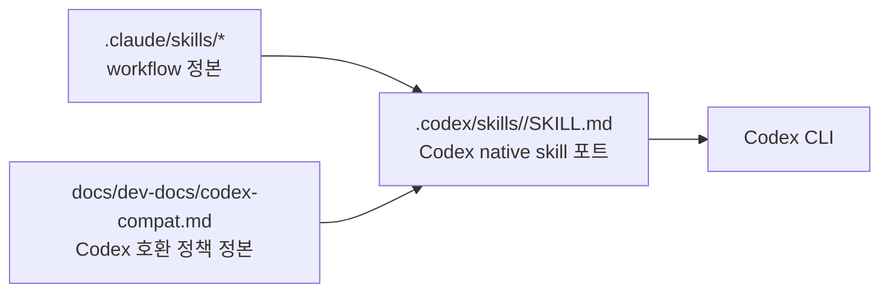

# Codex Compatibility — Dialectic-CLI

> Codex CLI가 repo-local `.claude/skills/*` 워크플로우를 실행할 때 적용하는 호환 정책의 정본. 본 문서는 dev-time A층 자산이며 runtime prompt에 들어가면 안 된다.

---

## 1. 위치와 책임

| 자산 | 책임 |
|---|---|
| `.claude/skills/*` | 개발 워크플로우의 canonical source |
| `docs/dev-docs/codex-compat.md` | Codex 호환 정책의 canonical source |
| `.codex/skills/<workflow>/SKILL.md` | Codex에서 `$create-plan`, `$sync-docs`처럼 직접 호출하는 native skill 포트 |
| `.codex/skills/claude-skill-compat/SKILL.md` | 미포팅 workflow나 직접 compat 호출을 위한 fallback 어댑터 |
| `src/dev_skill_cli.py` / `dialectic-skill` | Codex 대화에 붙여넣을 `$<workflow>` 명시 호출 문구 생성 |

`.codex/skills/*`는 Codex가 "스킬"로 발견하는 실행 단위다. 따라서 정책 정본은 이 디렉터리에 두지 않고, 개발 문서 영역인 `docs/dev-docs/`에 둔다.



---

## 2. Canonical Sources

Codex가 `.claude/skills` 워크플로우를 실행할 때 다음 파일을 source of truth로 취급한다.

| Workflow | Canonical file |
|---|---|
| Skill index | `.claude/skills/SKILLS.md` |
| create-plan | `.claude/skills/create-plan/SKILL.md` |
| execute-plan | `.claude/skills/execute-plan/SKILL.md` |
| review-plan | `.claude/skills/review-plan/SKILL.md` |
| review-code | `.claude/skills/review-code/SKILL.md` |
| sync-docs | `.claude/skills/sync-docs/SKILL.md` |
| commit | `.claude/skills/commit/SKILL.md` |

요청된 workflow가 명확하면 해당 canonical file만 읽는다. Workflow가 모호할 때만 `.claude/skills/SKILLS.md`를 먼저 읽는다.

---

## 3. Codex Overrides

Codex는 canonical `.claude` skill을 읽은 뒤 다음 override를 적용한다.

1. `Agent(...)`, `Task tool`, `subagent_type="general-purpose"`는 Claude Code 용어다. Codex에서는 사용자가 subagent·delegation·parallel agent 작업을 명시 요청한 경우에만 `spawn_agent`로 번역한다.
2. 사용자가 subagent를 명시 승인하지 않았으면 main Codex thread에서 직접 수행한다.
3. `execute-plan`은 phase graph 의미를 보존한다. 기본은 main thread 순차 실행이며, 병렬화는 사용자 명시 승인 후에만 한다.
4. `review-plan`과 `review-code`는 독립 검토 요구를 review stance로 보존한다. Subagent 승인이 없으면 same-context review임을 밝히고 checklist를 더 엄격하게 적용한다.
5. `review-plan` 결과로 plan을 자동 수정하지 않는다. `review-code` 결과로 코드를 자동 수정하지 않는다. `commit` workflow로 자동 commit하지 않는다.
6. A/B층 경계를 유지한다. `.claude/skills`, `.codex/skills`, `CLAUDE.md`, `AGENTS.md`, `docs/dev-docs/*`는 dev-time A층 자산이며 runtime prompt에 포함하지 않는다.

---

## 4. 실행 절차

1. 요청된 workflow name을 식별한다.
2. `.claude/skills/<workflow>/SKILL.md`를 읽는다.
3. 본 문서의 Codex override를 적용한다.
4. `AGENTS.md` Pre/Post-Implementation Checklist를 따른다.
5. 스킬 동작이 바뀌면 `.claude` canonical skill과 본 문서를 함께 갱신한다. Codex skill discovery 동작이나 trigger description이 바뀔 때만 `.codex/skills/<workflow>/SKILL.md`를 갱신한다.

---

## 5. Command Wrapper

`pip install -e .` 이후 `dialectic-skill`은 `$<workflow>`로 시작하는 Codex-ready prompt를 생성한다.

```bash
dialectic-skill
dialectic-skill sync-docs
dialectic-skill review-plan plan/001-run-mode-core
dialectic-skill --show review-code
```

Wrapper는 Codex를 직접 실행하지 않는다. 현재 Codex session의 소유권을 사용자에게 남기기 위해 붙여넣을 prompt만 출력한다.

예시 출력:

```markdown
$sync-docs

`.claude/skills/sync-docs/SKILL.md`를 Codex 방식으로 적용해서 `sync-docs` 실행해줘.
```

---

## 6. Reporting

이 레이어를 사용할 때는 짧게 보고한다.

```markdown
$<workflow>

`.claude/skills/<workflow>/SKILL.md`를 Codex 방식으로 적용해서 `<workflow>` 실행해줘.
```

Canonical skill과 Codex tool policy가 충돌하면 Codex tool policy가 우선한다. 충돌 지점과 가장 가까운 안전한 대체 실행을 보고한다.
