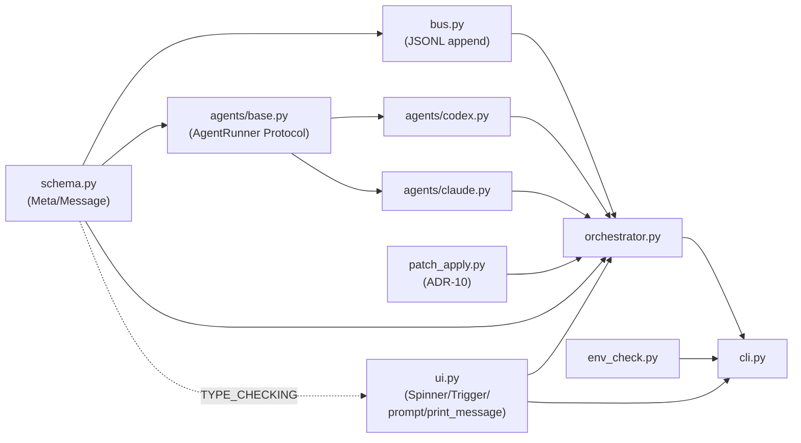

# Dev Systems Index

Dialectic-CLI 개발 모듈별 진리문서 (A 층 — `outline/01-harness-layers.md` §1.2).

각 모듈은 `src/*.py` 1:1 대응. `architecture.md`(왜 dialectic + ADR 10개)는 횡단 결정, 본 파일들은 모듈 단위 동작·인터페이스.

## 모듈 표

| 모듈 | 파일 | 책임 | LOC | 핵심 ADR |
|---|---|---|---|---|
| [schema](jsonl-bus.md#schema) | `src/schema.py` | `Message` 13 필드 + `Meta` 14 필드 dataclass (ADR-10 4 필드 포함) + to_dict/from_dict + frozen `__post_init__` ts invariant | ~119 | ADR-1·-10 |
| [bus](jsonl-bus.md) | `src/bus.py` | JSONL append-only `Bus(path)` + `f.flush()` 강제 | ~40 | ADR-1 |
| [agents](agents.md) | `src/agents/{base,codex,claude}.py` | `AgentRunner` Protocol + `CodexRunner`/`ClaudeRunner` 어댑터 | ~388 | ADR-2 |
| [orchestrator](orchestrator.md) | `src/orchestrator.py` | 턴 라이프사이클 + `[CONVERGED]` + ADR-9 fallback + ADR-6 차단 + ADR-10 R2.6/R2.7 통합 + 3 mode 분기 (end-only/critical/full) + helper 6종 (`_decision_msg`/`_last_critique_msg_id`/`_last_proposal_msg_id`/`_setup_sigint_handler`/`_run_session_*` 3) + `MAX_TURNS_HARD_CAP=20` | ~975 | ADR-1·-3·-6·-9·-10 |
| [patch-apply](patch-apply.md) | `src/patch_apply.py` | `extract_patches`/`apply_patches`/`validate_patch_path` (cwd-isolation §Layer 4 SSOT 정통)/`PatchApplyError` — ADR-10 search-replace | ~177 | ADR-10 |
| [env-check](env-check.md) | `src/env_check.py` | `dialectic doctor` — claude/codex 인증 점검 | ~52 | — |
| [cli](orchestrator.md#cli) | `src/cli.py` | argparse subparsers `run`/`doctor` + `_interactive_menu` (default 진입) + `--interactive` 3 mode (end-only/critical/full) | ~300 | ADR-4 |
| [ui](ui.md) | `src/ui.py` | 사용자 결정 UI (`prompt_decision`/`prompt_end_or_iterate`) + 비동기 트리거 (`TriggerListener` Ctrl+F) + spinner (`Spinner`) + 결과 출력 (`print_message`) + stdin 통제 (`stdin_utf8_mode`/`stdin_canonical_off`/`flush_stdin`) | ~730 | ADR-4 |
| [cwd-isolation](cwd-isolation.md) | (횡단 — `orchestrator.py run_session` + `agents/*.py subprocess.run`) | ADR-6 메커니즘 | (横) | ADR-6 |

## 의존 그래프

A → {B1, B2} → C → D plan 의존 그래프와 동형. ui.py는 plan 006·008·009 누적 산출 — orch + cli 양쪽 호출자.

## 변경 시 갱신 매핑

| 코드 변경 | 갱신 대상 (dev-docs/systems/) |
|---|---|
| `src/schema.py` Meta/Message 필드 | `jsonl-bus.md` §schema |
| `src/bus.py` append/read 인터페이스 | `jsonl-bus.md` §bus |
| `src/agents/*.py` 어댑터 cmd_list·인증·Meta 채움 | `agents.md` |
| `src/orchestrator.py` 턴 loop·[CONVERGED]·ADR-9·R2.6/R2.7·mode 분기·helper | `orchestrator.md` + `runtime-docs/systems/<mode>.md` |
| `src/patch_apply.py` extract/apply/validate (ADR-10) | `patch-apply.md` + `cwd-isolation.md §Layer 4` (SSOT) |
| `src/env_check.py` doctor 호출 | `env-check.md` |
| `src/cli.py` argparse 인자 + 메뉴 진입 | `orchestrator.md` §cli + `runtime-docs/systems/<mode>.md` §1 |
| `src/ui.py` 사용자 결정/트리거/spinner/결과 출력/stdin 통제 | **`ui.md`** + `outline/03-ux.md` §3.1·§3.2·§3.3 + `code-conventions.md` §7 + `validation.md` P-RAW |
| subprocess `cwd=` 또는 ADR-6 차단 메커니즘 | `cwd-isolation.md` |

`Documentation-Checklist.md` §1에 본 매핑 등재 — 변경 시 sync-docs가 catch.

## 관련 문서

- `architecture.md` (왜 dialectic + ADR + 4계층) — 횡단 결정
- `code-conventions.md` (Python 규칙) — 모든 모듈 횡단
- `validation.md` §4.4 (P-id 표) — 결함 패턴 환원
- `runtime-docs/systems/INDEX.md` — 모드 단위 진리 (A 층 ↔ B 층 cross-link)
