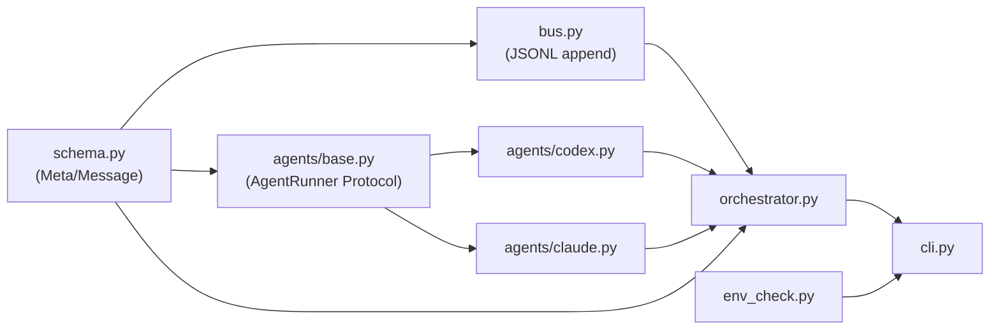

# Dev Systems Index

Dialectic-CLI 개발 모듈별 진리문서 (A 층 — `outline/01-harness-layers.md` §1.2).

각 모듈은 `src/*.py` 1:1 대응. `architecture.md`(왜 dialectic + ADR 9개)는 횡단 결정, 본 파일들은 모듈 단위 동작·인터페이스.

## 모듈 표 (Day 2 산출물 기준)

| 모듈 | 파일 | 책임 | LOC | 핵심 ADR |
|---|---|---|---|---|
| [schema](jsonl-bus.md#schema) | `src/schema.py` | `Message` 12 필드 + `Meta` 14 필드 dataclass + to_dict/from_dict | ~86 | ADR-1 |
| [bus](jsonl-bus.md) | `src/bus.py` | JSONL append-only `Bus(path)` + `f.flush()` 강제 | ~40 | ADR-1 |
| [agents](agents.md) | `src/agents/{base,codex,claude}.py` | `AgentRunner` Protocol + `CodexRunner`/`ClaudeRunner` 어댑터 | ~317 | ADR-2 |
| [orchestrator](orchestrator.md) | `src/orchestrator.py` | 턴 라이프사이클 + `[CONVERGED]` + ADR-9 fallback + ADR-6 차단 | ~398 | ADR-1·-3·-6·-9 |
| [env-check](env-check.md) | `src/env_check.py` | `dialectic doctor` — claude/codex 인증 점검 | ~52 | — |
| [cli](orchestrator.md#cli) | `src/cli.py` | argparse subparsers `run`/`doctor` | ~67 | ADR-4 |
| [cwd-isolation](cwd-isolation.md) | (횡단 — `orchestrator.py run_session` + `agents/*.py subprocess.run`) | ADR-6 메커니즘 | (横) | ADR-6 |

## 의존 그래프

A → {B1, B2} → C → D plan 의존 그래프와 동형.

## 변경 시 갱신 매핑

| 코드 변경 | 갱신 대상 (dev-docs/systems/) |
|---|---|
| `src/schema.py` Meta/Message 필드 | `jsonl-bus.md` §schema |
| `src/bus.py` append/read 인터페이스 | `jsonl-bus.md` §bus |
| `src/agents/*.py` 어댑터 cmd_list·인증·Meta 채움 | `agents.md` |
| `src/orchestrator.py` 턴 loop·[CONVERGED]·ADR-9 | `orchestrator.md` + `runtime-docs/systems/<mode>.md` |
| `src/env_check.py` doctor 호출 | `env-check.md` |
| `src/cli.py` argparse 인자 | `orchestrator.md` §cli + `runtime-docs/systems/<mode>.md` §1 |
| subprocess `cwd=` 또는 ADR-6 차단 메커니즘 | `cwd-isolation.md` |

`Documentation-Checklist.md` §1에 본 매핑 등재 — 변경 시 sync-docs가 catch.

## 관련 문서

- `architecture.md` (왜 dialectic + ADR + 4계층) — 횡단 결정
- `code-conventions.md` (Python 규칙) — 모든 모듈 횡단
- `validation.md` §4.4 (P-id 표) — 결함 패턴 환원
- `runtime-docs/systems/INDEX.md` — 모드 단위 진리 (A 층 ↔ B 층 cross-link)
