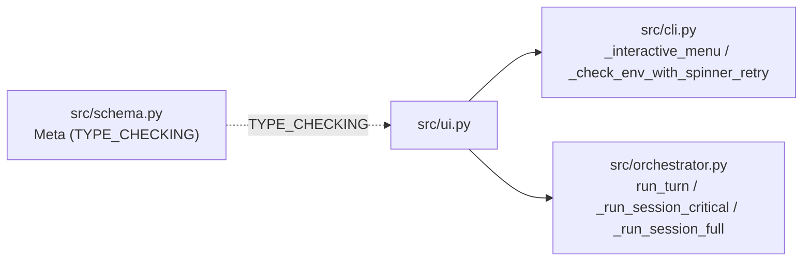

# UI Module — `src/ui.py` SSOT

사용자 개입 UI 자산 모음 (A 층 메뉴 진입 + B 층 turn loop 호출). plan 006-ui (Spinner·prompt_decision 신설) → plan 008-ui-polish (print_message·stdin_canonical_off·stdin_utf8_mode·flush_stdin 추가) → plan 009-user-synthesis-wiring (TriggerListener·prompt_end_or_iterate 추가) → plan 015-trigger-race-fix (TriggerListener `_byte_queue` + `__exit__` queue drain Phase C ① 부분 fix, race 잔존) 누적 산출.

## 1. 책임

- **사용자 결정 UI**: 6지선다 (a/r/m/i/e/s) + Y/n/c/text + 재입력 retry — `prompt_decision`, `prompt_end_or_iterate`
- **비동기 트리거**: Ctrl+F raw mode listener — `TriggerListener`
- **진행 표시**: ANSI spinner — `Spinner`
- **결과 출력**: outline §3.2:193-225 형식 — `print_message`
- **stdin 통제**: canonical/raw mode 전환 + drain thread + INTR 보존 — `stdin_utf8_mode`, `stdin_canonical_off`, `flush_stdin`

핵심 정합성: 외부 의존성 0 (표준 라이브러리만 — `os/sys/threading/queue/select/termios/tty/signal/fcntl/time/contextlib/typing`). isatty 가드로 CI·파이프 환경 silent fallback.

## 2. 핵심 함수·클래스 표

| 자산 | 종류 | 책임 | 호출 시점 | 핵심 정합 |
|---|---|---|---|---|
| `DECISION_KEYS = ("a","r","m","i","e","s")` | 상수 | outline §3.3 SSOT 6지선다 키 | `prompt_decision` 분기 | outline 1:1 |
| `KEY_LABEL` dict | 상수 | a/r/m/i/e/s → `accept driver`/`accept reviewer`/`merge`/`iterate`/`end`/`skip review` | 6지선다 표시 | outline §3.3 |
| `SPINNER_TICK_S = 0.1` / `SPINNER_FRAMES` | 상수 | spinner 갱신 주기 + 10 프레임 (`⠋⠙⠹⠸⠼⠴⠦⠧⠇⠏`) | Spinner._run | code-conventions §2 외부 의존성 0 |
| `DRAIN_POLL_S = 0.05` / `DRAIN_BUF_BYTES = 4096` | 상수 | stdin drain thread select timeout + os.read buf | `stdin_canonical_off._drain_loop` | C-013 EOF guard |
| `THREAD_JOIN_TIMEOUT_S = 1.0` | 상수 | spinner / drain / trigger thread join 한계 | __exit__ | C-012 join guard |
| `INVALID_RETRY_LIMIT = 3` | 상수 | 잘못된 키 입력 retry 한계 | prompt_*  | 비대화형 fallback |
| `VENDOR_LABEL` / `ROLE_LABEL_KO` | 상수 | spinner/print_message 라벨 — `codex→Codex CLI`, `implementer→구현자` 등 | spinner msg / print_message header | outline §3.2:190 narrative SSOT |
| `prompt_decision(turn_id, *, interactive_mode="end-only")` | 함수 | 6지선다 + directive 한 줄 입력 → `(key, directive_or_None)`. Enter=`("i", None)` default. invalid retry 3회 한계 fallback `("i", None)`. EOF/KBI=`("e", None)` | full 모드 매 턴 끝 (orchestrator wiring) | outline §3.2 line 216 라벨 SSOT |
| `prompt_end_or_iterate(turn_id, reason, *, allow_continue=True, allow_iterate_no_directive=True)` | 함수 | Y/n/c/text 분기 → `(key, directive_or_None)`. allow 인자별 옵션 노출 분기 (trigger 단독→Y/c/text, CONVERGED/last_turn→Y/n/text). retry 3회 한계 fallback (`c` 또는 `e`). EOF/KBI=`("e", None)` | critical 모드 종료 직전 / 트리거 발동 / max-turns 도달 | `_read_line_for_prompt()` helper 사용 — fd-level os.read로 Python TextIOWrapper buffer 우회 (plan 011 Bug 1 fix 3차). validation.md C-015 — 일부 환경 race 잔존 |
| `_read_line_for_prompt()` | 함수 | fd-level readline. `flush_stdin(grace_period_s=0.05)` + `os.read(fd, 4096)` byte 단위 누적, newline까지. canonical mode가 line discipline 처리 (kernel level line buffer) | `prompt_end_or_iterate` 내부 호출 | plan 011 Bug 1 fix — input() GNU readline lib race + sys.stdin TextIOWrapper buffer race 차단. validation.md C-015 |
| `Spinner(message="")` | 클래스 (컨텍스트) | ANSI 회전 + threading.Thread daemon. isatty=False → no-op. `__exit__`에 `\r\x1b[2K` clear | run_turn driver/reviewer 호출 wrap (outline §3.2:190) | code-conventions §7 패턴 |
| `TriggerListener()` | 클래스 (컨텍스트) | Ctrl+F (`0x06`) raw mode listener. `__enter__` setcbreak (`when=TCSANOW` — drain X) + 사전 누름 회수 (fcntl `O_NONBLOCK` + `os.read` drain → 0x06 검사) + `self._byte_queue: queue.Queue[bytes] = queue.Queue(maxsize=1024)` 초기화 (plan 015 Phase C ① queue 메커니즘). `_run` thread `select` fd-level + `os.read` byte 단위 + self-pipe wake. listener thread `os.read` 직후 `self._byte_queue.put_nowait(ch_bytes)` — byte 절도 후 thread-safe queue에 보존 (TRIGGER_BYTE 검사 + Event set는 listener thread 내부 보존 — 실시간 stderr 피드백 유지). trigger.set 후 thread 계속 (loop 유지 — 추가 누름 안내). `__exit__` self-pipe wake + thread join + 1차 timeout 시 추가 wake + 추가 join (plan 011 Bug 1 fix 3차) + **finally `while True: queue.get_nowait() except queue.Empty: break` queue drain loop (plan 015 Phase C ① — 잔존 byte 폐기, forward 금지 — 사용자 'y'/한글 입력에 trigger byte(0x06) prefix 누수 차단)** + tcsetattr(`TCSAFLUSH`) 복원 (drain + flush + 즉시 적용, plan 011 Bug 1 fix 1차) + `tcflush(TCIFLUSH)` drain. `is_set()` Event proxy. cleanup-restart 패턴 (매 turn 새 인스턴스) | critical 모드 turn loop wrap | P-RAW + plan 009/011 hot-fix history + plan 015 Phase C ① queue 부분 fix. validation.md C-015 보류 — `tools/repro_listener.py` 수동 시연 race 0/4, 실 dialectic CLI(WSL2 PTY) 시연 race 잔존 — R-NNN 환원 보류 |
| `stdin_utf8_mode()` | 컨텍스트 매니저 | Linux line discipline `IUTF8` iflag set — 한글 multi-byte Backspace 1회 char 단위 정상 처리. `termios.IUTF8` 미노출 빌드 시 `_LINUX_IUTF8 = 0o040000` fallback. 비-Linux/비-tty silent skip | 메뉴 진입 wrap | 한글 입력 결함 차단 |
| `stdin_canonical_off()` | 컨텍스트 매니저 | canonical mode + ECHO off (`tcsetattr(TCSAFLUSH)`) + drain thread (daemon) — Spinner 동안 사용자 키 입력 line 누수 차단. drain loop INTR(`\x03`) 감지 시 `os.kill(SIGINT)` 명시 호출 (Ctrl-C 보존, P-RAW 결함 통로 1). `try/finally` `tcsetattr(TCSAFLUSH, old) + tcflush(TCIFLUSH)` 복원. `is_alive()` guard로 thread.start 실패 mask 차단 (C-012) | 환경 점검 spinner wrap | P-RAW 결함 통로 1·2·3·6 |
| `flush_stdin(*, grace_period_s=0.0)` | 함수 | POSIX `tcflush(TCIFLUSH)` 1차 + select polling `os.read` 2차 drain. `grace_period_s>0` 시 deadline polling (spinner 종료 race window cover). EOF guard (C-013). isatty=False silent | spinner 종료 직후 buffer drain | P-RAW |
| `print_message(*, role_label, vendor_label, kind, text, meta)` | 함수 | outline §3.2 line 193-225 형식 1:1 stdout 출력. 헤더 ANSI 색상 (kind별: proposal=cyan, critique=yellow, decision=green, error=red). `isatty()=False` 시 색상 빈 문자열 (capsys/CI 회귀 차단). 출력 자체는 isatty 무관 | run_turn proposal/critique 직후 | outline SSOT |

## 3. 의존 모듈 / 호출자



- `cli.py:_check_env_with_spinner_retry` → `Spinner` + `stdin_canonical_off` + `flush_stdin`
- `cli.py:_interactive_menu_body` → `stdin_utf8_mode`
- `orchestrator.py:run_turn` → `Spinner`(driver/reviewer 호출 wrap) + `print_message`(proposal/critique 직후)
- `orchestrator.py:_run_session_critical` → `TriggerListener`(매 turn cleanup-restart) + `prompt_end_or_iterate`(매 turn 끝 잠재 prompt)
- `orchestrator.py:_run_session_full` → `prompt_decision`(매 turn 끝 6지선다)

## 4. 핵심 결함 패턴 (validation.md P-RAW 누적)

본 모듈은 stdin/raw mode 통제라 P-RAW 결함 통로 6종 + plan 015 Phase C ① queue drain 폐기 정책 부분 fix 통로:

1. **ISIG 처리 우회** — drain loop `\x03` 감지 → `os.kill(SIGINT)` (`stdin_canonical_off`)
2. **mode 복원 누수** — try/finally tcsetattr + tcflush
3. **thread.start 실패 mask** — `is_alive()` guard
4. **EOF byte busy loop** — `if not data: return` (C-013)
5. **`(OSError, termios.error)` 양 catch** — termios.error는 OSError 하위 X
6. **set 실패 silent skip** — tty인데 권한·기능 미지원 환경 호환
7. **listener thread byte 절도 race + cleanup queue 잔존 forward 누수** (C-015 보류 — race 부분 완화, plan 015 Phase C ①) — raw mode listener thread `os.read(fd, 1)` byte 절도 vs main thread readline 동시 점유. listener는 thread-safe `queue.Queue(maxsize=1024)` 보존 + `__exit__` finally에서 thread join 후 queue drain loop (`get_nowait` empty까지) **discard**. queue forward는 금지 — 사용자 'y'/한글 입력에 trigger byte(0x06) 또는 이전 사용자 byte가 readline prefix 누수. **잔존**: `tools/repro_listener.py` 수동 시연(에이전트 호출 0)에서 race 0/4, 실 dialectic CLI(codex/claude subprocess 30초+ 후 prompt) 시연에서는 race 재현 — listener thread `os.read` blocking 갇힘 + cooked mode 한 줄 분할 절도. 사용자 워크어라운드: prompt 첫 입력 빈 줄 처리되면 두 번째 입력은 정상 도달.

plan 008 hot-fix round + plan 009 hot-fix round + plan 015 Phase C ① 부분 fix 사례 누적 — `validation.md:342-360` + C-015 (§3 후보 상태, R-NNN 환원 보류).

## 5. 변경 시 갱신 영향

| 코드 변경 | ui.md 영향 |
|---|---|
| 새 prompt 함수 추가 | §2 핵심 함수·클래스 표 행 추가 |
| `Spinner` / `TriggerListener` 동작 변경 | §2 narrative + §4 P-RAW 통로 재검토 |
| outline §3.2 narrative 변경 | §2 narrative 정합성 cross-check |
| `_serialize_history` / `build_prompt` 시그니처 변경 (orchestrator) | §3 의존 그래프 narrative |
| 새 raw mode 자산 추가 (예: 새 listener) | §4 P-RAW 통로 6종 재검사 + validation.md 사례 누적 |

## 6. 검증 명령

```bash
# 단위 (필수, 매 변경마다)
.venv/bin/pytest -q tests/test_ui.py tests/test_ui_print_message.py \
                    tests/test_orchestrator_spinner.py \
                    tests/test_trigger_listener.py \
                    tests/test_prompt_end_or_iterate.py \
                    tests/test_cli_interactive_modes.py

# E2E 사용자 시연 (대화형)
dialectic        # 메뉴 진입 — Spinner·stdin_canonical_off·flush_stdin 동작
dialectic run --task "..." --max-turns 2 --interactive critical
                # TriggerListener·prompt_end_or_iterate 동작
dialectic run --task "..." --max-turns 2 --interactive full
                # prompt_decision 6지선다 동작

# TriggerListener 수동 standalone (plan 015 Phase C ① 부분 fix 검증)
.venv/bin/python tools/repro_listener.py
                # Spinner + 5초 sleep + Ctrl+F → prompt 사이클
                # 수동 시연 race 0/N (에이전트 호출 0 환경 한정 — 실 dialectic CLI race 잔존)
```

## 7. 관련 문서

- `outline/03-ux.md` §3.1·§3.2·§3.3 — UI/메뉴/6지선다 narrative SSOT (5 위치 cascade)
- `docs/runtime-docs/protocol.md` §6 — kind 표 (decision kind UI 결과 보존)
- `docs/dev-docs/code-conventions.md` §2 외부 의존성 0 + §7 TriggerListener termios 패턴
- `docs/dev-docs/validation.md` P-RAW — raw mode 결함 통로 6종 + plan 008·009·015 사례 누적, C-015 (TriggerListener Phase C ① queue 부분 fix, R-NNN 환원 보류)
- `docs/dev-docs/systems/orchestrator.md` — UI 호출자 wiring (run_turn / _run_session_*)
- `plan/completed/006-ui/01-plan.md`, `plan/completed/008-ui-polish/01-plan.md`, `plan/completed/009-user-synthesis-wiring/01-plan.md`, `plan/completed/015-trigger-race-fix/01-plan.md` — 누적 산출 history
- `tools/repro_listener.py` — TriggerListener 수동 standalone 시연 (Spinner + 5초 sleep, 사용자 환경 의존성 검증)
