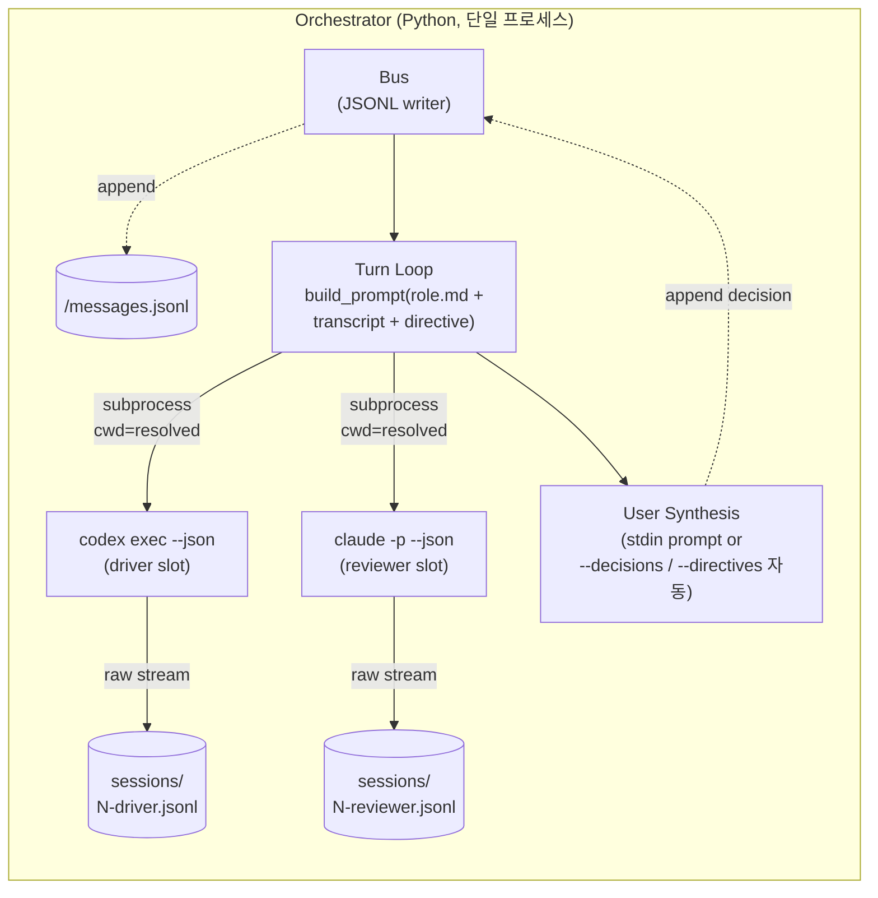
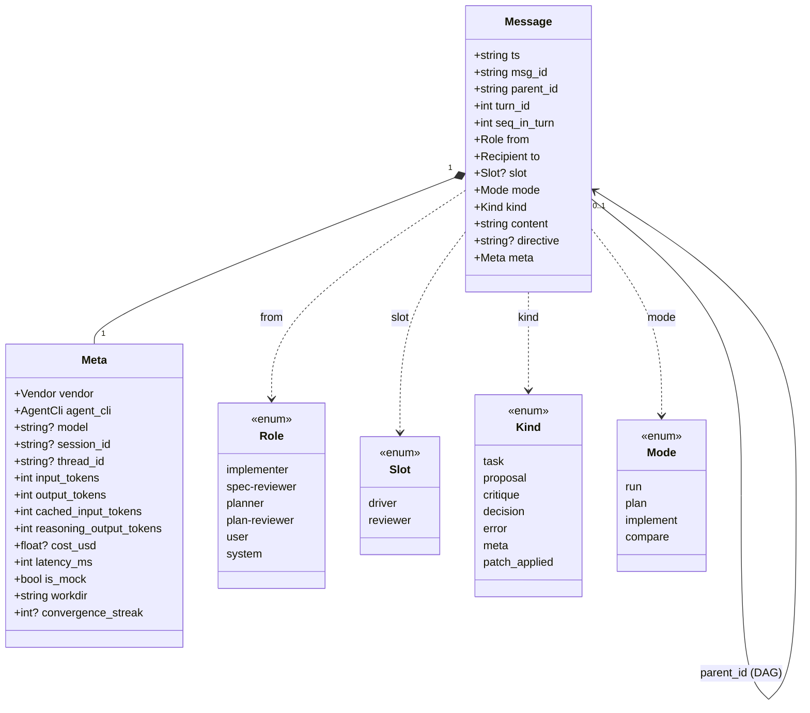
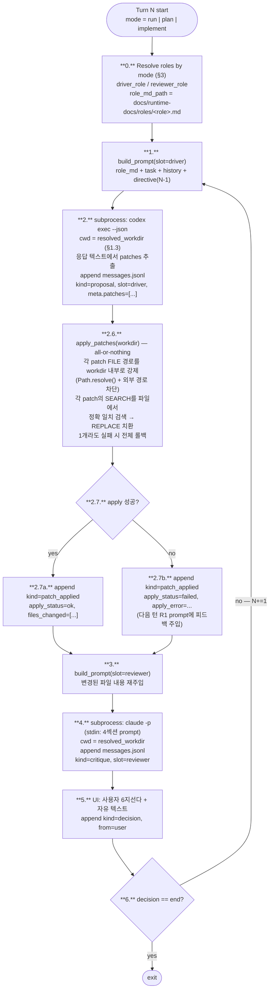

# Protocol — Dialectic-CLI 런타임 사양

> 본 문서는 런타임 메커니즘의 단일 진실 (single source of truth). 코드와 본 문서가 어긋나면 둘 중 하나가 틀린 것 — `docs/dev-docs/Documentation-Checklist.md`에 따라 동기화한다.

권장 동선 4단계 — 메시지 흐름·턴 라이프사이클·실패 모드를 한 문서에서 모두 확인.

---

## 1.0 포지션 vs 역할 vs 벤더 (3축 분리)

본 문서에 등장하는 세 가지 명칭의 차이:

| 구분 | 의미 | 값 | 결정 시점 |
|---|---|---|---|
| **포지션 (slot)** | 한 턴 안에서 누가 먼저/나중에 발화하는가 | `driver` (먼저) / `reviewer` (나중) | 프로토콜 고정 |
| **역할 (role)** | 그 포지션에 들어가는 에이전트의 책임 | `implementer` / `spec-reviewer` / `planner` / `plan-reviewer` | **모드별 자동 매핑** (§3) |
| **벤더 (CLI)** | 그 포지션을 실제 실행하는 CLI | `codex` / `claude` / `mock` | `--driver` / `--reviewer` 플래그 |

**메시지 스키마의 `from`은 역할 기준** (의미 명확). 포지션은 로그 파일명·orchestration 순서. 벤더는 CLI 호출 명령. 셋이 직교(orthogonal)하므로 한 task에 대해 (4 모드) × (2 포지션 × 2 벤더) = 최대 16 변종 비교 가능.

---

## 1.1 통신 모델



직접 IPC 없음. bus가 통신 메커니즘 (자세한 정당화는 `docs/dev-docs/architecture.md` §5).

---

## 2. 메시지 스키마

`<session-ts>/messages.jsonl` — 한 줄 = 한 메시지. 파일은 append-only.

```jsonc
{
  "ts": "2026-05-06T14:32:11.482Z",     // ISO-8601 UTC
  "msg_id": "019dfd43-7a67-4a69-9d4b-aaaabbbbcccc",  // uuid4 hex (parent 추적)
  "parent_id": "019dfd43-7a67-4a69-9d4b-bbbbccccdddd", // 어떤 메시지에 응답한 것인가 (DAG)
  "turn_id": 1,                          // 1부터 시작
  "seq_in_turn": 1,                      // 같은 턴 내 순서 (driver=1, reviewer=2, user=3)
  "from": "implementer",                 // role 기준 — implementer | spec-reviewer | planner | plan-reviewer | user | system
  "to":   "broadcast",                   // broadcast | implementer | spec-reviewer | planner | plan-reviewer
  "slot": "driver",                      // driver | reviewer (system/user는 null)
  "mode": "run",                         // run | plan | implement | compare
  "kind": "proposal",                    // task | proposal | critique | decision | error | meta | patch_applied
  "content": "...",                      // 본문 (마크다운/코드 자유)
  "directive": null,                     // 사용자가 다음 턴에 주입한 지시문 (kind=decision일 때)
  "meta": {
    "vendor": "openai",                  // openai | anthropic | mock | user | system
    "agent_cli": "codex",                // codex | claude | mock | user
    "model": "gpt-5-codex",              // 가능하면 stream에서 파싱 (없으면 null)
    "session_id": null,                  // claude session_id (claude 호출 시)
    "thread_id": "019dfd43-...",         // codex thread_id (codex 호출 시)
    "input_tokens": 13281,
    "output_tokens": 5,
    "cached_input_tokens": 11648,
    "reasoning_output_tokens": 13,       // codex turn.completed.usage 보고 — claude·mock은 0
    "cost_usd": 0.0,                     // claude는 직접, codex는 추정 또는 null
    "latency_ms": 2371,
    "is_mock": false,                    // mock 재생 시 true
    "workdir": "/tmp/dialectic-abc123",  // resolved cwd (재현성)
    "convergence_streak": null,          // reviewer [CONVERGED] 단독 마지막 줄 출력 시 1, auto_end_converged 시 K, 그 외 null
    // === 추가 필드 (search-replace 메커니즘, Q22 ✅ A2 / ADR-10) ===
    "patches": [                         // kind=proposal일 때, driver 응답 텍스트에서 추출한 search-replace 블록을 메시지 append와 동시에 기록 (P-JSONL append-only 일관). 응답에 patch 블록 없으면 빈 리스트 [] 또는 null
      {"file": "wave_difficulty.py", "search": "...", "replace": "..."}
    ],
    "apply_status": "ok",                // kind=patch_applied일 때만: "ok" | "failed" (all-or-nothing 채택, partial 폐기)
    "apply_error": null,                 // apply_status=failed 시 사유 (예: "search not found in wave_difficulty.py", "path outside workdir: ../etc/passwd")
    "files_changed": ["wave_difficulty.py"]  // apply_status=ok 시 적용된 파일 리스트, failed 시 빈 리스트 [] (롤백되어 실 변경 0)
  }
}
```

### 타임스탬프 정책

`ts` 필드는 **MUST UTC ISO8601 with `Z` 접미사**. `pyproject.toml` `requires-python = ">=3.10"` 기준 (3.10 호환):

- import: `from datetime import datetime, timezone`
- 생성: `datetime.now(tz=timezone.utc).isoformat(timespec='milliseconds').replace('+00:00', 'Z')`
- **금지**: 
  - TZ-naive `datetime.now()` (로컬 타임존 누수)
  - `datetime.utcnow()` (Python 3.12+ deprecated, TZ-naive 반환)
  - `datetime.UTC` 상수 (Python 3.11+ alias — 3.10 호환 보장 위해 `timezone.utc` 사용)

src/schema.py에서 ts 필드를 dataclass field로 정의 시 frozen + str 타입. 검증은 `tests/test_schema.py`에서 정규식 `^\d{4}-\d{2}-\d{2}T\d{2}:\d{2}:\d{2}\.\d{3}Z$` 매치 검사.

ADR-1 (JSONL bus) 정합 — 재현성·로그 비교를 위해 timezone 일관성 강제.

### `kind` 값별 의미

| kind | 발생 시점 | from |
|---|---|---|
| `task` | 첫 메시지 (turn_id=0) | `system` (또는 `user`) |
| `proposal` | driver 포지션 응답 | role 따라 (`implementer` 또는 `planner`) |
| `critique` | reviewer 포지션 응답 | role 따라 (`spec-reviewer` 또는 `plan-reviewer`) |
| `decision` | run_session critical/full 모드 (Phase D wiring) — 매 턴 끝 `prompt_decision`/`prompt_end_or_iterate` 호출 결과. critical 모드는 Ctrl+F 트리거·CONVERGED·max-turns 도달 시점만, full 모드는 매 턴 강제 | `user` |
| `error` | 호출 실패·timeout·파싱 실패 | `system` |
| `meta` | budget 초과·중단 등 | `system` |
| `patch_applied` | R2.6 apply_patches 직후 (성공/실패 모두) — `meta.apply_status`/`apply_error`/`files_changed` 동반 | `system` |

### `decision` 메시지 형식 (`src/orchestrator.py:_decision_msg` SSOT)

- `content` = key (`a` | `r` | `m` | `i` | `e` | `s`) — outline §3.3 6지선다 정합
- `directive` = directive 본문 (있을 때) 또는 `null`
- `seq_in_turn` = `97` (`META_DECISION_SEQ`) — 직렬화 순서 proposal=1 → critique=2 → decision=97 → patch_applied=98 → meta=99. 시간 순 ≠ 직렬화 순 (ADR-10 의도된 비대칭, `src/orchestrator.py:50-52` narrative). decision은 patch_applied(98) 직전 슬롯 — 사용자 직권 지시가 patch 내역보다 먼저 driver 다음 턴 prompt에 노출 (`_serialize_history` sort 정합)
- `meta.vendor` = `"user"`, `meta.agent_cli` = `"user"`
- `meta.is_mock` = `false` (사용자 입력은 실 행위 — mock 재생 X)
- `meta.cost_usd` = `null` (LLM 호출 0 — 측정 불가, 0과 의미 다름)
- `meta` 토큰 4종(`input_tokens`/`output_tokens`/`cached_input_tokens`/`reasoning_output_tokens`) 모두 0

### 스키마 구조



### 부가 필드의 타당성

- `msg_id` + `parent_id` → 후속 분석 시 jq 없이도 DAG로 흐름 재구성
- `meta.cost_usd` + `latency_ms` → "비용·속도 vs 품질" 분석 (Validation 1차 데이터)
- `kind=error` → 호출 실패도 메시지로 기록 → 디버깅·신뢰성
- `is_mock` → 재생 vs 실 호출 구분, 정직성 확보
- `from` (역할) + `slot` (순서) + `mode` (맥락) → 한 줄로 "어떤 모드의 어느 포지션에 어떤 역할이 들어갔는가" 즉시 파악
- `meta.workdir` → 재현성. 같은 task를 다른 cwd로 재실행 시 결과 차이 추적

---

## 3. 모드 ↔ role 매핑

```python
# src/orchestrator.py
MODE_ROLES = {
    "run":       {"driver": "implementer",  "reviewer": "spec-reviewer"},
    "plan":      {"driver": "planner",      "reviewer": "plan-reviewer"},
    "implement": {"driver": "implementer",  "reviewer": "spec-reviewer"},
    # compare는 위 3개 중 하나를 선택해서 병렬 실행
}
```

mode가 정해지면 role은 자동. 사용자가 신경 안 써도 됨. mode 한 단어만 보면 어떤 ROLE 쌍인지 자명.

---

## 4. 한 턴의 라이프사이클



---

## 5. 4섹션 프롬프트 빌드 규약

각 에이전트에게 주는 prompt는 **고정된 4섹션 마크다운**. orchestrator의 `build_prompt()` 함수가 생성한다.

```markdown
# 1. ROLE
{docs/runtime-docs/roles/<role>.md 전체 — 모드별 implementer/spec-reviewer/planner/plan-reviewer 중 하나}

# 2. TASK
{사용자 초기 task 텍스트.
 implement 모드는 task 대신 spec.md 본문 주입}

# 3. HISTORY
{messages.jsonl 에서 turn_id < N 인 메시지를 다음 형식으로 직렬화.
 라벨은 역할 기준}
## Turn 1
- IMPLEMENTER (proposal): {content 본문}
- SPEC-REVIEWER (critique): {content 본문}
- USER (decision: iterate, directive: "..."): {결정 + directive}

## Turn 2
...

# 4. YOUR TURN
당신의 역할({role})로 다음을 수행:
{role-specific instructions}

(directive: {turn N-1의 user directive 그대로})
```

### 왜 이 형식?

- **Section 분리**: 에이전트가 자기 ROLE을 잊지 않도록 매 턴 `# 1. ROLE` 재주입. 프롬프트 cache가 비용을 흡수하므로 반복 비용 미미.
- **HISTORY 풀 주입**: 압축하지 않고 모든 이전 턴을 그대로 주입. Claude 실측: cache_creation 5549 → cache_read 4971로 캐시가 효율적으로 처리.
- **`directive` 마지막 강조**: 사용자 의도가 가장 손실되기 쉬운 부분이라 의도적으로 마지막에 한 번 더.
- **ROLE 섹션의 셀프체크**: 응답 전 자가 일관성 강제. messages.jsonl에서 ROLE 준수 자명 확인 가능 (`docs/runtime-docs/roles/*.md` §응답 전 셀프체크).

---

## 6. 세션 연속성 — stateless

`--session-id` / `--resume`는 **사용 안 함**. orchestrator가 매 턴 풀 트랜스크립트를 재주입한다 (ADR-1).

이유:
1. JSONL이 source of truth — 사후에 흐름 재구성 가능
2. Codex(`thread_id` 사후 캡처) ↔ Claude(`session_id` 사전 지정) 비대칭을 추상화 누수 없이 흡수
3. 디버깅·중간 편집 시 JSONL만 편집하면 됨

세션 ID는 **로그 파일명 일관성** 용도만 (`<session-ts>/sessions/N-<slot>-<uuid>.jsonl`).

---

## 7. cwd 격리 (ADR-6)

orchestrator는 모든 subprocess 호출에 `cwd=resolved_workdir` 강제.

- `--workdir <path>` CLI 옵션 명시 시: 그 경로 사용 (driver/reviewer가 작업 대상 코드베이스를 읽으며 작업 가능)
- 미지정 시: `tempfile.mkdtemp(prefix="dialectic-")`로 임시 디렉토리 자동 생성, 런 종료 시 정리

**Dialectic-CLI 자체 cwd**(개발용 .md가 있는 곳)는 절대 런타임 cwd가 되지 않는다 — 개발용 ROLE이 런타임 prompt에 누수되는 위험 차단.

`resolved_workdir`은 매 턴 메시지 `meta.workdir`에 기록 (재현성).

단위 테스트(`tests/test_cwd_isolation.py`):
- Dialectic-CLI cwd에 더미 `CLAUDE.md`(예: "절대 코드를 제안하지 마라")를 둔 상태에서 어댑터 호출
- raw stream JSONL에 더미 내용이 prompt에 포함되지 않음을 검증

---

## 8. 어댑터 인터페이스

```python
# src/agents/base.py
@dataclass(frozen=True)
class AgentResponse:
    text: str
    raw_path: Path        # <session-ts>/sessions/N-<slot>-<id>.jsonl
    meta: Meta            # frozen dataclass — schema.Meta 재사용 (§2 14 필드)
    stderr_excerpt: str | None = None  # 비정상 종료 시 stderr 발췌 (P-STDERR_LOSS).
                                       # orchestrator 빈 응답 분기에서 _error_msg content에 합성 (§9 정합)

class AgentRunner(Protocol):
    name: str             # "codex" | "claude" | "mock"
    vendor: str           # "openai" | "anthropic" | "mock"
    def run(self, prompt: str, *, raw_log_path: Path, timeout_s: int, workdir: Path) -> AgentResponse: ...
```

세 어댑터:
- `src/agents/codex.py`: `codex exec --json --sandbox read-only --skip-git-repo-check --ignore-rules --ephemeral -`
- `src/agents/claude.py`: `claude -p --tools "" --no-session-persistence --max-budget-usd 1.0 --output-format json` (`--bare` 미사용, `--append-system-prompt` 제거 — 4섹션 prompt를 stdin 통째 전달)
- `src/agents/mock.py`: 사전 녹음된 JSONL 파일 재생 (인증 불필요, `--record`로 녹음)

orchestrator는 어떤 어댑터인지 모름 — 인터페이스 동치. mock은 `--mock <recording_dir>` 인자 시 단 한 줄 분기.

---

## 9. 실패 모드

| 실패 | Day 2 처리 | 메시지 기록 |
|---|---|---|
| Subprocess 비정상 종료 (returncode != 0, 비-auth) | 어댑터: `text=""` + `stderr_excerpt` 보존 + raw_log에 stdout+stderr 디스크 저장. orchestrator: 빈 응답 분기에서 `_error_msg` content에 stderr 합성 + **즉시 turn loop break** (retry 1회는 Day 3+ deferred) | `kind=error, content="ValueError: empty_response \| stderr: <발췌>"` |
| Timeout (>300s) | orchestrator catch → `_error_msg` + turn loop break | `kind=error, content="TimeoutExpired: ..."` |
| 출력 JSON 파싱 실패 | raw stdout 통째 보존 (어댑터 raw_log_path) + caller raise → orchestrator catch → break | `kind=error, content="JSONDecodeError: ..."` |
| 빈 응답 (정상 종료, `text=""`) | response_meta 전달로 token·cost 보존 + `_error_msg` 합성 + break | `kind=error, content="ValueError: empty_response"` |
| 인증 실패 | 어댑터 `AgentAuthError` raise → orchestrator catch → `_error_msg` + break + `dialectic doctor` 안내 (Day 3+ 재인증 UI) | `kind=error, content="AgentAuthError: <stderr>"` |
| CLI 미설치 (`FileNotFoundError`) | orchestrator catch → `_error_msg` + break | `kind=error, content="FileNotFoundError: ..."` |
| MAX_BUDGET_USD 초과 | claude `--max-budget-usd 1.0` 초과 시 응답 받기 전 차단 | `kind=meta, content="budget_exceeded"` (Day 3+) |
| Patch SEARCH 미일치 | apply_status=failed 기록, 전체 롤백, 다음 턴 driver R1 prompt에 `apply_error` 피드백 주입 후 재시도 | `kind=patch_applied, apply_status=failed, apply_error="search not found in <file>", files_changed=[]` |
| Patch FILE 경로가 workdir 외부 (absolute path / `..` traversal / symlink escape) | R2.6 진입 직전 차단, apply_status=failed 기록 (ADR-6 cwd 격리 쓰기 경계) | `kind=patch_applied, apply_status=failed, apply_error="path outside workdir: <file>", files_changed=[]` |
| Patch REPLACE 적용 중 파일 IO 실패 (권한·디스크) | 이미 부분 적용된 patch 롤백 시도 후 apply_status=failed (best-effort 롤백, 실패 시 stderr 경고 + 사용자 보고) | `kind=patch_applied, apply_status=failed, apply_error="io error on <file>: <errno>", files_changed=[]` |

**Day 2 retry 정책**: `protocol.md §9` 명세 "retry 1회"는 Day 3+ 사용자 directive 기반 정책 결정 후 활성. Day 2는 retry 0 + 즉시 break (max-turns 반복 차단). `run_session` loop가 `last_msg.kind == "error"` 검사 후 `auto-end (error: ...)` `_meta_msg` append + early return.

모든 에러도 messages.jsonl에 append되어 사후 분석·재현 가능. **stderr 발췌는 어댑터가 raw_log_path에 디스크 저장 + content에도 합성** (P-STDERR_LOSS 정합 — `validation.md §4.4`).

---

## 10. 호출 옵션 보안·결정성

- **Codex**: `--sandbox read-only --skip-git-repo-check --ignore-rules --ephemeral`
  - read-only sandbox: 코드 실행 못 함, 파일 수정 못 함
  - skip-git-repo-check: 임시 cwd에서도 동작
  - ignore-rules: cwd의 `.rules` 파일 무시 (외부 영향 차단)
  - ephemeral: 세션 디스크 저장 비활성 — claude `--no-session-persistence`와 대응. cwd 격리(OS 차원, ADR-6)와 함께 작동하는 보조 안전망
- **Claude**: `--tools "" --no-session-persistence --max-budget-usd 1.0 --output-format json`
  - tools "": 모든 툴 비활성 (텍스트 in/out만)
  - no-session-persistence: 디스크 저장 비활성 (raw 로그를 우리가 따로 캡처하므로 중복 방지)
  - max-budget-usd: 비용 안전장치
  - **`--bare` 미사용**: OAuth/keychain 인증 거부 명세 — Max 구독 무료 호출 우선. cwd 격리는 OS 차원(`subprocess.run(..., cwd=workdir)`) 단독 의존. `disable_bare` 토글은 Day 4 ADR-9 후보 deferred (API key 사용자 대상 2층 방어선)
  - **`--append-system-prompt` 제거**: 4섹션 prompt 전체를 stdin 통째 전달 (§5와 일관)
- **공통**: timeout 300s, cwd=resolved_workdir, stdin으로 prompt 전달

---

## 11. 변경 시 동기화

본 문서가 바뀌면 다음을 함께 갱신 (Documentation-Checklist 참조):

| 본 문서 변경 부위 | 동기화 대상 |
|---|---|
| 메시지 스키마 (§2) | `src/schema.py`, `src/bus.py`, `tests/test_schema.py`, **`docs/dev-docs/systems/jsonl-bus.md`** |
| 모드 추가 (§3) | `src/orchestrator.py` MODE_ROLES, `docs/runtime-docs/roles/<new>.md`, `docs/dev-docs/architecture.md` §4, **`docs/runtime-docs/systems/<mode>.md` 신규**, **`docs/runtime-docs/systems/INDEX.md` 매트릭스** |
| 턴 라이프사이클 (§4) | `src/orchestrator.py` turn loop, `tests/test_turn_cycle.py`, **`docs/dev-docs/systems/orchestrator.md`**, **`docs/runtime-docs/systems/<mode>.md` (영향 모드)** |
| 프롬프트 형식 (§5) | `src/orchestrator.py` build_prompt(), `docs/runtime-docs/roles/*.md` 셀프체크, **`docs/dev-docs/systems/orchestrator.md`** |
| 실패 모드 (§9) | `src/agents/*.py` error handling, `docs/dev-docs/validation.md`, **`docs/dev-docs/systems/agents.md`** |
| 호출 옵션 (§10) | `src/agents/{codex,claude}.py` cmd_list, **`docs/dev-docs/systems/agents.md`** |

## 12. 관련 문서

- `systems/INDEX.md` — **4 모드별 진리문서 인덱스**
- `systems/run-mode.md` — Day 2 산출물 SSOT
- `roles/{implementer,spec-reviewer,planner,plan-reviewer}.md` — 4 ROLE 본문 (build_prompt §1 ROLE 입력)
