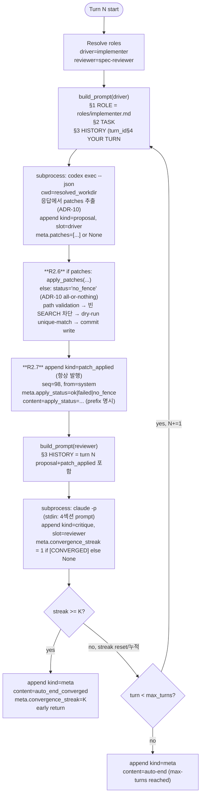

# run 모드 — 한 턴 E2E SSOT

`dialectic run` 명령의 동작 진리. Day 2 정식 검증 완료 (실 호출 18 tests passed).

## 1. 명령 표면

진입로는 두 가지:

1. **default 메뉴 진입** — `dialectic` 단독 실행 → `_interactive_menu` 호출 → 헤더 1줄 + `Spinner("환경 점검 중...")` wrap한 `check_env()` (수십 초 외부 호출 가능, isatty=False 시 no-op) + 환경 점검 결과(활성 부족 시만 출력) + task 한 줄 입력(example 표시 + `?` 도움말 키) + max-turns 입력(default 1, 빈/비정수/음수 처리) + 진행 확인 단계(`진행? [Y/n] (n=task 재입력):`, `n` 거부 시 task 재입력 루프) → run 분기 (default 매핑: driver=codex, reviewer=claude, **interactive=critical** — 메뉴 진입 default, plan 009-user-synthesis-wiring; max-turns은 사용자 입력값). 호출 동안 stderr에 spinner(`[{role}: {vendor}] running... ⠋`, outline §3.2:190 SSOT) + 정상 응답 시 stdout에 구분선·헤더(`✓ latency · tokens`)·본문 출력(outline §3.2:193-225 SSOT, ANSI proposal=cyan/critique=yellow). 기획자 페르소나(outline/03-ux §3.1)의 default 진입로. EOFError/KeyboardInterrupt 안전 종료(exit 0).
2. **CLI 인자 명시** — 자동화/CI용. 하기 인자 표 그대로:

```bash
dialectic run --task <text> [--workdir <path>] [--driver {codex,claude}]
                            [--reviewer {codex,claude}] [--max-turns <int>]
                            [--mode {run,plan,implement}] [--convergence-streak <int>]
                            [--interactive {end-only,critical,full}]
```

| 인자 | default | 설명 |
|---|---|---|
| `--task` | (필수) | 사용자 task 한 줄. driver/reviewer prompt §2 TASK에 주입 |
| `--workdir` | `~/.local/share/dialectic/runs/<YYYYMMDD-HHMMSS>-<8char>/` (plan 010 Phase C, XDG Base Directory Specification) | 작업 디렉토리. 우선순위: `--workdir` CLI > `DIALECTIC_RUNS_DIR` env > `XDG_DATA_HOME/dialectic/runs/` > default. 미지정 시에도 cleanup X — 결과 확인 통로 (C-010). 매 호출마다 `<workdir>/<UTC ts>/` 세션 폴더 자동 생성 (workdir 재호출 시 격리, plan 011 Bug 2 fix). 종료 시 stderr에 `session_dir`+`messages.jsonl`+`sessions/` 경로 안내. **Dialectic-CLI repo 루트·하위 사용 불가 (ADR-6, SystemExit + mkdtemp leak 차단 — C-008). base_dir이 repo 하위인 env 설정도 차단됨.** |
| `--driver` | `codex` | thesis 발화 위치 |
| `--reviewer` | `claude` | antithesis 발화 위치 |
| `--max-turns` | `1` | 최대 turn 수. 도달 시 `auto-end (max-turns reached)` |
| `--mode` | `run` | run/plan/implement 3 모드. compare는 별도 subcommand (미구현, 후속 plan). 메뉴 단계 2는 4종 노출 — run/plan/implement 활성 분기, compare는 안내 + retry (`src/cli.py:_input_mode:266-282`) |
| `--convergence-streak` | `2` | reviewer `[CONVERGED]` 마커 누적 K턴 도달 시 `auto_end_converged` (outline/02 §2.9). ADR-9 fallback: `--max-turns < K+1` 시 K=1 + stderr 경고 |
| `--interactive` | `end-only` (CLI 직접 호출), `critical` (메뉴 진입 default) | 3 모드 — `end-only` (자동 dialectic, prompt 0) / `critical` (Ctrl+F 비동기 트리거 + CONVERGED·max-turns 도달 시 `prompt_end_or_iterate` Y/n/text) / `full` (매 턴 끝 6지선다 a/r/m/i/e/s). plan 009-user-synthesis-wiring 산출. ADR-9 정책 — critical/full에서 `[CONVERGED]` streak ≥ K 도달 시 강제 종료 차단, 사용자 prompt. `MAX_TURNS_HARD_CAP=20` 절대 상한 (i 분기 무한 누적 방지). i 분기 정책 α — trigger/converged/last_turn 모든 i = `max_turns_runtime += 1` 단순 누적 (사용자 결정). full s/a 분기는 `run_turn(*, skip_reviewer=)` / `build_prompt(*, exclude_reviewer=)` keyword 인자로 wiring (default False 회귀 0) |

## 2. 한 턴 라이프사이클



`protocol.md §4 :226-248` 라이프사이클 mermaid의 run 모드 구현. R2.6/R2.7은 ADR-10 search-replace 메커니즘 (proposal 직후 항상 patch_applied 발행 — patches 0건도 `apply_status="no_fence"`로 명시 발행하여 silent skip 차단 + driver R1 prompt 자가 교정 채널 보존). R5/R6은 outline/02 §2.9 [CONVERGED] 메커니즘 보강. `mode=="implement"` + `apply_status=="no_fence"` 조합은 추가 가드로 `convergence_streak=None` 강제(`orchestrator.md §run_turn 라이프사이클` P1-3 narrative 참조) — run 모드는 가드 미적용.

## 3. 메시지 흐름 (실 호출 검증 기록)

`~/.local/share/dialectic/runs/<YYYYMMDD-HHMMSS>-<8char>/<UTC ts>/messages.jsonl` 4 라인 — `--workdir` 미지정 default 경로 (plan 010 Phase C 후, plan 011 Bug 2 fix 후 session 폴더 격리):

| 라인 | turn_id | seq_in_turn | from | kind | parent_id | meta 핵심 |
|---|---|---|---|---|---|---|
| 1 | 0 | 1 | system | task | null | vendor=system, is_mock=false |
| 2 | 1 | 1 | implementer | proposal | (task) | vendor=openai, agent_cli=codex, thread_id=..., reasoning_output_tokens=37, **patches=[...] or None (ADR-10)** |
| 2.5 | 1 | 98 | system | patch_applied | (proposal) | (proposal 직후 항상) **apply_status=ok\|failed\|no_fence, files_changed=[...]** (ADR-10 R2.7) |
| 3 | 1 | 2 | spec-reviewer | critique | (proposal 또는 patch_applied) | vendor=anthropic, agent_cli=claude, session_id=..., **convergence_streak=1**, cost_usd=0.063 |
| 4 | 1 | 99 | system | meta (auto_end_converged) | (critique) | vendor=system, **convergence_streak=1** |

`(seq_in_turn, ts)` 정렬 시 직렬화 순서는 `proposal(1) → critique(2) → patch_applied(98) → meta(99)` — patch_applied는 **시간 순**(turn 내 발생 순)으로는 critique 앞이지만 **직렬화 순**으로는 critique 뒤 (의도된 비대칭, ADR-10 §5.6 mitigation: driver 다음 턴 prompt에서 마지막 강조 효과 ↑).

DAG 무결성: `parent_id` 모두 직전 메시지 `msg_id`. task만 `parent_id=null`.

## 4. 종료 조건 (DoD `01-plan §6` + outline/04 §4.5.1)

```
+----------------------------------------------------------+
| 우선순위 (위에서 아래로 평가)                              |
+----------------------------------------------------------+
| 1. SystemExit  — workdir == repo 루트 또는 하위 (ADR-6)   |
|                  + mkdtemp leak 차단 (C-008)              |
| 2. fatal error — kind=error (auth/CLI 미설치/timeout/     |
|                  parse fail/빈 응답+stderr) 즉시 break     |
|                  → auto-end (error: ...) (C-009)          |
|                  retry 1회는 Day 3+ deferred              |
| 3. auto_end_converged — streak >= K (early return)       |
| 4. auto-end (max-turns reached) — turn 루프 fallthrough  |
+----------------------------------------------------------+
| 종료 후: cleanup=False default (C-010) — workdir 보존 +  |
|        stderr에 messages.jsonl/sessions/ 경로 안내        |
+----------------------------------------------------------+
```

ADR-9 fallback: `--max-turns < --convergence-streak + 1` + `K > 1` 가드 시 K=1 + stderr `K reduced to 1 (ADR-9, outline/02 §2.9)`. K=1 명시 입력은 fallback path skip (degenerate guard).

**fatal error 응답 형식** (protocol.md §9 정합): 어댑터가 비-auth 비정상 종료 시 `text="" + stderr_excerpt=stderr[:N]` 반환 → orchestrator 빈 응답 분기에서 `_error_msg` content에 `"ValueError: empty_response | stderr: <발췌>"` 합성 → messages.jsonl 단독으로 사용자 디버깅 가능 (P-STDERR_LOSS round 7 정합).

## 5. 의존 모듈 (dev-docs/systems/)

| 모듈 | 책임 |
|---|---|
| [orchestrator](../../dev-docs/systems/orchestrator.md) | `run_session`, `run_turn`, `build_prompt`, `_detect_converged`, 헬퍼 4종 (`_msg`/`_error_msg`/`_task_msg`/`_meta_msg`) |
| [agents](../../dev-docs/systems/agents.md) | `CodexRunner`, `ClaudeRunner` — cmd_list, 인증 실패 감지, raw stream 보존 |
| [jsonl-bus](../../dev-docs/systems/jsonl-bus.md) | append-only Bus + Meta 14 필드 + ts 형식 |
| [cwd-isolation](../../dev-docs/systems/cwd-isolation.md) | ADR-6 메커니즘 (workdir resolve + repo-root 차단 + subprocess cwd) |
| [env-check](../../dev-docs/systems/env-check.md) | `dialectic doctor` 동작 |

## 6. 변경 시 갱신 영향

| 코드 변경 | run-mode.md 영향 |
|---|---|
| `run_session` 종료 분기 추가 | §4 종료 조건 매트릭스 갱신 |
| `--mode` choices 확장 (plan/implement/compare 추가 시) | INDEX.md + 본 파일은 unaffected (run 한정) |
| `[CONVERGED]` 알고리즘 변경 (outline/02 §2.9) | §2 라이프사이클 R4·R5 + §4 종료 조건 갱신 |
| 어댑터 추가 (mock 등) | §1 `--driver`/`--reviewer` choices 갱신 + §3 메시지 흐름 예시 갱신 |
| `MODE_ROLES["run"]` 매핑 변경 | §2 R0 노드 갱신 |
| `--interactive` 분기 변경 (critical/full prompt 시점·정책) | §1 `--interactive` 인자 표 + §4 종료 조건 (`auto_end_user`/`auto_end_hard_cap` 추가) |

## 7. 검증 명령

```bash
# 단위 (필수, 매 변경마다)
pytest -q tests/test_orchestrator_converge.py tests/test_cwd_isolation.py

# E2E (인증 환경 필요)
dialectic doctor   # 인증 OK 확인
dialectic run --task "Reply with single digit: 1+1=?" \
              --driver codex --reviewer claude --max-turns 1
ls ~/.local/share/dialectic/runs/             # <YYYYMMDD-HHMMSS>-<8char>/ workdir (plan 010 Phase C default)
ls ~/.local/share/dialectic/runs/<workdir>/   # <UTC ts>/ session 폴더 (plan 011 Bug 2 fix)
cat ~/.local/share/dialectic/runs/<workdir>/<session-ts>/messages.jsonl   # 4 라인 (task→proposal→critique→meta)
```

DoD 만족 기준 — `messages.jsonl`에 4 라인 + 모든 `parent_id` 체인 + `convergence_streak=1` 박힘 + `kind=meta content="auto_end_converged"` 등장.
