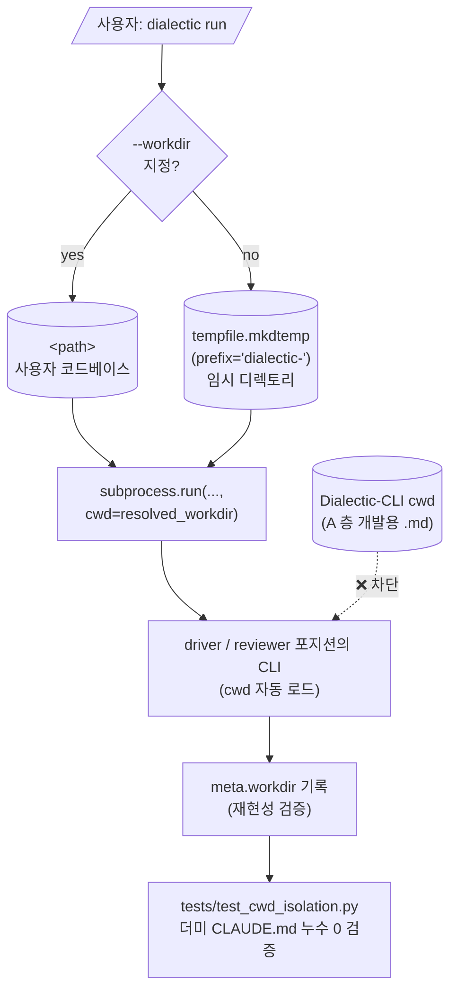

# 1. .md 하네스 두 층 구분 ✅ (Q11 = B)

## 1.1 두 층 정의

| 층 | 정체 | 누가 읽는가 | 언제 |
|---|---|---|---|
| **A. 개발용** (dev-time) | Claude Code/Codex/사용자가 *Dialectic-CLI 자체를 만들 때* 참조 | Claude Code (코딩 모드), Codex CLI (페어), 사용자 | 개발 중 |
| **B. 런타임용** (runtime) | Dialectic-CLI 실행 중 driver/reviewer 포지션의 4 role(implementer·spec-reviewer·planner·plan-reviewer)에 prompt로 주입되는 ROLE/PROTOCOL | orchestrator → 두 포지션의 CLI(Codex/Claude/Mock) | 매 턴 |

두 층이 같으면 안 되고 모순돼서도 안 됨. **A가 런타임 prompt에 누수되지 않음**을 §1.3에서 보장.

## 1.2 파일별 소속

| 파일 | A | B | 비고 |
|---|---|---|---|
| `README.md` | ◯ | — | 사용자 진입점 |
| `CLAUDE.md` | ◯ | — | Claude Code 개발 모드 진입점 |
| `AGENTS.md` | ◯ | — | Codex CLI 개발 모드 진입점 |
| `docs/dev-docs/Documentation-Checklist.md` | ◯ | — | 변경 유형 → .md 동기화 매핑 |
| `docs/dev-docs/code-conventions.md` | ◯ | — | Python·우리 도구 specific 규칙 (cwd 격리, JSONL append-only 등). dev-time 자기 검증 |
| `docs/dev-docs/assignment-requirements.md` | ◯ | — | 과제 본문 ↔ 본 도구 매핑 표 (Q17) |
| `docs/dev-docs/architecture.md` | ◯ | △ | 왜 dialectic·4계층 매핑. 사용자/개발자 모두 참조, 일부는 B 진입 컨텍스트로 인용 가능 |
| `docs/runtime-docs/protocol.md` | △ | ◯ | 메시지 스키마·턴 라이프사이클. 진실은 런타임 사양, 개발자도 이를 따라 코드 작성 |
| `docs/runtime-docs/roles/implementer.md` | — | ◯ | run·implement 모드 driver 포지션 |
| `docs/runtime-docs/roles/spec-reviewer.md` | — | ◯ | run·implement 모드 reviewer 포지션 |
| `docs/runtime-docs/roles/planner.md` | — | ◯ | plan 모드 driver 포지션 |
| `docs/runtime-docs/roles/plan-reviewer.md` | — | ◯ | plan 모드 reviewer 포지션 |
| `docs/dev-docs/validation.md` | ◯ | △ | 결함 → 규칙. 일부 항목은 directive로 런타임 영향 |

## 1.3 충돌 차단 메커니즘 (cwd 격리, Q11 = B)

**위험**: A의 `CLAUDE.md`/`AGENTS.md`는 cwd 자동 로드 가능. Dialectic-CLI 자체 cwd에서 런타임 호출이 일어나면 **개발용 ROLE이 런타임 driver/reviewer prompt에 끼어들어 ROLE 충돌**.

**대응**:
1. CLI에 `--workdir <path>` 옵션. 사용자가 작업 대상 프로젝트 경로 명시 (driver/reviewer가 그 코드베이스를 읽으며 작업하는 본래 시나리오).
2. 미지정 시 `tempfile.mkdtemp(prefix="dialectic-")`로 임시 디렉토리 자동 생성, 런 종료 시 정리.
3. orchestrator가 `subprocess.run(..., cwd=resolved_workdir)` 강제. **Dialectic-CLI 자체 cwd(개발 .md가 있는 곳)는 절대 런타임 cwd가 되지 않음.**
4. resolved_workdir은 매 턴 메시지 `meta.workdir`에 기록 (재현성 검증).
5. **단위 테스트**: Dialectic-CLI cwd에 더미 `CLAUDE.md`(예: "절대 코드를 제안하지 마라")를 둔 상태에서 어댑터 호출 → raw stream JSONL을 검사해 더미 내용이 prompt에 포함되지 않았음을 확인.

**효과**:
- `--workdir` 명시: driver/reviewer가 실제 코드베이스를 읽으며 작업 가능 (본래 사용 시나리오).
- 미지정 임시 디렉토리: 자동 로드 .md 없는 깨끗한 환경 → 두 층 누수 원천 차단.

## 1.4 4 role × 응답 전 셀프체크

각 ROLE 섹션 끝에 셀프체크 항목 포함. Pre-Implementation Checklist 패턴을 dialectic 4 role에 적용. ROLE마다 책임이 다르므로 셀프체크도 다름.

### implementer.md (run·implement 모드 driver 포지션)

- [ ] task/spec의 모든 요구사항을 함수 시그니처/본문에 매핑했는가 (구현 누락 0 검증)
- [ ] trade-off를 1개 이상 명시했는가 (어떤 요구사항이 우선되었는가)
- [ ] 직전 턴 reviewer critique에 대해 항목별 응답 명시 (수용/반박/유보)
- [ ] 직전 턴 user directive를 반영했는가
- [ ] 1500자 이내인가

### spec-reviewer.md (run·implement 모드 reviewer 포지션, Q16 = 충실도 + 일반 결함)

- [ ] task/spec의 각 요구사항을 코드의 어느 줄이 만족하는지(또는 누락) 짚었는가
- [ ] **P0** (spec 미준수, 즉시 수정) / **P1** (spec 부분 준수) / **P2** (spec과 무관한 일반 결함) 라벨 분리
- [ ] driver(implementer) proposal의 어느 부분(섹션/줄)을 가리키는지 인용
- [ ] 같은 벤더(implementer와 동일 벤더) 시각으로는 놓칠 결함 1개 이상 (cross-vendor 진정성)
- [ ] 질문은 1개 이내인가
- [ ] 1500자 이내인가

### planner.md (plan 모드 driver 포지션)

- [ ] 입력/출력 시그니처 (타입·범위)를 명시했는가
- [ ] 엣지케이스 목록 (빈 입력, 경계, 예외)을 별도 섹션으로 정리했는가
- [ ] 비기능 요구(성능·복잡도·외부 의존)를 별도 섹션으로 정리했는가
- [ ] 직전 턴 reviewer critique 항목별 응답 명시
- [ ] 직전 턴 user directive 반영
- [ ] 1500자 이내인가

### plan-reviewer.md (plan 모드 reviewer 포지션)

- [ ] 빠진 엣지케이스를 1개 이상 지적 (있다면)
- [ ] 모순/중복 항목 검토
- [ ] 실현 가능성 (구현 시 어디서 막힐지) 평가
- [ ] **P0** (입출력·시그니처 명세 부재) / **P1** (엣지케이스/비기능 누락) / **P2** (개선 제안) 라벨 분리
- [ ] planner spec의 어느 섹션을 가리키는지 인용
- [ ] 질문은 1개 이내인가
- [ ] 1500자 이내인가

자가 일관성 강제. prompt cache로 비용 영향 미미. messages.jsonl에서 ROLE 준수 자명 확인 가능. 4 role 모두 동일 구조(셀프체크 + 본문)라 코드도 단일 인터페이스.

## 1.5 dev-time 하네스 파일 명세

**A(개발용)** 층의 각 파일이 갖춰야 할 형태:

| 파일 | 형태 |
|---|---|
| `CLAUDE.md`, `AGENTS.md` | Role/Communication, Operational Mandate, Pre/Post Checklist 골격. paths는 본 repo용으로 |
| `docs/dev-docs/Documentation-Checklist.md` | "변경 유형 → 갱신 대상 .md" 표. 행은 본 프로젝트용으로 작성 |
| `docs/dev-docs/Plans/plan-writing-guide.md` | AS-IS / TO-BE 형식 가이드. create-plan / review-plan / execute-plan이 참조 |
| `.claude/skills/commit/SKILL.md` | 분류표 → 사용자 확인 → 순차 커밋. Claude Code 기본 동작과 충돌하는 라인 제거 |
| `.claude/skills/sync-docs/SKILL.md` | 코드 변경 → Documentation-Checklist 매핑 갱신. A/B 층 분리로 코드→.md 매핑 비자명 → 진짜 효과 |
| `.claude/skills/create-plan/SKILL.md` | AS-IS/TO-BE 가이드 기반 plan 생성. 도메인: 어댑터/orchestrator/bus, JSONL 스키마, cwd 격리, stateless·prompt 4섹션 |
| `.claude/skills/review-plan/SKILL.md` | "Dialectic-CLI 전문가" 역할. plan-edit 자동 루프 없음 — 재계획 필요 시 사용자 수동 fix |
| `.claude/skills/execute-plan/SKILL.md` | `.py`/pytest 기반 실행. **Phase 병렬 subagent 패턴 유지** — compare 모드 병렬과 narrative 일치 |
| `.claude/skills/review-code/SKILL.md` | 도메인 3개: **안전성** (subprocess injection·토큰 노출·파일 I/O) / **인터페이스** (어댑터 일관성·JSONL 스키마·cwd 격리) / **컨벤션** (타입 힌트·의존성 최소화·README 정합성). 본 도구 런타임(벤더 다양성)과 차원이 다른 도메인 다양성 — 메타 충돌 아님 |
| `docs/dev-docs/Checklists/review-plan-checklist.md` | 어댑터 일관성, JSONL 무결성, cwd 격리, prompt 누수, 4섹션 포맷, mock 동치성 |
| `docs/dev-docs/Checklists/review-code-checklist.md` | 도메인 3개 항목별 (안전성/인터페이스/컨벤션) |
| `.claude/skills/SKILLS.md` | 6개 스킬 인덱스. Tier 구조: **Tier 1** (create-plan / execute-plan, 자동 chaining) + **Tier 2** (review-plan / review-code / sync-docs, 후처리·검증) + **독립** (commit) |

**스킬 이름 규칙**: `동사-명사` (e.g. `create-plan`, `execute-plan`).

**B(런타임용)** 층의 4 role(implementer/spec-reviewer/planner/plan-reviewer)은 dialectic ROLE이라 새로 작성. 셀프체크 형식은 §1.4의 Pre-Implementation Checklist 패턴.

**도구 스코프 외 (다루지 않음)**:
- `implement`, `diagnose`, `analyze`, `sync-comments`, `test`, `create-skill`, `port-skill` 같은 일반 코딩 보조 스킬 — 본 도구 스코프(~500 LOC)가 작아 불필요
- `plan-edit`: review-plan 자동 루프 제거 결정으로 미사용 (재계획은 사용자 수동 fix)
- `review-design` / `review-skill`: architecture·skills 변경이 매우 드물어 적용 시점 부재
- 게임 엔진·인프라 도메인 특화 룰 — 해당 없음
- 일자별 WorkLog 폴더 — git log + commit message로 충분
