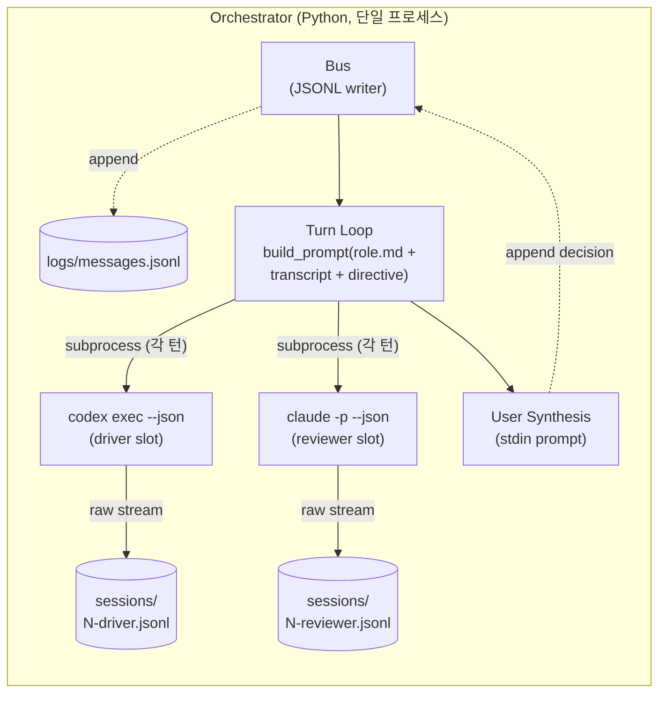
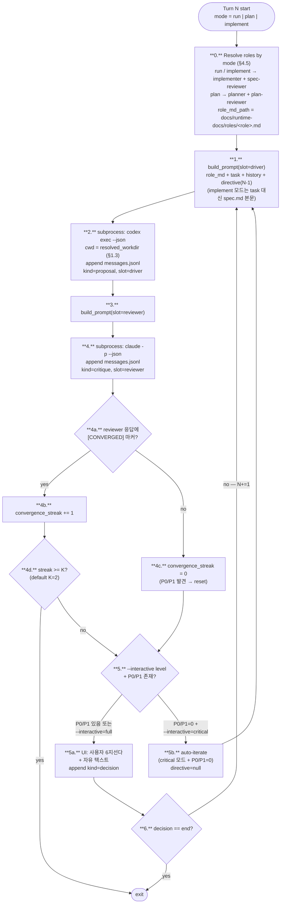

# 2. 에이전트간 통신 부분

## 2.0 포지션 vs 역할 (용어 정리)

본 문서에서 두 종류의 명칭이 등장한다 — **포지션(slot)**과 **역할(role)**.

| 구분 | 의미 | 값 | 결정 시점 |
|---|---|---|---|
| **포지션** | 한 턴 안에서 누가 먼저/나중에 발화하는가 | `driver` (먼저) / `reviewer` (나중) | 프로토콜 고정 |
| **역할** | 그 포지션에 들어가는 에이전트의 책임 (개발자? 계획자?) | `implementer` / `spec-reviewer` / `planner` / `plan-reviewer` | **모드별 자동 매핑** (§4.5) |
| **벤더(CLI)** | 그 포지션을 실제 실행하는 CLI | `codex` / `claude` / `mock` | `--driver` / `--reviewer` 플래그 |

**메시지 스키마의 `from`은 역할 기준** (의미 명확). 포지션은 로그 파일명·CLI 플래그·orchestration 순서에 사용. 이 두 개념을 분리해야 모드가 늘어도 스키마가 안정적이다.

## 2.1 통신 모델 (확정)



## 2.2 메시지 스키마 (확정)

**초기 4필드(`ts/turn_id/role/type/content`) 초안은 너무 얇음**. 다음 필드 추가:

```jsonc
// logs/messages.jsonl — 한 줄 = 한 메시지
{
  "ts": "2026-05-06T14:32:11.482Z",
  "msg_id": "t1-driver",          // 메시지 고유 ID (parent 추적용)
  "parent_id": "t0-task",         // 어떤 메시지에 응답한 것인가 (DAG)
  "turn_id": 1,
  "seq_in_turn": 1,               // 같은 턴 내 순서 (driver=1, reviewer=2, user=3)
  "from": "implementer",          // implementer | spec-reviewer | planner | plan-reviewer | user | system (역할 기준; §2.0)
  "to":   "broadcast",            // broadcast | implementer | spec-reviewer | planner | plan-reviewer
  "slot": "driver",               // driver | reviewer (한 턴 내 순서; system/user는 null)
  "mode": "run",                  // run | plan | implement | compare
  "kind": "proposal",             // task | proposal | critique | decision | error | meta
  "content": "...",               // 본문 (마크다운/코드 자유)
  "directive": null,              // 사용자가 다음 턴에 주입한 지시문 (kind=decision일 때)
  "meta": {
    "vendor": "openai",           // openai | anthropic
    "agent_cli": "codex",         // codex | claude | mock
    "model": "gpt-5-codex",
    "session_id": "67916fc8-...", // claude session_id
    "thread_id": "019dfd43-...",  // codex thread_id
    "input_tokens": 13281,
    "output_tokens": 5,
    "cached_input_tokens": 11648,
    "cost_usd": 0.0,
    "latency_ms": 2371,
    "is_mock": false              // mock 재생 시 true
  }
}
```

**부가 필드의 타당성**:
- `msg_id` + `parent_id` → 후속 분석 시 jq 없이도 흐름 재구성 가능
- `meta.cost_usd` + `latency_ms` → "비용·속도 vs 품질" 분석 자료 (Validation 계층의 1차 데이터)
- `kind=error` → 호출 실패도 메시지로 기록
- `is_mock` → 재생 vs 실 호출 구분, 정직성 확보
- `from` (역할) + `slot` (순서) + `mode` (맥락) → 같은 JSONL 한 줄로 "어떤 모드의 어느 포지션에 어떤 역할이 들어갔는가" 즉시 파악

## 2.3 한 턴의 라이프사이클 (확정)



## 2.4 프롬프트 빌드 규약 (확정, `docs/runtime-docs/protocol.md`에 명문화)

각 에이전트에게 주는 프롬프트는 **고정된 4섹션 마크다운**:

```markdown
# 1. ROLE
{docs/runtime-docs/roles/<role>.md 전체 — 모드별로 implementer.md / spec-reviewer.md / planner.md / plan-reviewer.md 중 1}

# 2. TASK
{사용자 초기 task 텍스트. implement 모드는 task 대신 spec.md 본문 주입}

# 3. HISTORY
{messages.jsonl 에서 turn_id < N 인 메시지를 다음 형식으로 직렬화 — 라벨은 역할 기준}
## Turn 1
- IMPLEMENTER (proposal): ...
- SPEC-REVIEWER (critique): ...
- USER (decision: iterate, directive: "focus on edge case Y"): ...

# 4. YOUR TURN
당신의 역할({role})로 다음을 수행:
{role-specific instructions, 예:
 implementer: spec/task의 모든 요구사항을 코드로 매핑. trade-off 명시. 1500자 이내.
 spec-reviewer: 1순위 spec 미준수(P0/P1) + 2순위 일반 결함(P2). 코드 줄 인용. 1500자 이내.
 planner: 입력/출력/엣지케이스/비기능 요구를 spec.md로 구체화. 1500자 이내.
 plan-reviewer: 빠진 엣지케이스·모순·실현 가능성. 1500자 이내.}

(directive: {turn N-1의 user directive 그대로})
```

**왜 이 형식?**
- Section 분리가 명확해야 에이전트가 자기 ROLE을 잊지 않음. `# 1. ROLE`을 매 턴 재주입.
- `HISTORY`를 압축하지 않고 풀 주입. prompt cache가 비용 흡수 (Claude 실측: cache_creation 5549 → cache_read 4971 패턴).
- `directive`는 마지막에 한 번 더 강조 — 사용자 의도 손실 방지.
- ROLE 섹션 끝에 **응답 전 셀프체크** 항목 포함 (§1.4, Pre-Implementation Checklist 패턴). 자가 일관성 강제, messages.jsonl에서 ROLE 준수 여부 자명 확인.

## 2.5 세션 연속성: stateless ✅ (Q1 = B)

**확정 사유**:
1. JSONL이 source of truth — 사후에 흐름 재구성 가능
2. Codex는 thread_id 사후 캡처, Claude는 사전 지정 — 비대칭 추상화 누수
3. stateless면 `messages.jsonl` 한 파일에서 풀 컨텍스트 재현
4. prompt cache가 자동 처리 — 비용 거의 안 늘어남
5. 디버깅·중간 편집 자유

**`--session-id`는 로그 파일명 일관성 용도만** (`logs/sessions/N-driver-<uuid>.jsonl`).

## 2.6 포지션 ↔ 역할 ↔ 벤더 매핑 ✅ (Q2 + Q12)

세 가지가 분리되어 있음 — §2.0 표 참조.

### 포지션 ↔ 역할 (모드별 자동 매핑)

| 모드 | driver 포지션 역할 | reviewer 포지션 역할 |
|---|---|---|
| `run` (일반) | implementer | spec-reviewer |
| `plan` (계획) | planner | plan-reviewer |
| `implement` (계획 구현) | implementer | spec-reviewer |
| `compare` (병렬 비교) | run/plan/implement 중 선택, 그에 따라 위 매핑 적용 |

자동이라 사용자가 신경 안 써도 됨. 모드 한 단어만 보면 어떤 ROLE이 들어갔는지 자명.

### 포지션 ↔ 벤더 (사용자 자유, Q2)

```bash
# 기본
dialectic run --task "..." --driver codex --reviewer claude

# 벤더 스왑 (cross-vendor 진정성 비교)
dialectic run --task "..." --driver claude --reviewer codex
```

→ 벤더 다양성이 진짜 시각 다양성을 만드는지 검증. `validation.md`에 "스왑 비교 분석" 섹션. `dialectic compare`(§4.5)와 결합되어 자동 비교 가능.

### 4중 분리의 가치

`{모드, 포지션, 역할, 벤더}` 4축이 직교(orthogonal) → 한 task에 대해 최대 (4 모드) × (2 포지션 × 2 벤더) = 16가지 변종 비교 가능. 변수가 깔끔하게 분리되어 있음.

## 2.7 어댑터 인터페이스 (코드 골격)

```python
# src/agents/base.py
@dataclass
class AgentResponse:
    text: str
    raw_path: Path        # logs/sessions/N-{role}-*.jsonl 경로
    meta: dict            # {vendor, model, session_id|thread_id, *_tokens, cost_usd, latency_ms, is_mock}

class AgentRunner(Protocol):
    name: str             # "codex" | "claude" | "mock"
    vendor: str           # "openai" | "anthropic" | "mock"
    def run(self, prompt: str, *, raw_log_path: Path, timeout_s: int) -> AgentResponse: ...

# src/agents/codex.py:  subprocess codex exec --sandbox read-only --json -
# src/agents/claude.py: subprocess claude -p --tools "" --output-format json --append-system-prompt
# src/agents/mock.py:   파일 재생 (인증 없이 동작) — §4.5.4 참조
```

**보안·결정성 호출 옵션**:
- Codex: `--sandbox read-only --skip-git-repo-check --ignore-rules` (외부 환경 영향 최소화)
- Claude: `--tools ""` (텍스트만), `--no-session-persistence`, `--max-budget-usd 1.0`
- 둘 다: timeout 300s, `kind=error` 메시지로 처리
- **둘 다: cwd 격리 (필수, Q11=B)** — `subprocess.run(..., cwd=resolved_workdir)`. `resolved_workdir = args.workdir or tempfile.mkdtemp(prefix="dialectic-")`. Dialectic-CLI 자체 cwd의 `CLAUDE.md`/`AGENTS.md`가 런타임 prompt에 자동 로드되어 ROLE이 충돌하는 것을 원천 차단. 상세: §1.3.

## 2.8 실패 모드 (확정)

| 실패 | 처리 | 메시지 기록 |
|---|---|---|
| Subprocess 비정상 종료 | 에러 캡처, 재시도 1회 | `kind=error, content=stderr 발췌` |
| Timeout (>300s) | 프로세스 kill, retry 1회 후 fail | `kind=error, content="timeout"` |
| 출력 JSON 파싱 실패 | raw stdout 통째 보존 | `kind=error, content="parse_failure"` |
| 빈 응답 | 사용자 알림, retry 옵션 | `kind=error, content="empty_response"` |
| 인증 실패 | 즉시 종료, README §환경설정 안내 | `kind=error` 후 SystemExit |
| MAX_BUDGET 초과 | 즉시 중단 | `kind=meta, content="budget_exceeded"` |

## 2.9 수렴 마커 — [CONVERGED]

reviewer가 P0/P1=0 (또는 P2만)일 때 응답 끝에 `[CONVERGED]` 한 줄 마커 출력. orchestrator가 정규식 `^\[CONVERGED\]$`로 감지.

- **카운터**: 마커 등장 시 `convergence_streak += 1`. 한 턴이라도 P0/P1 발견 시 0 reset.
- **종료**: streak ≥ K (default K=2, `--convergence-streak`로 조정) → `kind=meta, content="auto_end_converged"` 메시지 append 후 종료.
- **fix-induced regression 차단**: K=1이면 driver가 P0 fix → 새 P0 도입을 못 봄. K=2가 fix→verify 1 사이클 보장.
- **메시지 스키마 영향**: `kind=critique` 메시지 `meta`에 `convergence_streak: <int>` 옵션 필드 추가 (디버깅·재현용). 필수 X — 없으면 0 가정.
- **auto-iterate 시 JSONL 처리**: critical 모드에서 P0/P1=0이라 사용자 prompt 생략 시, **`kind=decision` 메시지는 append 안 함** (사용자 결정 부재 = 결정 메시지 부재). 카운터 흔적은 `kind=critique`의 `meta.convergence_streak`에만. 자동 종료 시점에만 `kind=meta, content="auto_end_converged", meta.streak=K` 메시지 1행 append. 디버깅·재현 가능.
- **경계 케이스**: `--max-turns < --convergence-streak + 1` 시작 시 K=1로 자동 fallback + stderr 경고 ("K reduced to 1: max-turns too low"). ADR-9 참조.
