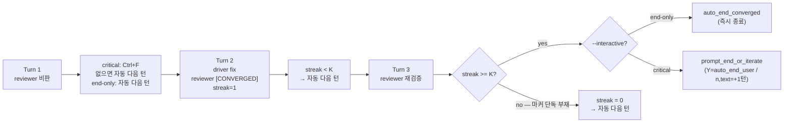

# 3. 사용자 사용성 부분

## 3.1 실행 흐름 — 메뉴 + CLI 둘 다 ✅ (Q14)

대상 사용자가 두 부류이므로 두 진입로를 둔다 (Q13: 기획자 페르소나가 1차 사용자, 자동화·CI 수요도 동시 충족).

### 설치 (모든 사용자 공통)

```bash
$ git clone https://github.com/shinjw4929/Dialectic-CLI && cd Dialectic-CLI
$ ./setup.sh
✓ Python venv 생성
✓ pip install -e . 완료
ℹ 인증은 dialectic 첫 실행 시 점검됩니다.
```

**`setup.sh` 한 스크립트로 끝**. 첫 사용자 30초 진입 보장.

### 진입로 1 — 메뉴 (기획자/탐색용, 인자 0)

```bash
$ dialectic
```

→ 환경 점검 → 모드 선택 → task 선택 → 매핑 선택 → 실행 (각 단계는 §3.2 화면 참조)

인자 일부만 줘도 OK — 빈 포지션만 메뉴로 묻는다.

**`--interactive {full,critical,end-only}` 플래그** (default 진입로별 분기 — CLI 직접 호출 default `end-only`, 메뉴 진입 default `critical`, Q18 ✅): 사용자 개입 강도 dial. 진입로 1·2 양쪽에서 동일하게 동작하지만 default만 분기 — 자동화·CI는 prompt 0이 자연 default, 메뉴 사용자(기획자)는 critical 시점 개입이 자연 default.

```bash
$ dialectic run                              # 모드만 정함 → task부터 메뉴 (default --interactive end-only)
$ dialectic                                  # 메뉴 진입 (default --interactive critical)
$ dialectic run --task @tasks/wave/task.md --interactive critical  # CLI 명시
```

### 진입로 2 — CLI 인자 (자동화/CI)

```bash
# 일반 모드 (모든 인자 명시 → 메뉴 0, 즉시 실행)
$ dialectic run --task @tasks/implement-dijkstra/task.md \
                --driver codex --reviewer claude \
                --workdir ./workdir-tmp \
                --max-turns 5

# 계획 모드 (task → spec.md)
$ dialectic plan --task @tasks/implement-dijkstra/task.md --workdir ./workdir-tmp

# 계획 구현 모드 (spec.md → code)
$ dialectic implement --spec ./workdir-tmp/specs/dijkstra.md --workdir ./workdir-tmp

# 비교 모드 (병렬, 비대화형)
$ dialectic compare --task @tasks/implement-dijkstra/task.md \
                    --configs "driver=codex,reviewer=claude" \
                              "driver=claude,reviewer=codex" \
                    --decisions iterate,iterate,end
```

**비대화형 강제**: `--non-interactive --decisions <list> --directives <list>` 또는 `decisions.txt` 사용. compare는 항상 비대화형.

**개입 강도 dial** (`--interactive`):
- `full`: 매 턴 끝 6지선다(a/r/m/i/e/s) 강제. listener 가동 X
- `critical` (메뉴 default): Ctrl+F 비동기 트리거 + CONVERGED/max-turns 종료 직전 `prompt_end_or_iterate` (Y/n/text 분기). reviewer P0/P1 자동 검출은 critique parser 미구현이라 후속 plan 대상 — 현재는 사용자 명시 트리거(Ctrl+F) + 종료 직전 잠재 prompt 둘로만 wiring
- `end-only` (CLI 직접 호출 default): max-turns·CONVERGED 도달 시 즉시 `auto_end` (사용자 prompt 0)
Ctrl+F 트리거: critical 모드만 listener 가동. Ctrl-C는 abort (subprocess SIGINT 전파 + raw mode 복원 + sys.exit(130)).

**플래그 충돌 시 우선순위**: `--non-interactive`가 `--interactive`보다 우선 (compare/end-only/critical 모두 비대화형으로 강제).

(코드 wiring은 후속 plan, ID는 작성 시점 할당 — 본 outline은 narrative SSOT만.)

### 인증 부재 자동 fallback ✅ (Q5·C)

활성 에이전트(설치 + 인증) ≥ 2가 아니면 인증 화면. 인증 부재 시 막히지 않도록 **mock 모드 옵션을 fallback으로 노출**:

```
⚠ 활성 에이전트 1/2 (claude 미인증)

다음 중 선택:
  1) claude 인증 후 재시도   [별도 터미널: claude login]
  2) Mock 모드로 진행         [인증 없이 즉시 체험]
  q) 종료
> 2

[Mock 모드] tasks/ 안의 사전 녹음 자산을 재생합니다.
```

→ 인증 부재 막힘 = 도구를 시도조차 못 함. mock fallback으로 원천 차단.

### 인증 풀림 처리 (런타임 중)

매 호출마다 사전 검증 안 함 (비용/복잡도 ↑). 호출이 인증 에러로 실패하면 친절 메시지 + 재인증 안내:

```
[Turn 2/5] Driver: codex 호출 중...
✗ 인증 실패: codex 토큰 만료된 것으로 보입니다.

다음을 실행해주세요 (별도 터미널):
  $ codex login

인증 후 r 키로 재시도, q로 종료(현재까지 진행은 `<workdir>/<UTC-ts>/messages.jsonl`에 보존됨).
> _
```

## 3.2 화면 구성 (Q7 = A 진행, 추후 재고)

### 단계 1 — 환경 점검

`dialectic` (인자 0) 또는 `dialectic run` (slot 미명시) 실행 시:

```
─────────────────────────────────────
 Dialectic-CLI · 환경 점검
─────────────────────────────────────
 codex CLI:    v0.128.0   ✓
 claude CLI:   v2.1.131   ✓
 codex auth:   로그인됨   ✓
 claude auth:  미로그인   ✗
─────────────────────────────────────
활성 2/2 → 다음 단계
또는
활성 1/2 → 인증 안내 + mock fallback 옵션 (§3.1)
```

### 단계 2 — 모드 선택 (Q12)

```
─────────────────────────────────────
 모드 선택
─────────────────────────────────────
 1) 일반 모드        (구현자 ↔ 검토자, 즉시 코드)
 2) 계획 모드        (계획자 ↔ 검토자, specs/ 산출)
 3) 계획 구현 모드   (specs/<name>.md → 코드)
 c) 비교 모드        (병렬, 비대화형)
─────────────────────────────────────
> 1
```

### 단계 3 — task 선택 (일반/계획) 또는 spec 선택 (계획 구현)

```
─────────────────────────────────────
 일반 모드 · Task 선택
─────────────────────────────────────
 1) tasks/implement-dijkstra/task.md          (구현 시나리오: scratch + 다중 턴)
 2) tasks/modify-dijkstra-add-graph/task.md   (수정 시나리오: ADR-10 search-replace)
 d) 직접 입력 (한 줄)
─────────────────────────────────────
> 1
```

계획 구현 모드는 spec.md 후보 표시:

```
 계획 구현 모드 · Spec 선택
─────────────────────────────────────
 1) workdir-tmp/specs/dijkstra.md         (계획 모드 산출 예시)
 2) workdir-tmp/specs/visualize.md        (수정 시나리오 산출 예시)
 d) 직접 경로 입력
```

### 단계 4 — 매핑·workdir 선택 (default 권장)

```
─────────────────────────────────────
 포지션 ↔ 벤더 매핑
─────────────────────────────────────
 1) driver=codex, reviewer=claude   (기본)
 2) driver=claude, reviewer=codex   (스왑)
─────────────────────────────────────
> 1

 workdir 선택 (driver/reviewer가 작업할 cwd, §1.3)
─────────────────────────────────────
 1) ./workdir-tmp (자동 정리됨)
 2) 기존 폴더 직접 지정
─────────────────────────────────────
> 1
```

### 단계 5 — 턴 진행 (실 dialectic loop)

기본 (단일 창, ANSI 색, 역할 라벨은 모드별로 변환됨):

```
─────────────────────────────────────────────────────────────────
 Dialectic-CLI · 일반 모드 · Turn 1/5
 task: tasks/implement-dijkstra/task.md
─────────────────────────────────────────────────────────────────

[구현자: Codex CLI] running... ⠋
  └─ thread 019dfd43...  (ETA 15-30s)

[구현자: Codex CLI] ✓ 18.4s · 245 out / 1.2k in
─────────────────────────────────────────────────────────────────
def wave_difficulty(wave_index: int) -> dict:
    ...

trade-offs:
- 1~5웨이브 학습 곡선: 선형 증가 채택 (지수 증가 대비 단조로움)
- 보스 변동: 10/20 웨이브 고정 등장 (랜덤은 reviewer 의견 필요)
─────────────────────────────────────────────────────────────────

[코드 검토자: Claude Code] running... ⠋
[코드 검토자: Claude Code] ✓ 12.1s · 180 out / 1.4k in · $0.034
─────────────────────────────────────────────────────────────────
P0 (spec 미준수):
- task.md "11+ 웨이브: 가속 곡선" — 코드는 11웨이브 이후도 선형. 구현 누락
P1 (spec 부분 준수):
- "재미를 위한 변동" — 보스 고정만 있음, 변동성이 단조로움
P2 (일반 결함):
- wave_index=0 입력 시 KeyError 미처리

질문: 가속 곡선의 정확한 함수 형태(지수? 2차?)는 명세 필요한가?
─────────────────────────────────────────────────────────────────

[User Synthesis · Turn 1]
  (a)ccept driver  (r)eviewer  (m)erge  (i)terate  (e)nd  (s)kip review
  > i
  directive (1줄): 11+ 웨이브 가속 곡선은 wave^1.3 적용
  ✓ recorded

─────────────────────────────────────────────────────────────────
 Turn 2/5 ...
```

**critical 모드 자동 진행 예시** (Turn 2 reviewer가 [CONVERGED] 단독 마지막 줄 — Q18 ✅, Q6 = b):

```
[코드 검토자: Claude Code] ✓ 9.8s · 50 out / 1.2k in
─────────────────────────────────────────────────────────────────
P0: (없음)
P1: (없음)
P2: 매직 넘버 250 — 상수화 권고

[CONVERGED]
─────────────────────────────────────────────────────────────────
auto → Turn 3/5  (critical mode, Ctrl+F 입력 시 다음 턴 끝에 prompt_end_or_iterate 진입.
                  종료 직전(CONVERGED 누적 K 도달·max-turns)에는 자동 prompt)
```

**역할 라벨**: 모드에 따라 자동 변환 — `[구현자]`/`[코드 검토자]` (run/implement) 또는 `[계획자]`/`[계획 검토자]` (plan).

**옵션 (--tmux)**: 2-pane. Pane B에 `dialectic logs --follow` (별도 pane에서 실시간 흐름).

**Q7 옵션 비교 (Day 3 재검토 시 참조)**:

| 옵션 | 장점 | 단점 |
|---|---|---|
| **A. 순수 print + ANSI** ✅ | 의존성 0, asciinema 깔끔, 디버깅 쉬움 | 스피너 등 인라인 갱신 직접 짜야 함 |
| **B. rich** | syntax highlighting, Panel/Table/Progress 즉시 사용, 코드 블록 자동 렌더 | 의존성 1개 추가, asciinema에 escape 노이즈 약간 |
| **C. textual** | 진짜 다중 패널 TUI, 마우스/스크롤 가능, 시연 임팩트 | 학습곡선↑, 호환 안 되는 터미널에서 깨짐, 3일 일정 위험 |

→ Day 3에 A 결과 보고 B 부분 도입 검토. C는 본 과제 스코프 외.

## 3.3 사용자 개입 인터페이스 (확정)

**default = critical 모드: reviewer가 P0/P1 발견 시만 prompt. 그 외 자동 다음 턴.** prompt 시 6지선다 + 자유 텍스트 directive (라벨은 포지션 기준이라 모드 무관):

| 키 | 의미 | 다음 턴 동작 |
|---|---|---|
| `a` accept driver | driver 포지션 제안(구현자/계획자) 그대로 수용 | reviewer critique 무시, 기존 방향 유지 |
| `r` accept reviewer | reviewer 포지션 비판 전부 수용 | driver는 비판 항목 모두 반영 |
| `m` merge | 일부만 수용 | directive에 채택/거절 항목 명시 |
| `i` iterate | 추가 직권 지시 | directive로 driver/reviewer 모두 다시 진행 |
| `e` end | 종료 | 최종 SYNTHESIS.md (또는 spec.md, 모드별) 생성 후 exit |
| `s` skip review | reviewer 비활성 1턴 | 디버깅·관찰용. plan 모드에서 빠른 반복용 |

**directive**: 1줄 단답 (Enter 종료). 멀티라인은 `--editor`로 `$EDITOR` 호출.

**Enter (default)**: `iterate` + 빈 directive — driver/reviewer가 자율로 다음 턴 진행 (사용자 직권 지시 없음). 6지선다 중 다른 결정 원할 때만 명시 키 입력.

**수렴 종료 흐름** (Q6 = b 확정, Q18 = critical, ADR-9 참조):



핵심 캡션: **연속 K=2턴 [CONVERGED]** = 안정 수렴. critical 모드는 K 도달 시 강제 종료 차단 → `prompt_end_or_iterate`로 사용자 최종 결정. end-only 모드는 즉시 `auto_end_converged`. Ctrl+F는 critical 모드의 사용자 명시 트리거 (모든 턴 끝에 listener.is_set 검사).

`--convergence-streak <int>` 플래그 (default `2`): K값 조정. K=1은 fix→verify 1 사이클을 못 봐 비권장 (ADR-9 참조).

**비대화형 모드**: `--non-interactive --decisions iterate,iterate,end --directives "...,...,"` — 자동 재현용. compare 모드의 기반.

## 3.4 종료 시 산출물 (모드별)

공통 (plan 011 Bug 2 fix — workdir 재호출 시 session 격리):
```
  <workdir>/<UTC-ts>/messages.jsonl                # 전체 흐름 (인계용)
  <workdir>/<UTC-ts>/sessions/{N}-{slot}-{id}.jsonl # 각 호출 raw stream
  <workdir>/<UTC-ts>/SYNTHESIS.md                  # 최종 결과 요약 (자동 생성)
```

`<UTC-ts>` 형식: `%Y%m%dT%H%M%SZ` (예: `20260509T071838Z`). 같은 workdir 재호출 시 새 session 폴더 자동 생성 (`src/orchestrator.py:662-666` SSOT).

모드별 추가 산출물 (--workdir 안에 생성):
```
일반 모드 (run):
  <workdir>/<file>.py 등                    # 구현자 코드 산출

계획 모드 (plan):
  <workdir>/specs/<task_id>.md              # 계획자 spec 산출

계획 구현 모드 (implement):
  <workdir>/<file>.py 등                    # 구현자 코드 산출 (specs/<task_id>.md 참조)

비교 모드 (compare):
  <workdir>/<UTC-ts>-<config_hash>/SYNTHESIS.md # 각 config별
  <workdir>/<UTC-ts>/compare.md                 # 통합 대조
```

**SYNTHESIS.md** 자동 생성:

```markdown
# Synthesis · 2026-05-08T14:32Z
## Task
parse_human_duration ...
## Final answer (사용자 종합)
{turn 마지막 user decision의 directive + 마지막 driver proposal 합본}
## Run metrics
- Turns: 4 (5에서 e로 조기 종료)
- Cost: $0.18 (Driver $0.10 + Reviewer $0.08)
- Latency: 평균 14.6s/turn
## Cross-vendor comparison
- Driver(Codex): {요약}
- Reviewer(Claude): {요약}
## Outstanding issues
{reviewer가 P0로 제기했으나 미해결로 남은 항목}
```

사후 정리된 "최종 결과물". 화면 녹화 없이도 흐름 자명.

## 3.5 관찰성: 내장 `dialectic logs` 서브커맨드 ✅ (Q3 갱신)

**원칙**: 흐름 관찰은 **도구 자체의 책임**. 외부 명령(`tail -f | jq`) 안내는 도구가 책임을 사용자 환경에 떠넘긴 셈. 모든 사용자가 동일 인터페이스로 관찰 가능해야 함.

### 인터페이스

```bash
dialectic logs --follow                       # 실시간 follow (현재 run)
dialectic logs --follow --kind critique       # 특정 kind 필터 (proposal|critique|decision|error|meta)
dialectic logs --turn 1                       # 특정 턴
dialectic logs --since <ts>                   # 시간 이후
dialectic logs --summary                      # role별 메시지 수·총 비용·평균 latency
dialectic logs --run <run_id>                 # 특정 과거 run (logs/runs/<id>/)
```

### 출력 예시

```
[14:32:11] T1 · IMPLEMENTER (proposal):
  def wave_difficulty(wave_index): ...
[14:32:24] T1 · SPEC-REVIEWER (critique):
  P0: 11+ 웨이브 가속 곡선 미구현
[14:32:48] T1 · USER (decision: iterate):
  directive: 가속 곡선 wave^1.3 적용
```

색상은 `kind`별 ANSI (proposal=cyan, critique=yellow, decision=green, error=red).

### 구현

- `src/cli.py`에 `logs` 서브커맨드 추가
- 내부적으로 `<workdir>/<UTC-ts>/messages.jsonl`을 한 줄씩 읽고 필터·포맷 (plan 011 Bug 2 fix 정합)
- `--follow`는 polling (`src/logs.py:_FOLLOW_POLL_INTERVAL_S = 0.5s` SSOT — `tail -f` 정합 + CPU 부담 최소화)
- 외부 의존성 0 (표준 라이브러리만)

**plan 010 Phase A 1차 범위 (6 flag)**: `--workdir / --session / --tail / --follow / --kind / --full`. `src/logs.py` SSOT (`find_latest_session_dir` + `resolve_session_dir` + `render_logs` — base_dir 우선순위 `DIALECTIC_RUNS_DIR > XDG_DATA_HOME/dialectic/runs > ~/.local/share/dialectic/runs`, 첫 매칭 한 곳만).

**후속 deferred**: `--turn / --since / --summary / --run` (color ANSI + summary 메트릭 + run_id 인덱스 — 별도 plan).

### jq는?

power user는 `<workdir>/<UTC-ts>/messages.jsonl`을 그대로 파이프 가능 — 자명한 가능성이지 README에 안내할 필요 없음. **도구 자체가 1차 인터페이스, jq는 raw 파일 위에 사용자가 자유롭게 쓰는 옵션**.

→ Q3 갱신: `dialectic logs` 내장 + raw JSONL은 자유 도구 사용 가능 (안내 X).
