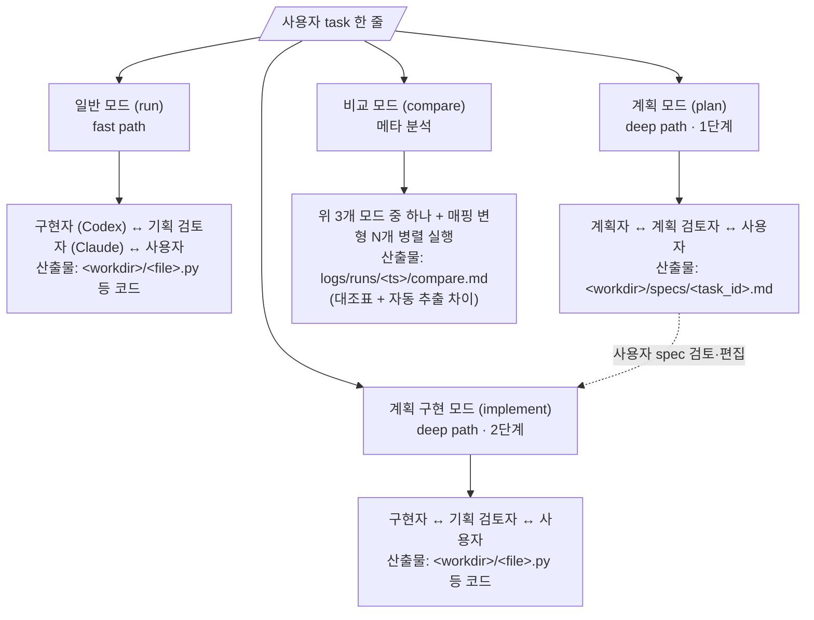

# 4. 과제 요구사항 + 모드 정의

---

## 4.1 명시 요구사항 체크리스트

| # | 요구사항 | 만족 방식 | 증빙 |
|---|---|---|---|
| 1 | 두 개 이상의 AI 에이전트가 메시지 교환 | Codex(Driver) ↔ Claude(Reviewer) ↔ User. 3-party. | `messages.jsonl` |
| 2 | 사용자 개입·관찰 가능 | 매 턴 6지선다 + directive(개입, `--interactive` 강도 dial). 실시간 화면 + `dialectic logs --follow`(관찰). default = critical 모드 — P0/P1 발견 시만 prompt, 사용자가 항상 `e`/Ctrl-C로 끼어들기 가능 | `kind=decision` 메시지 + reviewer `[CONVERGED]` 마커 |
| 3 | 통신·프로토콜·UI·언어 자유 | Python · subprocess + headless · JSONL · stdin/stdout TUI | `docs/runtime-docs/protocol.md` |
| 4 | AI 코딩 에이전트로 개발 | 도구 자체를 Claude Code + Codex CLI로 페어 프로그래밍 | `prompts/01-bootstrap.md`, ... + git log |
| 5 | README대로 실행 시 동작 | 3-step setup (clone → install → auth → run) + mock 모드 (인증 없이도 OK) | README 첫 단락 + 예제 |

## 4.2 제출물 체크리스트

| 제출 형식 | 만족 방식 |
|---|---|
| 작동하는 코드 (GitHub repo) | https://github.com/shinjw4929/Dialectic-CLI 공개 |
| 개발 시 사용한 .md | (a) 하네스 .md (AGENTS.md, CLAUDE.md, docs/*) (b) 개발 prompt (prompts/01-, 02-, ...) |
| 세션 로그 (JSONL) 또는 화면 녹화 | **둘 다**: `logs/messages.jsonl` + `logs/sessions/*.jsonl` + `tasks/*/recordings/*.jsonl` (mock 재생용 자산) + 5분 데모 mp4/cast |

## 4.3 데모 task — 기획자 페르소나 ✅ (Q13)

**페르소나 변경**: 사용자 = 기획자/사용자 페르소나 — "사용자가 에이전트에게 의도를 전하면 도구가 다중 턴 dialectic으로 진화시킨다". task는 **알고리즘·시각화 위주** (도메인 비종속) — 평가자 환경에서 추가 의존성 없이 재현 가능.

**현재 시나리오 라이브러리 (`tasks/`)**:

| 시나리오 폴더 | 분류 | 의도 |
|---|---|---|
| **`tasks/implement-dijkstra/`** | 구현 시나리오 (scratch) | 빈 workdir에서 dijkstra 알고리즘 작성 → 다중 턴 user synthesis directive("그래프 추가" → "색 추가")로 점진적 enhancement. plan 009 산출 user synthesis wiring 실 시연 |
| **`tasks/modify-dijkstra-add-graph/`** | 수정 시나리오 (existing code) | seed 코드(`dijkstra.py`)를 workdir로 복사 후 `visualize` 함수 추가 지시 → ADR-10 search-replace 메커니즘 시연. driver가 기존 함수 보존하며 추가만 수행하는지 검증 |

**결정**:
- 두 시나리오가 본 도구의 두 핵심 흐름(scratch implementation + existing code modification)을 1:1로 시연 — 평가 데모 자산
- 다른 task 후보(reward_curve, inventory_balance 등)는 시간 여유 시 추가, 본 plan 외
- compare 모드 결합은 plan 011-Phase-D / 012 진입 후 검토 (§4.5.4)
- mock 녹음(`tasks/<scenario>/recordings/`)은 plan 007 진입 후 시나리오별 자산 추가

## 4.4 Mock 모드 ✅ (Q5 = B, 인증 부재 시 자동 fallback ✅ Q5·C)

**목표**: 사용자가 인증 없이 `dialectic run`을 실행해도 실제와 동일한 화면이 흘러야 함. 인증 부재로 도구를 못 돌리는 상황 차단.

**자동 fallback** (Q5·C): 환경 점검에서 활성 에이전트 < 2면 mock 모드 옵션을 사용자에게 노출 (§3.1). 사용자가 선택 시 인증 단계 우회.

#### 작동 흐름

```
[개발 시점: 사용자(우리)가 실 실행 + 녹음]
─────────────────────────────────────────────
$ dialectic run --task "@tasks/parse_human_duration/task.md" \
                --record tasks/parse_human_duration

  Turn 1: codex 호출 → stdout JSONL
            ├─ 평소: logs/sessions/1-driver-<uuid>.jsonl 저장
            └─ --record 추가: tasks/.../recordings/codex_driver/turn-1.jsonl 복사
          claude 호출 → 동일
  사용자 결정 (i, "..."): tasks/.../recordings/decisions.txt에 한 줄 추가
  Turn 4 (e): 녹음 종료
  → tasks/parse_human_duration/recordings/ 풀 세트 완성

[배포 시점: 사용자가 mock 실행]
─────────────────────────────────────────────
$ dialectic run --task "@tasks/parse_human_duration/task.md" \
                --mock tasks/parse_human_duration

  MockAgent (driver 포지션에 codex 대신):
    Turn 1: subprocess 호출 안 함
            tasks/.../recordings/codex_driver/turn-1.jsonl 그대로 읽음
            event 라인 한 줄씩 stdout으로 흘림 (선택적 sleep으로 리얼한 진행감)
            → 사용자 화면: "Driver running... 18.4s ✓ ..." 똑같이 보임
            → logs/messages.jsonl 정상 append (실 호출과 동일)
    Turn 2~4: 동일
  사용자 결정: --mock-decisions tasks/.../recordings/decisions.txt 시 자동 답변
              미지정 시 일반 인터랙티브 (직접 결정 가능)
```

#### 어댑터 동치성 (인터페이스 동일)

```python
# src/agents/mock.py
class MockAgent(AgentRunner):
    def __init__(self, recording_dir: Path, role: str):
        self.recording_dir = recording_dir / role
        self.turn_idx = 0

    def run(self, prompt, *, raw_log_path, timeout_s):
        rec = self.recording_dir / f"turn-{self.turn_idx + 1}.jsonl"
        # rec → raw_log_path 복사 (실 호출과 동일하게 raw 보존)
        # rec 파싱해서 텍스트 추출
        # 짧은 sleep으로 리얼한 진행감 (--mock-fast 옵션으로 0)
        self.turn_idx += 1
        return AgentResponse(text=..., raw_path=raw_log_path,
                             meta={"is_mock": True, ...})

# orchestrator.py — 단 한 줄 분기
if args.mock:
    driver = MockAgent(args.mock, role=f"{args.driver}_driver")
    reviewer = MockAgent(args.mock, role=f"{args.reviewer}_reviewer")
else:
    driver = make_agent(args.driver, role="driver")
    reviewer = make_agent(args.reviewer, role="reviewer")
```

#### 디렉터리 구조

```
tasks/parse_human_duration/
├── task.md                          # task 본문 (--task에 들어가는 것)
├── recordings/
│   ├── codex_driver/
│   │   ├── turn-1.jsonl             # 실 codex stream 그대로
│   │   ├── turn-2.jsonl
│   │   └── ...
│   ├── claude_reviewer/
│   │   ├── turn-1.jsonl             # 실 claude stream 그대로
│   │   └── ...
│   ├── decisions.txt                # 사용자가 입력했던 결정 (한 줄에 하나):
│   │                                #   i|focus on edge case Y
│   │                                #   r|
│   │                                #   m|accept P1, defer P2
│   │                                #   e|
│   └── meta.json                    # 실행 일시, 비용, 모델 버전
└── (역할 스왑 녹음도 같은 식, 디렉터리만 다르게)
```

#### 정직성 표시

mock 출력에 `· MOCK` 라벨 붙임. 사용자가 실 데이터인지 재생인지 즉시 인지 → 신뢰도↑.

#### 부가 가치 (한 번에 세 가지)

1. **제출 요건 자동 충족**: 녹음 = 과제 요구의 "에이전트 세션 로그(JSONL)" 그대로
2. **회귀 테스트**: 매 commit 후 mock 재생해 출력 안 깨지는지 확인 (CI 친화적)
3. **다수 시나리오**: 같은 task에 매핑 다른 녹음 두면 cross-vendor 비교도 인증 없이 재생

#### 구현 비용

- `src/agents/mock.py`: ~80줄
- 녹음 옵션 (`--record`): orchestrator에 ~20줄
- decisions.txt 자동 답변: UI 코드 ~15줄
- **총 ~3시간**, Day 3 오전.

---

## 4.5 모드 정의 (4개) ✅ (Q12)

4개 모드는 모두 같은 dialectic 메커니즘(driver 포지션 + reviewer 포지션) 위에 다른 role.md를 주입하는 변형. 모드 추가 비용은 role.md 4개 작성 + orchestrator의 모드→role 매핑 dict 정도 (~50줄).

### 모드 데이터 흐름 (대조)



해석:
- **빠른 path**: 일반 모드 한 번. 작은 task에 적합.
- **신중한 path**: 계획 모드(spec 산출) → 사용자가 spec 검토·편집 → 계획 구현 모드(코드 산출). 큰 task에 적합. 4계층 narrative 중 **Knowledge 계층 자산화** 강력한 시연.
- **메타**: 비교 모드로 매핑·모드 변종을 정량 비교. validation.md 환원 자료.

### 4.5.1 일반 모드 (run)

`dialectic run --task <path>` (또는 인자 없이 메뉴).

| 항목 | 값 |
|---|---|
| driver 포지션 역할 | `implementer` |
| reviewer 포지션 역할 | `spec-reviewer` |
| 입력 | task.md (또는 사용자 직접 입력 한 줄) |
| 산출물 | `<workdir>/<file>.py` (신규 작성) **또는** 기존 파일 search-replace 수정 (driver 응답의 patch 블록 → orchestrator R2.6/R2.7 적용 → `meta.files_changed` 기록, Q22 ✅ A2). §2.3 라이프사이클·§2.2 스키마 참조 |
| 사용자 개입 | 매 턴 6지선다 + directive |
| 종료 | `e` 키 / `--max-turns` 도달 / **연속 K=2턴 P0/P1=0 + [CONVERGED]** (Q6 = b 확정, default K=2, `--convergence-streak`로 조정) |

"no critique" 자동 종료의 안전 마진 = K턴 streak. 단발 마커는 fix-induced regression을 못 봐 종료 조건 부적합 (ADR-9 참조). **`--max-turns < K+1`이면 K=1 자동 fallback** (Patch 5).

reviewer는 task 충실도(P0/P1) + 일반 결함(P2) 둘 다 (Q16 ✅).

### 4.5.2 계획 모드 (plan)

`dialectic plan --task <path>` (메뉴 가능).

| 항목 | 값 |
|---|---|
| driver 포지션 역할 | `planner` |
| reviewer 포지션 역할 | `plan-reviewer` |
| 입력 | task.md (자유 task 한 줄) |
| 산출물 | `<workdir>/specs/<task_id>.md` (구체 spec) |
| 종료 시 행동 | spec.md를 사용자가 보고 검토 → 다음 단계로 (계획 구현 모드 호출) |

`planner.md` 책임: 입력 → 출력 시그니처, 엣지케이스, 비기능 요구를 spec.md로.
`plan-reviewer.md` 책임: 빠진 엣지케이스, 모순, 실현 가능성 지적.

산출 spec.md 예시 구조:
```markdown
# Spec · wave_difficulty
## Signature
def wave_difficulty(wave_index: int) -> dict[str, int | float]: ...
## Inputs/Outputs
- wave_index: 1-based int
- 반환 dict: {enemy_count, enemy_hp, spawn_interval_sec}
## Edge cases
- wave_index <= 0: ValueError
- 매우 큰 wave_index: 가속 곡선이 메모리 안전?
## Functional requirements
- 1~5: 학습 곡선 (선형)
- 6~10: 중간 도전 (1.2x 증가)
- 11+: 가속 곡선 (wave^1.3)
- 10·20 웨이브: 보스 등장
## Non-functional
- 호출 1회당 < 1ms
- 결정성 (같은 입력 → 같은 출력)
```

이 spec.md를 그대로 계획 구현 모드의 입력으로 사용 → 두 단계 자산이 자연스럽게 연결.

### 4.5.3 계획 구현 모드 (implement)

`dialectic implement --spec <path>` (메뉴 가능).

| 항목 | 값 |
|---|---|
| driver 포지션 역할 | `implementer` (run과 동일) |
| reviewer 포지션 역할 | `spec-reviewer` (run과 동일) |
| 입력 | `<workdir>/specs/<task_id>.md` (계획 모드 산출 또는 사용자 작성) |
| 산출물 | `<workdir>/<file>.py` (신규 작성) **또는** 기존 파일 search-replace 수정 (driver 응답의 patch 블록 → orchestrator R2.6/R2.7 적용 → `meta.files_changed` 기록, Q22 ✅ A2). §2.3 라이프사이클·§2.2 스키마 참조 |
| 종료 | run과 동일 |

`spec-reviewer.md`는 spec.md를 ground truth로 코드 충실도 검사. P0/P1은 spec 미준수, P2는 일반 결함.

### 4.5.4 비교 모드 (compare) ✅ (Q9)

**별도 서브커맨드** — 메인 인터랙티브 모드와 완전 분리.

#### 인터페이스

```bash
# 병렬 비교 (별도 모드, 비대화형)
dialectic compare --task "@tasks/implement-dijkstra/task.md" \
                  --configs "driver=codex,reviewer=claude" \
                            "driver=claude,reviewer=codex" \
                  --parallel \
                  --decisions iterate,iterate,end \
                  --max-turns 5
```

#### 작동 방식

- N개 config 각각 별도 subprocess(`dialectic run --non-interactive ...`)로 spawn
- `concurrent.futures.ThreadPoolExecutor` (또는 `asyncio.gather`)로 동시 실행
- 각 run은 자기 디렉터리(`logs/runs/<ts>-<config_hash>/`)로 격리 — 충돌 없음
- 진행 표시: 메인이 자식 stderr 라인 모아 ASCII 진행 (`[A] T1 driver done · [B] T1 driver running`)
- 종료 시 각 SYNTHESIS.md 모아 `compare.md` 생성

#### 안전장치

- `--parallel-max 2` 기본값 — Codex/Claude rate limit 보수 대응
- 비용 N배 → README에 추정치 명시 (`compare`는 turn당 ~$0.15 × N config)
- mock 모드는 자연스럽게 병렬 안전 (파일 읽기만)
- 인터랙티브 안 함 — `--decisions`/`--directives` 또는 `decisions.txt` 필수
- compare는 `--interactive=end-only`와 의도 동등 (둘 다 비대화형). compare는 N config 병렬 + 메타 분석이 본질, end-only는 단일 run의 비대화형. 직교.

#### 산출물 `compare.md` 구조

```markdown
# Compare · 2026-05-08T14:32Z · task: wave_difficulty

| Config | Turns | Cost | Final P0 issues | 채택 비율(driver:reviewer) |
|---|---|---|---|---|
| codex_driver/claude_reviewer | 4 | $0.18 | 0 | 60:40 |
| claude_driver/codex_reviewer | 3 | $0.14 | 1 | 80:20 |

## 핵심 차이 (자동 추출)
- A 매핑: driver(codex)가 trade-off 더 자세히 명시 → reviewer(claude) critique가 P1·P2 깊이 파고듦
- B 매핑: driver(claude)가 첫 제안부터 엣지케이스 포함 → critique 양 적음, 빠른 종료

## (수동 작성) Cross-vendor 진정성 평가
{사용자가 직접 채우는 결론 섹션 — validation.md로 환원}
```

→ 자동(도구) + 수동(분석)의 혼합. 자동만이면 "도구 자랑", 수동 결론이 있어야 "분석 능력" 신호.

#### 구현 비용

단일 모드 위에 ~3시간. Day 3 오전 (mock과 같이).

---

## 4.6 모드별 구현 비용 정리

| 모드 | 새로 작성하는 것 | 비용 | Day |
|---|---|---|---|
| run (일반) | 기본 메커니즘 + `implementer.md` + `spec-reviewer.md` | 핵심 작업, ~2일 | Day 2 |
| plan (계획) | `planner.md` + `plan-reviewer.md` (run 위에 role.md만 교체) | ~2시간 | Day 3 오전 |
| implement (계획 구현) | spec.md 입력 처리 (task 포지션에 spec 본문 주입) | ~1시간 | Day 3 오전 |
| compare (비교) | subprocess 병렬 + `compare.md` 자동 생성 | ~3시간 | Day 3 오전 |
| mock | `mock.py` adapter + `--record` 옵션 | ~3시간 | Day 3 오전 |
| patch apply (search-replace) | `src/patch_apply.py` — 정규식 추출 + SEARCH 정확 일치 검색 + REPLACE 치환 + `kind=patch_applied` append (R2.6/R2.7 단계) | ~1.5시간 | Day 2 후반 (orchestrator turn loop 직후) |

→ Day 3 오전(~5시간)에 plan + implement + compare + mock 모두 처리 가능. patch apply는 Day 2 후반에 통합 — minimum cut 시 Day 3 오전으로 밀려도 modify 데모는 Day 4 풀 데모 시점에 시연 가능. role.md 4개는 Day 1 .md 골격 단계에서 작성 → Day 3에는 코드 wiring만.
