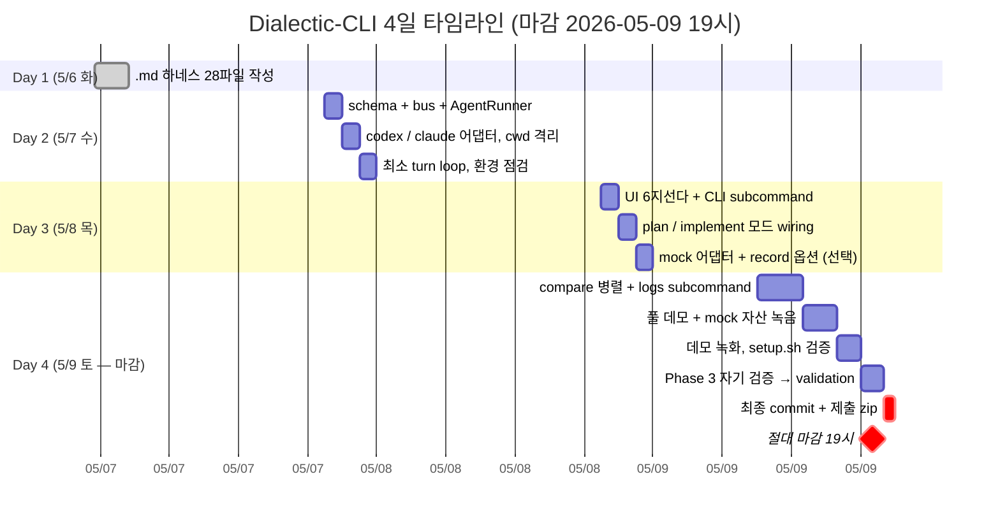

# 5. 타임라인 + 다음 행동

> 사용자 가용 시간 현실 반영 — 평일(5/7 수, 5/8 목) 회사 후 19:30+ ~4.5h, 토요일(5/9 마감일) 종일.

---

## 5.1 4일 타임라인 (실제 가용 시간 기준)



<details>
<summary>상세 작업 목록 (펼치기)</summary>

```
Day 1 (5/6 화 → 5/7 새벽, 23:30~02:30) ✓ 완료 — .md 하네스 풀 작성 (28 파일)
─ A 개발용 (dev-time):
  · CLAUDE.md, AGENTS.md (Pre/Post Checklist, §1.5)
  · docs/dev-docs/Documentation-Checklist.md (변경 유형 → .md 동기화 매핑)
  · docs/dev-docs/code-conventions.md (Q17 보강 — Python·도구 specific 규칙)
  · docs/dev-docs/Plans/plan-writing-guide.md (AS-IS/TO-BE 가이드)
  · docs/dev-docs/Checklists/{review-plan, review-code}-checklist.md (2 신작)
  · .claude/skills/{commit, sync-docs, create-plan, review-plan, execute-plan, review-code}/SKILL.md (6 skills)
  · .claude/skills/SKILLS.md (Tier 구조 인덱스)
─ B 런타임용:
  · docs/runtime-docs/protocol.md (메시지 스키마 + 턴 라이프사이클 + 실패 모드 + 모드↔role 매핑)
  · docs/runtime-docs/roles/{implementer, spec-reviewer, planner, plan-reviewer}.md (4 role)
  · docs/dev-docs/validation.md (스켈레톤만, 운영 중 채워짐)
─ 공통:
  · docs/dev-docs/architecture.md (왜 dialectic, 4계층 매핑, 4 모드 흐름, ADR 8개)
  · docs/dev-docs/assignment-requirements.md (Q17 보강 — 과제 본문 매핑)
  · README.md (setup.sh 한 줄 + 5초 데모 + 4 모드 표)
  · setup.sh (venv + install + 안내)
  · tasks/wave_difficulty/task.md (기획자 페르소나 데모 task)
─ commit (아직 안 함, Day 2 시작 전 또는 Day 2 시작 시 한꺼번에):
  "Add dev-time harness (A)", "Port commit/sync-docs skills",
  "Add 4 plan/review skills + 2 checklists + 가이드",
  "Add code conventions + assignment requirements",
  "Add runtime harness (B) — 4 roles + protocol",
  "Add architecture with ADR table", "Add wave_difficulty task draft"

Day 2 (5/7 수, 회사 후 19:30+ , ~4.5h 가용) — run 모드 핵심 메커니즘
─ minimum target: **한 턴 E2E 성공** (codex·claude 양쪽 호출 + JSONL 기록 + cwd 격리 검증)
─ 작업:
  · src/schema.py + src/bus.py (~80 LOC) — 메시지 dataclass + JSONL append-only writer
  · src/agents/base.py (~30 LOC) — AgentRunner Protocol + AgentResponse
  · src/agents/codex.py (~60 LOC) — codex exec --json 호출, raw stream → text 파싱
  · src/agents/claude.py (~60 LOC) — claude -p --json 호출
  · `--workdir <path>` 또는 `tempfile.mkdtemp(prefix="dialectic-")` fallback (§1.3 cwd 격리)
  · tests/test_cwd_isolation.py (단위 테스트 — 더미 CLAUDE.md 누수 0 검증)
  · src/orchestrator.py 최소 turn loop (~120 LOC) — driver 호출 → reviewer 호출 → JSONL append
  · 환경 점검 함수 (claude/codex --version + auth status)
─ minimum cut (4.5h 안 끝나면): 어댑터 1개(claude only) + 단방향 호출만, codex 어댑터는 Day 3로
─ commit 단위: "Add JSONL bus + schema", "Add AgentRunner protocol + cwd isolation",
  "Implement codex/claude adapters", "Wire minimum turn loop"

Day 3 (5/8 목, 회사 후 19:30+, ~4.5h 가용) — 인터랙티브 + plan/implement
─ minimum target: **run 모드 풀 인터랙티브 + plan/implement 모드 작동**
─ 작업:
  · src/ui.py (~80 LOC) — 6지선다 + directive 입력, 진행 spinner
  · src/cli.py (~120 LOC) — argparse subcommand (run/plan/implement/compare/logs) + 메뉴 fallback
  · MODE_ROLES dict in orchestrator.py — mode → {driver_role, reviewer_role}
  · dialectic plan / implement (role 매핑만 변경, 코드 분량 적음)
  · src/agents/mock.py + `--record` 옵션 (시간 남으면, 못 끝나면 Day 4 오전으로)
─ minimum cut: mock·compare는 Day 4 오전으로 밀려도 OK. run/plan/implement 3 모드 인터랙티브만 보장
─ commit 단위: "Add user synthesis prompt UI", "Add CLI subcommands + menu fallback",
  "Wire plan/implement modes via role remap"

Day 4 (5/9 토, 마감일, 종일 가용 — 가장 큰 작업 시간대)
─ 오전 (~3-4h):
  · mock + --record 마무리 (Day 3 잔여 시)
  · dialectic compare --parallel 구현 (~80 LOC, ThreadPoolExecutor)
  · src/cli.py logs 서브커맨드 (~50 LOC)
─ 점심 후 (~2-3h):
  · 풀 데모 1회 실행 (wave_difficulty run 모드) → mock 자산 녹음 (tasks/wave_difficulty/recordings/)
  · 추가 데모: plan → implement 흐름 1회 + compare 1회
  · README 정돈 (4 모드 안내, mock fallback 검증, 실제 명령 cross-check)
  · SYNTHESIS.md / compare.md / spec.md 자동 생성 마무리
─ 오후 (~2h):
  · 데모 녹화 (asciinema 시도, OBS 백업)
  · setup.sh 깨끗한 환경 검증 (별도 사용자로 git clone → setup.sh → dialectic --mock 한 줄)
─ 오후 후반 (~1-2h):
  · Phase 3 자기 검증 — review-code로 src/ 검토, review-plan으로 outline/ 검토
  · 발견된 결함을 docs/dev-docs/validation.md에 R-001부터 환원
  · CLAUDE.md/AGENTS.md 운영 흔적 반영
─ 저녁 (~1h):
  · 최종 commit, push (의미 단위)
  · 제출 zip 패키징 (코드 + 영상 + JSONL)
─ 19:00 절대 마감 (4h 버퍼로 잠)
```

</details>

---

## 5.2 위험 요소 (사전 인지)

1. **Day 2 4.5h 안에 어댑터 3개 + bus + schema + orchestrator 최소 loop가 빡빡** → minimum cut(어댑터 1개만)으로 fallback. 핵심 메커니즘은 보장.
2. **회사 일정·체력 변동** → Day 2/3 슬립 가능. Day 4 오전이 항상 fallback (mock·compare).
3. **Codex/Claude 응답 시간 변동성** → 데모 영상 편집 부담. mock 모드가 안전망.
4. **`pyproject.toml` entry_point 빌드 실수** → 사용자 실행 실패. CI(GitHub Actions로 install + smoke run) 추가 검토 (Day 4 시간 남으면).
5. **Compare 모드 병렬 시 rate limit** → `--parallel-max 2` 기본, 실제 데모는 mock 재생으로 안전.

---

## 5.3 다음 행동

### Day 1 — 완료 ✓

`.md` 하네스 28 파일 풀 작성. 정리:

**A. 개발용 (dev-time harness)** — Claude Code/Codex가 *이 도구를 만들 때* 자동 로드
1. ✓ `CLAUDE.md` (Pre/Post Checklist)
2. ✓ `AGENTS.md` (Codex 시점)
3. ✓ `docs/dev-docs/Documentation-Checklist.md` (변경 → .md 매핑)
4. ✓ `docs/dev-docs/code-conventions.md` (Python·도구 specific 규칙)
5. ✓ `docs/dev-docs/Plans/plan-writing-guide.md` (AS-IS/TO-BE 가이드)
6. ✓ `docs/dev-docs/Checklists/review-plan-checklist.md`
7. ✓ `docs/dev-docs/Checklists/review-code-checklist.md`
8. ✓ `.claude/skills/commit/SKILL.md`
9. ✓ `.claude/skills/sync-docs/SKILL.md`
10. ✓ `.claude/skills/create-plan/SKILL.md`
11. ✓ `.claude/skills/review-plan/SKILL.md`
12. ✓ `.claude/skills/execute-plan/SKILL.md`
13. ✓ `.claude/skills/review-code/SKILL.md`
14. ✓ `.claude/skills/SKILLS.md` (Tier 인덱스)

**B. 런타임용 (runtime harness)** — orchestrator가 driver/reviewer prompt에 주입
15. ✓ `docs/runtime-docs/protocol.md`
16. ✓ `docs/runtime-docs/roles/implementer.md`
17. ✓ `docs/runtime-docs/roles/spec-reviewer.md`
18. ✓ `docs/runtime-docs/roles/planner.md`
19. ✓ `docs/runtime-docs/roles/plan-reviewer.md`
20. ✓ `docs/dev-docs/validation.md` (스켈레톤)

**공통**
21. ✓ `docs/dev-docs/architecture.md` (4계층 매핑 + ADR 8개)
22. ✓ `docs/dev-docs/assignment-requirements.md` (과제 매핑)
23. ✓ `README.md` (setup.sh + 5초 데모)
24. ✓ `setup.sh`
25. ✓ `tasks/wave_difficulty/task.md`

→ Day 2 시작 전(또는 시작 시) `commit` 스킬 호출 — 위 28 파일을 의미 단위 ~6-7 commit으로 push.

### Day 2 — 코드 핵심 메커니즘

26. `src/schema.py` — 메시지 dataclass (msg_id·parent_id·turn_id·slot·mode·kind·content·directive·meta)
27. `src/bus.py` — JSONL append-only writer (flush 강제, append-only 검증)
28. `src/agents/base.py` — AgentRunner Protocol + AgentResponse
29. `src/agents/codex.py` — codex exec 호출 + raw stream 파싱
30. `src/agents/claude.py` — claude -p 호출 + raw stream 파싱
31. `tests/test_cwd_isolation.py` — 더미 CLAUDE.md 누수 0 검증
32. `tests/test_bus_append.py` — append-only 위반 검증
33. `src/orchestrator.py` 최소 turn loop — driver 호출 → reviewer 호출 → JSONL append
34. 환경 점검 함수 (claude/codex --version + auth status)

→ Day 2 끝나기 전 `sync-docs` + `review-code` 호출, `commit` 스킬 호출.

### Day 3 — 인터랙티브 + plan/implement

**Day 2 환원 후속 cross-check (Day 3 첫 작업 권고)**:
- `validation.md §3 C-003` (P-VENDOR 어댑터 비대칭 docstring·returncode·env) — mock 어댑터 작업이 새 비대칭 통로인지 검증 후 R-002 정식 환원 결정
- `validation.md §2 R-001` (P-ENCODING — Day 2에 정식 환원 완료) — mock 어댑터 raw_log 저장 시 `encoding="utf-8"` 자동 catch (review-code-checklist.md §1 P0 행)

35. `src/ui.py` — 6지선다 + directive 입력 + 진행 spinner
36. `src/cli.py` — argparse subcommand + 메뉴 fallback
37. orchestrator MODE_ROLES dict — 모드↔role 매핑
38. dialectic plan / implement 모드 (role 매핑만 변경)
39. `src/agents/mock.py` + `--record` 옵션 (시간 남으면) — **C-003 cross-check 시점**

### Day 4 — 마감

40. `dialectic compare --parallel` 구현
41. `dialectic logs` 서브커맨드
42. mock + --record 마무리 (Day 3 잔여 시)
43. 풀 데모 실행 → mock 자산 녹음 (tasks/wave_difficulty/recordings/)
44. README 정돈 + 자동 생성 로직 (SYNTHESIS.md / compare.md / spec.md)
45. 데모 녹화 (asciinema)
46. setup.sh 깨끗한 환경 검증
47. **Phase 3 자기 검증** — review-code + review-plan → validation.md R-001~ 환원
48. CLAUDE.md/AGENTS.md 운영 흔적 반영
49. 최종 commit + push + 제출 zip
50. 19:00 절대 마감
