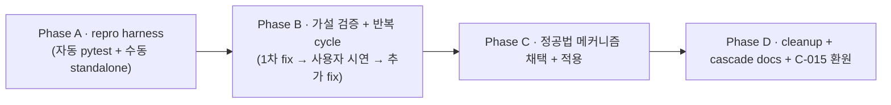

# Plan · 015-trigger-race-fix

## 0. 메타

- 작업 ID: `015-trigger-race-fix`
- 의도: TriggerListener `__exit__` → `prompt_end_or_iterate` readline byte 절도 race 정공법 fix. agent 응답 생략한 reproduction harness로 빠른 검증 cycle 구축 + 사용자 반복 시연으로 race 완전 제거
- 관련 ADR / Q번호: P-RAW (raw mode + thread + stdin 절도 race 광역 패턴), validation.md C-015 (3차 hot fix 누적 + race 잔존 등록)
- 예상 영향 범위: `src/ui.py` (TriggerListener 메커니즘 정공법 변경 — 후보 4종 중 채택), 채택 메커니즘 ① (main thread polling) 시 `src/orchestrator.py:_run_session_critical` 호출 지점 wiring 추가, 신규 `tools/repro_listener.py` (수동 standalone harness), 신규 `tests/test_listener_race_pty.py` (pytest pty 자동 재현), `docs/dev-docs/validation.md` C-015 환원, `docs/dev-docs/systems/ui.md` TriggerListener narrative cascade, `docs/dev-docs/Plans/upcoming-plans.md` plan 015 entry
- LOC 추정: ~80 LOC (코드 + harness) + ~60 LOC (테스트). 정공법 메커니즘 채택 결과 따라 ±50 LOC 변동 가능 — 단일 plan 적정성: 4 phase 직렬 + 단일 의도(race fix) + 영향 모듈 7+이지만 모두 race fix scope. 사용자 단일 결정으로 통합 진행 (분할 시 harness ↔ fix ↔ cascade 의존 사슬이 plan 경계로 깨짐)
- 백로그 SSOT: `validation.md §3 C-015` (3차 hot fix 누적 + 잔존 race), plan 011 commit `2c2bc2a` (3차 fix 적용)

## 1. AS-IS

### 1.1 TriggerListener 3차 hot fix 누적 (현재 코드)

- `src/ui.py:297-547 TriggerListener` 클래스 (plan 009 산출 + plan 011 Bug 1 fix 1차·2차·2차+ 누적):
  - `__init__` `:333-344` 부근 — Event/thread/self-pipe 초기화, isatty + termios 검사로 `_enabled` 설정
  - `_run` thread `:351-418` 부근 — `select.select(timeout=0.1)` cycle + `os.read(self._fd, 1)` byte 단위 + TRIGGER_BYTE(0x06, line 322 paste 상수) 매치 시 `_triggered.set()` + stderr 안내. self-pipe wake로 `_stop` 신호 즉시 감지 (line 366-377 영역)
  - `__enter__` `:419-481` 부근 — setcbreak `when=TCSANOW` (drain X) + 사전 누름 byte 회수 (fcntl O_NONBLOCK + os.read drain → 0x06 검사) + self-pipe pair 생성 + thread.start
  - `__exit__` `:483-547` 부근 — `_stop.set` + self-pipe wake + thread.join(`THREAD_JOIN_TIMEOUT_S=1.0`, line 33) + **plan 011 fix 2차+: join timeout 시 추가 wake + 추가 join (line 487-506) + is_alive 시 stderr [!] 경고** + tcsetattr **TCSAFLUSH** 복원 (line 515, plan 011 fix 1차) + tcflush(TCIFLUSH) (line 524)

### 1.2 prompt_end_or_iterate readline 우회 누적 (현재 코드)

- `src/ui.py:146-247 prompt_end_or_iterate` (plan 009 + Bug 1 fix 2차):
  - 본문 line 200-215 부근 readline 호출:
    - print label/reason/options to stderr
    - sys.stdout.write("> ") + flush
    - **`raw = _read_line_for_prompt()`** (Bug 1 fix 2차)
- `src/ui.py:118-143 _read_line_for_prompt` helper (plan 011 Bug 1 fix 2차 신규):
  - flush_stdin(grace_period_s=0.05) — listener 잔재 byte drain
  - **`os.read(fd, 4096)` byte 단위 직접 누적** — Python sys.stdin TextIOWrapper buffer 우회
  - newline까지 buffer → decode utf-8

### 1.3 사용자 e2e 시연 결함 narrative (validation.md C-015)

- 사용자 환경: WSL2 PTY (CLAUDE.md 가정 환경)
- 시연 시퀀스 (plan 011 commit `2c2bc2a` 적용 후):
  1. `dialectic` 메뉴 → 단계 5 진입 → critical 모드 turn loop
  2. driver 응답 stream 중 사용자 Ctrl+F 누름 → trigger.set + stderr "[i] 사용자 트리거 발동" 출력
  3. turn 종료 → TriggerListener `__exit__` (3차 fix 적용)
  4. main thread `prompt_end_or_iterate` 호출 → label/reason/options stderr 출력 + "> " stdout
  5. 사용자 'y' 또는 한글 directive 입력 + Enter
  6. **결함**: text="" 분기 (line 187 `if text == ""`) 실행 → "Y / c / 텍스트 중 하나를 입력해주세요." 출력 → invalid retry
  7. INVALID_RETRY_LIMIT=3 도달 → fallback ("c", None) → 자연 진행 → 사용자 directive 손실

### 1.4 hot fix 시도된 가설 (모두 race 잔존)

| 차수 | 가설 | 적용 위치 | 효과 |
|---|---|---|---|
| 1차 | termios attrs 즉시 적용 | `__exit__` TCSADRAIN → TCSAFLUSH | 부분 효과, race 잔존 |
| 2차 | GNU readline lib 우회 | `input()` → `sys.stdin.readline()` | race 잔존 |
| 3차 | Python TextIOWrapper buffer 우회 | `sys.stdin.readline()` → `os.read(fd, 4096)` 직접 + flush_stdin 사전 | race 잔존 |
| 3차+ | listener thread 강제 종료 보장 | `__exit__` join 1차 timeout → 추가 wake + 추가 join + is_alive 경고 | race 잔존 |

### 1.5 추정 root cause (검증 필요)

- listener thread `_run` `select+os.read` cycle이 `__exit__` 진행 중에도 마지막 cycle 잔존 → 사용자 byte 절도 (자명한 race)
- 또는 termios canonical mode 복원이 PTY 환경에 따라 즉시 반영 안 됨 → readline이 raw mode로 받아 newline 인식 실패
- 또는 stdout/stderr buffering으로 사용자가 prompt 보기 전에 입력 → 그 byte가 listener에 절도 (먼저 읽힘)

본 plan A에서 reproduction harness로 가설별 검증.

### 1.6 기존 단위 테스트 (회귀 보호 대상)

- `tests/test_trigger_listener.py:30-220` (5 테스트, plan 011 commit `2c2bc2a` 후 TCSAFLUSH 단언) — fake termios mock 기반, 실 fd 미사용
- `tests/test_prompt_end_or_iterate.py:1-150` (12 테스트) — `_read_line_for_prompt` mock 기반
- 두 테스트 모두 PTY 환경에서 race 자동 재현 X — mock으로 우회

## 2. TO-BE

### 2.1 Reproduction Harness — 자동 (pytest pty 기반)

- 신규 `tests/test_listener_race_pty.py` (~50 LOC + 30 테스트):
  - `pty.spawn` 또는 `pty.openpty + subprocess`로 child Python process spawn
  - child가 `from src.ui import TriggerListener, prompt_end_or_iterate` 후 시뮬레이션 cycle 실행
  - parent가 child stdin에 byte injection (Ctrl+F = 0x06, then 'y\n')
  - parent가 child stdout/stderr capture → race 결함 (빈 줄 retry) 검출
  - timeout 안전망 (10초)
  - 외부 의존성 0 (`pty` stdlib + `subprocess` 표준)

### 2.2 Reproduction Harness — 수동 (standalone script)

- 신규 `tools/repro_listener.py` (~50 LOC) — repo 안 신규 디렉토리 `tools/` 또는 기존 `scripts/` 활용:
  - dummy AgentRunner stub (즉시 1줄 응답)
  - listener + prompt_end_or_iterate cycle만 실행 (orchestrator·codex·claude 호출 0)
  - 사용자가 실행 → Ctrl+F → prompt → 입력 → 결과 자체 출력 (race 발생 시 명시적 메시지)
  - venv activate 필요 — `./.venv/bin/python tools/repro_listener.py` 직접 호출

### 2.3 race root cause 검증 + 정공법 메커니즘 채택

가설 4 후보 — Phase B 검증 결과 채택:

1. **listener thread 유지 + thread-safe Queue + main thread polling** (채택 — Phase C §3.2 단일 결정)
   - 현재 listener thread `select+os.read`가 byte 절도 → main thread readline byte 누락 race
   - 변경: listener thread는 byte를 `queue.Queue`에 push (절도 X) → main thread `poll_trigger_byte()` helper가 `queue.get_nowait()`로 검사 + TRIGGER_BYTE 발견 시 trigger.set
   - 핵심: byte 절도 0 (queue가 byte 보존) + readline race 0 (`__exit__` 시 queue 잔존 byte 처리 결정 필요 — Phase C §3.2 단일 결정)
2. **signal-based trigger** (POSIX SIGUSR1)
   - 사용자가 별도 명령(`pkill -USR1 dialectic` 또는 keyboard shortcut → signal)으로 trigger
   - 단점: 키 입력 매핑 어려움 (terminal에서 직접 signal 발생 X)
   - readline lib 영향 0
3. **listener fd close 강제 종료** (위험)
   - `__exit__`에서 self.fd close → os.read OSError → thread return
   - 단점: stdin fd 0 close하면 main thread readline도 영향 (parent fd 잃음)
   - 별도 dup된 fd 사용으로 회피 가능하지만 복잡
4. **trigger 키 변경** (terminal 충돌 회피)
   - 0x06 (Ctrl+F)이 readline forward-char와 매핑 → readline lib state 영향
   - 다른 control char (0x14 Ctrl+T, 0x07 Ctrl+G 등) 또는 escape sequence (Esc+F)
   - 단점: 사용자 익숙도 낮아짐

채택 우선순위 (Phase C §3.2 단일 결정 반영):
- **1순위: ① main thread polling + thread-safe Queue (채택)** — byte 절도 0 + readline race 0
- 2순위: ② signal-based (UX 비친화이지만 race 0)
- 3순위: ③ fd dup/close (위험, 복잡)
- 4순위: ④ TRIGGER_BYTE 변경 — `src/ui.py:323-325` 코드 주석 narrative상 사전 검증 실패 (Ctrl+T 시도 동일 결함). race 자체 source가 byte 매핑 아닌 thread + termios 일반이라 단독 채택 부적합 (fallback narrative만)

### 2.4 cascade docs

- `docs/dev-docs/systems/ui.md` TriggerListener 표 + narrative (메커니즘 변경)
- `docs/runtime-docs/protocol.md` (만약 TriggerListener 동작 narrative 있으면)
- `docs/dev-docs/validation.md` C-015 → 채택 메커니즘 narrative + R-NNN 환원 (3회 hot fix 광역 패턴 입증 시)
- `docs/dev-docs/Plans/upcoming-plans.md` plan 015 entry 추가 (진입 → completed)

## 3. Phase 인덱스

### 3.1 의존성 그래프

직렬 — A 산출(harness)은 B/C 검증 도구. B는 1차 가설 fix + 사용자 반복 시연 (cycle 5회 한계). C는 B에서 race 미해결 시 정공법 메커니즘 강제 진입. D는 cleanup + cascade.

### 3.2 Phase 파일 경로

| Phase | 경로 | 의존 | 병렬 그룹 |
|---|---|---|---|
| A · repro harness | [phase-a-repro-harness.md](phase-a-repro-harness.md) | (없음) | — |
| B · 반복 cycle | [phase-b-iterative-cycle.md](phase-b-iterative-cycle.md) | A | — |
| C · 정공법 메커니즘 | [phase-c-canonical-fix.md](phase-c-canonical-fix.md) | B | — |
| D · cleanup + cascade | [phase-d-cleanup-cascade.md](phase-d-cleanup-cascade.md) | C | — |

## 4. 비기능 요구

- 외부 의존성 추가 0 (표준 라이브러리만 — `pty`, `subprocess`, `select`, `os`, `termios`)
- plan 009 critical 모드 UX 보존 — Ctrl+F 키 매핑 + 매 턴 trigger 인식 가능 (메커니즘만 변경)
- 회귀 0 — 기존 `tests/test_trigger_listener.py` (5) + `tests/test_prompt_end_or_iterate.py` (12) + `tests/test_orchestrator_decision_wiring.py` (23, plan 011 산출) 모두 통과
- harness 자체가 cwd 격리 (ADR-6) 위반 X — child process는 `/tmp/...` cwd 강제

## 5. 위험 (Phase 횡단)

1. **harness가 race 자동 재현 실패**
   - PTY 환경 차이 (WSL2 vs Linux native vs macOS) — pytest CI에서 재현 안 될 수 있음
   - 차단: 수동 standalone harness 병렬 — 사용자 환경에서 재현 보장. pytest harness는 best-effort

2. **정공법 메커니즘이 plan 009 critical 모드 회귀**
   - listener thread 유지 + queue 패턴 도입 시 `__exit__` queue 잔존 byte 처리 정책 결정 필요 — Phase C §3.2가 단일 SSOT
   - 차단: Phase C 적용 후 plan 009 시연 매트릭스 재실행 (1턴 진행 도중 Ctrl+F → 턴 끝 prompt) — race 0 + UX 보존 양쪽 검증

3. **반복 cycle 무한 루프**
   - Phase B 가설 fix → 사용자 시연 → race 잔존 → 추가 fix → 무한 반복
   - 차단: Phase B cycle 5회 한계. 5회 도달 시 Phase C 정공법 강제 진입 (가설 fix 포기, 메커니즘 변경)

4. **사용자 환경 의존성 narrative 부재**
   - WSL2 PTY 외 환경에서 race 발생 안 할 수 있음 — fix 검증 어려움
   - 차단: Phase A에서 사용자 환경 narrative 수집 (terminal emulator, locale, WSL 버전) — phase-a §6에 기록

5. **mock 어댑터(plan 007 deferred) 부재로 dummy harness 자체 신설**
   - dummy AgentRunner는 본 plan 산출이지 plan 007 산출 아님
   - 차단: dummy는 harness 한정 (`tools/repro_listener.py`) — production code 영향 0. plan 007 진입 시 mock adapter 정식 wiring + dummy harness 폐기 가능

## 6. 완료 기준 (Definition of Done)

- [ ] (Phase A) `tests/test_listener_race_pty.py` 신규 작성 + race 자동 재현 (pty 기반, 외부 의존성 0)
- [ ] (Phase A) `tools/repro_listener.py` 신규 작성 + 사용자 수동 시연 cycle 가능 (codex/claude 호출 0)
- [ ] (Phase A) 사용자 환경 narrative 수집 (terminal emulator, locale, WSL 버전, race 재현률)
- [ ] (Phase B) 가설 fix 시도 → 사용자 시연 5회 중 race 0회 (race 재현률 0/5) 도달 또는 5 cycle 도달 시 Phase C 진입
- [ ] (Phase C) 채택 메커니즘 ① main thread polling (thread-safe Queue) 적용 → harness 자동 재현 race 0/5 + 사용자 수동 시연 race 0/5
- [ ] (Phase C) plan 009 critical 모드 시연 회귀 0 (`dialectic` 메뉴 진입 → 1턴 진행 도중 Ctrl+F → 턴 끝 `prompt_end_or_iterate` 표시 + 사용자 'y' 입력 → `auto_end_user` 정상)
- [ ] (Phase D) `docs/dev-docs/systems/ui.md` TriggerListener 표 + narrative 갱신
- [ ] (Phase D) `docs/dev-docs/validation.md` C-015 → R-NNN 환원 또는 status update (광역 패턴 입증 narrative)
- [ ] (Phase D) `docs/dev-docs/Plans/upcoming-plans.md` plan 015 entry 추가 (→ completed)
- [ ] sync-docs 누락 0 / `pytest -q` 회귀 0 + 신규 케이스 ≥4

## 7. 참조 .md

- [`docs/dev-docs/validation.md`](../../docs/dev-docs/validation.md) §3 C-015 — 3차 hot fix 누적 + 잔존 race narrative
- [`docs/dev-docs/systems/ui.md`](../../docs/dev-docs/systems/ui.md) TriggerListener 표 — cascade 대상
- [`src/ui.py:297-547`](../../src/ui.py) — TriggerListener AS-IS (3차 fix 적용 코드)
- [`src/ui.py:146-247`](../../src/ui.py) — prompt_end_or_iterate AS-IS
- [`src/ui.py:118-143`](../../src/ui.py) — `_read_line_for_prompt` helper (Bug 1 fix 2차)
- [`tests/test_trigger_listener.py`](../../tests/test_trigger_listener.py) — 회귀 대상 (5 테스트)
- [`tests/test_prompt_end_or_iterate.py`](../../tests/test_prompt_end_or_iterate.py) — 회귀 대상 (12 테스트)
- [`tests/test_orchestrator_decision_wiring.py`](../../tests/test_orchestrator_decision_wiring.py) — plan 009/011 산출 회귀 대상 (23 테스트)
- [`plan/completed/009-user-synthesis-wiring/`](../completed/009-user-synthesis-wiring/) — TriggerListener 신설 SSOT
- plan 011 commit `2c2bc2a` (Fix TriggerListener raw mode and prompt readline race) — 3차 hot fix 적용 SSOT
- POSIX `pty` 표준 라이브러리 — Phase A pytest 자동 재현
- `docs/dev-docs/architecture.md` — 본 plan은 신규 ADR 불필요 (P-RAW 패턴 유지)
