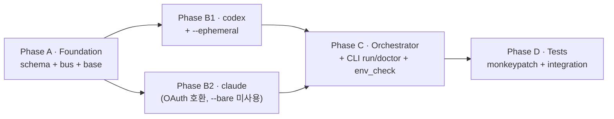

# Plan · run 모드 한 턴 E2E (Day 2 코어)

## 0. 메타

- **작업 ID**: `001-run-mode-core`
- **의도**: `dialectic run --task "..." --driver codex --reviewer claude --workdir <path> --max-turns 1` 한 턴 E2E. driver(codex) → reviewer(claude) → JSONL append + cwd 격리. 인터랙티브 UI·plan/implement·compare는 Day 3+.
- **관련 ADR / Q번호**:
  - ADR-1 (stateless, 풀 트랜스크립트 주입) — `docs/dev-docs/architecture.md` §6
  - ADR-2 (포지션·역할·벤더 3축 분리) — `docs/dev-docs/architecture.md` §6
  - ADR-6 (cwd 격리) — `docs/dev-docs/architecture.md` §6, `outline/01-harness-layers.md` §1.3
  - ADR-9 ([CONVERGED] streak K=2 자동 종료 + `--max-turns < K+1` 시 K=1 fallback) — `outline/02-communication.md` §2.9, `outline/04-requirements-and-modes.md` §4.5.1
  - Q1 stateless / Q11 cwd 격리 / Q12 4 모드 — `outline/README.md` §6
- **예상 영향 범위**:
  - 신규: `src/{schema,bus,orchestrator,env_check}.py`, `src/agents/{base,codex,claude}.py`, `tests/test_{schema,bus_append,cwd_isolation,cwd_isolation_integration}.py`
  - 변경: `src/cli.py` (stub → argparse `run`/`doctor` 서브커맨드), `docs/runtime-docs/protocol.md` §10 (codex `--ephemeral` 추가, claude `--append-system-prompt` 제거), `README.md` (status banner + 환경설정 섹션)
- **LOC 추정**: ~813 (Phase 합산: A 178 + B1 95 + B2 80 + C 295 + D 165). 순 신규 코드는 ~683. Phase A 175→178 — `Meta`에 `convergence_streak: int | None = None` 1 필드 추가 (outline/02 §2.9). Phase C 275→295 — outline/02 §2.9 `[CONVERGED]` 감지(`_detect_converged`) + `run_session` ADR-9 fallback + streak 누적 + `auto_end_converged` 분기 +15 LOC, cli `--convergence-streak`/`--interactive` 인자 2종 +5 LOC. Phase D ~75는 `protocol.md` §2/§4/§8/§10 + `code-conventions.md` §5 + `architecture.md` ADR-6 한 줄 + `README.md` + `pyproject.toml` + `.gitignore` — 코드 외.

---

## 1. AS-IS (현재 상태)

### 1.1 코드

- `src/__init__.py:1-6` — `__version__ = "0.1.0"`만.
- `src/cli.py:1-24` — print stub. argparse 미사용, `dialectic run` 인자 처리 없음.
- `src/agents/__init__.py:1-4` — docstring만, 어댑터 0개.
- `src/{schema,bus,orchestrator,env_check}.py`, `src/agents/{base,codex,claude}.py` 부재.
- `tests/` 디렉토리 — 기존 `tests/test_dev_skill_cli.py` 1개 존재 (Day 1 dev_skill_cli 보강 산출), `tests/__init__.py` 부재. 본 plan의 신규 5 파일(`test_schema/test_bus_append/test_cwd_isolation/test_cwd_isolation_integration/test_orchestrator_converge.py`)과 충돌 0. `pyproject.toml:30-32` `[tool.pytest.ini_options]` 설정 존재 (단 `addopts` 부재 — 본 plan에서 `markers` + `addopts` 둘 다 추가).

### 1.2 문서·계약 (이미 확정, 본 plan은 따름)

- 메시지 스키마 — `docs/runtime-docs/protocol.md` §2 (필드 1:1).
- AgentRunner Protocol — `protocol.md` §8, `docs/dev-docs/code-conventions.md` §5.
- subprocess 호출 규약 — `code-conventions.md` §3 (`shell=True` 금지, `cwd` 명시, `timeout=300`, env 화이트리스트).
- 호출 옵션 베이스라인 — `protocol.md` §10. 본 plan은 §10 기반 + 본 review에서 확인된 추가 옵션 박음.
- 4섹션 prompt — `protocol.md` §5.
- 모드↔role 매핑 — `protocol.md` §3 (`MODE_ROLES`).
- 턴 라이프사이클 — `protocol.md` §4.
- cwd 격리 메커니즘 — `outline/01-harness-layers.md` §1.3, `protocol.md` §7.
- 4 role 본문 — `docs/runtime-docs/roles/{implementer,spec-reviewer,planner,plan-reviewer}.md` 모두 존재.

### 1.3 review-plan에서 직접 검증한 CLI 사실 (1차 검증 완료)

| 항목 | 결과 |
|---|---|
| `claude --version` (`/home/sjw49/.local/bin/claude`) | ✓ `2.1.131 (Claude Code)` |
| `codex --version` (`/usr/local/bin/codex`) | ✓ `codex-cli 0.128.0` |
| `claude --tools "" --no-session-persistence --max-budget-usd --output-format json --append-system-prompt` | ✓ 모두 존재 |
| `claude --bare` (CLAUDE.md auto-discovery skip) | ✓ 존재. 단 OAuth/keychain 인증 거부 명세 — **본 plan 미사용 결정** (Max OAuth 비용 0 우선). Day 4 ADR-9 후보로 `disable_bare` 토글 + API key 사용자 대상 검증 deferred. |
| `claude auth status` 서브커맨드 | ✓ 존재 + 본 plan review에서 직접 `claude auth status` 호출 → JSON 출력 (`authMethod`/`subscriptionType`) 확인. 비용 0. |
| `claude doctor` 서브커맨드 | ✓ 존재 — auto-updater 점검, 비용 0 (env_check에 추가 가치) |
| `codex exec --json --sandbox read-only --skip-git-repo-check --ignore-rules` | ✓ 모두 존재 |
| `codex exec --ephemeral` (세션 디스크 저장 비활성) | ✓ 존재 — claude `--no-session-persistence` 대응 |
| `codex login status` 서브커맨드 | ✓ 존재 — 인증 상태 비용 0 점검 (서브에이전트 review에서 `login` 자식 `status` 확인) |
| `codex exec --json` 실 출력 이벤트 | ✓ `thread.started` / `turn.started` / `item.completed{text}` / `turn.completed{usage:{input_tokens, cached_input_tokens, output_tokens, reasoning_output_tokens}}` |
| codex JSON 이벤트의 `model` 필드 | **부재** — 어댑터에서 `meta.model = None` 고정 |

### 1.4 검증된 외부 사실 (`outline/README.md` §0)

- claude `-p --output-format json` 2.4s, $0.037, `session_id`·`total_cost_usd`·`usage.cache_*` 포함.
- codex `exec --json` 즉시 `thread.started` 이벤트 + `item.completed{text}` + `turn.completed{usage}`.

---

## 2. TO-BE (목표 상태)

### 2.1 모듈 (Phase별 상세는 phase 파일에)

| 파일 | 책임 | 담당 Phase |
|---|---|---|
| `src/schema.py` | `Message`·`Meta` dataclass (frozen, slots), `to_dict()`/`from_dict()`, 필드 1:1 protocol.md §2 | A |
| `src/bus.py` | `Bus` 클래스 — `append(msg)` 시 `f.flush()`, `read_all()`, append-only 인터페이스 (수정 API 노출 X) | A |
| `src/agents/base.py` | `AgentResponse` (frozen), `AgentRunner` Protocol (keyword-only `run`), `AgentAuthError` | A |
| `src/agents/codex.py` | `CodexRunner` — `codex exec --json --sandbox read-only --skip-git-repo-check --ignore-rules --ephemeral -`. `meta.model = None`, `thread_id` 캡처 | B1 |
| `src/agents/claude.py` | `ClaudeRunner` — `claude -p --tools "" --no-session-persistence --max-budget-usd 1.0 --output-format json`. `--bare` 미사용(OAuth 호환 우선), `--append-system-prompt` 제거(4섹션 prompt를 stdin 통째 전달). cwd 격리는 OS 차원(`cwd=workdir`)만. | B2 |
| `src/orchestrator.py` | `MODE_ROLES`, `build_prompt()`, `run_turn()`, `run_session(max_turns=1)` | C |
| `src/env_check.py` | `check_env()` — `claude --version`/`codex --version` + `claude auth status`/`codex login status` (인증 상태 dict 반환), 실 호출 비용 0 | C |
| `src/cli.py` (rewrite) | argparse subparsers — `run` (필수 wiring) + `doctor` (env_check 호출) | C |
| `tests/test_schema.py` | `Message` round-trip (to_dict → json → from_dict 동치) | D |
| `tests/test_bus_append.py` | append-only 인터페이스 검증 (수정 메서드 부재 reflection) | D |
| `tests/test_cwd_isolation.py` | monkeypatch — `subprocess.run` cwd 인자가 repo 루트가 아님 단언 | D |
| `tests/test_cwd_isolation_integration.py` | 실 호출 (`pytest -m integration`) — repo 루트에 sentinel 마커 작성 후 별도 임시 dir을 workdir로 호출, raw stream에 마커 0회 검증 (cwd 격리 단독 ADR-6 검증). Max OAuth 환경 비용 0. | D |

### 2.2 문서

- `docs/runtime-docs/protocol.md` 4 부분 갱신:
  - §2 (`:52-194`) — `Meta`에 `reasoning_output_tokens: int` + `convergence_streak: int | None = null` 필드 추가 (dataclass JSONC + classDiagram 둘 다) + `msg_id`/`parent_id` 예시를 sequence → uuid4 hex로 갱신.
  - §4 (`:212-231`) — 라이프사이클 mermaid R4 노드에서 `--append-system-prompt` 제거 (stdin 통째 전달로 변경).
  - §8 (`:302-326`) — `meta: dict` → `meta: Meta`, claude cmd_list `--append-system-prompt` 제거, codex cmd_list `--ephemeral` 추가.
  - §10 (`:342-355`) — codex `--ephemeral` 호출 옵션 안전성 설명. claude `--bare`는 미사용 명시 + Day 4 ADR-9 후보 deferred.
- `docs/dev-docs/code-conventions.md` §5 (`:81-119`) 갱신 — `AgentResponse.meta: dict` → `meta: Meta` 강타입화.
- `docs/dev-docs/architecture.md` ADR-6 (`:133`) 한 줄 보강 — codex `--ephemeral`이 cwd 격리(OS 차원) 보조 안전망. claude `--bare`는 OAuth/keychain 거부 명세로 본 plan 미사용, Day 4 ADR-9 후보로 `disable_bare` 토글 검토 deferred.
- `README.md` — status banner ("코드 미구현" → "run 모드 한 턴 E2E 동작"), 5초 데모 명령 갱신, 환경설정 섹션에 `dialectic doctor` 안내, "현재 동작 모드" 섹션 ("Day 2: run 모드만 정식 검증").
- `.gitignore` 한 줄 — `CLAUDE.md.test-marker` (시나리오 A sentinel 누수 차단).

### 2.3 비기능

- 외부 의존성 0 (`code-conventions.md` §2).
- subprocess 모두 §3 규약 준수.
- 한 턴 E2E latency: ~30s 이내 (강제 X).

---

## 3. Phase 인덱스

### 3.1 의존성 그래프

### 3.2 Phase 파일 경로

| Phase | 경로 | 의존 | 병렬 그룹 | LOC |
|---|---|---|---|---|
| A · Foundation | [phase-a-foundation.md](phase-a-foundation.md) | (없음) | — | ~178 |
| B1 · codex 어댑터 | [phase-b1-codex.md](phase-b1-codex.md) | A | B (B1·B2 병렬) | ~95 |
| B2 · claude 어댑터 | [phase-b2-claude.md](phase-b2-claude.md) | A | B (B1·B2 병렬) | ~80 |
| C · Orchestrator + CLI | [phase-c-orchestrator.md](phase-c-orchestrator.md) | B1, B2 | — | ~295 |
| D · Tests + Doc cross-check | [phase-d-tests.md](phase-d-tests.md) | C | — | ~165 |

---

## 4. 비기능 요구

- **외부 의존성**: 0 (표준 라이브러리만). 추가 시 ADR 필요 — 본 plan 범위에서 추가 없음.
- **보안**:
  - `shell=True` 금지 (review-code §안전성 P0).
  - 환경변수 화이트리스트 (auth 변수만).
  - 토큰을 로그·print에 노출 X.
  - 파일 I/O 경로는 `Path.resolve()` 후 사용.
- **재현성**: 모든 메시지 `meta.workdir` 기록.
- **정직성**: `meta.is_mock` 필수. 본 plan은 항상 `False`.
- **포맷**: 4-space indent, max 100, double quote.

---

## 5. 위험 (Phase 횡단)

1. **env 화이트리스트 누락 시 인증 실패** (P-CWD/P-LEAK) — `subprocess.run(env={...})`이 좁으면 OAuth 캐시 못 찾음. 1차 `PATH`·`HOME`·`USER`·`LANG`만, 실패하면 추가 변수 식별 후 phase 파일 갱신.
2. **`tempfile.mkdtemp` 미정리 누수** — orchestrator `run_session`이 `try/finally`로 임시 dir 정리. `--workdir` 명시 시 X.
3. **JSONL flush 정책** (P-JSONL) — `f.flush()`만 항상, `os.fsync()`는 본 plan 범위 밖 (`code-conventions.md` §4 "선택"). 향후 운영 데이터 critical 시 재검토.
4. **subprocess `cwd` 누락 위험** (P-CWD) — AgentRunner Protocol 시그니처에 `workdir: Path` keyword-only 강제 + 어댑터 본문 `cwd=workdir` 명시. test_cwd_isolation.py monkeypatch + integration 2단 검증.
5. **Phase B 진입 전 CLI 옵션 1차 검증** — review-plan에서 이미 완료(§1.3). Phase B 진입 시 재확인 X.
6. **빈 응답 / parse failure** (phase-b1 §6.2·§6.3, phase-b2 §6.3와 cross-link — 어댑터 한정 처리, 본 횡단 위험은 orchestrator 측 후속 처리만 다룸): **Day 2는 retry 생략, 즉시 `kind=error` 기록 후 턴 종료**. 한 턴 E2E minimum target이라 retry 가치 작음 + 자유 해석 차단. retry 1회 정책은 Day 3+ 인터랙티브 추가 시 사용자 directive 기반으로 재도입 검토.
7. **테스트 비용** — 단위 테스트는 monkeypatch (실 API 0회). integration 테스트는 `pytest -m integration` 별도 — 시나리오 A 단독 (시나리오 B는 phase-d §0/§3.4에서 제거 결정). Max OAuth 환경 비용 $0 (claude only).
8. **`compare` 모드 schema vs orchestrator 비대칭** (P-MODE) — `schema.Message.mode`는 `"compare"` 허용 (protocol.md §2와 1:1, Day 4 compare 서브커맨드 사용 예정), 본 plan의 `MODE_ROLES` dict는 `compare` 키 부재. **outline/02 §2.6에 따르면 `compare`는 메타 모드 — run/plan/implement 중 사용자 선택 + 매핑/모드 변종 N개를 병렬 실행. 따라서 `MODE_ROLES["compare"]` 키 부재는 의도된 설계** — Day 4에서 별도 dispatcher 함수가 selected sub-mode에 따라 `MODE_ROLES[selected]` 조회 후 N 병렬 실행 + `compare.md` 자동 생성. 본 plan 범위에서 cli `--mode choices`도 `compare` 미포함 → 도달 불가, 정합성 위반 0.
9. **A·B 두 층 횡단 영향 — commit 분리 강제** (P-LEAK) — 본 plan은 dev-time(A: `tests/`·`README.md`·`.gitignore`·`pyproject.toml`) + runtime(B: `src/agents/`·`src/orchestrator.py`·`docs/runtime-docs/protocol.md`·`docs/runtime-docs/roles/*.md` 매핑) 양층 영향. CLAUDE.md §3 Pre-5("두 층 모두 영향이면 한 commit에 묶지 말고 분리")에 따라 commit 단위 분리 필수 — Phase A·B·C 코드(B층 + 일부 A) ↔ Phase D `protocol.md`/`code-conventions.md`/`architecture.md` 갱신(Knowledge 계층 동기화) ↔ Phase D `README.md`/`pyproject.toml`/`.gitignore`(A층 dev-time 보강) 3 묶음 commit 분리 권고. `commit` 스킬 분류표가 1차 catch.

---

## 6. 완료 기준 (Definition of Done)

- [ ] **(Phase A)** `src/schema.py`·`src/bus.py`·`src/agents/base.py` 작성, import 성공, `Message` round-trip 동작.
- [ ] **(Phase B1)** `src/agents/codex.py` 작성. 짧은 prompt 1회 실 호출 — `AgentResponse.text` 비어 있지 않음, `meta.thread_id` 존재, `meta.model is None`, `meta.is_mock=False`.
- [ ] **(Phase B2)** `src/agents/claude.py` 작성. 짧은 prompt 1회 실 호출 — `AgentResponse.text` 비어 있지 않음, `meta.session_id` 존재, `meta.cost_usd` 캡처, `meta.is_mock=False`. Max OAuth 비용 0. **(cmd_list 단언 책임 분리)** `--bare`·`--append-system-prompt` 부재 + `--tools "" --no-session-persistence --max-budget-usd 1.0 --output-format json` 모두 박힘 검증은 **Phase D `tests/test_cwd_isolation.py` monkeypatch 단언이 담당** (B2는 코드 작성 + 실 호출 sanity check, D는 cmd_list 정확성 단언).
- [ ] **(Phase C)** `dialectic run --task "1+1=?" --workdir /tmp/test-run --driver codex --reviewer claude --max-turns 1 --mode run` exit 0. `<workdir>/logs/messages.jsonl` 4 라인 이상(task→proposal→critique→meta auto-end). 매 메시지 `msg_id`(uuid4) + `meta.is_mock=False` + `meta.workdir` 존재. `parent_id`는 task 메시지(turn_id=0)만 `None`, 그 외 모두 직전 메시지의 `msg_id` 가리킴 (DAG 무결성).
- [ ] **(Phase C)** `dialectic doctor` exit 0, claude/codex `--version` + `auth/login status` 결과 출력. 비용 0.
- [ ] **(Phase C)** `[CONVERGED]` 수렴 메커니즘 — reviewer 응답 마지막 줄이 `[CONVERGED]` 단독이면 `kind=critique, meta.convergence_streak=1` 기록 + `--convergence-streak` (default 2) 만큼 누적 시 `kind=meta, content="auto_end_converged", meta.convergence_streak=K` 한 줄 등장 후 max-turns 도달 전 early return (outline/02 §2.9, outline/04 §4.5.1). **검증 프로토콜**: Day 2 mock 어댑터 미구현이라 실 호출 reviewer가 우연히 [CONVERGED] 출력해야 통과 — 강제 검증 곤란. Day 2는 (a) `_detect_converged()` unit test (`tests/test_orchestrator_converge.py` — 모의 reviewer 응답 문자열로 binary 분기) + (b) ADR-9 fallback warning 검증으로 갈음. 실 호출 [CONVERGED] 검증은 Day 3+ mock 어댑터 도입 후 (mock 녹음에 마커 포함) 또는 task directive로 reviewer prompt에 "결함 없으면 마지막 줄에 [CONVERGED]만 출력" 강제 가능.
- [ ] **(Phase C)** ADR-9 fallback — `dialectic run --max-turns 1 --convergence-streak 2` (default) 호출 시 stderr에 `K reduced to 1 (ADR-9, outline/02 §2.9)` 경고 등장 + auto_end_converged가 streak=1 도달 시 정상 동작. `--convergence-streak 1`은 fallback path skip (degenerate guard).
- [ ] **(Phase D)** `pytest -q` 통과 (test_schema, test_bus_append, test_cwd_isolation 모두 pass).
- [ ] **(Phase D)** `pytest -m integration` 통과 — 시나리오 A(`test_cwd_isolation_adr6`: cwd 격리 단독 ADR-6 검증, repo 루트 마커가 임시 dir cwd에 흘러들지 않음) 1회. Max OAuth 환경 비용 $0. `--bare` 2층 검증은 Day 4 ADR-9 후보로 deferred.
- [ ] **(Phase D)** `docs/runtime-docs/protocol.md` §2/§4/§8/§10 + classDiagram 모두 갱신:
  - §2 (`:52-194`) — Meta dataclass JSONC `reasoning_output_tokens` + `convergence_streak` 2 필드 추가, msg_id 예시 uuid4 hex로 갱신.
  - §2 classDiagram Meta 블록 (`:132-145` — Message :117-130 혼동 차단) — `+int reasoning_output_tokens` + `+int? convergence_streak` 추가 (현재 12 → 14 필드).
  - §4 (`:212-231`) — 라이프사이클 mermaid R4 노드 (`:221`) `--append-system-prompt` 제거 (stdin 통째 전달).
  - §8 (`:302-326`) — `meta: dict→Meta` (`:310`), claude cmd_list (`:320`)·codex cmd_list (`:319`) 동기화.
  - §10 (`:342-355`) — claude `--append-system-prompt` 제거 + `--bare` 미사용 명시, codex `--ephemeral` 추가.
- [ ] **(Phase D)** `docs/dev-docs/code-conventions.md` §5 (`:81-119`) 갱신 — `AgentResponse.meta: dict→Meta` 강타입화 (`:94`) + `:114` 본문 정정 (`meta["error"]` 인덱싱 → `text=""` + orchestrator 분기).
- [ ] **(Phase D)** `docs/dev-docs/architecture.md` ADR-6 (`:133`) + ADR-9 본문 보강 — codex `--ephemeral` cwd 격리 보조 안전망 + `[CONVERGED]` streak K=2 + max-turns < K+1 fallback.
- [ ] **(Phase D)** `README.md` status banner + 환경설정 섹션 갱신.
- [ ] (전체) Day 2 운영 중 발견된 결함 패턴 → `docs/dev-docs/validation.md`에 환원. 발견 0이면 "Day 2 — 환원 항목 0" 한 줄 명시 (4계층 Validation narrative 완결성).
- [ ] (전체) `outline/05-timeline.md` Day 2 자기 검증 섹션 한 줄 갱신 — `dialectic run --max-turns 1` E2E 동작 narrative (4계층 Validation 자체 Day 2 분기). 갱신 X로 결정 시 commit message에 사유 명시.
- [ ] (전체) `sync-docs` 호출 → Documentation-Checklist §1.1 매핑 누락 0.
- [ ] (전체) `review-code` 호출 → 안전성·인터페이스·컨벤션 P0 = 0.
- [ ] (전체) `commit` 스킬로 의미 단위 ~5 commit 사용자 승인 후 푸시.

minimum cut: 시간 부족 시 Phase B1(codex)을 Day 3로 미루고 claude 단일 어댑터로 한 턴 E2E. dialectic 내러티브 약화하지만 메커니즘 검증 100%.

---

## 7. 참조 .md

- `docs/runtime-docs/protocol.md` §2 (스키마), §3 (MODE_ROLES), §4 (라이프사이클), §5 (4섹션), §7 (cwd), §8 (어댑터), §10 (호출 옵션 — 본 plan에서 갱신).
- `docs/dev-docs/code-conventions.md` §2 (외부 의존성 0), §3 (subprocess), §4 (JSONL), §5 (어댑터), §9 (테스트).
- `outline/01-harness-layers.md` §1.3 (cwd 격리), §1.4 (4 role 셀프체크 — 본 plan은 prompt 빌드만, role.md 변경 X).
- `docs/dev-docs/Checklists/review-code-checklist.md` (Phase D 검증 시).
- `docs/dev-docs/Documentation-Checklist.md` §1.1 / §1.2 (sync-docs 시).
