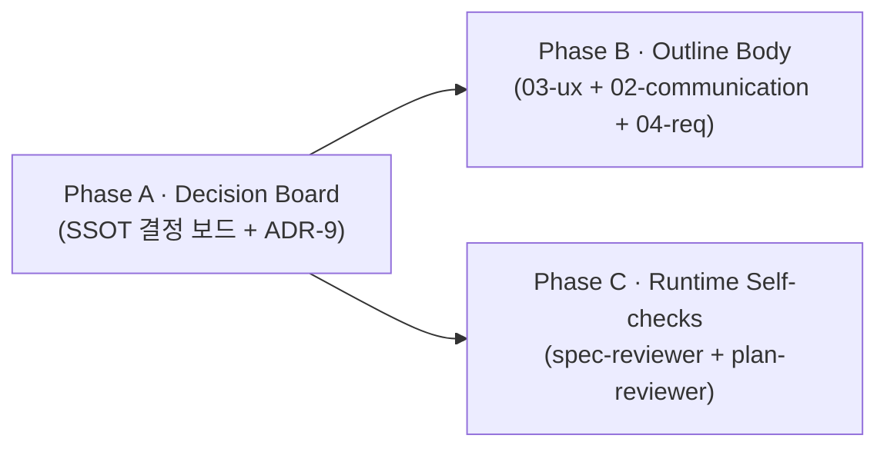

# Plan · 사용자 개입 default 재설계 + 수렴 종료

## 0. 메타

- 작업 ID: `002-interactive-default-convergence`
- 의도: 매 턴 사용자 개입 강제(피로감 원인) → `critical` default + 연속 K턴 [CONVERGED] 자동 종료. thesis "사용자 = synthesis 생성자"는 **개입 권한**으로 재정의 (개입 빈도 ≠ thesis).
- 관련 ADR / Q번호:
  - 신설 **ADR-9** (interactive critical + convergence 종료, `docs/dev-docs/architecture.md` §6 표에 추가)
  - **Q6** 확정 (a/b/c 보류 → b 우선, `outline/README.md` line 53)
  - **Q18** 신설 (interactive default = critical, P1 threshold)
- 예상 영향 범위: outline 4 파일 + runtime roles 2 파일 + architecture.md 1 파일 = **7 파일**
- LOC 추정: 약 ~130 (대부분 narrative .md, 코드 0)

## 1. AS-IS (현재 상태)

### 1.1 사용자 개입 default — 매 턴 강제

`outline/03-ux.md` §3.3 (line 227-242): 매 턴 끝 6지선다(a/r/m/i/e/s) + free-text directive **강제**. Enter-default 동작 부재. 모든 결정이 명시적 keystroke 필요.

`outline/03-ux.md` §3.1 (line 36-54): CLI 인자에 `--max-turns` 정의됨. 그러나 interactive 강도 dial 플래그 없음. 비대화형은 `--non-interactive --decisions <list>`로만 가능 (전부/전무 두 극단).

### 1.2 종료 조건 — 보류 상태

`outline/README.md` line 53:
```
🟡 Q6  종료 조건 = Day 2 첫 E2E 후 결정 (a/b/c 셋 다 권고)
```
세 후보(a=`--max-turns`, b=reviewer "no critique", c=사용자 `e`)가 모두 권고로만 남음. **수렴 의미 정의 부재**.

`outline/04-requirements-and-modes.md` line 189: "종료: `e` 키 / `--max-turns` 도달 / reviewer "no critique" (Q6 결정)". "no critique"의 자동 시그널 메커니즘이 protocol에 없음 — reviewer 출력 형식에 마커 약속 부재.

### 1.3 Q18 부재

`outline/README.md` §6 결정 보드는 Q1~Q17까지만. interactive 강도 결정 항목 없음.

### 1.4 reviewer 출력 형식 — CONVERGED 마커 부재

`docs/runtime-docs/roles/spec-reviewer.md` line 36-63: 출력 형식이 P0/P1/P2/Cross-vendor/질문 5섹션. **수렴 시그널 마커 없음**. 셀프체크(line 69-78)에도 "P0/P1=0이면 어떻게 표시할지" 항목 없음.

`docs/runtime-docs/roles/plan-reviewer.md` line 36-69: 동일 — 출력 형식 + 셀프체크에 수렴 시그널 부재.

### 1.5 fix-induced regression 검증 부재

driver가 P0 수정 → 새 P0/P1 도입 가능. 그러나 reviewer 셀프체크(spec-reviewer line 71: "task/spec 각 요구사항을 코드의 어느 줄이 만족하는지 짚었는가")에 **"직전 턴 driver fix가 새 결함 도입했는지" 검증 항목 없음**. 즉 "regression 검증" 책임이 ROLE에 명시 안 됨.

### 1.6 architecture.md ADR 표

`docs/dev-docs/architecture.md` §6 (line 122-137): ADR-1~ADR-8 정의됨. 사용자 개입 정책 / 수렴 종료 관련 ADR 부재.

## 2. TO-BE (목표 상태)

### 2.1 새 default 동작 (CLI/UX 층위)

| 항목 | 값 |
|---|---|
| `--interactive` 플래그 | `full` / `critical` (default) / `end-only` 3 단계 dial |
| Enter 단독 입력 | `iterate` + 빈 directive (default 동작) |
| `critical` 모드 | reviewer가 P0 또는 P1 발견 시만 사용자 prompt. P2만 또는 0 → 자동 다음 턴 |
| `end-only` 모드 | max-turns까지 자동 진행, 마지막 SYNTHESIS만 prompt (compare 모드와 동치 인터페이스) |
| Ctrl-C / 사용자 `e` | 항상 작동 (수동 개입권 유지) |

### 2.2 수렴 종료 조건

| 항목 | 값 |
|---|---|
| 마커 | reviewer 응답 끝에 `[CONVERGED]` 출력 (P0/P1=0일 때만) |
| 종료 조건 | 연속 **K=2턴** 동안 `[CONVERGED]` 마커 → 자동 e |
| 카운터 reset | 한 턴이라도 P0/P1 등장 시 streak 초기화 |
| 플래그 | `--convergence-streak <int>` (default 2, 1 또는 3 조정 가능) |
| 안전망 | a (`--max-turns`) · c (사용자 `e` / Ctrl-C) 항상 유효 |
| 메시지 스키마 | reviewer kind=critique 메시지 meta에 `convergence_streak: <int>` 옵션 필드 |

### 2.3 reviewer ROLE 책임 확장

- **출력 형식**: P0/P1/P2 모두 0이면 응답 끝에 `[CONVERGED]` 한 줄 출력. 그 외 출력 안 함.
- **셀프체크 항목 추가**:
  - "직전 턴 driver fix가 새 P0/P1을 도입했는지 명시 검사" (regression check)
  - "P0/P1=0이고 P2만이거나 모두 0이면 응답 끝에 `[CONVERGED]` 마커 출력"

### 2.4 결정 보드 / ADR 갱신

- `outline/README.md` §6: Q6 = ✅ b 확정 + Q18 ✅ 신설 라인 추가
- `docs/dev-docs/architecture.md` §6: ADR-9 (interactive critical default + K턴 수렴 종료) 한 행 추가

### 2.5 narrative 일관성

- `outline/03-ux.md` §3.1·§3.2·§3.3 — `--interactive` 플래그 명세, Enter=iterate 명시, critical 모드 흐름 다이어그램 추가, 6지선다 표 위에 "default 동작" 박스
- `outline/02-communication.md` §2.3 턴 라이프사이클 — "수렴 카운터 체크 → critical 분기" 단계 추가, §2.8 실패/제어 모드 표에 "수렴 카운터 reset" 행 추가
- `outline/04-requirements-and-modes.md` §4.1 #2 — "사용자 개입·관찰 가능" → "사용자 개입 가능 (강도는 `--interactive`로 조정)"으로 재서술. §4.5.1 종료 조건 = "연속 K=2턴 P0/P1=0 또는 사용자 e 또는 max-turns" 명시

## 3. Phase 인덱스

### 3.1 의존성 그래프



A가 source of truth (결정 보드 + ADR). B·C는 A를 인용하여 본문 채움. B와 C는 의존성 없어 병렬.

### 3.2 Phase 파일 경로

| Phase | 경로 | 의존 | 병렬 그룹 |
|---|---|---|---|
| A · Decision Board | [phase-a-decision-board.md](phase-a-decision-board.md) | (없음) | — |
| B · Outline Body | [phase-b-outline-body.md](phase-b-outline-body.md) | A | B (B·C 병렬) |
| C · Runtime Self-checks | [phase-c-runtime-self-checks.md](phase-c-runtime-self-checks.md) | A | C (B·C 병렬) |

## 4. 비기능 요구

- **코드 블록 라벨 컨벤션** (plan-writing-guide.md §3.1 보강 — guide는 python `# paste`만 정의, 본 plan은 narrative .md plan이라 펜스 종류별 보강):
  - 빈 펜스 (` ``` `) / `markdown` 펜스: 펜스 직후 첫 줄 `<!-- paste -->` (HTML 주석, markdown 렌더러에서 메타로 인식)
  - `mermaid` 펜스: 펜스 직후 첫 줄 `%% paste` (mermaid 주석 형식, 파서 호환)
  - paste 시 라벨 줄은 제외하고 본문만 .md에 복사
  - guide §3.1 자체 갱신은 별도 plan 영역
- **외부 의존성 0**: 본 plan은 .md narrative만 변경. 코드 LOC 0. 추가 패키지 없음.
- **Documentation-Checklist 준수**: 본 plan 종료 시 sync-docs 호출 필수 — outline ↔ runtime-docs/protocol.md ↔ roles/*.md 일관 검증.
- **commit 분리**: Phase별 1 commit (3 commit). 의미 단위 — Phase A는 "결정 보드", Phase B는 "outline 본문 반영", Phase C는 "role 셀프체크".
- **CLAUDE.md ↔ AGENTS.md 동기화 점검**: 본 plan은 두 진입점 자체는 안 건드리나, Post-Implementation §4 절차 준수.

## 5. 위험 (Phase 횡단)

| 위험 | 원인 | 차단 |
|---|---|---|
| **결정 보드와 outline 본문 불일치** | Phase A·B를 분리해서 작성 시 표현 다를 수 있음 | Phase B 작업 단위에 "Phase A 결과(README.md Q6/Q18 라인) 직접 인용" 명시 |
| **수렴 카운터 의미 혼동** | "P2만이면 streak 유지인가 reset인가" 모호 | Phase A에 SSOT 정의 (P0/P1=0이면 streak++, P0/P1≥1이면 reset 0) |
| **reviewer 출력 형식 깨짐** | `[CONVERGED]` 마커가 기존 5섹션과 충돌 | Phase C에 "마커는 별도 줄, P 섹션과 분리. P2만이거나 0개면 마커만, P0/P1 있으면 마커 없음" 명시 |
| **fix-induced regression 검증 부담↑** | reviewer가 매 턴 직전 fix까지 검토 → 응답 비대 | 1500자 한도 유지 (기존 셀프체크). regression 항목은 P0/P1 발견 시 인용으로만 (별도 섹션 X) |
| **--interactive=end-only가 compare와 중복?** | end-only는 비대화형, compare도 비대화형 | Phase B §3.1·§3.2에 "compare는 항상 비대화형 별도 서브커맨드, run/plan/implement는 `--interactive end-only`로 동등 효과" 명시. 중복이 아니라 직교 |
| **K=2 default가 max-turns 5와 비례 부적절** | max-turns 5에서 K=2면 사실상 fix 후 1턴만 verify | `--max-turns < --convergence-streak + 1`이면 K=1로 자동 fallback + stderr 경고 (Patch 5, ADR-9 갱신본). README 예시에 K·max-turns 관계 짧게 |
| **기존 mock 녹음 자산이 [CONVERGED] 마커 부재로 자동 종료 미작동** | mock 모드의 reviewer 응답이 사전 녹음에서 그대로 재생됨. 마커 없으면 K턴 streak 도달 못 함 | 본 plan 시점에는 mock recordings 부재 (Day 4 wave_difficulty 녹음 시 작성). Day 4 녹음은 갱신된 ROLE 사용하므로 마커 자동 포함 — 본 plan은 narrative만 갱신, 후속 녹음 작업의 의존 사항 |
| **outline narrative와 실제 코드 동작 갭** | 본 plan은 명세만 변경, --interactive 플래그·수렴 카운터·`[CONVERGED]` 정규식 매칭은 실 코드 부재 | 본 plan은 명세 SSOT. 후속 코드 plan(`<후속-plan-id>` (가칭, ID는 작성 시점에 할당 — `plan/` 폴더 충돌 검사 필수) 가칭, Day 3 `src/ui.py` + `src/cli.py`)에서 wiring. outline 본문에 "(코드 wiring은 후속 plan)" 한 줄 명시 |

## 6. 완료 기준 (Definition of Done)

- [ ] (Phase A) `outline/README.md` §6에 Q6=✅b, Q18=✅critical 라인 정확히 추가
- [ ] (Phase A) `docs/dev-docs/architecture.md` §6 표에 ADR-9 행 추가 (결정·이유·거부 대안)
- [ ] (Phase B) `outline/03-ux.md` §3.1에 `--interactive {full,critical,end-only}` 플래그 명세
- [ ] (Phase B) `outline/03-ux.md` §3.3에 Enter=iterate default 박스 + critical 흐름 다이어그램
- [ ] (Phase B) `outline/02-communication.md` §2.3 턴 라이프사이클 mermaid에 "수렴 카운터 체크" 노드 추가
- [ ] (Phase B) `outline/02-communication.md` §2.8 부근에 `[CONVERGED]` 마커 정의 박스
- [ ] (Phase B) `outline/04-requirements-and-modes.md` §4.1 #2 + §4.5.1 종료 조건 재서술
- [ ] (Phase C) `docs/runtime-docs/roles/spec-reviewer.md` 출력 형식에 `[CONVERGED]` 약속 + 셀프체크 2항목 추가
- [ ] (Phase C) `docs/runtime-docs/roles/plan-reviewer.md` 동일 갱신
- [ ] sync-docs 호출 — Documentation-Checklist 매핑상 누락 0
- [ ] CLAUDE.md ↔ AGENTS.md 동기화 점검 (본 plan은 직접 변경 X지만 절차 준수)
- [ ] (Phase A) `docs/dev-docs/Documentation-Checklist.md` §1.7에 신규 행 3개 추가 (interactive default Q18 / [CONVERGED] 마커 ADR-9 / ADR 추가)

## 7. 참조 .md

- `docs/dev-docs/Plans/plan-writing-guide.md` — 본 plan 형식 SSOT
- `docs/dev-docs/Documentation-Checklist.md` — Phase 종료 시 sync-docs 매핑
- `docs/dev-docs/architecture.md` §6 — ADR 추가 자리
- `docs/runtime-docs/protocol.md` — reviewer 출력 형식 인용 영향 (Phase C 작업 시 cross-check)
- `outline/01-harness-layers.md` §1.4 — role 셀프체크 인용. Phase C에서 이 섹션도 동기화할지 검토
- 후속 의존 plan: `<후속-plan-id>` (가칭, ID는 작성 시점에 할당 — `plan/` 폴더 충돌 검사 필수) (가칭, Day 3 `src/ui.py` + `src/cli.py` 본격 wiring) — 본 plan의 narrative SSOT를 실제 코드로 옮김. 본 plan 종료 시점에는 outline-code 갭 존재 (Patch 4 위험 명시)
