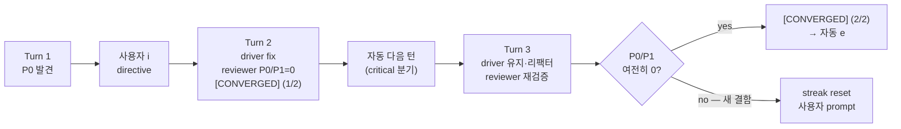
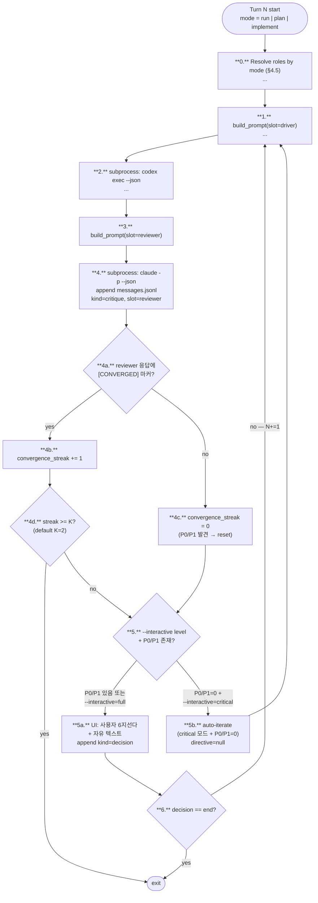

# Phase B · Outline Body — 002-interactive-default-convergence

## 0. 메타

- Phase ID: B
- 소속 plan: [00-plan.md](00-plan.md)
- 의존 Phase: A (결정 보드 SSOT 인용)
- 병렬 그룹: B (C와 병렬 가능)
- 예상 LOC: ~80 (.md narrative, 3 파일 분산)

## 1. 목표

Phase A에서 확정된 Q6/Q18/ADR-9를 outline 본문 3개 파일에 narrative로 풀어 쓴다. 사용자 개입 흐름·수렴 종료 메커니즘·요구사항 충족 방식을 일관되게 갱신.

## 2. 입력

- Phase A 산출:
  - `outline/README.md` Q6 ✅ 확정 라인, Q18 ✅ 신설 라인
  - `docs/dev-docs/architecture.md` ADR-9 행
- 현 outline 본문 위치:
  - `outline/03-ux.md` §3.1 (line 3-89), §3.2 (line 91-225), §3.3 (line 227-242)
  - `outline/02-communication.md` §2.3 (line 82-99), §2.8 (line 204-214)
  - `outline/04-requirements-and-modes.md` §4.1 (line 7-13), §4.5.1 (line 178-192)
- 참조: `docs/dev-docs/Plans/plan-writing-guide.md` §1.1 mermaid (.md 문서는 mermaid 유지)

## 3. 출력

### 3.1 `outline/03-ux.md` 변경

#### §3.1 (실행 흐름) — 진입로 1·2 양쪽에 `--interactive` 플래그 명시

`line 32-34` "인자 일부만 줘도 OK" 블록 다음에 **`--interactive {full,critical,end-only}` 플래그 추가 명시** (default critical). `line 38-42` CLI 예시에 `--interactive critical` 추가 또는 default 동작이라 생략됨을 한 줄 주석.

`line 56` "비대화형 강제" 단락 다음에 한 단락 추가:
```
<!-- paste -->
**개입 강도 dial** (`--interactive`):
- `full`: 매 턴 6지선다 강제 (기존)
- `critical` (default): reviewer가 P0/P1 발견 시만 prompt. P2만이거나 0이면 자동 다음 턴
- `end-only`: max-turns까지 자동, 마지막 SYNTHESIS만 prompt (compare와 동치 인터페이스)
Ctrl-C는 항상 작동 — 자동 진행 중 언제든 깨어나 결정 가능.
```

#### §3.2 (화면 구성) — 단계 5 턴 진행 흐름에 critical 분기

`line 200-211` (User Synthesis 블록) 다음에 critical 모드 흐름 추가 — reviewer P0/P1=0이면 prompt 없이 다음 턴 진행하는 화면 예시:

```
<!-- paste -->
[기획 검토자: Claude Code] ✓ 9.8s · 50 out / 1.2k in
─────────────────────────────────────────────────────────────────
P0: (없음)
P1: (없음)
P2: 매직 넘버 250 — 상수화 권고

[CONVERGED] (streak 1/2)
─────────────────────────────────────────────────────────────────
auto → Turn 2/5  (critical mode, P0/P1=0이라 prompt 생략. 'q' 또는 Ctrl-C로 개입)
```

#### §3.3 (사용자 개입) — Enter default + 수렴 흐름 다이어그램

`line 229` "매 턴 끝에 6지선다" → "**default = critical 모드: reviewer가 P0/P1 발견 시만 prompt. 그 외 자동 다음 턴.** prompt 시 6지선다 + 자유 텍스트 directive (라벨은 포지션 기준이라 모드 무관)"로 재서술.

`line 240` "directive: 1줄 단답" 다음에 **Enter default 동작 박스** 추가:
```
<!-- paste -->
**Enter (default)**: `iterate` + 빈 directive — driver/reviewer가 자율로 다음 턴 진행 (사용자 직권 지시 없음). 6지선다 중 다른 결정 원할 때만 명시 키 입력.
```

`line 242` 다음에 **수렴 종료 다이어그램** 추가 (mermaid):


핵심 캡션: "**연속 K=2턴 [CONVERGED]** = 안정 수렴. 한 번이라도 P0/P1 등장 시 streak reset (fix-induced regression 차단)."

`line 242` 비대화형 모드 단락 직전에 `--convergence-streak <int>` 플래그 한 줄 추가 (default 2).

### 3.2 `outline/02-communication.md` 변경

#### §2.3 (턴 라이프사이클) — 수렴 카운터 분기 추가

`line 84-99` mermaid 흐름도에 `R5` (사용자 6지선다) **이전**에 카운터 분기 노드 삽입:



#### §2.8 (실패 모드) 부근 — `[CONVERGED]` 마커 정의 박스

`line 213` 표 마지막 행 다음에 새 §2.9 절 추가 (또는 §2.8 하위 박스):

```markdown
<!-- paste -->
## 2.9 수렴 마커 — [CONVERGED]

reviewer가 P0/P1=0 (또는 P2만)일 때 응답 끝에 `[CONVERGED]` 한 줄 마커 출력. orchestrator가 정규식 `^\[CONVERGED\]$`로 감지.

- **카운터**: 마커 등장 시 `convergence_streak += 1`. 한 턴이라도 P0/P1 발견 시 0 reset.
- **종료**: streak ≥ K (default K=2, `--convergence-streak`로 조정) → `kind=meta, content="auto_end_converged"` 메시지 append 후 종료.
- **fix-induced regression 차단**: K=1이면 driver가 P0 fix → 새 P0 도입을 못 봄. K=2가 fix→verify 1 사이클 보장.
- **메시지 스키마 영향**: `kind=critique` 메시지 `meta`에 `convergence_streak: <int>` 옵션 필드 추가 (디버깅·재현용). 필수 X — 없으면 0 가정.
- **auto-iterate 시 JSONL 처리**: critical 모드에서 P0/P1=0이라 사용자 prompt 생략 시, **`kind=decision` 메시지는 append 안 함** (사용자 결정 부재 = 결정 메시지 부재). 카운터 흔적은 `kind=critique`의 `meta.convergence_streak`에만. 자동 종료 시점에만 `kind=meta, content="auto_end_converged", meta.streak=K` 메시지 1행 append. 디버깅·재현 가능.
- **경계 케이스**: `--max-turns < --convergence-streak + 1` 시작 시 K=1로 자동 fallback + stderr 경고 ("K reduced to 1: max-turns too low"). ADR-9 참조.
```

### 3.3 `outline/04-requirements-and-modes.md` 변경

#### §4.1 #2 — 요구사항 충족 방식 재서술

`line 9` (요구사항 #2 행) 갱신:

```
<!-- paste -->
| 2 | 사용자 개입·관찰 가능 | 매 턴 6지선다 + directive(개입, `--interactive` 강도 dial). 실시간 화면 + `dialectic logs --follow`(관찰). default = critical 모드 — P0/P1 발견 시만 prompt, 사용자가 항상 `e`/Ctrl-C로 끼어들기 가능 | `kind=decision` 메시지 + reviewer `[CONVERGED]` 마커 |
```

#### §4.5.1 (run 모드) — 종료 조건 확정

`line 189` 행 갱신:

```
<!-- paste -->
| 종료 | `e` 키 / `--max-turns` 도달 / **연속 K=2턴 P0/P1=0 + [CONVERGED]** (Q6 = b 확정, default K=2, `--convergence-streak`로 조정) |
```

`line 189` 다음 한 줄 추가:
```
<!-- paste -->
"no critique" 자동 종료의 안전 마진 = K턴 streak. 단발 마커는 fix-induced regression을 못 봐 종료 조건 부적합 (ADR-9 참조).
```

#### §4.5.4 (compare 모드) — 한 줄만 추가

`line 274` "인터랙티브 안 함 — `--decisions`/`--directives`..." 다음에 한 줄:
```
<!-- paste -->
- compare는 `--interactive=end-only`와 의도 동등 (둘 다 비대화형). compare는 N config 병렬 + 메타 분석이 본질, end-only는 단일 run의 비대화형. 직교.
```

## 4. 작업 단위

> **anchor 원칙**: 줄 번호 직접 인용 X. grep 키워드 + 위치 한정자(직전/직후/단락 다음 등)로 위치 명시.

- [ ] `outline/03-ux.md` §3.1 "인자 일부만 줘도 OK" 단락 다음 (CLI 예시 코드 블록 직전)에 `--interactive` 플래그 명세 추가
- [ ] `outline/03-ux.md` §3.1 "비대화형 강제" 단락 다음에 개입 강도 dial 단락 추가
- [ ] `outline/03-ux.md` §3.2 "User Synthesis · Turn 1" 블록 다음(`Turn 2/5 ...` 직전)에 critical 모드 화면 예시 추가
- [ ] `outline/03-ux.md` §3.3 6지선다 도입 문장(`grep "매 턴 끝에 6지선다"`) 재서술 (default critical 명시)
- [ ] `outline/03-ux.md` §3.3 "directive: 1줄 단답" 단락 다음에 Enter=default 박스
- [ ] `outline/03-ux.md` §3.3 "비대화형 모드" 단락 직전에 수렴 종료 mermaid + 캡션 + `--convergence-streak` 플래그 단락
- [ ] `outline/03-ux.md` §3.1 갱신 본문 안에 한 줄 명시: "**플래그 충돌 시 우선순위**: `--non-interactive`가 `--interactive`보다 우선 (compare/end-only/critical 모두 비대화형으로 강제)"
- [ ] `outline/03-ux.md` §3.3 (또는 §3.1 어느 한 곳) 한 줄 명시: "(코드 wiring은 후속 plan, ID는 작성 시점 할당)" — outline-code 갭 표시
- [ ] `outline/02-communication.md` §2.3 turn lifecycle mermaid 블록 전체 교체 (R0~R6 + R4a/R4b/R4c/R4d/R5/R5a/R5b 추가)
- [ ] `outline/02-communication.md` §2.8 표 마지막 행("MAX_BUDGET 초과") 다음에 §2.9 [CONVERGED] 마커 정의 절 신설
- [ ] `outline/04-requirements-and-modes.md` §4.1 #2 행(`grep "사용자 개입·관찰 가능"`) 전체 갱신
- [ ] `outline/04-requirements-and-modes.md` §4.5.1 종료 행(`grep "^| 종료"`) 갱신 + 안전 마진 한 줄
- [ ] `outline/04-requirements-and-modes.md` §4.5.1 한 줄 추가: "(안전 마진은 K턴 streak. 단발 마커는 fix-induced regression을 못 봐 부적합 — ADR-9 참조). **`--max-turns < K+1`이면 K=1 자동 fallback** (Patch 5)."
- [ ] `outline/04-requirements-and-modes.md` §4.5.4 안전장치 마지막 항목(`grep "인터랙티브 안 함"`) 다음 줄에 compare ↔ end-only 직교 한 줄 추가

## 5. 검증

- `grep -n "interactive" outline/03-ux.md`: 최소 5행 (플래그 명세, 강도 dial, default critical, 화면 예시 등)
- `grep -n "CONVERGED" outline/02-communication.md outline/03-ux.md outline/04-requirements-and-modes.md`: 각 파일 ≥ 1행
- `grep -n "convergence_streak\|--convergence-streak" outline/03-ux.md outline/02-communication.md`: ≥ 2행
- mermaid 블록 syntax 검증 — 각 파일 ` ```mermaid ` 시작·끝 짝수
- Phase A 결과 인용: §3 본문에 "Q6=b 확정", "Q18=critical", "ADR-9" 인용 흔적 ≥ 3회
- 작업 후 `git diff --stat outline/` = 3 파일 변경 (01-, 05-는 손대지 않음)

## 6. 엣지케이스 / 위험 (Phase 한정)

| 위험 | 차단 |
|---|---|
| §2.3 mermaid 노드 너무 많아짐 (R4a~R5b 6개 추가) → 가독성↓ | 한 단계에 한 책임만. R4a/b/c/d는 카운터 로직, R5a/b는 분기. 색은 안 씀 (mermaid default) |
| 사용자가 `--interactive=critical`인데 `--non-interactive --decisions` 동시 지정 시? | §3.1 단락에 "충돌 시 `--non-interactive` 우선" 한 줄 명시 |
| `[CONVERGED]` 마커가 reviewer 본문에 우연히 등장 (예: "스레드가 [CONVERGED]됐다") | §2.9에 정규식 `^\[CONVERGED\]$` (단독 한 줄) 명시. 본문 인용 차단 |
| critical 화면 예시(§3.2)가 line 200-211 ANSI 색 의도와 충돌? | "auto → Turn 2/5" 한 줄만 추가. 색 정의 영향 X |
| §3.3 6지선다 표(line 231-238)와 default Enter 박스 정렬 깨짐 | 표는 그대로 유지. Enter 박스는 표 위에 별도 단락 |
| §4.5.1 종료 조건 갱신이 §4.5.2/4.5.3/4.5.4에도 영향? | run·implement·plan 모두 동일 K턴 종료 적용. plan 모드는 마커 의미가 "spec 수렴"으로 약간 다름 — Phase C plan-reviewer.md에서 별도 처리 |
