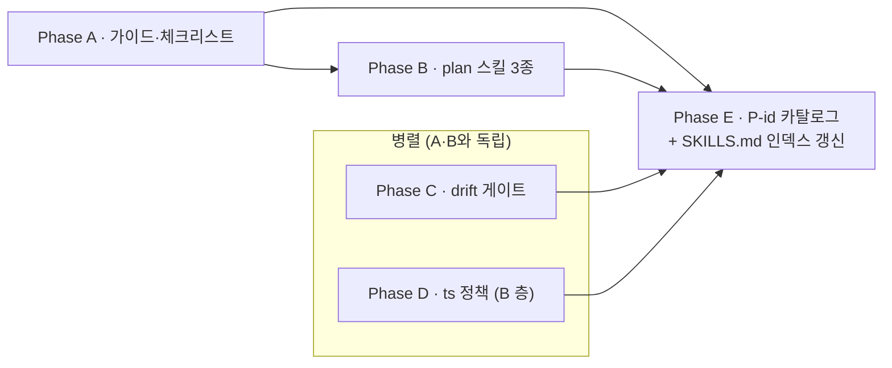

# Plan · workflow-rigor (4 도메인 자유도 누수 차단)

## 0. 메타

- 작업 ID: `003-workflow-rigor`
- 의도: dev-time 워크플로우 4 지점에서 발생하는 **자유도 누수**를 결정적으로 차단. 각 항목은 "보고는 하지만 강제 안 함" 또는 "의도 모호" 패턴을 묶어 결정적 동작으로 환원.
- 관련 ADR / Q번호:
  - **ADR-1** (JSONL bus, `architecture.md:128`) — Phase D ts 정책 근거
  - **ADR-6** (cwd 격리, `architecture.md:133`) / **Q11** (`outline/README.md:58`) — Phase E P-LEAK 패턴 근거
  - ADR-2·3·5 — Phase E P-VENDOR / P-MODE / P-MOCK 패턴 근거
- 예상 영향 범위 (총 15 .md, **A 층 14 + B 층 1**, 코드 변경 0):
  - **B 층 (runtime)** — Phase D commit 2 단독 (CLAUDE.md `:77-79` "두 층 모두 영향이면 commit 분리"):
    - `docs/runtime-docs/protocol.md` (§2 ts 정책 단락 추가)
  - **A 층 (dev-time)** — Phase A·B·C·E commit 1 통합 (Phase D의 Documentation-Checklist 매핑 한정 갱신도 commit 1에 포함):
    - `docs/dev-docs/Plans/plan-writing-guide.md` (§3 + §5)
    - `docs/dev-docs/Checklists/review-plan-checklist.md` (§1.3 + §2)
    - `docs/dev-docs/Checklists/review-code-checklist.md` (§환원 부분)
    - `docs/dev-docs/validation.md` (§4.4)
    - `docs/dev-docs/Documentation-Checklist.md` (§1.2 매핑 한정 — Phase D §3.2 작업, 00-plan.md §5.3a 참조)
    - `.claude/skills/create-plan/SKILL.md`
    - `.claude/skills/review-plan/SKILL.md`
    - `.claude/skills/execute-plan/SKILL.md`
    - `.claude/skills/sync-docs/SKILL.md`
    - `.claude/skills/commit/SKILL.md`
    - `.claude/skills/review-code/SKILL.md`
    - `.claude/skills/SKILLS.md` (인덱스 한 줄 설명 갱신 — `Documentation-Checklist.md:50` 매핑 정합)
    - `CLAUDE.md` (§4 sync-docs 강제 표현)
    - `AGENTS.md` (CLAUDE.md 동기화, `:193`)
- LOC 추정: ~60 LOC (markdown 본문 추가, 코드 변경 0)

## 1. AS-IS (현재 상태)

### 1.1 spec/paste 라벨 부재 (A 도메인)

`docs/dev-docs/Plans/plan-writing-guide.md:113-168` §3 phase 형식이 phase 파일 §3(출력) 예시로 코드 블록을 보여주지만, 코드 블록의 의도가 "그대로 paste" 인지 "시그니처 명세 (자유 해석)" 인지 라벨 부재.

기존 plan `plan/001-run-mode-core/`의 phase 파일에 코드 블록 19개:
- `phase-c-orchestrator.md` 7개 — `MODE_ROLES = {...}`(그대로 paste 의도) vs `def _msg(...)`(시그니처+docstring 명세) vs `def main()`(거의 완전 구현) 혼재.
- `phase-a-foundation.md` 4개, `phase-d-tests.md` 4개, `phase-b1` 2개, `phase-b2` 2개.

`.claude/skills/execute-plan/SKILL.md:55` "phase §3·§4·§5을 그대로 subagent 명세로 전달", `:173` 한계 명시: "phase §4 작업 단위가 모호하면 subagent가 자유 해석". 코드 블록의 paste/spec 구분 부재로 subagent 자유 해석 폭이 큼.

`docs/dev-docs/Checklists/review-plan-checklist.md:33-44` §1.3 phase 본문 검사에 "§3 출력 시그니처 부재 시 P0" 항목만 있음 — paste/spec 라벨 검사 부재.

### 1.2 sync-docs 결과가 commit을 차단하지 않음 (D 도메인)

`.claude/skills/sync-docs/SKILL.md:13` "자동 수정 금지 — 누락 보고만". `:50` §4 누락 보고는 markdown 표 출력만.

`.claude/skills/commit/SKILL.md:21-52` §1·§2 변경 수집·분류 단계에서 sync-docs 결과를 입력으로 받지 않음. CLAUDE.md `:84-97` Post-Implementation Checklist가 호출 순서(sync-docs → review-code → commit)는 강제하지만, sync-docs 누락 항목 존재 시 commit이 자동 차단되는 메커니즘 부재. 사용자가 보고를 무시하고 commit 진행 가능.

`.claude/skills/review-code/SKILL.md`는 `commit` 직전 P0=0 강제 표현이 명확("P0 결함 0 확인 후 commit 진행", `CLAUDE.md:92`)하지만 sync-docs는 같은 강제 표현 없음 (`CLAUDE.md:87-89`).

### 1.3 ts 필드 정책 미명시 (E 도메인)

`docs/runtime-docs/protocol.md:58` 메시지 스키마 example에 `"ts": "2026-05-06T14:32:11.482Z", // ISO-8601 UTC` — example로만 명시. 정책 문장(MUST/SHOULD)으로 박힌 부분 없음.

`docs/runtime-docs/protocol.md:103` mermaid class diagram의 `+string ts` 자료형만 표기.

src/schema.py·src/bus.py 미작성 (`src/` 디렉토리에 `cli.py`, `__init__.py`, `agents/`만 존재) — 향후 작성 시 `datetime.now()` (TZ-naive) 사용 위험.

### 1.4 결함 패턴 자유 텍스트 (B 도메인)

`docs/dev-docs/validation.md:89-100` §4.4 "본 도구 specific 환원 패턴" — 6개 패턴이 자유 텍스트로 카탈로그화:
- cwd 격리 실수 (ADR-6 위반)
- JSONL append-only 위반
- mock vs 실 호출 비대칭
- 모드↔role 매핑 일관성
- 두 층 누수
- 벤더 비대칭

short-id 부재 → review-code/review-plan 스킬이 결함 보고 시 "이 결함이 6개 패턴 중 어느 것인지" 식별·인용 불가. R-NNN 승격 시 어느 패턴(P)에서 유래했는지 추적 끊김.

`docs/dev-docs/Checklists/review-code-checklist.md:84` "환원 (validation.md)" 섹션 존재하나 P-id 인용 형식 없음.

## 2. TO-BE (목표 상태)

### 2.1 spec/paste 라벨 도입 (A)

phase 파일 §3 출력의 코드 블록에 라벨 부여:
- **`spec` (default)**: 시그니처·docstring·예시 명세. execute-plan이 의도 보존하며 자유 해석.
- **`paste`**: 그대로 코드에 들어가는 정의(상수, frozen dataclass, lambda 등). execute-plan subagent 변형 금지.

라벨 표기: 코드 펜스 직후 인라인 주석. 예:
````
```python
# paste
MODE_ROLES = { "run": {...} }
```
````

라벨 없는 코드 블록은 `spec`으로 해석 (default). 기존 `plan/001-run-mode-core/` 호환 유지.

### 2.2 drift 게이트 (D)

`commit` 스킬 §1 변경 수집 단계에서 sync-docs 결과 점검:
- sync-docs §4 누락 보고가 비어있지 않으면 → 분류표 작성 진입 차단 + 사용자에게 누락 .md 갱신 권고.
- sync-docs 미실행 상태면 commit이 자동 sync-docs 호출.

### 2.3 ts 정책 명시 (E)

`protocol.md` §2에 정책 문장 1줄 추가:
> "ts" 필드는 **MUST UTC ISO8601** with `Z` 접미사. TZ-naive `datetime.now()` 사용 금지. `datetime.now(tz=UTC).isoformat(timespec='milliseconds')` 권장.

향후 `src/schema.py`·`src/bus.py` 작성 시 본 정책이 review-code 검사 항목으로 작동.

### 2.4 P-id 카탈로그 (B)

`validation.md` §4.4 6개 패턴에 short-id 부여:
- `P-CWD` — cwd 격리 실수
- `P-JSONL` — JSONL append-only 위반
- `P-MOCK` — mock vs 실 호출 비대칭
- `P-MODE` — 모드↔role 매핑 일관성
- `P-LEAK` — 두 층 누수
- `P-VENDOR` — 벤더 비대칭

review-code/review-plan 스킬 보고 형식에 P-id 칼럼 추가. 결함이 6개 패턴 중 하나면 P-id 인용, 아니면 빈 칸 (신규 패턴 발견 신호).

체크리스트(`review-code-checklist.md` 환원 §, `review-plan-checklist.md` §2 본 도구 specific §)에 P-id 인용 의무 1행 추가.

## 3. Phase 인덱스

### 3.1 의존성 그래프



- **A → B**: Phase B의 3 스킬이 가이드 형식 변경 (라벨 도입) 인지 필요.
- **A → E**: 둘 다 `review-plan-checklist.md` 수정 (A는 §1.3 라벨 검사, E는 §2 P-id 인용) — 같은 파일 동시 수정 충돌 회피 위해 직렬.
- **B → E**: 둘 다 `review-plan SKILL.md` 수정 (B는 라벨 검사 항목, E는 보고 형식 P-id 칼럼) — 같은 파일 동시 수정 충돌 회피.
- **C → E, D → E**: SKILLS.md 인덱스 갱신을 Phase E 마지막 작업으로 묶음 (모든 SKILL.md 변경 완료 후 한 번에 인덱스 갱신 — `Documentation-Checklist.md:50` 정합). C·D는 시작 시점부터 A와 독립 병렬.
- **C, D 자체 독립**: 영향 .md 겹침 0 (sync-docs/commit SKILL.md vs protocol.md).

### 3.2 Phase 파일 경로

| Phase | 경로 | 의존 | 병렬 그룹 |
|---|---|---|---|
| A · 가이드·체크리스트 | [phase-a-guide.md](phase-a-guide.md) | (없음) | — |
| B · plan 스킬 3종 | [phase-b-skills.md](phase-b-skills.md) | A | — |
| C · drift 게이트 | [phase-c-drift-gate.md](phase-c-drift-gate.md) | (없음) | C·D 병렬 |
| D · ts 정책 | [phase-d-ts-policy.md](phase-d-ts-policy.md) | (없음) | C·D 병렬 |
| E · P-id 카탈로그 + SKILLS.md 인덱스 | [phase-e-pid-catalog.md](phase-e-pid-catalog.md) | A, B, C, D | — |

## 4. 비기능 요구

- **외부 의존성 추가 0**: markdown 본문 추가만. 코드 변경 0. `pyproject.toml` 무관.
- **소급 적용 의무 X**: `plan/001-run-mode-core/`의 라벨 없는 코드 블록은 `spec` default로 호환. P-id는 신규 결함 발견부터 적용.
- **하위 호환**: 라벨·P-id 없이 작성된 기존 산출물 모두 유효.
- **CLAUDE.md ↔ AGENTS.md 동기화**: Phase C에서 CLAUDE.md §4 변경 시 AGENTS.md 동시 갱신 (CLAUDE.md `:193` 명시).
- **commit 분리 (A/B 층 분리)**: Phase D는 B 층 자산(`docs/runtime-docs/protocol.md`) 변경 — A 층 변경(Phase A·B·C·E)과 **별도 commit으로 분리** (CLAUDE.md `:77-79` 정합). commit 1: Phase A+B+C+E (A 층 12 .md 통합 또는 의미 단위 분할). commit 2: Phase D (B 층 protocol.md 단독). commit 분류는 `commit` 스킬 §2 분류표에서 결정.
- **SKILLS.md 인덱스 동기화**: 6 SKILL.md(create-plan, review-plan, execute-plan, sync-docs, commit, review-code) 변경 → `SKILLS.md` 인덱스 한 줄 설명 갱신 필수 (`Documentation-Checklist.md:50`). 모든 SKILL.md 변경 통합 후 1회 갱신 — Phase E 마지막 작업 단위로 묶음 (C·D → E 의존 추가).

## 5. 위험 (Phase 횡단)

### 5.1 review-plan-checklist.md / review-plan SKILL.md 동시 수정 충돌

Phase A와 Phase E가 `review-plan-checklist.md` 수정, Phase B와 Phase E가 `review-plan SKILL.md` 수정. 직렬 의존성 그래프(A→E, B→E)로 충돌 회피. execute-plan이 병렬화 시 본 의존성 무시하면 머지 충돌 발생.

차단: 00-plan.md §3.1 mermaid + 각 phase 파일 §0에 의존 명시.

### 5.2 spec/paste 라벨 default 결정 위험

default를 `spec`으로 잡았으나, plan-writing-guide §3 출력 예시(`AgentResponse` dataclass 정의)는 사실상 paste 의도. 사용자가 라벨 안 붙이면 spec으로 해석되어 execute-plan이 자유 해석할 위험.

차단: 가이드 §3에 "default=spec, dataclass·상수·`MODE_ROLES` 같은 정의는 `paste` 명시 권장" 가이드 추가. review-plan §1.3 검사 행이 P1 (모호) 신호 송출.

### 5.3 sync-docs 자동 호출이 commit 흐름 지연

Phase C drift 게이트가 commit 진입 시 sync-docs 자동 호출하면, 변경 큰 commit에서 sync-docs 점검이 느림. 사용자 경험 ↓.

차단: sync-docs 호출은 캐시 — 같은 git HEAD에서 이미 호출됐으면 결과 재사용. 또는 사용자가 `--skip-sync-docs` 명시 옵션 (기각: 회피 통로 만들면 게이트 무력화).

### 5.3a Phase D ↔ Phase C 게이트 충돌 (Documentation-Checklist 매핑 영향)

`Documentation-Checklist.md:32` §1.2 매핑: `protocol.md 메시지 스키마 변경 → src/schema.py, src/bus.py, tests/test_schema.py, architecture.md §5`. Phase D가 protocol.md §2에 ts 정책 단락을 **추가**할 때 sync-docs는 위 4 파일을 누락 보고 → Phase C drift 게이트 BLOCKED → commit 영구 차단. src/schema.py·bus.py 미작성이라 갱신 불가.

차단 (해결 옵션 (a) 채택): `Documentation-Checklist.md:32` 매핑을 "스키마 **필드** 변경"에 한정. "정책 단락 추가"는 mapping 외로 명시. 구체:
- 변경 대상 행 `docs/runtime-docs/protocol.md` 메시지 스키마 → `docs/runtime-docs/protocol.md` 메시지 스키마 **필드** 변경 (필드 추가·제거·자료형 변경 시)
- 정책 단락 (MUST 표현·example·docstring) 추가는 mapping 외 — phase 작업이 명시적으로 "정책 단락" 명명 시 sync-docs가 본 mapping 적용 X
- Phase D §3에 본 매핑 한정을 같은 commit으로 갱신 (Documentation-Checklist.md 자체 수정 — Phase D 영향 범위에 포함)

### 5.4 P-id 7번째 패턴 등장 처리

§4.4 6개 외 새 패턴 발견 시 P-id 부여 흐름 정의 필요. 임의로 `P-XXX` 부여하면 카탈로그 분기.

차단: validation.md §4.4 마지막에 "신규 패턴 발견 시 P-id 부여 절차" 1단락 추가. ID는 사용자가 명명 (자동 부여 X — 의미 단위 일관성 위해).

### 5.5 Phase D ts 정책이 src/schema.py·bus.py 미작성 시점에 박힘

src 미구현 시점에 정책만 박으면, 향후 어댑터 작성자가 정책 미인지 가능성. protocol.md만 보고 schema.py 작성하므로 위험 낮지만, code-conventions.md 보강 검토.

차단: Phase D §6 엣지케이스에 "code-conventions.md §4 ts 처리 단락 추가 권장" 메모.

## 6. 완료 기준 (Definition of Done)

- [ ] (Phase A) `plan-writing-guide.md` §3에 spec/paste 라벨 규칙 단락 추가, §5 안티패턴 표에 "라벨 부재" 행 추가
- [ ] (Phase A) `review-plan-checklist.md` §1.3에 라벨 검사 행 추가
- [ ] (Phase B) `create-plan/SKILL.md` §7.2 phase 파일 §3 출력 항목에 라벨 가이드 1행
- [ ] (Phase B) `review-plan/SKILL.md` 검사 항목에 라벨 인지 1줄
- [ ] (Phase B) `execute-plan/SKILL.md` §2에 paste 분기 처리 단락 (변형 금지·spec 자유 해석)
- [ ] (Phase C) `sync-docs/SKILL.md`에 차단 신호(미해결 항목 존재) 출력 형식 명시
- [ ] (Phase C) `commit/SKILL.md` §1·§2에 sync-docs 미해결 시 차단 분기 추가
- [ ] (Phase C) `CLAUDE.md` §4 + `AGENTS.md` 강제 표현 동기화 (필수 — drift 게이트 동작 시 기존 표현 outdated)
- [ ] (Phase D) `protocol.md` §2 메시지 스키마에 ts 정책 문장 1줄 (MUST UTC `Z` 접미사)
- [ ] (Phase E) `validation.md` §4.4 6개 패턴에 P-CWD/P-JSONL/P-MOCK/P-MODE/P-LEAK/P-VENDOR id 부여 + §4.4 끝에 "신규 패턴 P-id 부여 절차" 단락
- [ ] (Phase E) `review-code-checklist.md` 환원 §에 P-id 인용 1행
- [ ] (Phase E) `review-plan-checklist.md` §2 본 도구 specific에 P-id 인용 1행
- [ ] (Phase E) `review-code/SKILL.md`·`review-plan/SKILL.md` 보고 형식에 P-id 칼럼
- [ ] (Phase E 마지막) `.claude/skills/SKILLS.md` 인덱스 한 줄 설명 갱신 — 6 SKILL.md 변경 사항 반영 (`Documentation-Checklist.md:50` 매핑)
- [ ] sync-docs 누락 0
- [ ] review-code P0 = 0 (코드 변경 0이라 P0 항목 자체 없음 — 형식 점검만)

## 7. 참조 .md

- `docs/dev-docs/architecture.md:122-137` (ADR 표) — ADR-1·6·2·3·5 인용
- `outline/README.md:47-65` (Q1~Q17 결정 보드 코드 블록) — Q11 인용 (line 58)
- `docs/dev-docs/Plans/plan-writing-guide.md:113-168` — Phase A 변경 대상 §3 phase 형식
- `docs/dev-docs/Plans/plan-writing-guide.md:183-192` — Phase A 변경 대상 §5 안티패턴 표
- `docs/dev-docs/Checklists/review-plan-checklist.md:33-44` — Phase A 변경 대상 §1.3
- `docs/dev-docs/Checklists/review-plan-checklist.md:46-58` — Phase E 변경 대상 §2 본 도구 specific
- `docs/dev-docs/Checklists/review-code-checklist.md:84-90` — Phase E 변경 대상 환원 §
- `docs/dev-docs/validation.md:89-100` — Phase E 변경 대상 §4.4
- `docs/runtime-docs/protocol.md:52-86` — Phase D 변경 대상 §2 (메시지 스키마 example 영역, ts 정책 단락 추가 위치)
- `.claude/skills/sync-docs/SKILL.md:50-66` — Phase C 변경 대상 §4 누락 보고
- `.claude/skills/commit/SKILL.md:21-52` — Phase C 변경 대상 §1·§2
- `.claude/skills/{create,review,execute}-plan/SKILL.md` — Phase B 변경 대상
- `docs/dev-docs/Documentation-Checklist.md:56` — `create-plan SKILL.md ↔ plan-writing-guide.md` 매핑 (이미 존재, 신규 매핑 X)
- `CLAUDE.md:84-97` (Post-Implementation Checklist) — Phase C 강제 표현 갱신 대상
