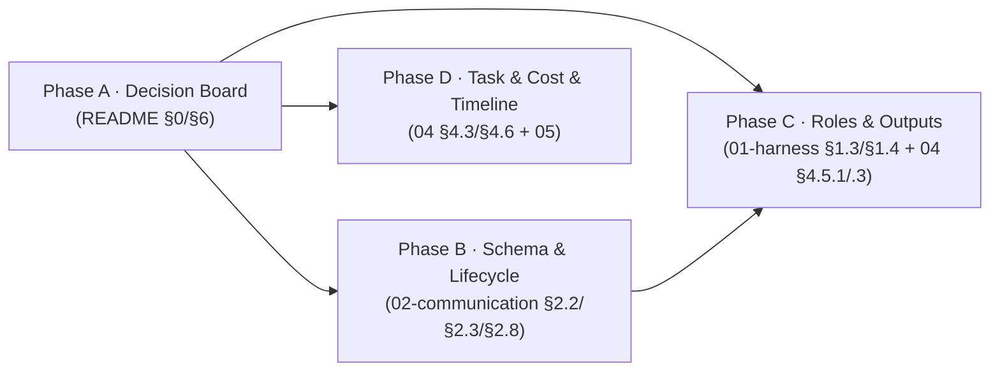

# Plan · outline modify-mechanism (search-replace 블록 채택)

## 0. 메타

- 작업 ID: `004-modify-mechanism`
- 의도: outline/ 5개 파일을 갱신해 "에이전트가 코드 구현·수정 모두 가능"이라는 요구사항을 반영. 결정 = Q22 코드 수정 메커니즘 = A2 (search-replace 블록 in/out, line number 의존 0). Q23 데모 task = c (modify 전용 task 신규 추가).
- 관련 ADR / Q번호: outline/README.md Q22 (신규), Q23 (신규). 기존 ADR-9(`docs/dev-docs/architecture.md`) `[CONVERGED]` 마커와 충돌 없음.
- 예상 영향 범위:
  - `outline/README.md` (§0 표, §6 결정 보드)
  - `outline/01-harness-layers.md` (§1.3 cwd 격리 시나리오, §1.4 셀프체크)
  - `outline/02-communication.md` (§2.2 메시지 스키마, §2.3 턴 라이프사이클, §2.8 실패 모드)
  - `outline/04-requirements-and-modes.md` (§4.3 데모 task, §4.5.1/§4.5.3 산출물, §4.6 비용)
  - `outline/05-timeline.md` (Day 2 작업 항목 + 날짜·요일 라벨 폐기)
  - `docs/dev-docs/architecture.md` (§6 ADR 표 — Q22 → ADR-10 승격, Phase A)
  - `docs/runtime-docs/protocol.md` (§2 메시지 스키마 + §4 turn lifecycle mermaid + §kind 값별 의미 + §9 실패 모드 — Phase B에서 outline/02와 동시 cascade, ADR-10 정합성)
- LOC 추정: ~170 줄 추가 / ~28 줄 변경 (Phase A ~45/~5 + B ~70/~7 + C ~30/~6 + D ~25/~12, 코드 0, .md만)

---

## 1. AS-IS (현재 상태)

### 1.1 코드 수정 메커니즘 부재
- `outline/README.md:37-41` §0 표: "양쪽 다 텍스트 in/out 어댑터 작성 가능"으로 못박힘. Codex `--sandbox read-only`, Claude `--tools ""` — 파일 시스템 쓰기 통로 0.
- `outline/02-communication.md:41-73` §2.2 메시지 스키마: `kind` enum이 `task | proposal | critique | decision | error | meta` 6개. 코드 수정 적용 결과를 표현할 `kind` 부재. `meta` 필드에 patch 관련 항목 0.
- `outline/02-communication.md:84-113` §2.3 턴 라이프사이클: R2(driver proposal) → R3(reviewer prompt build) 직결. 중간에 파일 적용 단계 없음.
- `outline/02-communication.md:218-227` §2.8 실패 모드 표 6행: subprocess/timeout/parse/empty/auth/budget. patch 적용 실패 행 0.

### 1.2 산출물 정의가 "신규 파일 톤"
- `outline/04-requirements-and-modes.md:187` §4.5.1 run 모드 산출물: "`<workdir>/<file>.py` (또는 task에 따라)". "기존 파일 수정" 변종 명시 X.
- `outline/04-requirements-and-modes.md:242` §4.5.3 implement 모드 산출물: "`<workdir>/<file>.py` 등 코드". 동일.

### 1.3 셀프체크에 modify 항목 0
- `outline/01-harness-layers.md:67-73` implementer.md 셀프체크 5개: 모두 "task→신규 함수 작성" 시나리오. search-replace 블록 형식 준수, SEARCH 정확 일치, 호환성 확인 항목 부재.
- `outline/01-harness-layers.md:75-84` spec-reviewer.md 셀프체크: `regression 검사` 항목은 있으나 "직전 턴 patch 적용 결과(kind=patch_applied)"를 명시 안 함.
- `outline/01-harness-layers.md:30-43` §1.3 cwd 격리 전체. 세부 영역: line 30=헤더, 32=위험 단락, 34=대응 헤더, 35-39=5 항목 리스트, 41=효과 헤더, 42-43=효과 본문. `--workdir <path>`가 "사용자 코드베이스"라고만 (line 35). driver가 그 코드를 **읽기**만 하는지 **쓰기**도 하는지 미명세.

### 1.4 데모 task 후보가 신규 작성만
- `outline/04-requirements-and-modes.md:27-34` §4.3 데모 task 후보 표 4개: `wave_difficulty`(1순위, 신규 작성), `reward_curve`(신규), `buggy_rule_review`(modify 톤이지만 후순위), `inventory_balance`(신규+계획).
- modify 전용 task 명시 0.

### 1.5 결정 보드에 Q22/Q23 부재
- `outline/README.md:47-69` §6 결정 보드 ``` 코드 펜스 (line 47=펜스 시작, 48-68=Q1~Q21, 68=Q21 마지막 결정, 69=펜스 닫힘). 코드 수정 메커니즘 결정 항목 부재.
- `docs/dev-docs/architecture.md:122` 헤더 "ADR — 핵심 설계 결정 9개" + line 126-136 ADR 표 (ADR-1~9). Q22를 위한 ADR-10 행 부재.

### 1.6 타임라인에 patch apply 작업 부재
- `outline/05-timeline.md:67-80` Day 2 작업 목록: schema/bus/AgentRunner/codex/claude/cwd/orchestrator. search-replace parser + apply 모듈 0.

---

## 2. TO-BE (목표 상태)

### 2.1 결정 도장 (Phase A)
- `outline/README.md` §0 스모크 테스트 결론 줄(line 41) 직후, line 43 `---` 직전에 **코드 수정 메커니즘 단락 1개 추가** (§0 표는 "초기 가정 / 실측 / 액션" 4컬럼이라 메커니즘 행이 부자연스러움 — 단락 형태로 결정 메커니즘 명시).
- `outline/README.md` §6 결정 보드에 Q22 ✅ (A2 채택), Q23 ✅ (c 채택) 두 줄 추가.
- `docs/dev-docs/architecture.md` §6 ADR 표(line 136 ADR-9 직후)에 **ADR-10 행 추가** (Q22 결정의 정통 기록). line 122 헤더 "9개" → "10개" 갱신. Documentation-Checklist:119 "새 ADR 결정 시 architecture ADR 표 + outline 결정 보드 동시 갱신" 매핑 준수.

### 2.2 메시지 스키마 + 턴 라이프사이클 (Phase B)
- `outline/02-communication.md` §2.2 `kind` enum에 `patch_applied` 추가.
- `outline/02-communication.md` §2.2 `meta`에 `patches: [{file, search, replace}]`, **`apply_status: "ok" | "failed"`** (all-or-nothing 채택, partial 폐기), `apply_error`, `files_changed: [str]` 필드 추가.
- `outline/02-communication.md` §2.2 부가 필드 타당성 bullet 2 행 추가 (P-JSONL append-only 일관 명시).
- `outline/02-communication.md` §2.3 R2 노드 텍스트에 "응답에서 patches 추출하여 meta.patches에 기록" 명시 + R2와 R3 사이에 **R2.6(apply_patches: all-or-nothing 트랜잭션 + path resolve로 workdir 내부 강제)** → R2.7(append kind=patch_applied) 단계 mermaid 추가.
- `outline/02-communication.md` §2.3 mermaid 직후 R2.6~R2.7 흐름 설명 단락 1개 추가 (path 안전성 + all-or-nothing 명시).
- `outline/02-communication.md` §2.8 실패 모드 표에 3 행 추가: "Patch SEARCH 미일치" / "Patch FILE 경로 workdir 외부 (path traversal 차단)" / "Patch REPLACE IO 실패" (모두 apply_status=failed, partial 폐기).
- **`docs/runtime-docs/protocol.md` cascade (ADR-10 정합성)** — 위 outline §2.2/§2.3/§2.8 변경과 동일 내용을 protocol.md §2(메시지 스키마, line 67 kind enum + meta 필드), §kind 값별 의미, §4(line 216-, turn lifecycle mermaid: line 223 R2 + line 230 화살표), §9 실패 모드에 동시 반영. 한 쪽만 갱신 시 runtime SSOT 균열.

### 2.3 셀프체크 + workdir 시나리오 + 산출물 (Phase C)
- `outline/01-harness-layers.md` §1.3 본문에 "기존 코드 베이스 + driver search-replace 수정" 시나리오 1단락 추가.
- `outline/01-harness-layers.md` §1.4 implementer.md 셀프체크에 3 항목 추가 (search-replace 블록 형식 / SEARCH 정확 일치 / 기존 호출 측 호환성).
- `outline/01-harness-layers.md` §1.4 spec-reviewer.md 셀프체크 `regression 검사` 항목을 "직전 턴 `kind=patch_applied` 결과 + 변경 파일 내용 vs 기존 의도" 명세로 강화.
- `outline/04-requirements-and-modes.md` §4.5.1, §4.5.3 산출물 행을 "신규 작성 또는 search-replace 수정 (orchestrator 적용, meta.files_changed 기록)"로 갱신.

### 2.4 데모 task + 비용 + timeline (Phase D)
- `outline/04-requirements-and-modes.md` §4.3 후보 표에 "modify 전용 task 신규" 추가, Q23=c 명시. tasks/<modify_task_id>/ 폴더 생성은 별도 후속 plan으로 분리.
- `outline/04-requirements-and-modes.md` §4.6 비용 표에 "patch apply (search-replace parser + 적용) ~1.5h Day 2" 행 추가.
- `outline/05-timeline.md` §5.1 Day 2 상세 + §5.3 Day 2 작업 목록(line 172-180)에 `src/patch_apply.py` 항목 추가.

---

## 3. Phase 인덱스

### 3.1 의존성 그래프



A가 결정 보드를 도장 → B/D 병렬, C는 B 산출(`kind=patch_applied`/`apply_status` 스키마)을 §1.4 spec-reviewer 셀프체크에서 인용하므로 B 직후 직렬. B-D 병렬, C는 B 완료 후 진입.

### 3.2 Phase 파일 경로

| Phase | 경로 | 의존 | 병렬 그룹 |
|---|---|---|---|
| A · Decision Board | [phase-a-decision-board.md](phase-a-decision-board.md) | (없음) | — |
| B · Schema & Lifecycle | [phase-b-schema-lifecycle.md](phase-b-schema-lifecycle.md) | A | B-D 병렬 |
| C · Roles & Outputs | [phase-c-roles-outputs.md](phase-c-roles-outputs.md) | A, B | — (B 완료 후 직렬) |
| D · Task & Cost & Timeline | [phase-d-task-cost-timeline.md](phase-d-task-cost-timeline.md) | A | B-D 병렬 |

---

## 4. 비기능 요구

- **외부 의존성 추가 없음** — outline은 .md 갱신만. 별도 후속 plan에서 `src/patch_apply.py` 구현 시 표준 라이브러리 (`re`)만.
- **decision board 단일 진실** — Q22/Q23 결정 텍스트는 `outline/README.md` §6에만 풀 명시. 다른 파일은 "Q22 ✅ 결정대로" 식 인용.
- **mermaid는 .md 렌더링용** — outline은 GitHub 등에서 mermaid 렌더링 가능, 본 plan도 mermaid 사용 OK (CLAUDE.md §1 다이어그램 매체별 분리 규칙).

---

## 5. 위험 (Phase 횡단)

1. **결정 ↔ 본문 불일치** — Phase A에서 Q22 텍스트와 §0 표 메커니즘 표현이 어긋나면 B/C/D 모두 잘못된 출처 인용. → DoD에 "§0 표 ↔ §6 Q22 텍스트 일관" 명시.
2. **셀프체크 ↔ 스키마 불일치** — Phase C가 implementer 셀프체크에 "search-replace 형식 준수"를 넣었는데 Phase B가 §2.2에 `meta.patches` 필드를 안 넣으면 자기 모순. → 4 phase 모두 완료 후 review-plan에서 cross-check.
3. **`tasks/<modify_task_id>/` 실 폴더 vs outline 명시 시점** — outline에 modify task 명시했는데 실제 task.md 본문은 별도 plan으로 분리됨. outline에 placeholder ID 사용 (예: `<modify_task_id>`)하고 실 ID는 후속 plan에서. → DoD에 "outline의 modify task 참조는 placeholder ID로" 명시.
4. **시한 압박** — 본 plan은 코드 작업 단계 직전 outline 갱신. plan 자체가 짧게 끝나야 후속 코드 작업 침범 X (LOC·.md 변경 폭이 작아야 우선순위 정합).
5. **execute-plan 분기 시 컨텍스트 분리 부족** — outline은 작은 .md여서 phase별 subagent보다 단일 메인 스레드 직접 Edit이 더 효율적일 수 있음. → 사용자가 review-plan 후 "직접 Edit"을 선택할 수도 있음, plan은 그래도 형식 준수.

---

## 6. 완료 기준 (Definition of Done)

- [ ] (Phase A) `outline/README.md` §0 line 41 직후, line 43 직전에 코드 수정 메커니즘 단락 추가
- [ ] (Phase A) `outline/README.md` §6 결정 보드에 Q22 ✅ + Q23 ✅ 두 줄 추가
- [ ] (Phase A) `docs/dev-docs/architecture.md` §6 ADR 표 line 136 직후에 ADR-10 행 추가
- [ ] (Phase A) `docs/dev-docs/architecture.md` line 122 헤더 "9개" → "10개" 갱신
- [ ] (Phase B) `outline/02-communication.md` §2.2 `kind` enum에 `patch_applied` 추가
- [ ] (Phase B) `outline/02-communication.md` §2.2 `meta` 블록에 `patches`/`apply_status` (=`"ok" | "failed"`만, partial 폐기)/`apply_error`/`files_changed` 필드 추가
- [ ] (Phase B) `outline/02-communication.md` §2.2 부가 필드 타당성 bullet에 P-JSONL 일관 2 행 추가
- [ ] (Phase B) `outline/02-communication.md` §2.3 mermaid에 R2 노드 라벨 갱신(응답에서 patches 추출 명시) + R3 노드 라벨 갱신(변경된 파일 내용 재주입 명시) + R2_6/R2_7/R2_7a/R2_7b 4 노드 추가, 기존 R2→R3 화살표 제거 + 새 화살표 R2→R2_6→R2_7→{R2_7a,R2_7b}→R3
- [ ] (Phase B) `outline/02-communication.md` §2.3 mermaid 직후 R2.6~R2.7 흐름 설명 단락 추가
- [ ] (Phase B) `outline/02-communication.md` §2.8 실패 모드 표에 3 행 추가 (SEARCH 미일치 / FILE 경로 workdir 외부 / REPLACE IO 실패 — 모두 apply_status=failed)
- [ ] (Phase B) `docs/runtime-docs/protocol.md` line 67 kind enum + meta 필드 + §kind 값별 의미 + §4 turn lifecycle mermaid + §9 실패 모드를 outline §2.2/§2.3/§2.8과 동시 cascade (ADR-10 runtime SSOT 정합성)
- [ ] (Phase C) `outline/01-harness-layers.md` §1.3 본문에 기존 코드 modify 시나리오 단락 추가
- [ ] (Phase C) `outline/01-harness-layers.md` §1.4 implementer 셀프체크 3 항목 추가
- [ ] (Phase C) `outline/01-harness-layers.md` §1.4 spec-reviewer 셀프체크 regression 항목 강화 + 1 항목 추가
- [ ] (Phase C) `outline/04-requirements-and-modes.md` §4.5.1, §4.5.3 산출물 행 갱신
- [ ] (Phase D) `outline/04-requirements-and-modes.md` §4.3 후보 표에 modify task 5번째 행 추가 (line 34 직후)
- [ ] (Phase D) `outline/04-requirements-and-modes.md` §4.3 결정 단락 line 37-38 갱신 (Q23=c 명시 + modify 2순위)
- [ ] (Phase D) `outline/04-requirements-and-modes.md` §4.6 비용 표에 patch apply 행 추가
- [ ] (Phase D) `outline/04-requirements-and-modes.md` §4.6 표 직후 단락에 patch apply 통합 시점 1줄 추가
- [ ] (Phase D) `outline/05-timeline.md` §5.1 Day 2 펼침에 `src/patch_apply.py` 행 추가
- [ ] (Phase D) `outline/05-timeline.md` §5.1 commit 단위 목록에 `"Add search-replace patch apply"` 삽입
- [ ] (Phase D) `outline/05-timeline.md` §5.3 Day 2 작업 목록에 `33b. src/patch_apply.py` 항목 추가
- [ ] (Phase D) `outline/05-timeline.md` 절대 날짜·요일 라벨 폐기 (머리 line 3 + §5.1 mermaid gantt + 펼침 본문 헤더 + §5.3 Day 헤더). 2026-05-08=금 calendar mismatch 차단 + 외부 독자 신뢰성 회복
- [ ] (전체) Q22 결정 텍스트 ↔ §0 단락 ↔ §2.2 스키마 ↔ §2.3 라이프사이클 ↔ §1.4 셀프체크 5중 일관 (review-plan 통과)
- [ ] (전체) sync-docs 호출 시 누락 0 (outline 변경이 다른 .md(architecture.md, protocol.md 등)에 파급되는지 확인)
- [ ] (전체) sync-docs 매핑 자체에 사각지대 발견 시 (예: 본 plan이 다루는 "outline 결정 보드 + 메시지 스키마 동시 변경" 유형이 `Documentation-Checklist.md` §1에 없음) 새 매핑 행 추가 또는 사용자 보고
- [ ] (전체) **path 안전성 검증** — Phase B/C 명세에 driver 응답 `FILE: <path>`의 absolute path / `..` traversal / symlink escape 차단 명시 (R2.6에서 `Path.resolve()` + workdir 내부 검사). ADR-6 cwd 격리의 쓰기 경계 보강
- [ ] (전체) review-plan P0 = 0

---

## 7. 참조 .md

- `docs/dev-docs/Plans/plan-writing-guide.md` — 본 plan 형식의 단일 진실
- `docs/dev-docs/architecture.md` ADR 표 — **Q22를 ADR-10으로 승격** (Phase A에서 architecture.md §6 ADR 표 갱신 + 헤더 "9개"→"10개"). 영향 폭(메시지 스키마 신규 `kind` + 라이프사이클 R2.6/R2.7 + 어댑터 추상화 보존)이 ADR-1·ADR-9와 같은 layer라 ADR 정통. Documentation-Checklist:119 "새 ADR 결정 시 architecture ADR 표 + outline 결정 보드 동시 갱신" 매핑 준수.
- `docs/dev-docs/Documentation-Checklist.md` — outline 변경 시 동기화 대상 .md 매핑 (sync-docs 자동 catch)
- `docs/runtime-docs/protocol.md` — **본 plan Phase B에 cascade 작업 포함** (옵션 A 채택, 직전 옵션 B "후속 plan 위임"은 architecture/outline/protocol 불일치 윈도우 발생 risk로 폐기). outline §2.2/§2.3/§2.8 변경과 동시에 protocol.md §2 메시지 스키마(kind enum + meta 필드), §kind 값별 의미, §4 turn lifecycle mermaid, §9 실패 모드 cascade — runtime SSOT 일관 보장. Documentation-Checklist §1.7 line 124 ("ADR 추가 (ADR-9)" → "ADR-9·ADR-10" 일반화)는 본 plan 스코프 외 P2로 deferred
- `docs/runtime-docs/roles/{implementer,spec-reviewer}.md` — outline §1.4 셀프체크 변경이 role.md에 파급 (실제 role.md 갱신은 후속 plan)
