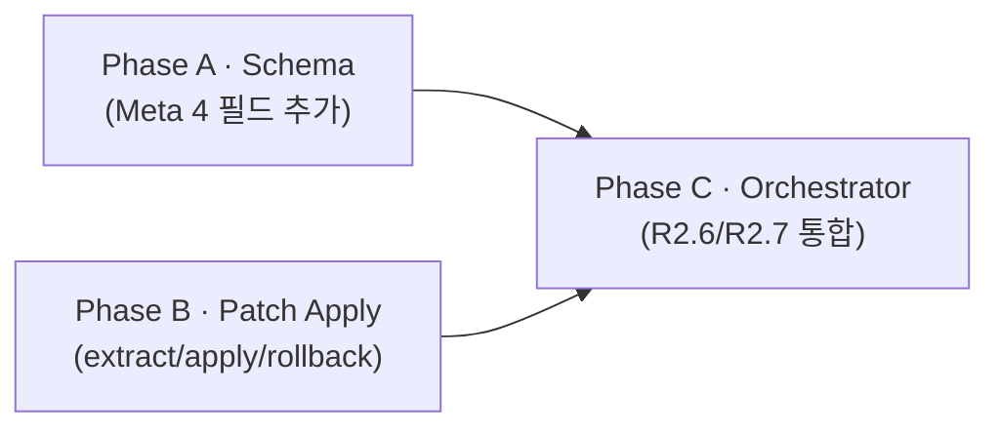

# Plan · ADR-10 patch_apply 코드 구현 (search-replace 메커니즘)

## 0. 메타

- 작업 ID: `005-patch-apply-impl`
- 의도: outline/protocol.md `004-modify-mechanism` plan으로 결정 도장 + 스키마/lifecycle/실패모드 cascade는 완수. 본 plan은 그 결정의 **코드 구현** — `src/schema.Meta` 4 필드 확장 + `src/patch_apply.py` 신규(extract/validate/apply/rollback) + `src/orchestrator.run_turn` R2.6/R2.7 통합 + 단위 테스트. 본 plan 끝나면 modify 시연(Q23=c 데모 task)이 코드 측면에서 가능.
- 관련 ADR / Q번호: ADR-10 (`docs/dev-docs/architecture.md` §6, ADR 표) / Q22 (`outline/README.md:71` ✅ A2 채택) / Q23 (`outline/README.md:72` ✅ c 채택 — modify 전용 task. 본 plan은 코드 인프라만, task.md 본문은 별도 후속 plan)
- 예상 영향 범위:
  - `src/schema.py` (Meta dataclass — 4 필드 추가, default=None)
  - `src/patch_apply.py` (신규 모듈)
  - `src/orchestrator.py` (`run_turn`에 patches 추출 + R2.6 apply + R2.7 patch_applied append)
  - `tests/test_patch_apply.py` (신규)
  - `tests/test_schema.py` (Meta 확장 검증 추가)
  - `tests/test_orchestrator_patch_integration.py` (신규 — R2.6/R2.7 진입 단언 단위 테스트, P1-X2 fix)
  - `docs/dev-docs/systems/jsonl-bus.md` §schema (Meta 18 필드 + kind enum patch_applied — Documentation-Checklist:60-61)
  - `docs/dev-docs/systems/orchestrator.md` (R2.6/R2.7 narrative — Documentation-Checklist:58)
  - `docs/runtime-docs/systems/run-mode.md` (R2.6/R2.7 turn lifecycle 갱신 — Documentation-Checklist:58 `<mode>.md` 매핑)
  - `README.md` (지원 플랫폼 섹션 갱신 — Linux/WSL 기준 명시, Windows native deferred 약속 가시화)
- LOC 추정: 코드 ~110 (schema +10 / patch_apply ~70 / orchestrator +30) / 테스트 ~140 (test_schema +30 / test_patch_apply ~80 / test_orchestrator_patch_integration ~30) / .md cascade ~50 (systems/ 3 파일 + README 지원 플랫폼). 합산 산수 정합 (P1 fix)

---

## 1. AS-IS (현재 상태)

### 1.1 schema.py — Meta 14 필드만, patches/apply_status 부재
- `src/schema.py:19-34` `Meta` dataclass: 14 필드 (vendor / agent_cli / model / session_id / thread_id / input_tokens / output_tokens / cached_input_tokens / reasoning_output_tokens / cost_usd / latency_ms / is_mock / workdir / convergence_streak). **`patches` / `apply_status` / `apply_error` / `files_changed` 4 필드 부재**.
- `src/schema.py:46-51` `Message`: `kind` 값 freeform string. protocol.md §2 line 67 enum에 `patch_applied`가 추가되어 있으나 Python 측 검증 부재 (whitelist X).
- `src/schema.py:65-82` `to_dict()` / `:84-114` `from_dict()`: Meta 14 필드 재귀 복제. 새 필드 추가 시 자동 picked up (`fields(self.meta)` iteration) — 변경 부담 0.

### 1.2 patch_apply 모듈 부재
- `src/` 하위 `patch_apply.py` 없음. driver 응답 텍스트에서 search-replace 블록을 추출·적용할 함수 0.
- `docs/runtime-docs/roles/implementer.md:78` 셀프체크가 정의한 마커 형식: `FILE: <path>` 헤더 + `<<<<<<< SEARCH` / `=======` / `>>>>>>> REPLACE`. 이 형식을 파싱할 코드 부재.

### 1.3 orchestrator R2.6/R2.7 단계 부재
- `src/orchestrator.py:312-316` `run_turn`: driver 응답을 받자마자 `_msg(... kind="proposal" ..., meta=resp1.meta)` → `bus.append(proposal)` → 곧장 reviewer 단계(`:318-`).
- protocol.md §4 line 232-235 mermaid에 정의된 **R2.6 apply_patches → R2.7 patch_applied append** 단계 미실현.
- 결과: driver가 `FILE:` / `SEARCH` / `REPLACE` 마커를 응답에 포함시켜도 workdir 파일은 절대 변경 안 됨. modify 데모 자체 불가.

### 1.4 SENTINEL_META — patch_applied 메시지용 헬퍼 부재
- `src/orchestrator.py:52-71` `SENTINEL_META(workdir, vendor, agent_cli, latency_ms, convergence_streak)`: `kind=meta` / `kind=task` 등 system 메시지용. apply_status / apply_error / files_changed 받는 분기 0. 본 plan에서 추가 필요.

### 1.5 테스트 6개 — patch_apply 검증 0
- `tests/test_schema.py` / `test_bus_append.py` / `test_cwd_isolation.py` (×2) / `test_orchestrator_converge.py` / `test_dev_skill_cli.py`. patch 추출 / path traversal 차단 / SEARCH 미일치 / all-or-nothing 롤백 케이스 부재.

---

## 2. TO-BE (목표 상태)

### 2.1 schema.py Meta 확장 (Phase A)
- `src/schema.py:34` `convergence_streak` 직후에 4 필드 추가:
  - `patches: list[dict[str, str]] | None = None` — kind=proposal일 때 driver 응답에서 추출한 search-replace 블록. 빈 응답·patch 0개면 None.
  - `apply_status: str | None = None` — kind=patch_applied일 때만 `"ok"` 또는 `"failed"`.
  - `apply_error: str | None = None` — apply_status=failed 시 사유 문자열.
  - `files_changed: list[str] | None = None` — apply_status=ok 시 변경된 파일 상대 경로 리스트.
- 모두 default=None — 기존 14 필드 위치/이름 보존 + `Meta(...)` 직접 호출 코드(orchestrator.SENTINEL_META, 어댑터 응답 생성) 무영향 (default가 채움).
- `tests/test_schema.py`에 신 필드 to_dict/from_dict 왕복 테스트 추가 (3~4 케이스: patches만 / apply_status=ok / apply_status=failed / 모두 None).

### 2.2 patch_apply.py 신규 모듈 (Phase B)
- `src/patch_apply.py` — 표준 라이브러리만(`re`, `pathlib.Path`).
- 공개 함수 3개 + 예외 1개:
  - `validate_patch_path(workdir: Path, file: str) -> Path` — cwd-isolation.md §Layer 4 SSOT 정통 구현. resolve + is_relative_to. 외부면 PatchApplyError. 본 plan이 해당 SSOT 함수의 코드 정통 위치 (이전엔 spec만 있고 코드 부재).
  - `extract_patches(text: str) -> list[dict[str, str]]` — 정규식으로 `FILE: <path>` 헤더 + `<<<<<<< SEARCH` / `=======` / `>>>>>>> REPLACE` 블록 매칭. 각 블록을 `{"file": ..., "search": ..., "replace": ...}` dict으로 반환. 매칭 0이면 `[]`.
  - `apply_patches(patches: list[dict[str, str]], workdir: Path) -> tuple[str, str | None, list[str]]` — all-or-nothing. 반환: `(status, error, files_changed)` — status는 `"ok"` 또는 `"failed"`. 내부에서 `validate_patch_path` 호출.
  - `class PatchApplyError(Exception)` — 내부 시그널 (path traversal / SEARCH 미일치 (count==0) / SEARCH 다중 매치 (count>1) / IO 실패 단일 catch 가능).
- 안전성 책임:
  - **path validation**: SSOT `validate_patch_path` 사용 — cwd-isolation.md:55-72 spec 1:1.
  - **dry-run 검증**: 각 파일을 한 번 read (`encoding="utf-8"`) → originals/mutated 두 dict 보존. SEARCH `content.count(search)` 검사: count==0 → "search not found", count>1 → "ambiguous match: ... N times" (unique-match 정책 — 다중 매치 모호성 차단). 1개라도 위반 시 PatchApplyError, 디스크 변경 0.
  - **commit phase**: 검증 통과 후 dry-run의 mutated를 write (`encoding="utf-8"`). IO 실패 시 originals dict로 복원 (별도 read 0회 — 백업은 dry-run 단계의 originals 재사용).

### 2.3 orchestrator.py R2.6/R2.7 통합 (Phase C)
- `src/orchestrator.py` import 추가: `from .patch_apply import extract_patches, apply_patches, PatchApplyError`.
- `run_turn` driver 분기(`:312-316`) 변경:
  1. `resp1.text` → `extract_patches(resp1.text)` 호출 → `patches: list[dict]` 획득.
  2. proposal Meta를 `dataclasses.replace(resp1.meta, patches=patches or None)`로 보강 (P-JSONL append-only — meta 사후 수정 X, append 시점에 한 번에 채움).
  3. `bus.append(proposal)`.
  4. `if patches:` 분기 — `apply_patches(patches, workdir)` 호출 → status/error/files_changed 획득. PatchApplyError catch는 함수 내부에서 처리 (status="failed" 반환).
  5. `kind=patch_applied` 메시지 생성: `_patch_applied_msg(turn_id, parent_id=proposal.msg_id, status, error, files_changed, workdir, mode)` → `bus.append(...)`.
  6. patches 빈 리스트면 R2.6/R2.7 skip — patch_applied 메시지 자체 부재 (apply 시도 0이면 메시지 무의미, 노이즈 차단).
- `_patch_applied_msg(...)` 헬퍼 신규 (`_meta_msg` 옆) — `from_="system"`, `slot=None`, `seq_in_turn=META_SEQ_SENTINEL-1` (proposal=1, patch_applied≈98, reviewer=2 직전 정렬). meta는 `SENTINEL_META(workdir)` + `dataclasses.replace`로 apply_status/apply_error/files_changed 채움.
- reviewer prompt build(`:322`)는 변경 0 — 이미 변경된 파일이 workdir에 반영되어 있어 reviewer는 일관 상태를 봄. 다음 턴 driver R1 prompt도 `_serialize_history`의 `from_=="system"` 분기(`:99-100`)가 patch_applied content를 자연 시리얼라이즈 → driver가 apply_error 피드백 자연 수신.

### 2.4 테스트 (Phase B + C)
- `tests/test_patch_apply.py` 신규 — pytest. 케이스:
  1. `extract_patches` happy path — 1 블록 / N 블록 / 0 블록.
  2. `extract_patches` 마커 누락 — `=======` 부재 시 매칭 0.
  3. `apply_patches` happy path — 단일 파일 SEARCH/REPLACE 적용 검증.
  4. **path traversal 차단** — `file: ../etc/passwd` / 절대 경로 / symlink escape → status="failed", 파일 변경 0.
  5. **SEARCH 미일치 (count==0)** — 파일에 없는 SEARCH → status="failed", 다른 파일도 변경 0 (all-or-nothing).
  6. **SEARCH 다중 매치 (count>1)** — SEARCH가 파일에 N>1회 나타남 → status="failed", apply_error에 "ambiguous match: ... N times" + 변경 0 (unique-match 정책).
  7. **multi-file 롤백** — 2개 파일 patch, 두번째 SEARCH 미일치 → 첫번째 파일 미변경.
  8. **`validate_patch_path` SSOT 1:1** — cwd-isolation.md §Layer 4 spec과 함수명·시그니처·동작 일치 검증.

---

## 3. Phase 인덱스

### 3.1 의존성 그래프

A·B 병렬 (서로 의존 0 — A는 schema dataclass, B는 표준 라이브러리만 사용해 patch_apply 모듈 신규). C는 A의 Meta 확장 + B의 함수 두 개를 모두 사용하므로 직렬.

### 3.2 Phase 파일 경로

| Phase | 경로 | 의존 | 병렬 그룹 |
|---|---|---|---|
| A · Schema | [phase-a-schema.md](phase-a-schema.md) | (없음) | A-B 병렬 |
| B · Patch Apply | [phase-b-patch-apply.md](phase-b-patch-apply.md) | (없음) | A-B 병렬 |
| C · Orchestrator | [phase-c-orchestrator.md](phase-c-orchestrator.md) | A, B | — |

---

## 4. 비기능 요구

- **외부 의존성 0** — 표준 라이브러리만 (`re`, `pathlib.Path`, `dataclasses.replace`, `os`). code-conventions §2 정합.
- **append-only (P-JSONL)** — proposal의 `meta.patches`는 append 시점에 한 번 채움. 이미 append된 메시지의 meta 사후 수정 0. patch_applied는 별도 메시지로 append.
- **path 안전성** — `Path.resolve()` 후 workdir 부모 검사로 absolute path / `..` traversal / symlink escape 차단 (ADR-6 cwd 격리의 쓰기 경계 보강).
- **all-or-nothing** — apply_patches가 1개라도 실패 시 디스크 변경 0 (dry-run 검증을 commit 전에 통과 필요). partial 폐기 (outline §2.2 결정).
- **frozen Meta 보존** — 어댑터 응답 meta는 변경 X. `dataclasses.replace`로 새 Meta 인스턴스 생성 (orchestrator.py:350-352 convergence_streak 패턴 재사용).
- **테스트 격리** — `tests/test_patch_apply.py`는 `tmp_path` fixture로 workdir 격리. 본 repo cwd 오염 0.

---

## 5. 위험 (Phase 횡단)

1. **Meta 필드 default 누락 → 기존 호출자 break**
   - 위험: `src/agents/codex.py` / `claude.py` 어댑터, `orchestrator.SENTINEL_META`, 모든 `tests/test_*.py`가 `Meta(...)`를 직접 인스턴스화. 새 4 필드에 default=None을 빠뜨리면 다 break.
   - 대응: Phase A §3 출력에 `default=None` 명시. Phase A DoD에 기존 6 테스트 모두 pass 검증 포함.

2. **frozen=True + slots=True 호환성**
   - 위험: 14 → 18 필드로 확장 시 `__slots__` 자동 생성과 default 충돌 가능 (Python 3.10 dataclass 제한 — slots + default=None 조합은 OK, 검증 필요).
   - 대응: Phase A 작업 단위에 `python -c "from src.schema import Meta; Meta(...)"` 1회 import smoke 명시.

3. **search-replace 정규식의 그리디 매칭**
   - 위험: 한 응답에 여러 patch 블록이 있을 때 SEARCH 본문 안에 또 다른 `=======`나 `>>>>>>> REPLACE`가 있으면 정규식이 잘못된 경계로 매칭.
   - 대응: Phase B 작업 단위에 non-greedy `.+?` + `re.DOTALL` 명시 + 다중 블록 단위 테스트 케이스. 그래도 SEARCH 본문에 마커 자체가 들어가는 case는 ADR-10 마커 형식의 본질적 한계로 양해 (driver self-check 책임).

4. **patches 0 vs None 일관성**
   - 위험: `extract_patches` 빈 리스트 반환 시 proposal `meta.patches`를 `[]`로 둘지 `None`으로 둘지 일관 미정 → JSONL 라인 차이로 디버깅 혼선.
   - 대응: TO-BE §2.3 항목 2에 `patches or None` 명시 (빈 리스트 → None). protocol.md §2 line 86 "빈 리스트 [] 또는 null" 양쪽 허용 명세 → 본 도구는 None 일관 채택.

5. **windows symlink + path validation**
   - 위험: `Path.resolve()`의 symlink 처리는 OS별 차이. Linux/macOS는 OK, Windows는 별도 검증 필요.
   - 대응: 본 plan은 Linux/WSL 기준 (CLAUDE.md 환경). Windows native 검증은 plan 스코프 외, README "지원 플랫폼" 섹션 + **별도 plan(예시 ID: `006-windows-native-support`) 추적 항목으로 backlog 등재**. 본 plan DoD에 "README 지원 플랫폼 섹션 갱신" 추가하여 약속 가시화.

6. **patch_applied 메시지의 seq_in_turn 충돌**
   - 위험: 현재 driver=1, reviewer=2, meta=99. patch_applied를 어디 끼울까. **시간 순서**(turn 내 흐름)는 proposal → patch_applied → reviewer로 patch_applied가 reviewer보다 먼저 발생. 그러나 seq=2로 두면 reviewer와 충돌, seq=1.5도 정수 X.
   - 대응: TO-BE §2.3 항목 5 명시 — `seq_in_turn=98` (META_SEQ_SENTINEL-1) 채택. **시간 순서**상 patch_applied는 reviewer보다 먼저(turn 내 발생 순), **직렬화 순서**(`_serialize_history`의 `(turn_id, seq_in_turn)` 정렬)는 proposal(1) → reviewer(2) → patch_applied(98)로 reviewer 뒤에 노출. **trade-off 양면**:
     - (+) 강조 효과 — driver의 다음 턴 prompt에서 patch_applied가 그 turn 마지막 메시지로 노출, apply_error 피드백 캐치 ↑.
     - (−) **driver 오인 risk** — driver가 직렬화 순서를 시간 순으로 오독하면 "reviewer가 patch_applied 전에 응답했다"고 가정 가능. apply_status=ok일 때 reviewer critique 내용이 변경 후 파일을 본 결과인데 driver가 변경 전 상태에 대한 critique으로 오해할 risk.
     - 채택 근거: 직렬화는 `_serialize_history`의 라벨이 "Turn N" 단위만 표시 (시간 분 단위 X) — driver가 같은 turn 내 메시지의 시간 순서를 직렬화 순서로 추론할 명시적 근거 0. (−)는 이론적, (+)는 실용적.
     - **차단/완화**:
       - (1) 회귀 가드 — 현재 `tests/test_orchestrator_converge.py`는 `_detect_converged` 단위 + `run_session` ADR-9 fallback 5 함수(`test_detect_converged_*` ×3 + `test_run_session_adr9_*` ×2)만 검증, **reviewer.seq_in_turn=2 단언 0건**. 본 plan에서 추가하는 `tests/test_orchestrator_patch_integration.py`(Phase C, 2 케이스)가 `assert critique.seq_in_turn == 2` + `assert patch_applied.seq_in_turn == 98` 단언을 포함 → reviewer를 seq=3으로 옮기는 변경은 본 통합 테스트에서 즉시 fail. Phase C 작업 단위에 본 단언 명시.
       - (2) driver 오인 방지 — `_patch_applied_msg` content에 `apply_status=...` 명시 prefix 채움. driver가 직렬화 마지막 메시지를 reviewer critique으로 오인하면 prefix로 즉시 구분. role implementer.md 셀프체크에 "직전 턴 patch_applied 결과를 별도 인지" 항목은 plan 004 cascade로 이미 추가됨 (1차 방어선).
       - (3) 후속 검토 — Day 3+에 reviewer prompt build에서 patch_applied 메시지를 별도 섹션으로 분리하여 "변경된 파일 + apply 결과"를 reviewer가 명확 인지하도록 추가 가능 (별도 plan).

---

## 6. 완료 기준 (Definition of Done)

- [ ] (Phase A) `src/schema.py:34` `Meta`에 patches / apply_status / apply_error / files_changed 4 필드 추가, 모두 default=None
- [ ] (Phase A) `tests/test_schema.py`에 신 필드 to_dict/from_dict 왕복 테스트 4 함수 추가 (patches만 / apply_status=ok / apply_status=failed / default=None)
- [ ] (Phase A) `pytest tests/test_schema.py -q` pass + `pytest tests/ -q` 기존 6 테스트 파일 모두 pass (회귀 0 — Phase A는 신규 테스트 파일 0, test_schema.py 수정만)
- [ ] (Phase B) `src/patch_apply.py` 신규 — `validate_patch_path` (cwd-isolation §Layer 4 SSOT 정통) + `extract_patches` / `apply_patches` / `PatchApplyError` 시그니처 명세대로 구현
- [ ] (Phase B) `tests/test_patch_apply.py` 신규 — extract 4 (single/multi/zero/blank-line) + apply 7 (happy/traversal/count==0/count>1/multi-file/SSOT/빈 SEARCH 차단) = 11 케이스
- [ ] (Phase B) `pytest tests/test_patch_apply.py -q` pass
- [ ] (Phase C) `src/orchestrator.py` `run_turn` driver 분기에 R2.6 (apply_patches) + R2.7 (patch_applied append) 단계 통합
- [ ] (Phase C) proposal `meta.patches`가 `dataclasses.replace`로 채워져 bus.append 시점에 한 번에 기록 (P-JSONL append-only)
- [ ] (Phase C) `_patch_applied_msg` 헬퍼 추가 — `from_="system"`, `seq_in_turn=98`, meta에 apply_status/apply_error/files_changed 채움
- [ ] (Phase C) `pytest tests/ -q` 전체 8 파일 (기존 6 + test_patch_apply.py + test_orchestrator_patch_integration.py) pass
- [ ] (전체) Q22 ✅ ↔ ADR-10 ↔ protocol.md §2/§4/§9 ↔ 본 plan 산출 코드 5중 일관 (review-plan 통과)
- [ ] (전체) **`docs/dev-docs/systems/jsonl-bus.md` §schema 갱신** — Documentation-Checklist:60-61 매핑(`src/schema.py` → systems/jsonl-bus.md §schema, `src/bus.py` → systems/jsonl-bus.md): Meta 필드 14 → 18 (patches/apply_status/apply_error/files_changed 추가), kind enum에 `patch_applied` 명시
- [ ] (전체) **`docs/dev-docs/systems/orchestrator.md` 갱신** — Documentation-Checklist:58 매핑(`src/orchestrator.py` 턴 라이프사이클 → systems/orchestrator.md): R2.6 (apply_patches) + R2.7 (patch_applied append) 통합 narrative 추가, `_patch_applied_msg` 헬퍼 명시
- [ ] (전체) **`docs/runtime-docs/systems/run-mode.md` 갱신** — Documentation-Checklist:58 매핑(`src/orchestrator.py` 턴 라이프사이클 → runtime-docs/systems/`<mode>.md`): R2.6/R2.7 turn lifecycle 단계 추가. 현재 R2 → R3 직결 narrative를 R2 → R2.6 → R2.7 → R3로 갱신 (P1-A fix)
- [ ] (전체) **`README.md` 지원 플랫폼 섹션 갱신** — Linux/WSL 기준 명시 + Windows native 검증은 별도 plan(`006-windows-native-support`) backlog 등재. ADR-10 path validation의 OS 의존성 가시화 (P1-D fix)
- [ ] (전체) sync-docs 호출 → 위 systems/ 3 파일 + README 외에 누락된 .md가 있으면 보고. protocol.md / ADR-10 / role implementer.md 셀프체크는 plan 004에서 cascade 완료
- [ ] (전체) validation.md §3 환원 후보 적재 — "all-or-nothing 트랜잭션 + 백업 복원" 패턴 신규 후보로 0~1건 적재. 적재 시 사유 1줄 명시, 적재 0건이면 "재발 사례 없음, 본 plan 종료 시점 단발" 명시 (측정 가능 표현, P2-X3 fix)
- [ ] (전체) review-code P0 = 0 — keyword-only 인자 / cwd 강제 / shell=True 부재 / 표준 라이브러리만 / append-only 위반 / **R-001 `encoding="utf-8"` 명시** 위반 0
- [ ] (전체) review-plan P0 = 0

---

## 7. 참조 .md

- `docs/dev-docs/Plans/plan-writing-guide.md` — 본 plan 형식 단일 진실
- `docs/dev-docs/architecture.md` ADR 표 §6 ADR-10 — Q22 결정의 정통 기록
- `docs/runtime-docs/protocol.md` §2 line 67 (kind enum) / line 85-91 (meta 4 필드) / §4 line 226-248 (turn lifecycle mermaid R2.6/R2.7) / §9 line 359-361 (실패 모드 patch 3행) — 본 plan이 구현할 명세 단일 진실
- `docs/runtime-docs/roles/implementer.md:78-80` — search-replace 마커 형식 (FILE / SEARCH / REPLACE) + driver 셀프체크
- `docs/dev-docs/code-conventions.md` — keyword-only / cwd 강제 / 표준 라이브러리 / append-only 규칙
- `plan/completed/004-modify-mechanism/` — 결정·문서 cascade가 완수된 선행 plan
- `outline/02-communication.md` §2.2 / §2.3 / §2.8 — Q22 결정 본문 (mirror of protocol.md, 본 plan은 outline 갱신 0)
