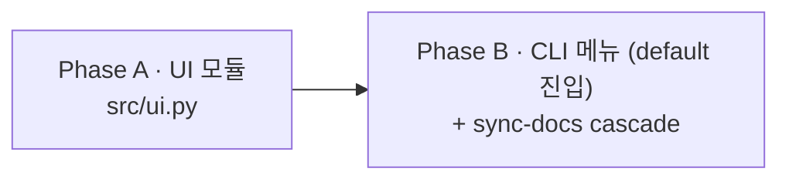

# Plan · 인터랙티브 UI

## 0. 메타

- 작업 ID: `006-ui`
- 의도: `src/ui.py`(6지선다 + directive + spinner) + `src/cli.py` 메뉴 진입(default 동작) wiring으로 outline/03-ux §3.2/§3.3 SSOT 코드 GAP 제거. 기획자 페르소나(outline/03-ux §3.1 line 19, Q14) 1차 사용자 — `dialectic` 단독 실행이 default 진입로
- 관련 ADR / Q번호:
  - Q14 (메뉴 + CLI 둘 다, outline/03-ux §3.1)
  - Q18 (`--interactive` default critical — Day 2 한정 `end-only`, 본 plan은 default 변경 X)
- 예상 영향 범위:
  - 신규: `src/ui.py`, `tests/test_ui.py`, `tests/test_cli_menu.py`
  - 수정: `src/cli.py` (default 메뉴 진입 분기)
  - 문서: `dev-docs/systems/orchestrator.md §cli`, `runtime-docs/systems/run-mode.md §1`, README 진입로 narrative
- LOC 추정: ~110 LOC (코드 ~80 + 테스트 ~30)
- **분리된 backlog**: mock 어댑터 (`src/agents/mock.py` + `--mock`/`--record`/`--mock-decisions` 인자 + 녹음 자산) — 본 plan에서 분리, 후속 plan 007 후보 (동영상 시연 결과 보고 진행/폐기 결정)

## 1. AS-IS (현재 상태)

### 1.1 UI 부재

- `src/ui.py` 부재. 사용자 결정 함수 0
- `src/orchestrator.py:run_turn` (`:336`, `:392`)에서 `directive=None` 하드코딩 — 본 plan은 `--interactive end-only` 단일이라 매 턴 directive 통로 미구현 유지 (후속 plan에서 critical/full 도입 시 wiring)
- `src/cli.py` (84 LOC): `--interactive choices=["end-only"]` 단일 노출 (`:54-56`). default 진입(`dialectic` 단독 실행) 시 메뉴 미구현 — `:64-66` `parser.print_help() + return 0` 으로 즉시 종료. 기획자 페르소나가 진입 통로 0

### 1.2 SSOT narrative (변경 없음, 참조용)

- outline/03-ux §3.3 (line 254-269) — 6지선다 정본: `a` accept driver / `r` accept reviewer / `m` merge / `i` iterate / `e` end / `s` skip review. Enter = iterate + empty directive
- outline/03-ux §3.2 단계 1~5 (line 104-252) — 메뉴 진입 narrative (환경 점검 → 모드 선택 → task 선택 → 매핑·workdir → 턴 진행). 본 plan은 단계 1·3 minimum cut
- outline/03-ux §3.1 line 19-69 — 진입로 1·2 (메뉴/CLI) + `--interactive` 강도 dial

## 2. TO-BE (목표 상태)

### 2.1 `src/ui.py` (~80 LOC, 신규)

- `prompt_decision(turn_id, *, interactive_mode) -> tuple[str, str | None]`
  - 키 매핑: `a/r/m/i/e/s` (outline §3.3 SSOT 1:1)
  - Enter (빈 입력) = `("i", None)` (outline default UX)
  - 잘못된 키 → 안내 + retry. `INVALID_RETRY_LIMIT=3` 회 fail → `("i", None)` fallback (비대화형 환경 무한 루프 차단)
  - `KeyboardInterrupt` (Ctrl-C) → `("e", None)`
  - `EOFError` (stdin 닫힘 / 파이프) → `("e", None)`
  - `interactive_mode == "end-only"` 시 directive 입력 단계 skip (key만 받음)
- `Spinner` — 컨텍스트 매니저. ANSI `⠋⠙⠹⠸⠼⠴⠦⠧⠇⠏` 회전, threading.Thread daemon. `not sys.stderr.isatty()` 시 모든 메서드 no-op (CI·파이프 noise 0)
  - 외부 의존성 0 (표준 라이브러리만, code-conventions §2)

### 2.2 `src/cli.py` 수정 (~30 LOC)

- `_interactive_menu(parser) -> int` 신규 함수 (outline §3.2 단계 1·3 minimum cut):
  - 환경 점검 1줄 출력 ("✓ codex CLI / claude CLI / 인증 ..." `env_check.check_env()` 결과 요약 1줄)
  - task 한 줄 입력 (`input("task (한 줄): ")`)
  - default 매핑(driver=codex, reviewer=claude) + max-turns=1 + interactive=end-only 고정
  - `args = parser.parse_args(["run", "--task", task_input])` 으로 run 분기 호출
  - `EOFError` / `KeyboardInterrupt` catch → exit 0 (안전 종료)
  - 단계 2(모드 선택) / 4(매핑·workdir) / 5(턴 진행 화면)는 후속 plan 분리
- `if not args.cmd:` 분기 (`:64-66`) → `return _interactive_menu(parser)` 로 변경

### 2.3 단위 테스트 (~30 LOC)

- `tests/test_ui.py`:
  - 6 키 매핑 (`a/r/m/i/e/s`) → 정확한 tuple 반환
  - Enter (`""`) → `("i", None)`
  - invalid key 3회 → `("i", None)` fallback
  - EOFError → `("e", None)`
- `tests/test_cli_menu.py`:
  - `_interactive_menu` EOFError 시 exit 0 (monkeypatch input)
  - task 입력 시 `parse_args(["run", "--task", task])` 호출 검증

### 2.4 sync-docs cascade

- `docs/dev-docs/systems/orchestrator.md §cli` (`:148-153`) — default 메뉴 narrative 추가 ("`dialectic` 단독 실행(default 진입) 시 `_interactive_menu` 호출, task 한 줄 입력 후 default 매핑으로 run 분기")
- `docs/runtime-docs/systems/run-mode.md §1` — 진입로 narrative 보강 ("`dialectic` (default 진입) → 메뉴 → run 분기 자동")
- `README.md` — 진입로 1(메뉴) 5초 데모 한 줄 + Day 2 한정 동작 narrative
- `docs/dev-docs/Documentation-Checklist.md §1.1` (`:66`) — `src/ui.py` 행 outline 매핑 사실 오류 (`§2.2/2.3` 헤더는 outline에 부재) → 본 plan sync-docs cascade에서 `§3.2/3.3`으로 정정. `src/cli.py` 행(line 64)은 정합

## 3. Phase 인덱스

### 3.1 의존성 그래프

A는 자급자족 (외부 호출자 0). B는 A의 `Spinner`/`prompt_decision` import 의존. 직렬 2 Phase.

### 3.2 Phase 파일 경로

| Phase | 경로 | 의존 | 병렬 그룹 |
|---|---|---|---|
| A · UI 모듈 | [phase-a-ui.md](phase-a-ui.md) | (없음) | — |
| B · CLI 메뉴 (default 진입) | [phase-b-cli-menu.md](phase-b-cli-menu.md) | A | — |

## 4. 비기능 요구

- **외부 의존성 0** — 표준 라이브러리만 (code-conventions §2). spinner는 `threading` + ANSI escape, 메뉴는 `input()`. 추가 시 ADR 필요
- **R-001 P-ENCODING** — 모든 파일 I/O `encoding="utf-8"` 명시. 본 plan은 file I/O 자체가 적음(메뉴 task 입력은 stdin) — write_text 0, read_text는 phase B의 env_check 결과 요약만 (이미 `env_check.py:check_env()` 자체에서 처리)
- **stdin 안전성** — UI/메뉴 둘 다 EOF/Ctrl-C에서 raise 누수 X. 비대화형 환경(파이프, CI) 자연 동작
- **회귀 0** — `--interactive end-only` 기본 동작 변경 X. 기존 8 테스트 파일 모두 pass

## 5. 위험 (Phase 횡단)

### 5-1. R-001 P-ENCODING 회귀

- **위험**: 신규 파일 3개 (`ui.py`, `test_ui.py`, `test_cli_menu.py`) + 기존 수정 (`cli.py`) — encoding 누락 시 P0
- **차단**: review-code-checklist §1 P0 자동 catch (R-001 정식 환원). 본 plan은 file I/O 자체가 적어 적용점 좁음 (`prompt_decision`은 stdin, spinner는 stderr write — 모두 encoding 무관)

### 5-2. 비대화형 환경 stdin EOF

- **위험**: 파이프 / CI 진입 시 `input()` `EOFError` raise → traceback 노출, exit ≠ 0
- **차단**: Phase A `prompt_decision` + Phase B `_interactive_menu` 둘 다 try/except `(EOFError, KeyboardInterrupt)` 명시. test 케이스 monkeypatch 검증

### 5-3. spinner ANSI 호환성

- **위험**: Windows cmd.exe / 일부 CI 터미널 (`isatty()=True`인데 escape 미지원)에서 `⠋⠙` 깨짐
- **차단**: 본 plan은 `not sys.stderr.isatty()` 가드만 (CI·파이프 silent). isatty=True인 깨진 터미널 명시 catch는 후속 plan(`--no-spinner` flag 또는 ASCII fallback) 검토. README narrative에 "Linux/macOS 터미널 검증, Windows native 미검증" 명시

### 5-4. 메뉴 minimum cut 범위 한정

- **위험**: 사용자가 `dialectic` 진입했을 때 outline §3.2 단계 2(모드 선택) / 4(매핑·workdir) 부재로 expect 어긋남 → 운영자 혼동
- **차단**: 메뉴 첫 줄에 "Day 2 minimum cut: run 모드 + default 매핑 (codex/claude). 다른 옵션은 CLI 인자로." 명시. 후속 plan(메뉴 단계 확장)에서 점진 도입

### 5-5. mock 어댑터 deferred 결과 README 신뢰성

- **위험**: 본 plan은 mock 미포함이라 인증 부재 시 `dialectic run` 실행 통로 0. 평가자가 README 따라 직접 실행 시도 시 인증 막힘 → 도구 외면 60% 가능
- **차단**: 본 plan 범위 외. 동영상 시연 + README narrative 갱신("인증 후 실행" 명시)으로 1차 cover. 평가자 reaction 정보 모은 후 plan 007-mock-adapter 진행 결정

## 6. 완료 기준 (Definition of Done)

- [ ] (Phase A) `src/ui.py` 작성 + `tests/test_ui.py` (≥4 케이스: 6 키 매핑 / Enter default / EOF / invalid retry) pass
- [ ] (Phase A) `prompt_decision` keyword-only 인자, EOF/Ctrl-C 정상 종료, 모든 file I/O `encoding="utf-8"` (file I/O 부재 시 vacuously OK)
- [ ] (Phase A) `Spinner` `not sys.stderr.isatty()` 가드 + threading 정리 (`__exit__`에 join)
- [ ] (Phase B) `src/cli.py` `_interactive_menu` 함수 + `if not args.cmd` 분기 변경
- [ ] (Phase B) `tests/test_cli_menu.py` (≥3 케이스: EOF / empty task / KeyboardInterrupt) pass
- [ ] (Phase B) `dialectic` (default 진입) 명령 직접 실행 → 메뉴 표시 (task 입력 prompt 출력 후 stdin EOF로 안전 종료, exit 0)
- [ ] (Phase B) sync-docs cascade — `orchestrator.md §cli` + `run-mode.md §1` + README 갱신
- [ ] 전체 회귀 0 — `pytest -q` 8 → ≥10 파일 모두 pass
- [ ] review-code P0 = 0 (R-001 encoding 포함)

## 7. 참조 .md

- `outline/03-ux.md` §3.1 (`:19-69`), §3.2 (`:104-252`), §3.3 (`:254-269`) — UI/메뉴/6지선다 SSOT
- `docs/runtime-docs/protocol.md` §2 (Meta `is_mock`) — 메뉴 진입 시 directive 메시지 필드 (본 plan은 wiring X, 후속 plan)
- `docs/dev-docs/systems/orchestrator.md` §cli (`:148-153`) — default 메뉴 narrative 추가 대상
- `docs/runtime-docs/systems/run-mode.md` §1 — 진입로 narrative 보강 대상
- `docs/dev-docs/code-conventions.md` §2 (외부 의존성 0), §6 (CLI 인자 처리)
- `docs/dev-docs/validation.md` R-001 (P-ENCODING)
- `plan/completed/005-patch-apply-impl/01-plan.md` — 직전 plan 워크플로우 학습 ref
- (deferred) `plan/007-mock-adapter/` (백로그) — mock 어댑터 + 녹음 자산. 동영상 시연 결과 보고 진행/폐기 결정
