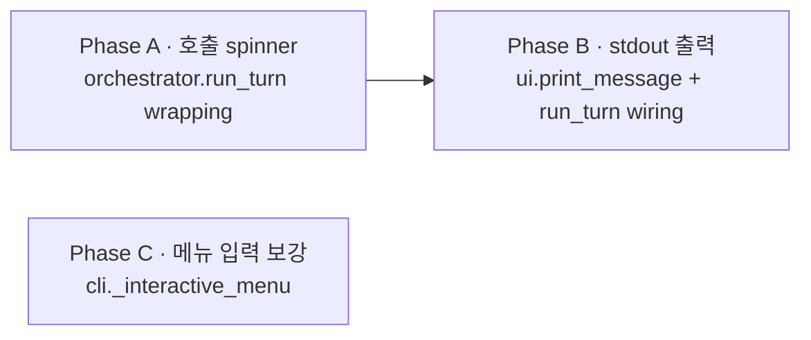

# Plan · UI polish (호출 spinner + stdout 출력 + 메뉴 입력 보강)

## 0. 메타

- 작업 ID: `008-ui-polish`
- 의도: `dialectic` 단독 실행 시 driver/reviewer 호출 동안 (1) 진행 spinner, (2) 결과 stdout 출력, (3) 메뉴 입력 안내가 모두 결여된 결함 3건을 단일 plan으로 묶어 wiring. outline/03-ux §3.2 narrative SSOT 코드 갭 제거.
- 관련 ADR / Q번호:
  - Q14 (메뉴 + CLI 둘 다 — outline/03-ux §3.1 line 19)
  - Q7 (단일 창 + ANSI 색 — outline/03-ux §3.2 line 244-252)
  - ADR-9 (`--max-turns < K+1` fallback — 본 plan 변경 X, 인용만)
- 예상 영향 범위:
  - 수정: `src/orchestrator.py` (run_turn driver/reviewer 호출 wrapping), `src/ui.py` (print_message + ANSI 상수), `src/cli.py` (_interactive_menu 보강)
  - 신규 테스트: `tests/test_orchestrator_spinner.py` (또는 동등), `tests/test_ui_print_message.py`, 기존 `tests/test_cli_menu.py` 케이스 추가
  - 문서: `docs/dev-docs/systems/orchestrator.md`, `docs/runtime-docs/systems/run-mode.md`, `README.md`, `docs/dev-docs/Documentation-Checklist.md §1.1` 매핑 (필요 시)
- LOC 추정: ~110 LOC (코드) + ~50 LOC (테스트)
- **분리된 backlog (deferred)**: `dialectic logs` 서브커맨드 (plan 009-observability), env_check 병렬·`claude doctor` timeout 안정화 (plan 009), workdir default 변경 `/tmp` → `~/.local/share/dialectic/runs` (plan 009 / validation.md C-010 환원), 메뉴 단계 2(모드 선택) / 4(매핑·workdir) (plan 010-menu-expansion), mock 어댑터 + `--mock`/`--record`/`--mock-decisions` 인자 + 녹음 자산 (plan 007-mock-adapter)

## 1. AS-IS (현재 상태)

### 1.1 호출 진행 표시 부재 (Phase A 대상)

- `src/orchestrator.py:run_turn` (`:309-427`): driver/reviewer 호출은 `runner.run(...)` 한 줄 (`:337`, `:393`) — 호출 동안 stderr/stdout 출력 0. 사용자가 본 30~50초 동안 화면 정지로 인지
- `src/ui.py:Spinner` 클래스 (`:82-124`)는 plan 006에서 구현됨 — 컨텍스트 매니저, isatty 가드, thread.join 정리 모두 보유. 그러나 외부 호출자 0 (`grep -rn "Spinner(" src/` → ui.py 정의만)
- outline/03-ux §3.2 line 190-194 narrative SSOT: `[구현자: Codex CLI] running... ⠋` 형식 + 종료 1줄 `[구현자: Codex CLI] ✓ 18.4s · 245 out / 1.2k in`

### 1.2 호출 결과 stdout 미출력 (Phase B 대상)

- `src/orchestrator.py:run_turn` proposal append (`:371`) + critique append (`:427`) 후 stdout 출력 0. `bus.append`로 JSONL에만 기록
- 사용자에게는 `run_session` finally 블록 (`:521-526`)의 workdir 안내 1회만 표시 — 결과 자체는 사용자가 직접 `messages.jsonl` 열어야 인지
- outline/03-ux §3.2 line 195-225 narrative SSOT: 구분선·헤더·본문 형식 + ANSI 색상 (§3.5 line 362, kind별 cyan/yellow/green/red) — 모두 코드 wiring 0
- `src/ui.py`에 stdout 출력 helper 부재 — `print_message` 등 함수 0

### 1.3 메뉴 입력 UI 불친절 (Phase C 대상)

- `src/cli.py:_interactive_menu()` (`:69-107`):
  - task input prompt (`:91`) `task (한 줄):` 단일 — example 부재. 기획자 페르소나가 무엇을 입력해야 할지 추측
  - 진행 확인 단계 부재 — task 입력 즉시 `orchestrator.run_session` 호출, 사용자가 "잘못 입력했나" 인지 못하고 30~50초 호출 진입
  - 도움말 키 부재 — `?` 입력 등 안내 통로 0
- 환경 점검 1줄 요약 + EOFError/KeyboardInterrupt 안전 종료는 plan 006에서 이미 구현 (변경 X)

### 1.4 SSOT narrative (변경 없음, 참조용)

- outline/03-ux §3.2 line 104-252 — 메뉴 단계 1~5 narrative + 단계 5 턴 진행 화면 형식 (spinner + 종료 1줄 + 본문 + 구분선)
- outline/03-ux §3.5 line 336-376 — `dialectic logs` 서브커맨드 narrative (본 plan 범위 외, plan 009)와 ANSI 색상 SSOT (line 362)
- outline/03-ux §3.1 line 19-69 — 진입로 1·2 + `--interactive` 강도 dial

## 2. TO-BE (목표 상태)

### 2.1 `src/orchestrator.py:run_turn` 수정 (~50 LOC, Phase A·B 공통 영역)

- driver 호출 (`:337`)을 `Spinner(driver_message)` 컨텍스트로 감싸기 — 메시지 형식: `[{role_label}: {vendor_label}] running...` (vendor_label dict 신설)
- driver 호출 종료 직후 (try 블록 내, 빈 응답 가드 통과 후) `print_message(role_label, vendor_label, kind="proposal", text=resp1.text, meta=resp1.meta)` 호출
- reviewer 호출 (`:393`)도 동일 wrapping + critique 출력
- 종료 1줄 출력은 `print_message` 내부에서 헤더로 처리 (outline §3.2:193 SSOT 1:1)
- 빈 응답·에러 분기에서는 spinner 종료 후 stderr 1줄 (`✗ {exception}` 형식)으로 사용자 인지 통로 보장 — 본 plan은 stdout 미출력 분기 그대로 유지하되 `with` 컨텍스트 매니저 자연 종료로 spinner clear

### 2.2 `src/ui.py` 보강 (~25 LOC)

- ANSI 색상 상수 paste (outline §3.5:362 SSOT):
  - `ANSI_CYAN = "\x1b[36m"` / `ANSI_YELLOW = "\x1b[33m"` / `ANSI_GREEN = "\x1b[32m"` / `ANSI_RED = "\x1b[31m"` / `ANSI_RESET = "\x1b[0m"`
  - kind 매핑: `KIND_COLOR = {"proposal": ANSI_CYAN, "critique": ANSI_YELLOW, "decision": ANSI_GREEN, "error": ANSI_RED}`
- `VENDOR_LABEL = {"codex": "Codex CLI", "claude": "Claude Code", "mock": "Mock"}` paste — orchestrator·메뉴에서 동시 참조
- `ROLE_LABEL_KO = {"implementer": "구현자", "spec-reviewer": "기획 검토자", "planner": "계획자", "plan-reviewer": "계획 검토자"}` paste — outline §3.2 line 190 / 240 1:1
- `print_message(*, role_label: str, vendor_label: str, kind: str, text: str, meta) -> None` keyword-only 신설 — outline §3.2 line 193-201 형식 1:1:
  - 구분선 1줄 (65 chars `─`)
  - 헤더 1줄: `{color}[{role_label}: {vendor_label}] ✓ {latency}s · {output_tokens} out / {input_tokens} in{cost_part}{reset}` — `cost_part`는 `meta.cost_usd`가 None이 아니면 ` · ${cost:.3f}`, 아니면 빈 문자열
  - 구분선 1줄
  - 본문 (text 그대로)
  - 구분선 1줄 (마지막)
- isatty 가드 — `sys.stdout.isatty()` False 시 ANSI 색상 모두 빈 문자열로 치환 (escape 노이즈 차단). 출력 자체는 항상 진행 (CI/pytest에서도 결과 인지 가능)

### 2.3 `src/cli.py:_interactive_menu` 보강 (~30 LOC)

- task input prompt 변경: `task (한 줄, 예: 'wave 5의 적 수와 HP를 dict로 반환하는 함수 작성', '?'=도움말):`
- task input 분기:
  - `?` 입력 시 사용 안내 1줄 출력 후 retry (`while True` 루프 진입)
  - 빈 입력 시 기존 동작 (`task 비어 있음 — 종료.` + return 0) 유지
  - EOFError/KeyboardInterrupt 안전 종료 유지
- 진행 확인 단계 신규: task 입력 후 `driver=codex, reviewer=claude, 1턴 — 진행? [Y/n]:` prompt
  - 빈 입력 또는 `y`/`Y` → 진행
  - `n`/`N` → `print("취소.")` + return 0
  - 그 외 → 빈 입력 동치 (Y default, 친절 동작)
  - EOFError/KeyboardInterrupt → return 0

### 2.4 단위 테스트 (~50 LOC)

- `tests/test_orchestrator_spinner.py` (또는 기존 `test_orchestrator_*` 확장) ≥2 케이스:
  - spinner 컨텍스트 매니저가 driver 호출 wrapping (mock runner + capsys로 stderr write 검증)
  - isatty=False 환경에서 spinner no-op (기존 plan 006 가드 회귀 0)
- `tests/test_ui_print_message.py` ≥3 케이스:
  - kind=proposal → cyan 색상 + 헤더 + 구분선 + 본문 (capsys stdout 단언)
  - kind=critique → yellow 색상
  - isatty=False 환경 → ANSI escape 부재 (`\x1b` 미포함)
- `tests/test_cli_menu.py` 기존 파일에 케이스 추가 ≥3:
  - example 표시 — task input prompt에 `wave 5` substring 포함 단언
  - 진행 확인 `n` 거부 → return 0 + `취소` substring (capsys stdout)
  - `?` 도움말 키 → 안내 출력 + retry (input 두 번 호출)

### 2.5 sync-docs cascade

- `docs/dev-docs/systems/orchestrator.md` §turn lifecycle / §cli — driver/reviewer 호출 wrapping narrative ("호출 동안 `Spinner` 컨텍스트로 stderr 진행 표시, 종료 직후 `ui.print_message`로 stdout 결과 출력")
- `docs/runtime-docs/systems/run-mode.md` §1 (진입 narrative) 또는 §턴 진행 화면 — outline §3.2 line 190-225 narrative ↔ 코드 wiring 매핑 1줄
- `README.md` — 진입로 1(메뉴) 데모 narrative 갱신: spinner + 결과 출력 동작 1줄 (이미 메뉴 narrative 있다면 보강)
- `docs/dev-docs/Documentation-Checklist.md §1.1` (`:66`) `src/ui.py` 행 매핑 — `print_message` 추가에 따른 갱신 필요 시 검토 (기존 §3.2/3.3 매핑은 유지, 새 ANSI/print_message 책임은 §3.2 line 190-225 + §3.5 line 362로 자연 포함)

## 3. Phase 인덱스

### 3.1 의존성 그래프

A·B는 `run_turn` 동일 함수 수정이라 직렬 (B가 A의 spinner stop 직후 print_message 호출). C는 `cli.py` 단독, A·B 무관 — 독립 병렬 가능.

### 3.2 Phase 파일 경로

| Phase | 경로 | 의존 | 병렬 그룹 |
|---|---|---|---|
| A · 호출 spinner | [phase-a-spinner.md](phase-a-spinner.md) | (없음) | A·B 직렬, C 독립 |
| B · stdout 출력 | [phase-b-stdout.md](phase-b-stdout.md) | A | A·B 직렬, C 독립 |
| C · 메뉴 입력 보강 | [phase-c-menu-polish.md](phase-c-menu-polish.md) | (없음) | C 독립 (A·B와 병렬 가능) |

## 4. 비기능 요구

- **외부 의존성 0** — 표준 라이브러리만 (code-conventions §2). spinner는 기존 `threading` + ANSI escape, print_message는 `sys.stdout` write만. 추가 시 ADR 필요
- **R-001 P-ENCODING** — 본 plan 산출물은 stdin/stdout만 사용 → file I/O 0 (vacuously OK). 신규 테스트 파일에 `read_text`/`write_text` 추가 시 `encoding="utf-8"` 강제
- **keyword-only 인자 (`*` 마커)** — `print_message`는 모든 인자 keyword-only. 헬퍼/orchestrator 호출 시 명시
- **JSONL append-only** — 본 plan은 stdout 출력만 추가. orchestrator의 `bus.append` 호출 위치·횟수 변경 0 (Phase B는 print_message를 append 직후에 추가)
- **frozen Meta** — 본 plan은 Meta 직접 변경 0 (출력만 읽음). 회귀 0
- **subprocess cwd 명시 (ADR-6)** — 본 plan은 subprocess 신규 호출 0이라 vacuously OK. 기존 cwd 가드 영향 X
- **isatty 가드** — Spinner는 plan 006에서 stderr isatty 가드 보유. print_message는 stdout isatty False 시 ANSI 색상만 빈 문자열, 출력 자체는 진행

## 5. 위험 (Phase 횡단)

### 5-1. spinner stderr ↔ print_message stdout 채널 분리

- **위험**: spinner는 stderr `\r` carriage return으로 라인 갱신, print_message는 stdout. 두 채널이 한 터미널에서 섞이면 spinner 잔여 frame이 결과 헤더 옆에 남을 가능성
- **차단**: Spinner `__exit__`에서 이미 `\r + 공백 + \r`로 라인 clear (`src/ui.py:107-110`). print_message는 `with Spinner(...):` 블록 종료 후 호출 — 컨텍스트 매니저 자연 정리. test에서 capsys로 stderr/stdout 분리 단언

### 5-2. isatty=False (CI/파이프) 회귀

- **위험**: pytest 등 비대화형 환경에서 ANSI escape가 평문 출력되면 capsys 단언 노이즈, 회귀 발생
- **차단**: print_message에 `sys.stdout.isatty()` False 시 ANSI 색상 모두 빈 문자열 치환 가드. 단위 테스트에 `monkeypatch.setattr(sys.stdout, 'isatty', lambda: False)` 케이스 추가

### 5-3. 빈 응답·에러 분기 spinner 누수

- **위험**: orchestrator의 driver/reviewer 호출이 `subprocess.TimeoutExpired` 등 except 진입 시 `with Spinner(...)` 블록이 정상 `__exit__` 호출되어야 함. 누수 시 thread join 실패
- **차단**: `with` 컨텍스트 매니저는 except에서도 `__exit__` 호출 보장 (Python 언어 명세). Spinner는 plan 006에서 `__exit__`에 `Event.set() + thread.join(timeout=1)` 보유 — 회귀 0. test 케이스 1개로 `runner.run` raise 시 spinner 정리 단언

### 5-4. 진행 확인 단계 의도 충돌

- **위험**: 사용자가 task만 입력하고 즉시 실행을 원하는데 `진행? [Y/n]` 추가 단계가 마찰. 일부 페르소나에는 불필요
- **차단**: 빈 입력·`y`·invalid 모두 Y default (친절 동작) — 1번 Enter로 통과. 후속 plan에서 `--no-confirm` flag 검토 (본 plan 범위 외)

### 5-5. 한국어 role label 일관성

- **위험**: outline §3.2 line 190 `[구현자: Codex CLI]` ↔ §3.2 line 240 `[기획 검토자]` ↔ 코드의 `MODE_ROLES` 영문 키 (`implementer`, `spec-reviewer`) 사이 매핑 일관성 깨질 가능
- **차단**: `src/ui.py:ROLE_LABEL_KO` paste dict 단일 정본. orchestrator는 `ROLE_LABEL_KO[role]`로만 접근. test에서 4 role × 2 vendor 8 조합 중 ≥1 케이스 단언

### 5-6. 후속 plan 의존 (deferred 5건)

- **위험**: 본 plan은 `dialectic logs`·env_check 안정화·workdir default·메뉴 단계 2·4·mock 어댑터 모두 포함 X. 평가자가 기대할 동작 일부 미달
- **차단**: §0 메타에 deferred backlog 5건 명시 + 후속 plan 번호 부여 (007/009/010). README narrative에 "Day 2 minimum cut + UI polish; logs/mock은 후속" 1줄 (필요 시 sync-docs cascade에서 검토)

## 6. 완료 기준 (Definition of Done)

- [ ] (Phase A) `src/ui.py`에 `VENDOR_LABEL` + `ROLE_LABEL_KO` paste dict 추가 (Phase B의 ANSI 상수·`print_message`는 별도 책임)
- [ ] (Phase A) `src/orchestrator.py:run_turn` driver 호출 (`:337`) + reviewer 호출 (`:393`) 둘 다 `with Spinner(...):` 컨텍스트로 wrapping
- [ ] (Phase A) `tests/test_orchestrator_spinner.py` (또는 기존 파일 확장) ≥2 케이스 pass — spinner 라이프사이클 (`__enter__`/`__exit__`) + isatty=False 회귀 0
- [ ] (Phase A) `dialectic run --task "test" --max-turns 1` 수동 실행 시 driver/reviewer 호출 동안 spinner 화면 표시 (수동 검증, `--task "echo"` mock runner 부재 시 인증 분기 진입까지만 단언)
- [ ] (Phase B) `src/ui.py`에 ANSI 상수 5개 + `KIND_COLOR` + `SEPARATOR` paste 추가
- [ ] (Phase B) `src/ui.py:print_message` keyword-only 함수 신설 (Phase A의 paste dict 활용)
- [ ] (Phase B) `tests/test_ui_print_message.py` ≥3 케이스 pass — proposal/critique/isatty=False
- [ ] (Phase B) `src/orchestrator.py:run_turn` proposal append (`:371`) + critique append (`:427`) 직후 `print_message(...)` 호출. 실 호출 시 stdout에 결과 출력 (수동 검증)
- [ ] (Phase C) `src/cli.py:_interactive_menu` example + 진행 확인 단계 + `?` 도움말 키 추가
- [ ] (Phase C) `tests/test_cli_menu.py` 기존 파일에 케이스 추가 ≥3 — example 표시 / 진행 확인 `n` 거부 / `?` 도움말 retry
- [ ] 전체 회귀 0 — `pytest -q` 43 → ≥48
- [ ] sync-docs cascade — `dev-docs/systems/orchestrator.md`, `runtime-docs/systems/run-mode.md`, `README.md` 갱신. `Documentation-Checklist.md §1.1` 매핑 변경 X (line 58·59 `src/orchestrator.py` / line 64 `src/cli.py` / line 66 `src/ui.py` 모두 기존 매핑이 `print_message`·spinner wiring·메뉴 보강을 자연 포함 — outline §3.2/§3.5 SSOT 인용 1줄)
- [ ] review-code P0 = 0 (R-001 encoding 포함)

## 7. 참조 .md

- `outline/03-ux.md` §3.1 (`:19-69`), §3.2 (`:104-252`), §3.5 (`:336-376`) — 진입로/메뉴/턴 진행 화면/ANSI 색상 SSOT
- `docs/runtime-docs/protocol.md` §3 (MODE_ROLES) / §4 (turn lifecycle) — 본 plan 변경 X, 인용만
- `docs/dev-docs/architecture.md` ADR 표 — ADR-6 (cwd 격리, vacuously OK), ADR-9 (`--max-turns < K+1` fallback, 변경 X), ADR-10 (patch_apply, 본 plan 영향 0)
- `docs/dev-docs/code-conventions.md` §2 (외부 의존성 0), §6 (CLI 인자 처리)
- `docs/dev-docs/validation.md` R-001 (P-ENCODING) — 본 plan은 stdin/stdout만이라 vacuously OK
- `docs/dev-docs/Documentation-Checklist.md §1.1` (`:64-66`) — `src/cli.py` / `src/orchestrator.py` / `src/ui.py` 매핑
- `docs/dev-docs/systems/orchestrator.md` — turn lifecycle + cli SSOT (sync-docs 대상)
- `docs/runtime-docs/systems/run-mode.md` — Day 2 산출물 SSOT (sync-docs 대상)
- `src/orchestrator.py` (`:309-427` run_turn, `:33` MODE_ROLES) — 수정 대상
- `src/ui.py` (`:82-124` Spinner) — 보강 대상 (`print_message` 신설)
- `src/cli.py` (`:69-107` _interactive_menu) — 수정 대상
- `plan/completed/006-ui/01-plan.md` + `phase-*.md` — 직전 plan 워크플로우 학습 ref (Spinner·메뉴 minimum cut SSOT)
- `plan/completed/005-patch-apply-impl/01-plan.md` — orchestrator wiring 패턴 사례 (frozen Meta `dataclasses.replace` 패턴)
- (deferred) `plan/007-mock-adapter/` (백로그 — mock 어댑터)
- (deferred) `plan/009-observability/` (백로그 — `dialectic logs`, env_check 병렬, workdir default 변경)
- (deferred) `plan/010-menu-expansion/` (백로그 — 메뉴 단계 2/4)
