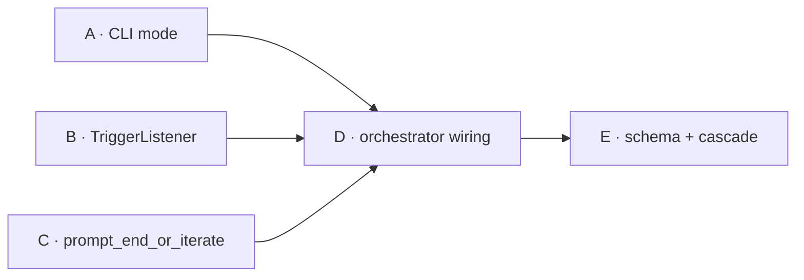

# Summary · User Synthesis Wiring

## 의도

본 도구 thesis "사용자 = synthesis 생성자"를 mid-session 단위로 실제 wiring. CLI/메뉴 mode 확장 + Ctrl+F 비동기 트리거 + critical 모드 잠재 prompt + full 모드 매 턴 6지선다 + 기존 `decision` kind 재사용.

## 배경 / 동기

`src/ui.py:59-108 prompt_decision` 호출자 0건 (docstring `:73`) → 핵심 thesis가 한 턴 단위에서 작동 X. plan 008(UI polish, 완료) 위에 본 plan이 wiring (Q18 강도 dial 정합). outline §3.1 critical = `reviewer P0/P1 자동 검출` 정의는 critique parser 부재로 미구현 → 본 plan이 outline 다중 위치 narrative cascade 갱신.

## Phase 흐름

## 핵심 의사결정

- 트리거 키 = **Ctrl+F (chr(0x06))**
- mode default: CLI=`end-only` / 메뉴=`critical`
- `[CONVERGED]` 정책 변경 — critical/full은 강제 종료 차단 → ADR-9 narrative cascade
- TriggerListener 공존 = **cleanup-restart 패턴**
- outline §3.1·§3.2·§3.3 narrative cascade 5 위치 (`:29`/`:32`/`:34`/`:61-65`/`:226-238`/`:271-282`)
- **`decision` kind 재사용** (protocol.md:238 SSOT) — `user_synthesis` 신설 폐기
- schema.py:53 kind 6→7종 정정 (patch_applied outdated 정정만)
- **wrap 함수 양산 폐기** — `_serialize_history`/`build_prompt`/`run_turn`에 `*, exclude_reviewer/skip_reviewer` keyword 인자 (default False, 회귀 0)
- full r 분기 directive 주입 = `_decision_msg` directive에 사용자 입력 우선 / 없으면 critique 요약 자동 — `_serialize_history:104` USER 라인 자연 처리, run_turn 추가 인자 0
- `MAX_TURNS_HARD_CAP=20` (critical·full + 초기 args 가드)
- mock fallback narrative (현재 vacuous, plan 007 진입 후 활성)

## 핵심 위험

- subprocess stdin 점유 vs listener raw mode (R1) → Phase B §5 실 호출 검증
- `tcsetattr` 복원 실패 (R3) → `__exit__` try/finally + SIGINT 핸들러 (Phase D _setup_sigint_handler)
- 기존 raw mode 자산 중첩 (R5) → 가동 시점 분리
- ADR-9 정책 변경 cascade 누락 시 SSOT 어긋남 (R5-8)
- 시그니처 확장 회귀 (R5-9) → default False 단위 테스트
- mock 어댑터 부재 vs fallback (R5-10) → plan 007 진입 후 활성 narrative

## DoD 요약

- [ ] (Phase A) choices 3종 + 메뉴 default critical + parser 격리 검증
- [ ] (Phase B) Ctrl+F 실 호출 + `__exit__` cleanup 단위 테스트
- [ ] (Phase C) 4 분기 + outline §3.2:216 라벨 SSOT
- [ ] (Phase D) 3 mode × 종료 매트릭스 ≥10 + `MAX_TURNS_HARD_CAP=20` + 초기 가드 + SIGINT
- [ ] (Phase E) schema 7종 + Meta vendor 4종 + outline 5 cascade + ADR-9
- [ ] sync-docs 누락 0 / review-code P0 = 0

→ 상세: [01-plan.md](01-plan.md), Phase별 [phase-*.md](.)
