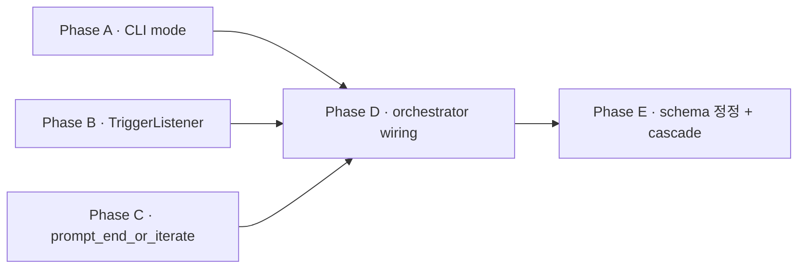

# Plan · User Synthesis Wiring

## 0. 메타

- 작업 ID: `009-user-synthesis-wiring`
- 의도: 본 도구 thesis "사용자 = synthesis 생성자"를 mid-session 단위로 실제 wiring. CLI/메뉴 mode 확장 + Ctrl+F 비동기 트리거 + critical 모드 잠재 prompt + full 모드 매 턴 6지선다 + 기존 `decision` kind 재사용으로 사용자 입력 JSONL 기록
- 관련 ADR / Q번호:
  - Q18 (`--interactive` 강도 dial — `outline/03-ux.md` §3.1)
  - ADR-6 (cwd 격리)
  - ADR-9 (`[CONVERGED]` streak K — 본 plan에서 정책 변경 → architecture.md §6 narrative cascade)
  - ADR-10 (patch_apply seq=98 의도된 비대칭 — `decision` seq=97 정합)
- 예상 영향 범위:
  - 신규: `src/ui.py`(TriggerListener·prompt_end_or_iterate 추가), `tests/test_trigger_listener.py`, `tests/test_prompt_end_or_iterate.py`, `tests/test_orchestrator_decision_wiring.py`, `tests/test_schema_kind_table.py`
  - 수정: `src/cli.py:74-77` (`--interactive` choices) + `:257-262` (메뉴 default), `src/orchestrator.py:run_session` (mode 분기 wiring + 초기 가드 + mock fallback) + `:run_turn` (`*, skip_reviewer/exclude_reviewer_history` keyword 인자, default False 회귀 0) + `:_serialize_history` + `:build_prompt` (`*, exclude_reviewer` keyword 인자), `src/schema.py:53` (kind 표 outdated 정정), `src/schema.py:21` (Meta.vendor 4종)
  - 문서: `docs/runtime-docs/protocol.md` §6, `docs/dev-docs/systems/orchestrator.md`, `docs/dev-docs/systems/jsonl-bus.md`, `docs/dev-docs/code-conventions.md`, `docs/dev-docs/architecture.md` §6, `outline/03-ux.md` (5 위치 cascade), `docs/dev-docs/Documentation-Checklist.md` §1.1, `README.md`
- LOC 추정: 코드 ~165 LOC + 테스트 ~70 LOC
- **hot-fix round (사용자 수동 시연 후 적용)**: Ctrl+F 1회 단발 인식 race 차단을 위해 session 단위 listener (pause/resume) 시도 → 사용자 byte 절도 결함 발견 → cleanup-restart 패턴 회귀 + "2회 연타" narrative 수용 / c (취소) 분기 신설 + `allow_continue`·`allow_iterate_no_directive` 옵션 분기 (trigger 단독은 Y/c/text, CONVERGED·last_turn은 Y/n/text) / Enter retry pattern (3회 한계 fallback) / `__exit__` `tcflush(TCIFLUSH)` drain (Ctrl+F 연타 잔재 byte 차단) / vendor·agent_cli 5종 (system 추가, SENTINEL_META 정합) / sync-docs cascade (run-mode.md / current-implementation-flow.md / validation.md P-RAW)

### 핵심 설계 결정

- **`user_synthesis` kind 신설 안 함** — 기존 `decision` kind 재사용:
  - `protocol.md:238` SSOT 정합 (kind=decision, from=user)
  - `src/orchestrator.py:104 _serialize_history` decision 분기 이미 정합
  - `src/schema.py:55 directive` 슬롯 활용
- `schema.py:53` kind 6→7종 정정 (patch_applied 추가만 — outdated 정정. 실제 코드 사용 중)
- `schema.py:21` Meta.vendor 3→4종 ("user" 추가)
- **wrap 함수 양산 폐기** — `_run_turn_driver_only` 등 wrap 대신 `run_turn`에 keyword 인자 (`*, skip_reviewer/exclude_reviewer_history`) 추가. default False라 AS-IS 회귀 0
- **`build_prompt`에도 `*, exclude_reviewer` 키워드 인자** — `_serialize_history`로 전달. full a 분기 대응
- **full r 분기 directive 주입** — `_decision_msg`에 r key + directive(사용자 입력 또는 마지막 critique 요약 자동 주입). `_serialize_history:104` USER 라인 출력 → 다음 턴 driver prompt 자연 포함. `run_turn` 시그니처 추가 인자 없음
- **`MAX_TURNS_HARD_CAP=20` 초기값 가드** — `args.max_turns > HARD_CAP` 시 stderr 경고 + clamp (P1-ε)
- **mock 모드 fallback narrative** — 현재 `_resolve_runner`에 mock 미등록 (plan 007 deferred). `args.driver=="mock"` 자체가 ValueError raise 시점 — fallback 분기는 plan 007 진입 후 활성 (현재 vacuous)
- **outline §3.1 cascade 5 위치** — `:29`, `:32`, `:34`, `:61-65`, `:226-238`, `:271-282`

**선행 plan 의존**: plan 008-ui-polish (이미 완료, plan/completed/008-ui-polish/)

## 1. AS-IS (현재 상태)

### 1.1 사용자 개입 wiring 0

- `src/ui.py:59-108 prompt_decision` — 6지선다 정의. 호출자 0건 (docstring `:73`)
- `src/ui.py:111-155 Spinner` — 패턴 ref (isatty 가드 line 122)
- `src/cli.py:74-77` — `--interactive choices=["end-only"]` 단일값
- `src/cli.py:257-262` — `_interactive_menu_body`가 `interactive="end-only"` 고정

### 1.2 turn loop + serialize_history + build_prompt + run_turn

- `src/orchestrator.py:94-112 _serialize_history(history) -> str` — line 104 `if m.kind == "decision":` 분기 정합
- `src/orchestrator.py:115-128 build_prompt(role, task, history, directive)` — directive 인자 이미 존재. `_serialize_history(history)` line 123 호출
- `src/orchestrator.py:310-320 run_turn(turn_id, mode, *, driver_runner, reviewer_runner, bus, task, workdir, sessions_dir) -> None` keyword-only
- `src/orchestrator.py:343 build_prompt(driver_role, ..., directive=None)` driver call
- `src/orchestrator.py:411 build_prompt(reviewer_role, ..., directive=None)` reviewer call
- `src/orchestrator.py:412 reviewer_runner.run` reviewer 호출 위치
- `src/orchestrator.py:456 run_session` turn loop 진입점
- `src/orchestrator.py:498-505` `streak = 0` (line 499) + `for turn in range(1, args.max_turns + 1)` (line 500)
- `src/orchestrator.py:511-516` error 즉시 종료
- `src/orchestrator.py:525-532` `streak >= K` (line 527) auto_end_converged
- `src/orchestrator.py:480-486` ADR-9 K=1 fallback

### 1.3 schema kind 표 vs 실제 코드 (P0 결함 fact)

- `src/schema.py:53 kind` docstring **6종 (outdated)**
- 실제 코드: `src/orchestrator.py:292 kind="patch_applied"` 사용 (ADR-10 산출, line 50-52 narrative)
- `protocol.md:67 kind comment` 7종 (정합)
- → schema.py docstring outdated. Phase E §3.1 정정 (patch_applied 추가만)
- `src/schema.py:55 directive: str | None` — decision kind directive 본문 활용
- `src/schema.py:21 vendor: str` — `"openai" | "anthropic" | "mock"` 3종. user 추가 필요

### 1.4 src/ui.py 기존 raw mode 자산 (plan 008 완료 산출)

- `src/ui.py:163-206 stdin_utf8_mode` — IUTF8 set
- `src/ui.py:209-287 stdin_canonical_off` — canonical+echo off + drain thread
- `src/ui.py:290-337 flush_stdin` — buffer drain
- `src/ui.py:357-396 print_message` — 결과 출력
- 가동 시점: 메뉴 진입 + 환경 점검 spinner. turn loop 진입 후 비활성

### 1.5 outline §3.1 critical mode 정의 vs 본 plan 의미 차이

`outline/03-ux.md`:
- `:29` `default critical`
- `:32`, `:34` 예제
- `:61-65` 강도 dial 정의 (reviewer P0/P1 자동 검출)
- `:226-238` §3.2 critical 자동 진행 예시
- `:271-282` §3.3 수렴 종료 mermaid

본 plan critical = Ctrl+F + 잠재 prompt. 차이 사유: critique parser 미구현 + 사용자 use case 1·2 정공법. Phase E §3.3에 5 위치 cascade 명시.

### 1.6 mock 어댑터 부재 (P1-δ)

- `src/orchestrator.py:299-307 _resolve_runner` — `runners = {"codex": ..., "claude": ...}`만 등록. mock 미등록
- 본 plan mock fallback 분기는 plan 007 진입 후 활성. 현재는 unreachable (vacuous narrative)

## 2. TO-BE (목표 상태)

### 2.1 `src/cli.py` — `--interactive` choices + 메뉴 default

- `:74-77`: `choices=["end-only","critical","full"]`. CLI default `"end-only"`
- `:257-262`: 메뉴 `interactive="critical"`

### 2.2 `src/ui.py` 신규 — `TriggerListener` (~50 LOC)

- 트리거 키 Ctrl+F (chr(0x06))
- termios + tty.setcbreak + select.select + threading.Thread
- isatty 가드 (Spinner 동일 패턴, `:122`)
- `__enter__`/`__exit__` + try/finally tcsetattr 복원
- Windows fallback (termios import 가드)
- cleanup-restart 패턴 (R5)

### 2.3 `src/ui.py` 신규 — `prompt_end_or_iterate(turn_id, reason)` (~25 LOC)

- Y/n/text 분기 + EOF/Ctrl+C 안전망
- 라벨 outline §3.2:216 SSOT
- 함수 이름 의미 (P1-ζ): end/iterate 결과 강조 — "잠재 prompt 시점" docstring narrative

### 2.4 `src/orchestrator.py` — mode 분기 + 시그니처 확장 (~50 LOC)

- `MAX_TURNS_HARD_CAP = 20` 모듈 상수 (paste, 초기 가드 + critical/full i 무한 방지)
- **`_serialize_history(history, *, exclude_reviewer: bool = False) -> str`** — critique 필터 추가 (default False, 회귀 0)
- **`build_prompt(role, task, history, directive, *, exclude_reviewer: bool = False) -> str`** — `_serialize_history` 호출에 전달 (default False, 회귀 0)
- **`run_turn(..., *, skip_reviewer: bool = False, exclude_reviewer_history: bool = False) -> None`** — full s 분기 시 reviewer 호출 skip / full a 분기 시 build_prompt에 exclude_reviewer 전달 (default False, 회귀 0)
- **wrap 함수 폐기** (`_run_turn_driver_only` 등) — keyword 인자 패턴이 더 깔끔, P1-η 자연 해소
- `_decision_msg(turn_id, key, directive, workdir, mode, *, parent_id) -> Message` helper 신설
- `_last_critique_msg_id(history)` / `_last_proposal_msg_id(history)` helper 신설 — parent_id 통일
- `_setup_sigint_handler(listener)` helper 신설 (phase-b R3 hand-off) — 이전 핸들러 반환, `__exit__` 시 복원
- `run_session`:
  - 초기값 가드: `max_turns_runtime = min(args.max_turns, MAX_TURNS_HARD_CAP)` + stderr 경고
  - mock fallback: 괄호 명시 (`(args.driver=="mock") or (args.reviewer=="mock")`) and `(args.interactive in ("critical","full"))` → end-only 강제
  - 3 mode 분기 — end-only (`for ... in range`, AS-IS) / critical (**`while turn <= max_turns_runtime`** + cleanup-restart) / full (**`while turn <= max_turns_runtime`** + prompt_decision 6 분기)
  - **i 분기 정책 = α** (사용자 결정): trigger / converged / last_turn 모든 i = `max_turns_runtime += 1` 단순 누적. 사용자 처음 입력 max_turns는 시작점, i 시 1턴씩 늘림. `MAX_TURNS_HARD_CAP=20` 절대 상한 보호
  - **`while` loop 정합** — i 분기 동적 갱신 (`for ... range`는 생성 시점 고정이라 무효, P1-새-1 fix)
  - **parent_id 결정 위치** — `skip_reviewer_next = False` reset 이전 (P1-새-2 dead code fix)
  - **full r 분기 directive 자동 주입** — `raw_directive` 빈 입력 시 `last_critique.content[:200]` inline (β inline 결정, `_summarize_critique` helper 폐기)

### 2.5 `src/schema.py` — kind 7종 정정 + Meta.vendor 4종 (~5 LOC)

- `:53 kind` 7종 (paste — patch_applied 추가만, decision 그대로)
- `:21 vendor` 4종 (paste — user 추가)

### 2.6 `src/bus.py` — 검증만

- 직렬화는 `Message.to_dict()` 자동. JSONL 무결성 vacuously 정합

### 2.7 단위 테스트 (~70 LOC)

- `tests/test_cli_interactive_modes.py` (≥3 케이스, P0-2 fix — parser.parse_args 격리)
- `tests/test_trigger_listener.py` (≥4 케이스)
- `tests/test_prompt_end_or_iterate.py` (≥4 케이스 + 라벨 SSOT 정합)
- `tests/test_orchestrator_decision_wiring.py` (≥10 케이스 + 초기 가드 + mock fallback)
- `tests/test_schema_kind_table.py` (≥2 케이스)

### 2.8 sync-docs cascade

- `protocol.md` §6, `orchestrator.md`, `jsonl-bus.md`, `code-conventions.md`, `architecture.md` §6, `outline/03-ux.md` 5 위치, `Documentation-Checklist.md` §1.1, `README.md`

## 3. Phase 인덱스

### 3.1 의존성 그래프

### 3.2 Phase 파일 경로

| Phase | 경로 | 의존 | 병렬 그룹 |
|---|---|---|---|
| A · CLI mode | [phase-a-cli-mode.md](phase-a-cli-mode.md) | (없음) | A·B·C |
| B · TriggerListener | [phase-b-trigger-listener.md](phase-b-trigger-listener.md) | (없음) | A·B·C |
| C · prompt_end_or_iterate | [phase-c-prompt-end-or-iterate.md](phase-c-prompt-end-or-iterate.md) | (없음) | A·B·C |
| D · orchestrator wiring | [phase-d-orchestrator-wiring.md](phase-d-orchestrator-wiring.md) | A, B, C | — |
| E · schema 정정 + cascade | [phase-e-schema-cascade.md](phase-e-schema-cascade.md) | D | — |

## 4. 비기능 요구

- **외부 의존성 0** — `threading`, `termios`, `tty`, `select`, `signal`
- **R-001 P-ENCODING** — 본 plan file I/O 0, vacuously OK
- **POSIX 한정** — TriggerListener termios 의존. Windows fallback
- **stdin 안전성** — raw mode 진입 후 SIGINT 핸들러로 abort 시도 복원
- **회귀 0** — `_serialize_history`/`build_prompt`/`run_turn` default 호출 시 AS-IS

## 5. 위험 (Phase 횡단)

### 5-1. subprocess.run stdin 점유 vs listener raw mode (R1)

Phase B §5 dialectic 1턴 실 호출 검증

### 5-2. tcsetattr 복원 실패 (R3)

`__exit__` try/finally + Phase D `_setup_sigint_handler`

### 5-3. critical/full 모드 무한 루프

`MAX_TURNS_HARD_CAP = 20` (critical·full 둘 다 + 초기 가드)

### 5-4. plan 008 hard dependency

이미 완료 (plan/completed/008-ui-polish/, b6225a6 직전 commit)

### 5-5. n 분기 효용 약함

Phase D 단위 테스트 + DoD 실 호출 1회 검증

### 5-6. 기존 raw mode 자산과 TriggerListener 중첩 (R5)

가동 시점 분리 + cleanup-restart

### 5-7. seq_in_turn 시간 vs 직렬화 정렬 비대칭

ADR-10 의도된 비대칭. decision seq=97 + patch_applied seq=98 narrative — `_decision_msg` docstring + protocol.md §6

### 5-8. ADR-9 정책 변경 cascade

architecture.md §6 ADR-9 narrative 갱신 (Phase E §3.4)

### 5-9. 시그니처 확장 회귀 (default False)

`_serialize_history`/`build_prompt`/`run_turn` 모두 default False라 회귀 0. Phase D §5 단위 테스트로 단언

### 5-10. mock 어댑터 부재 vs fallback 분기 (P1-δ)

`_resolve_runner`에 mock 미등록이라 `args.driver=="mock"` 자체 unreachable. fallback narrative는 plan 007 진입 후 활성 — vacuous now

## 6. 완료 기준 (DoD)

- [ ] (Phase A) `src/cli.py:74-77` choices 3종 + `:257-262` 메뉴 default critical
- [ ] (Phase A) `tests/test_cli_interactive_modes.py` ≥3 케이스 (parser 격리)
- [ ] (Phase B) `src/ui.py:TriggerListener` + `tests/test_trigger_listener.py` ≥4 케이스
- [ ] (Phase B) Ctrl+F 실 호출 검증 (R1·R2 통과) + `__exit__` cleanup 단위 테스트 (R3)
- [ ] (Phase C) `prompt_end_or_iterate(turn_id, reason)` + `tests/test_prompt_end_or_iterate.py` ≥4 케이스
- [ ] (Phase D) `_serialize_history(*, exclude_reviewer)` 시그니처 확장 + 회귀 0
- [ ] (Phase D) `build_prompt(*, exclude_reviewer)` 시그니처 확장 + 회귀 0
- [ ] (Phase D) `run_turn(*, skip_reviewer, exclude_reviewer_history)` 시그니처 확장 + 회귀 0
- [ ] (Phase D) `_decision_msg`/`_last_critique_msg_id`/`_last_proposal_msg_id`/`_setup_sigint_handler` helper
- [ ] (Phase D) `MAX_TURNS_HARD_CAP=20` (critical·full + 초기 가드 — args 25 시 clamp + stderr)
- [ ] (Phase D) 3 mode 분기 wiring + cleanup-restart + SIGINT 핸들러
- [ ] (Phase D) `tests/test_orchestrator_decision_wiring.py` ≥10 케이스
- [ ] (Phase D) critical/full 시연 (CONVERGED+n / a 분기 exclude_reviewer / s 분기 skip / r 분기 critique 요약 directive)
- [ ] (Phase E) `src/schema.py:53` 7종 정정 + `:21` 4종
- [ ] (Phase E) `tests/test_schema_kind_table.py` ≥2 케이스
- [ ] (Phase E) outline 5 위치 cascade
- [ ] (Phase E) architecture.md §6 ADR-9 narrative
- [ ] (Phase E) sync-docs cascade — protocol.md + jsonl-bus + code-conventions + Documentation-Checklist + README
- [ ] 전체 회귀 0 — 신규 ≥23, 기존 그대로 pass
- [ ] sync-docs 누락 0
- [ ] review-code P0 = 0

## 7. 참조 .md

- `outline/03-ux.md` §3.1·§3.2·§3.3 (5 위치 cascade)
- `docs/runtime-docs/protocol.md` §6 (kind decision SSOT)
- `docs/dev-docs/architecture.md` (ADR-6/9/10)
- `docs/dev-docs/systems/orchestrator.md`, `jsonl-bus.md`
- `docs/dev-docs/code-conventions.md` (TriggerListener 패턴 추가)
- `docs/dev-docs/validation.md` (R-001, P-RAW, P-JSONL, P-MOCK)
- `docs/dev-docs/Documentation-Checklist.md` §1.1
- `docs/dev-docs/Plans/upcoming-plans.md` plan 009 섹션
- `plan/completed/006-ui/01-plan.md`, `plan/completed/008-ui-polish/01-plan.md` 학습 ref
- `src/orchestrator.py:50-52, 254-265, 292` patch_applied + ADR-10 비대칭
- `src/orchestrator.py:94-128, 310-320` 시그니처 확장 대상
- `src/ui.py:111-155` Spinner 패턴
- `src/ui.py:163-206`, `:209-287`, `:290-337` 기존 raw mode 자산
- POSIX termios + tty.setcbreak + select.select + signal — 표준 라이브러리
