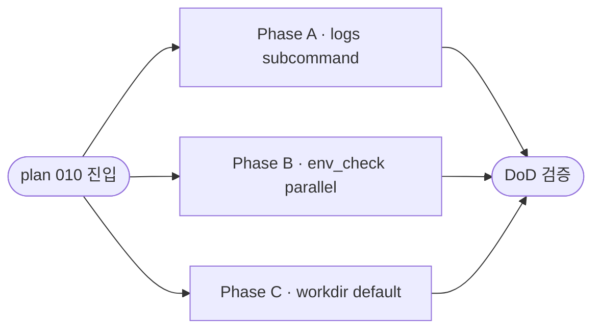

# Plan · 010-observability

## 0. 메타

- 작업 ID: `010-observability`
- 의도: dialectic 1턴 시연에서 발견된 관찰 가능성 결함 3건 통합 — `logs` 서브커맨드 + env_check 병렬 + workdir default 변경
- 관련 ADR / Q번호: ADR-6 (cwd 격리, `docs/dev-docs/architecture.md:133`), Q3 (관찰성 SSOT, `outline/03-ux.md §3.5`)
- 예상 영향 범위: `src/cli.py` (logs subparser + workdir default 통과), `src/env_check.py` (병렬화), `src/orchestrator.py:run_session` workdir 해소 (현재 `:604-625`, plan 011 진행 후 line drift 가능 — execute 진입 시 grep 재확인), 새 모듈 `src/logs.py` 후보 (Phase A)
- 진행 순서: **plan 009 완료(2026-archive 산출, orchestrator.py 552→975 LOC) → plan 011 → plan 010**. 010은 011 산출(`_interactive_menu_body` 5단계 + `_input_workdir` helper)을 전제로 narrative cascade 점검 필수
- LOC 추정: ~120 LOC + 테스트 ~60 LOC

## 1. AS-IS (현재 상태)

### 1.1 logs 관찰 통로

- `outline/03-ux.md §3.5` (line 341-378) Q3 SSOT — 7개 flag (`--tail`, `--follow`, `--kind`, `--turn`, `--since`, `--summary`, `--run`) narrative 정의됨
- `src/cli.py:50-90` argparse — `run` / `doctor` subparser만. `logs` subparser 0건 (`grep -n "logs" src/cli.py` 0건 — substring 매치도 없음). plan 011 진행 후 main()/argparse 영역은 추가 line drift 발생 가능하나 `subs.add_parser` 패턴은 유지
- 사용자는 현재 `cat <workdir>/<UTC-ts>/messages.jsonl | jq` 직접 호출 (도구 1차 인터페이스 부재)

### 1.2 env_check 직렬

- `src/env_check.py:53-62 check_env` — 4개 sub-check sequential dict 구성:
  - `claude --version` (timeout 5s) → `claude auth status` (timeout 10s) → `codex --version` (timeout 5s) → `codex login status` (timeout 10s)
  - 최악 직렬 합 ~30s. 정상 통과 시 wall clock 1~3s
- `src/cli.py:_check_env_with_spinner_retry` (현재 `:121-141`, plan 011 진행 후 2 line shift) — Spinner는 이미 `with stdin_canonical_off(), Spinner("환경 점검 중..."):` wrap (plan 008 산출). 직렬 호출 시간 자체는 단축 X. plan 011은 helper 자체 미수정 (line shift만 발생)
- `claude doctor`는 영구 제외 — `src/env_check.py:1-8` (validation.md §4.4 P-VENDOR 등재됨)

### 1.3 workdir default

- `src/orchestrator.py:606-607` (post-009):
  ```
  workdir = (Path(args.workdir).resolve() if args.workdir
             else Path(tempfile.mkdtemp(prefix="dialectic-")).resolve())
  ```
- `tempfile.mkdtemp(prefix="dialectic-")` → `/tmp/dialectic-XXXX` (Linux/WSL `TMPDIR` 의존)
- `src/cli.py:57-61` — `--workdir` help 텍스트도 `tempfile.mkdtemp(prefix='dialectic-')` 명시
- ADR-6 차단 로직 (`src/orchestrator.py:612-625`): repo 루트·하위 경로 SystemExit
- `tests/test_cwd_isolation.py` + `test_cwd_isolation_integration.py` — repo-root 차단 회귀 통과 중
- plan 011 산출 후 `_interactive_menu_body`에 단계 4 workdir 직접 입력 분기 신설 + `_input_workdir` helper. 010 진입 시 메뉴 narrative "1) 자동 생성(orchestrator default) 2) 직접 입력" 라벨이 default 경로 변경 cascade 대상 (011 Phase C가 추상 표현 사용 시 자동 흡수, 구체 라벨이면 Phase C 작업 단위로 갱신)

## 2. TO-BE (목표 상태)

### 2.1 logs 서브커맨드 (Phase A)

- `src/cli.py` `logs` subparser 신설 — flag: `--workdir <path>` (workdir level 또는 session_dir 직접 둘 다 수용, default = 자동 탐색) / `--session <UTC-ts>` (workdir level + 명시 session 선택) / `--tail N` / `--follow` / `--kind <name>` / `--full`
- `src/logs.py` (신규) — JSONL line 한 줄씩 읽고 1줄 요약(`[turn=N seq=M] kind=... from=... slot=...`) 출력. `--full` 시 content 본문 펼침
- malformed JSONL line은 stderr 1줄 경고 + skip (P-JSONL 정합)
- 자동 탐색 (`find_latest_session_dir`) **2-tier**: base_dir 우선순위(`DIALECTIC_RUNS_DIR > XDG_DATA_HOME/dialectic/runs > ~/.local/share/dialectic/runs`) → 첫 매칭 base_dir 직속 자식 mtime 최대 workdir → 그 안의 `<UTC-ts>` 매칭 자식 mtime 최대 → `messages.jsonl` 존재 검증
- 사용자 명시 `--workdir` 해석 (`resolve_session_dir`): `messages.jsonl` 존재하면 session_dir 직접 사용, 아니면 자식 `<UTC-ts>` 폴더 mtime 최대 자동 선택
- path SSOT 변경: plan 011 Bug 2 fix로 `<workdir>/<UTC-ts>/messages.jsonl` 구조 (`src/orchestrator.py:662-666`). `outline/03-ux.md §3.4` line 290-336 갱신 후 SSOT 정합
- `outline/03-ux.md §3.5`의 `--turn / --since / --summary / --run`은 후속 plan으로 deferred (본 plan §3.2 표 외)

### 2.2 env_check 병렬 (Phase B)

- `src/env_check.py:check_env` 내부에서 `concurrent.futures.ThreadPoolExecutor(max_workers=4)`로 4개 sub-check 동시 실행
- `executor.map`은 입력 순서로 결과 yield → 별도 재정렬 불필요. dict insertion 순서(claude/version → claude/auth → codex/version → codex/login) 자연 보존
- 외부 의존성 0 (표준 라이브러리 `concurrent.futures`)
- 결과 형식 dict 구조 변경 X — `_run_capture` 반환값 그대로

### 2.3 workdir default (Phase C)

- 우선순위: `--workdir` CLI 인자 > `DIALECTIC_RUNS_DIR` 환경변수 > `XDG_DATA_HOME/dialectic/runs/` > `~/.local/share/dialectic/runs/`
- 폴더명 형식: `<YYYYMMDD-HHMMSS>-<short-id>` (`tempfile.mkdtemp(prefix=..., dir=base_dir)` 활용 — short-id는 mkdtemp suffix 그대로)
- `src/orchestrator.py:606-607` (post-009) workdir 해소 로직 분리 → `_resolve_workdir(args)` 헬퍼
- ADR-6 차단 (`:612-625`, post-009)은 변경 X — base_dir이 repo 하위인 경우(예: `DIALECTIC_RUNS_DIR=/home/sjw49/Dialectic-CLI/runs`)도 SystemExit 정상 동작
- `validation.md` 신규 §3 후보 환원 검토 (cleanup default와 별개. P-id 부여는 commit 시점 §3 후보 최신 ID로 결정)

## 3. Phase 인덱스

### 3.1 의존성 그래프



### 3.2 Phase 파일 경로

| Phase | 경로 | 의존 | 병렬 그룹 |
|---|---|---|---|
| A · logs subcommand | [phase-a-logs-subcmd.md](phase-a-logs-subcmd.md) | (없음) | A·B·C 모두 병렬 가능 |
| B · env_check parallel | [phase-b-env-parallel.md](phase-b-env-parallel.md) | (없음) | A·B·C 모두 병렬 가능 |
| C · workdir default | [phase-c-workdir-default.md](phase-c-workdir-default.md) | (없음) | A·B·C 모두 병렬 가능 |

## 4. 비기능 요구

- 외부 의존성 0 — `concurrent.futures` (Phase B), `os/Path/tempfile` (Phase C) 모두 표준 라이브러리. 새 추가 시 ADR 필요
- 성능: env_check 병렬 후 wall clock 목표 ≤ max(개별 timeout) (직렬 합 X)
- 보안: ADR-6 cwd 격리는 변경 X. `_safe_env` 화이트리스트도 변경 X
- 회귀: `tests/test_cwd_isolation.py` + `test_cwd_isolation_integration.py` + `test_cli_menu.py` 모두 통과 유지

## 5. 위험 (Phase 횡단)

- **범위 비대 (Step 1.5 신호 2개)**: S2 독립 기능 3 (logs / env_check / workdir) + S4 영향 모듈 3 (cli.py / env_check.py / orchestrator.py). 사용자 단일 plan 결정 — 분할 시 phase 1개 안티패턴 발생 (각 plan이 1 phase). LOC 합 ~120으로 작아 단일 plan 비대 위험 낮음
- **workdir default 변경의 ADR-6 사이드 이펙트**: `~/.local/share/dialectic/runs/`는 repo 외부지만, `DIALECTIC_RUNS_DIR` override가 repo 하위 경로일 때 ADR-6 차단 동작 검증 필수 — Phase C 검증 항목
- **logs 자동 탐색 ↔ workdir default 결합**: Phase A의 "마지막 세션 자동 탐색"은 Phase C의 base_dir 위치에 의존. 두 phase가 병렬이지만 같은 우선순위 표(§2.3) SSOT 인용으로 동기화. base_dir 이름 변경 시 Phase A·C 동시 수정 필요
- **env_check 병렬 시 출력 순서 보존**: `executor.map` 채택으로 입력 순서 yield 보장. 만약 `as_completed`로 변경 시 완료 순서 비결정 → 입력 인덱스 매핑 필수. Phase B `§3 출력` + `§6 엣지` 명시
- **README.md 동시 수정 충돌**: Phase A(`§4 사용 예시 1줄 추가`)·Phase C(`§4 결과 위치 안내 갱신`) 모두 `README.md` 수정 작업 포함. 병렬 분기 시 merge 충돌 가능 → execute-plan 단계에서 README는 직렬화(Phase A 먼저, Phase C가 추가 수정) 또는 두 phase가 README의 서로 다른 절을 명확히 분담. Phase A는 "사용 예시" 섹션, Phase C는 "결과 위치" 섹션 — 분담 명시
- **plan 011 후행 line drift**: 010 진입 시점에 plan 011이 `src/cli.py` `_interactive_menu_body` 5단계 풀 노출 + `_input_workdir` helper 추가 → cli.py 전체 line 번호 추가 drift 예상. 010 본 plan의 `cli.py` line 인용은 post-009 기준이라 011 산출 후 stale. **execute-plan 진입 시 grep 재확인 필수** (`grep -n "subs.add_parser\|--workdir\|_check_env" src/cli.py`)
- **plan 011 Phase C narrative cascade**: 011 Phase C가 메뉴 단계 4에 workdir "자동 생성(orchestrator default) / 직접 입력" 분기 노출. 010 Phase C가 default 경로를 `~/.local/share/dialectic/runs/`로 변경 후 011 narrative와 cross-check 필요. 011이 추상 표현("orchestrator default 위임") 사용 시 자동 흡수, 구체 경로 박힘 시 010 Phase C 작업 단위에 011 갱신 추가
- **plan 010 Phase A `find_latest_session_dir` 한계**: 011 진행 후 사용자가 메뉴 단계 4에서 임의 경로(예: `/tmp/myproj`) 직접 입력한 workdir은 base_dir 우선순위 표 외 → 자동 탐색 X. 사용자가 `dialectic logs --workdir <path>` 명시 지정 권장 narrative (Phase A `§6` + README "사용 예시"에 명시)

## 6. 완료 기준 (Definition of Done)

- [ ] (Phase A) `dialectic logs --tail 10` 실행 시 자동 탐색된 최신 session_dir의 messages.jsonl 마지막 10개 메시지 1줄 요약 출력 (exit 0)
- [ ] (Phase A) `dialectic logs --workdir <wd> --session <UTC-ts> --full --kind critique` 실행 시 명시 session의 critique kind만 본문 펼쳐 출력
- [ ] (Phase A) `dialectic logs --workdir <wd>` (workdir level) 시 자식 session 자동 선택, `--workdir <wd>/<UTC-ts>` (session_dir 직접) 시 그대로 사용
- [ ] (Phase A) malformed JSONL line skip + stderr 경고 단언 (단위 테스트)
- [ ] (Phase A) `find_latest_session_dir` 2-tier 탐색 단위 테스트 + `resolve_session_dir` workdir/session 자동 분기 단위 테스트
- [ ] (Phase B) `time dialectic doctor` wall clock ≤ 12s (이전 직렬 worst 30s 대비)
- [ ] (Phase B) `check_env()` 반환 dict의 sub-check 4건 순서 = claude/version → claude/auth → codex/version → codex/login (단위 테스트, dict insertion 순서 단언)
- [ ] (Phase C) `dialectic run --task "..." --max-turns 1` 실행 후 workdir이 `~/.local/share/dialectic/runs/<...>` 하위
- [ ] (Phase C) `DIALECTIC_RUNS_DIR=/tmp/custom dialectic run ...` 시 workdir이 `/tmp/custom/<...>` 하위
- [ ] (Phase C) `DIALECTIC_RUNS_DIR=<repo>/runs dialectic run ...` 시 ADR-6 SystemExit (회귀 차단)
- [ ] `pytest -q` 회귀 0 + 신규 테스트 ≥17 (Phase A 9, B 3, C 5 = 17 합계)
- [ ] sync-docs 누락 0 — 다음 .md 모두 갱신:
  - [ ] `docs/dev-docs/systems/orchestrator.md` (Phase C: workdir 해소 narrative)
  - [ ] `docs/runtime-docs/systems/run-mode.md` (Phase C: workdir 경로 narrative)
  - [ ] `docs/dev-docs/systems/env-check.md` (Phase B: 병렬 호출 narrative)
  - [ ] `docs/dev-docs/systems/cwd-isolation.md` (Phase C: default 경로 + base_dir이 repo 하위인 경우 차단)
  - [ ] `README.md` (Phase A: "사용 예시" / Phase C: "결과 위치" — 섹션 분담)
  - [ ] `docs/dev-docs/Documentation-Checklist.md` 매핑 신규 2건 — Phase A는 `src/logs.py` → `outline/03-ux.md §3.5`, Phase C는 `src/orchestrator.py:_resolve_workdir` → `systems/orchestrator.md`+`systems/cwd-isolation.md` 매핑 보강
- [ ] review-code P0 = 0 (R-001 encoding + cwd= 명시 + Protocol 일관성)

## 7. 참조 .md

- `docs/dev-docs/Plans/upcoming-plans.md:207-278` — plan 010 backlog SSOT (본 plan 진입 후 entry 제거 예정)
- `outline/03-ux.md §3.5` (line 341-378) — `dialectic logs` Q3 SSOT
- `outline/03-ux.md §3.4` (line 290-336) — 종료 시 산출물 SSOT (`<workdir>/<UTC-ts>/messages.jsonl` + sessions/ + SYNTHESIS.md, plan 011 Bug 2 fix 정합)
- `docs/dev-docs/architecture.md:133` ADR-6 — cwd 격리
- `docs/dev-docs/systems/env-check.md` — env_check SSOT (Phase B 갱신 대상)
- `docs/dev-docs/systems/cwd-isolation.md` — ADR-6 SSOT (Phase C 회귀 점검)
- `docs/dev-docs/validation.md §3 C-010` — workdir cleanup default 정책 (이미 적재)
- `src/ui.py:Spinner` (plan 006 산출) — Phase A·B 안 쓰지만 메뉴는 이미 wrap 중 (`src/cli.py:_check_env_with_spinner_retry`, post-009/011 `:121-141`)
