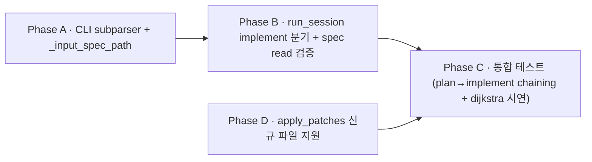

# Plan · 014-implement-spec

## 0. 메타

- 작업 ID: `014-implement-spec`
- 의도: `dialectic implement --spec <path>` (또는 `dialectic run --mode implement --spec <path>`) wiring — plan 013 산출 `<workdir>/specs/<slug>.md`를 implement 모드 입력으로 소비. driver=implementer / reviewer=spec-reviewer 1턴 라이프사이클 + 메뉴 단계 2 implement 분기 활성. **+ `apply_patches` 신규 파일 생성 지원** — narrative-구현 차이 해소 (architecture.md `:137` ADR-10 "신규 파일·기존 파일 둘 다 동일 흐름" 정합)
- 관련 ADR / Q번호: ADR-6 (cwd 격리 — spec read는 영향 0). ADR-10 (search-replace 메커니즘 — narrative 그대로, 신규 파일 분기만 보강). 신규 ADR 불필요. outline/04 §4.5.3 implement 모드 narrative · `protocol.md §5 :282-284` "implement 모드는 task 대신 spec.md 본문 주입" SSOT
- 예상 영향 범위: `src/cli.py` (`p_implement` subparser 또는 `--spec` 인자 + `_input_spec_path` 메뉴 helper + `_input_mode` 단계 2 implement 분기 변경), `src/orchestrator.py` (`run_session` mode==implement 분기 — spec read 검증 + task substitution), `src/patch_apply.py` (apply_patches 신규 파일 분기 — `SEARCH=""` + `FileNotFoundError` catch + `mkdir(parents=True, exist_ok=True)` + `write_text`), 신규 테스트 `tests/test_implement_spec.py` + `tests/test_patch_apply.py` 확장, 문서 cascade (systems/orchestrator.md + systems/patch-apply.md + protocol.md §5 + roles/implementer.md `:78` 셀프체크 보강 + runtime-docs/systems/INDEX.md implement 행)
- LOC 추정: ~100 LOC (코드 — A 40 + B 25 + D 30 + 통합 wiring 5) + ~130 LOC (테스트 — A 30 + B 40 + D 40 + C 20)
- 의존: plan 011(완료, 메뉴 wiring) + plan 013(완료, spec.md 자동 생성 — input source) + plan 010(완료, workdir default) + plan 005(완료, patch_apply 기존 파일 wiring — 본 plan에서 확장)
- 백로그 SSOT: plan 013 §5 위험 #6 + plan 011 phase-a-mode-select.md `:128` "implement는 `--spec` 입력 가정인데 메뉴는 task만 받음" deferred 안내 + **plan 005 시점 잠재 결함 — `architecture.md :137` ADR-10 narrative "신규 파일·기존 파일 둘 다 동일 흐름"이 `src/patch_apply.py:109` `read_text()` FileNotFoundError 미catch + `:97-99` 빈 SEARCH 차단으로 구현 부재. dijkstra 등 신규 파일 생성 시나리오 작동 X**

## 1. AS-IS

### 1.1 CLI subparser 단일 (`p_run` 만)

- `src/cli.py:56-83` `p_run = subs.add_parser("run", ...)` — 유일 subparser. `p_implement` / `p_compare` 부재
- `src/cli.py:57` `p_run.add_argument("--task", required=True)` — task 필수, `--spec` 인자 0
- `src/cli.py:67-71` `--mode choices=["run", "plan", "implement"]` 정의 — implement 키는 보존되지만 wiring 0
- `dialectic run --mode implement --task <text>`로 임시 호출은 가능하나 outline `:50` narrative(`dialectic implement --spec <path>`)와 어긋남

### 1.2 메뉴 단계 2 implement 차단 (deferred 안내)

- `src/cli.py:219-250` `_input_mode()` — 단계 2 mode 선택 메뉴
- `:236-242` implement 선택 시: `print("implement 모드는 spec.md 경로 입력 wiring이 본 plan 외 — 별도 plan에서 \`dialectic implement\` subparser 추가 예정 (outline :50). 다른 모드를 선택해주세요.")` + `continue` (retry)
- 사용자가 implement 선택해도 단계 3(task 입력) 진입 X — deferred 차단 상태

### 1.3 `build_prompt` mode 분기 부재

- `src/orchestrator.py:197-226` `build_prompt(role, task, history, directive, *, exclude_reviewer)` — `task` 인자가 §2 TASK 자리에 1:1 주입(`f"# 2. TASK\n{task}\n\n"`)
- mode 인자 0 — implement 모드 시 task 자리에 spec.md 본문 주입 wiring 부재
- `protocol.md §5 :282-284` "implement 모드는 task 대신 spec.md 본문 주입" narrative만 정합. 실제 호출 path 0

### 1.4 `MODE_ROLES["implement"]` 정의는 보존

- `src/orchestrator.py:48-50` `MODE_ROLES["implement"] = {driver: "implementer", reviewer: "spec-reviewer"}` — Day 1 plan 001 산출 시점에 보존됨 (run과 동일 role 쌍, 다른 모드 라벨)
- `roles/implementer.md` + `roles/spec-reviewer.md` 실재 (run 모드에서 사용 중) — implement 모드 진입 시 그대로 재사용 가능

### 1.5 `run_session` mode 분기 — plan만 활성

- `src/orchestrator.py:771-772` `run_session` 본문에 `if args.mode == "plan":` 분기로 `spec_path = _resolve_spec_path(workdir, args.task, session_ts=session_ts)` 1회 계산 (plan 013 산출)
- mode==implement 분기 0 — `args.task`만 task 메시지 자리에 들어감 (`bus.append(_task_msg(args.task, args.mode, workdir))` `:764`)
- spec read·검증 wiring 0

### 1.6 outline narrative

- `outline/03-ux.md:46-50` 5초 데모: `dialectic plan --task @tasks/... --workdir <path>` → `dialectic implement --spec <path>/specs/<slug>.md --workdir <path>` chaining 시연
- `outline/03-ux.md:131-132` 메뉴 narrative: 단계 2 mode 선택에 "3) 계획 구현 모드 (specs/<name>.md → 코드)" 명시
- `outline/04-requirements-and-modes.md §4.5.3 :228-240` implement 모드: driver=implementer, reviewer=spec-reviewer, 입력=`<workdir>/specs/<task_id>.md`, 산출물=`<workdir>/<file>.py` (run과 동일)
- `runtime-docs/systems/INDEX.md:13` implement 행: "미구현 — `--spec @<path>` 입력 메커니즘 + `build_prompt` implement 분기 부재" (sync-docs cascade 대상)
- `roles/planner.md:11` "산출물(`<workdir>/specs/<task_id>.md`)은 추후 `dialectic implement` 모드에서 implementer + spec-reviewer 쌍의 입력으로 사용된다" — plan 014 진입 시점에 narrative 충족

## 2. TO-BE

### 2.1 CLI 분리 — 권장 옵션 B (`--mode implement --spec <path>` 1차 + alias deferred)

#### 2.1.1 결정 항목

- **옵션 A**: `dialectic implement --spec <path> --workdir <path> --max-turns N --interactive end-only` 신규 subparser
- **옵션 B (권장)**: `dialectic run --mode implement --spec <path> ...` — 기존 `p_run` 확장. `--spec` 인자 추가 + mode==implement 시 required
- 본 plan 1차 = 옵션 B (코드 재사용 + 단일 subparser 유지). `dialectic implement` alias는 동일 plan 산출 wrapper subparser 또는 후속 plan으로 결정

#### 2.1.2 옵션 B wiring (`src/cli.py:56-83` `p_run` 확장)

```python
# spec
p_run.add_argument(
    "--spec",
    type=str, default=None,
    help="implement 모드 입력 — `<workdir>/specs/<slug>.md` 또는 임의 spec.md 경로. mode==implement 시 required.",
)
```

argparse 자체 required 검증은 `--mode`와 conditional이라 어려움 → `run_session` 진입 시 mode==implement + spec is None이면 SystemExit (호출자 책임).

#### 2.1.3 `dialectic implement` alias subparser (옵션 B 보강)

`src/cli.py`에 `p_implement = subs.add_parser("implement", ...)` 추가:
- `--spec <path>` required
- 다른 인자(`--driver`/`--reviewer`/`--workdir`/`--max-turns`/`--interactive`/`--convergence-streak`)는 `p_run`과 동일 default
- `--task` 인자 부재 (implement 모드 task 자리 = spec body, `--task`는 의미 X)
- `--mode` 인자 부재 (implement subparser는 자동 mode==implement)
- set_defaults에 `func=lambda args: orchestrator.run_session(args)` + `args.mode = "implement"` + `args.task = ""` (spec read 후 substitution)

### 2.2 메뉴 단계 2 implement 분기 활성

#### 2.2.1 `_input_mode` 변경 (`src/cli.py:219-250`)

```python
# spec — implement 분기를 deferred에서 active로
if raw == "3":
    return "implement"  # 단계 3에서 _input_spec_path 분기
```

기존 deferred 안내 코드 제거. compare는 deferred 유지(별도 plan).

#### 2.2.2 신규 helper `_input_spec_path` (`src/cli.py`)

```python
# spec
def _input_spec_path() -> str:
    """단계 3 implement 모드 — spec.md 경로 입력.

    - 절대 또는 상대 경로 (Path.resolve()로 정규화)
    - 파일 부재·디렉토리·UTF-8 디코딩 실패 시 retry + 안내
    - '?' 도움말 키 (post-010 default workdir narrative — `~/.local/share/dialectic/runs/<...>/specs/<slug>.md` 자동 탐색 가능 안내)
    - EOF/Ctrl-C → _safe_input이 _MenuExit raise (기존 `_input_task` 패턴)
    """
```

#### 2.2.3 단계 3 분기 — mode에 따라 task 또는 spec 입력

`_interactive_menu_body` (`src/cli.py:385-446` 인근):
```python
# spec
mode = _input_mode()
if mode in ("run", "plan"):
    task = _input_task()
    spec = None
else:  # implement
    task = ""
    spec = _input_spec_path()
```

진행 확인 prompt(`_input_confirm` — `src/cli.py:338` 기존 helper)에서 spec 경로도 echo back (사용자 시각 검증). 시그니처에 `spec: str | None = None` keyword-only 인자 추가.

### 2.3 `run_session` implement 분기 wiring (`src/orchestrator.py:771-772` 인근)

```python
# spec — mode==plan 분기 직전 또는 직후에 implement 분기 추가
if args.mode == "implement":
    if not args.spec:
        raise SystemExit(
            "implement 모드는 --spec <path> 필수 — outline :50 dialectic implement narrative."
        )
    spec_path_in = Path(args.spec).resolve()
    if not spec_path_in.is_file():
        raise SystemExit(f"spec 파일 없음 또는 디렉토리: {spec_path_in}")
    try:
        spec_body = spec_path_in.read_text(encoding="utf-8")
    except UnicodeDecodeError as e:
        raise SystemExit(f"spec UTF-8 디코딩 실패: {spec_path_in} ({e})") from e
    if not spec_body.strip():
        raise SystemExit(f"spec 파일 비어있음: {spec_path_in}")
    # task 자리에 spec body 주입 — protocol.md §5 :282-284 정합
    args.task = spec_body
```

위치: `bus.append(_task_msg(args.task, args.mode, workdir))` (`:764`) 직전. spec body가 `_task_msg`에 들어가야 history serialization 시 §2 TASK 일관.

### 2.4 task 메시지 (`_task_msg`) — 변경 0

`_task_msg(args.task, args.mode, workdir)` 호출(`src/orchestrator.py:764`)은 그대로. mode==implement 시 args.task에 이미 spec body가 substitution됨 (§2.3). `_task_msg`는 mode 라벨만 별도 보존(`mode="implement"`).

### 2.5 `apply_patches` 신규 파일 지원 (`src/patch_apply.py` — Phase D 산출)

#### 2.5.1 AS-IS 차이 (구현 ↔ narrative)

- `architecture.md:137` ADR-10: "**신규 파일·기존 파일 수정 둘 다 동일 흐름**" — narrative SSOT
- `outline/04 :182`/`:237`: run/implement 모드 산출 "`<workdir>/<file>.py` (**신규 작성**) **또는** 기존 파일 search-replace 수정"
- `src/patch_apply.py:109` `original_text = resolved.read_text(encoding="utf-8")` — 파일 부재 시 FileNotFoundError raise (catch 0)
- `:97-99` 빈 SEARCH 차단 (`empty SEARCH not allowed`) — 신규 파일 생성 시도(`SEARCH=""`)가 거부됨
- 결과: dijkstra 등 빈 workdir에서 새 파일 생성 시나리오 status="failed"
- **모드 영향 범위**: `apply_patches`는 `src/orchestrator.py:594` `run_turn` 내부에서 모드 분기 없이 호출 → Phase D 효과는 implement만이 아니라 **run 모드(driver=implementer 동일, MODE_ROLES `:48`)에서도 신규 파일 생성 활성**. plan 모드는 planner role narrative-only 가이드(`docs/runtime-docs/roles/planner.md`)라 사실상 영향 0

#### 2.5.2 TO-BE 분기

```python
# spec — apply_patches 신규 파일 지원 (Phase D)
# (1) path validation 그대로
# (2) 빈 SEARCH 차단 → 분기:
#     - 파일이 부재(.exists() False)이고 SEARCH="" → 신규 파일 의도. originals/mutated에 ""/REPLACE 등록 (read 호출 X)
#     - 파일 존재 + SEARCH="" → 기존 정책 유지 (PatchApplyError)
#     - 파일 부재 + SEARCH 비어있지 X → PatchApplyError("search not found in <file>")
# (3) dry-run:
#     - 기존: read_text 호출 → FileNotFoundError catch → originals/mutated에 ""/REPLACE 등록
#     - 본 분기 추가는 (2)에서 SEARCH=""로 식별된 파일에 한정
# (4) commit:
#     - 신규 파일 write 시 resolved.parent.mkdir(parents=True, exist_ok=True) 호출
#     - write_text(encoding="utf-8") 그대로
#     - rollback 시 신규 파일은 originals[resolved] = "" 였으므로 빈 파일로 복원되거나 unlink 필요. 단순화: 신규 파일은 rollback 시 unlink (`originals == ""` 표식 활용)
```

신규 파일·기존 파일 혼합 한 응답에서 처리 가능 (입력 순서대로 patch 처리).

#### 2.5.3 implementer.md `:78` 셀프체크 보강

```python
# spec — implementer.md "응답 전 셀프체크" 항목 추가
- [ ] (신규 파일 생성 시) SEARCH 블록은 빈 문자열 (`<<<<<<< SEARCH\n=======`), REPLACE 블록에 신규 파일 전체 본문 (ADR-10 신규 파일 분기, plan 014)
```

### 2.6 신규 테스트 — `tests/test_implement_spec.py` + `tests/test_patch_apply.py` 확장

| 케이스 | 검증 | 카운트 |
|---|---|---|
| `_input_spec_path` 정상 | tmp_path/spec.md 생성 후 입력 → 절대 경로 반환 | 1 |
| `_input_spec_path` 부재 retry | 미존재 → retry → 정상 입력으로 수렴 | 1 |
| `_input_spec_path` 디렉토리 retry | tmp_path 디렉토리 입력 → retry | 1 |
| `--mode implement --spec <missing>` SystemExit | 부재 spec → SystemExit "spec 파일 없음" | 1 |
| `--mode implement` (spec 부재) SystemExit | `--spec` 미지정 → SystemExit "spec 필수" | 1 |
| `--mode implement` 빈 spec SystemExit | 빈 파일 → SystemExit "비어있음" | 1 |
| `--mode implement` 정상 — task 자리에 spec body 주입 | mock driver/reviewer + spec.md 본문 검증: `_task_msg`/build_prompt §2 TASK가 spec body | 1 |
| `dialectic implement` alias subparser 호출 | mode=="implement" + args.spec 정합 | 1 |
| 메뉴 단계 2 implement 선택 → 단계 3 spec 입력 분기 (mode=run/plan과 분기) | monkeypatch input + 통합 | 1 |
| **plan→implement chaining mock** | plan 1턴 → spec.md 생성 → implement 1턴 → spec body가 §2 TASK | 1 |

총 ≥10 케이스 (Phase A·B·C 통합). Phase D ≥5 케이스는 [`phase-d-patch-new-file.md §3.4`](phase-d-patch-new-file.md) 참조 — 합 ≥18.

### 2.7 문서 cascade

- `docs/dev-docs/systems/orchestrator.md` — `run_session` mode==implement 분기 narrative + `build_prompt` mode 무관 narrative cross-check
- `docs/dev-docs/systems/patch-apply.md` — `apply_patches` 신규 파일 분기 narrative (Phase D 산출)
- `docs/runtime-docs/protocol.md §5 :282-284` — implement 모드 task 자리 narrative가 wiring으로 충족됨 cross-check (narrative 변경 X)
- `docs/runtime-docs/protocol.md §3 모드별 산출물 표` (plan 013 추가) — implement 행 narrative 정합 cross-check
- `docs/runtime-docs/systems/INDEX.md` implement 행 — "미구현 ..." → "plan 014 ✓" 갱신
- `docs/runtime-docs/roles/planner.md:11` cross-check — narrative 변경 X (wiring으로 충족)
- `docs/runtime-docs/roles/implementer.md:78` 셀프체크 — 신규 파일 생성 시 `SEARCH=""` 명시 항목 추가 (Phase D 산출)
- `docs/dev-docs/architecture.md:137` ADR-10 — narrative "신규 파일·기존 파일 둘 다 동일 흐름"이 wiring으로 충족됨 cross-check (narrative 변경 X)
- `docs/dev-docs/Documentation-Checklist.md §1.1` — `--spec` 인자 + run_session implement 분기 + apply_patches 신규 파일 분기 매핑 행 신규
- `docs/dev-docs/Plans/upcoming-plans.md` — P014 노드 backlog → completed 갱신 + entry 신규 단락
- `README.md` 〈현재 동작 모드〉 — implement 모드 wiring 활성 narrative 1줄 + 5초 데모에 `dialectic implement --spec ...` chaining 시연 추가

## 3. Phase 인덱스

### 3.1 의존성 그래프



A → B → C 직렬 (B가 A의 `args.spec` 인자, C가 B의 wiring 사용). D는 A·B와 의존 0 — A·D 병렬 가능. C가 D 산출(신규 파일 wiring) 의존이라 D → C.

### 3.2 Phase 파일 경로

| Phase | 경로 | 의존 | 병렬 그룹 |
|---|---|---|---|
| A · CLI subparser + 메뉴 helper | [phase-a-cli.md](phase-a-cli.md) | (없음) | A·D 병렬 가능 |
| B · run_session implement 분기 | [phase-b-orchestrator.md](phase-b-orchestrator.md) | A | — |
| D · apply_patches 신규 파일 지원 | [phase-d-patch-new-file.md](phase-d-patch-new-file.md) | (없음) | A·D 병렬 가능 |
| C · 통합 테스트 | [phase-c-integration.md](phase-c-integration.md) | B + D | — |

## 4. 비기능 요구

- 외부 의존성 추가 0 (표준 라이브러리만 — `pathlib`)
- ADR-6 정합 — spec 경로는 read-only이므로 cwd auto-discovery 영향 0 (subprocess 호출은 `cwd=workdir`로 격리됨)
- UTF-8 인코딩 명시 (`Path.read_text(encoding="utf-8")`) — 한글 spec 지원
- `args.spec` 인자는 keyword-only argparse default `None` — 회귀 0 (mode!=implement 시 무시)
- `dialectic implement` alias subparser는 `p_run`과 인자 중복 (DRY 위반 가능성) — `_add_common_args(parser)` helper 추출 권고. 1차 구현은 단순 복사 + Phase A §6에 P2 위험 명시

## 5. 위험 (Phase 횡단)

1. **patches in spec body — 실수로 코드 fence 포함 시**
   - planner.md role은 코드 X 명세만이지만 driver(planner) 응답이 위반 시 spec.md에 patches fence 들어감
   - implement 모드 진입 시 spec body가 task 자리(build_prompt §2 TASK)로 들어감 — driver 응답이 아님
   - `extract_patches`는 `resp1.text`(driver 응답)에만 호출 — task 자리 영향 0 ✓
   - 그러나 implementer가 spec body를 그대로 베껴 응답하면? → 그건 implementer 정상 동작 (spec → 코드 fence 포함된 patch)
   - **mitigation**: 본 plan 외. roles/spec-reviewer.md에 "spec body 자체에 patch 마커가 있으면 implementer가 분리해 적용해야 함" narrative는 별도 결정

2. **spec 본문 길이 — token 한도 초과**
   - claude/codex 모델별 input token 한도 다름 (claude-sonnet ~200K, codex 다양)
   - spec.md가 크면 build_prompt §1 ROLE + §2 TASK + §3 HISTORY 합산이 한도 초과
   - 본 plan 1차: stderr 경고만, 거부 X (사용자 판단)
   - 정확한 한도 체크는 별도 plan (token counting 도입 필요)

3. **`dialectic implement` alias vs `--mode implement` 두 path**
   - 두 path 모두 같은 `run_session` 진입이지만 인자 default 분리 가능성
   - subparser 인자 동기화 누락 시 한쪽만 갱신 → 회귀
   - **mitigation**: Phase A §3에 `_add_common_args(parser)` helper 추출 권고 (P2). 1차 구현은 단순 복사

4. **메뉴 단계 3 mode 분기 — task vs spec**
   - 단계 3에서 mode에 따라 다른 helper 호출 (`_input_task` vs `_input_spec_path`)
   - 메뉴 흐름 narrative(`_interactive_menu_body` docstring) 갱신 필요
   - mode 변수가 단계 2에서 단계 3으로 propagate되어야 — 기존 plan 011 wiring 그대로 사용

5. **spec 경로 ADR-6 — repo 하위 경로 spec 입력 시**
   - 사용자가 `--spec /path/to/Dialectic-CLI/some_spec.md` 같이 repo 하위 경로 지정 가능
   - read-only이므로 cwd auto-discovery 영향 0 (claude/codex subprocess는 `cwd=workdir`로 호출)
   - 그러나 spec body가 ADR-6 SSOT(개발용 .md 누수)와 겹칠 가능성 0 — spec 본문은 task 텍스트일 뿐
   - **결정**: 추가 차단 불필요 (ADR-6은 workdir 차단에 한정)

## 6. 완료 기준 (Definition of Done)

- [ ] (Phase A) `--spec <path>` 인자 추가 (`p_run.add_argument`) + `dialectic implement` alias subparser (`p_implement`) 추가
- [ ] (Phase A) `_input_spec_path` 메뉴 helper 추가 + `_input_mode` implement 분기 active 변경 + `_interactive_menu_body` 단계 3 mode 분기 (task vs spec) + `_input_confirm` 시그니처 확장
- [ ] (Phase A) 단위 테스트 ≥3 (`_input_spec_path` 정상/부재retry/디렉토리retry)
- [ ] (Phase B) `run_session` mode==implement 분기 — spec 검증 4종 (None/missing/dir/empty SystemExit) + 정상 시 args.task substitution
- [ ] (Phase B) 단위 테스트 ≥5 (SystemExit 4종 + 정상 1종)
- [ ] (Phase D) `apply_patches` 신규 파일 분기 — `SEARCH=""` + 파일 부재 시 `read_text` 호출 X + REPLACE를 신규 파일 본문으로 write (`mkdir(parents=True)` 포함)
- [ ] (Phase D) `apply_patches` rollback 신규 파일 unlink 정합 (`originals[resolved] == ""` 표식)
- [ ] (Phase D) 단위 테스트 ≥5 (신규 파일 정상 / 신규 파일 디렉토리 부재 mkdir / 신규+기존 혼합 / 기존 파일 SEARCH="" 거부 정책 보존 / rollback unlink)
- [ ] (Phase D) `roles/implementer.md:78` 셀프체크에 신규 파일 SEARCH="" 항목 추가
- [ ] (Phase C) plan→implement chaining mock 통합 테스트 — plan 1턴 spec 생성 → implement 1턴 spec body가 §2 TASK 진입 + driver mock 응답에 신규 파일 patch fence 포함 → workdir에 .py 파일 생성 검증 ≥1
- [ ] (Phase C) `dialectic implement --spec <abs path>` alias 호출 + `dialectic run --mode implement --spec <abs path>` 동등 동작 verify ≥2
- [ ] (Phase C) **dijkstra 실 시연** (사용자 명시 후, API 비용) — `tasks/implement-dijkstra/task.md` 1차 task 호출 → 빈 workdir에 dijkstra.py 생성 + `meta.apply_status="ok"` + `meta.files_changed=["dijkstra.py"]`
- [ ] sync-docs 누락 0 (systems/orchestrator.md + systems/patch-apply.md + protocol.md §3 산출물 표 cross-check + INDEX.md implement 행 + roles/implementer.md `:78` + Documentation-Checklist 매핑 행)
- [ ] review-code P0 = 0 (특히 spec read UTF-8 명시 + Path.resolve() + ADR-6 cross-check + apply_patches 신규 파일 rollback 정합)
- [ ] `pytest -q` 회귀 0 + 신규 ≥18 케이스 (A 3 + B 5 + D 5 + C 5)

## 7. 참조 .md

- [`outline/03-ux.md`](../../outline/03-ux.md) `:46-50`/`:131-132` — 5초 데모 + 메뉴 narrative
- [`outline/04-requirements-and-modes.md`](../../outline/04-requirements-and-modes.md) `§4.5.3 :228-240` — implement 모드 정의
- [`docs/runtime-docs/protocol.md`](../../docs/runtime-docs/protocol.md) `§5 :282-284` — task 자리 spec body 주입 narrative + `§3 모드별 산출물 표` (plan 013)
- [`docs/runtime-docs/roles/implementer.md`](../../docs/runtime-docs/roles/implementer.md) — driver ROLE
- [`docs/runtime-docs/roles/spec-reviewer.md`](../../docs/runtime-docs/roles/spec-reviewer.md) — reviewer ROLE
- [`docs/runtime-docs/roles/planner.md`](../../docs/runtime-docs/roles/planner.md) `:11` — spec.md narrative cross-check
- [`docs/runtime-docs/systems/INDEX.md`](../../docs/runtime-docs/systems/INDEX.md) `:13` — implement 행 갱신 대상
- [`docs/dev-docs/systems/orchestrator.md`](../../docs/dev-docs/systems/orchestrator.md) — run_session mode 분기 cascade
- [`docs/dev-docs/Documentation-Checklist.md`](../../docs/dev-docs/Documentation-Checklist.md) `§1.1` — `src/orchestrator.py`/`src/cli.py` 매핑
- `src/cli.py:56-83` — `p_run` subparser AS-IS
- `src/cli.py:219-250` — `_input_mode` deferred 안내 AS-IS
- `src/cli.py:380~` — `_interactive_menu_body` 단계 3 task 입력 AS-IS
- `src/orchestrator.py:48-50` — `MODE_ROLES["implement"]` 정의 (보존됨)
- `src/orchestrator.py:197-226` — `build_prompt` (mode 무관, task 자리 1:1 주입)
- `src/orchestrator.py:764` — `bus.append(_task_msg(args.task, args.mode, workdir))` task 메시지 진입점
- `src/orchestrator.py:771-772` — `mode==plan` spec_path 분기 (plan 013 산출, 본 plan은 그 뒤에 implement 분기 추가)
- `plan/completed/013-spec-autosave/` — spec.md 산출 책임 (input source)
- `plan/completed/011-menu-expansion/phase-a-mode-select.md:128` — 메뉴 implement deferred 안내 SSOT
